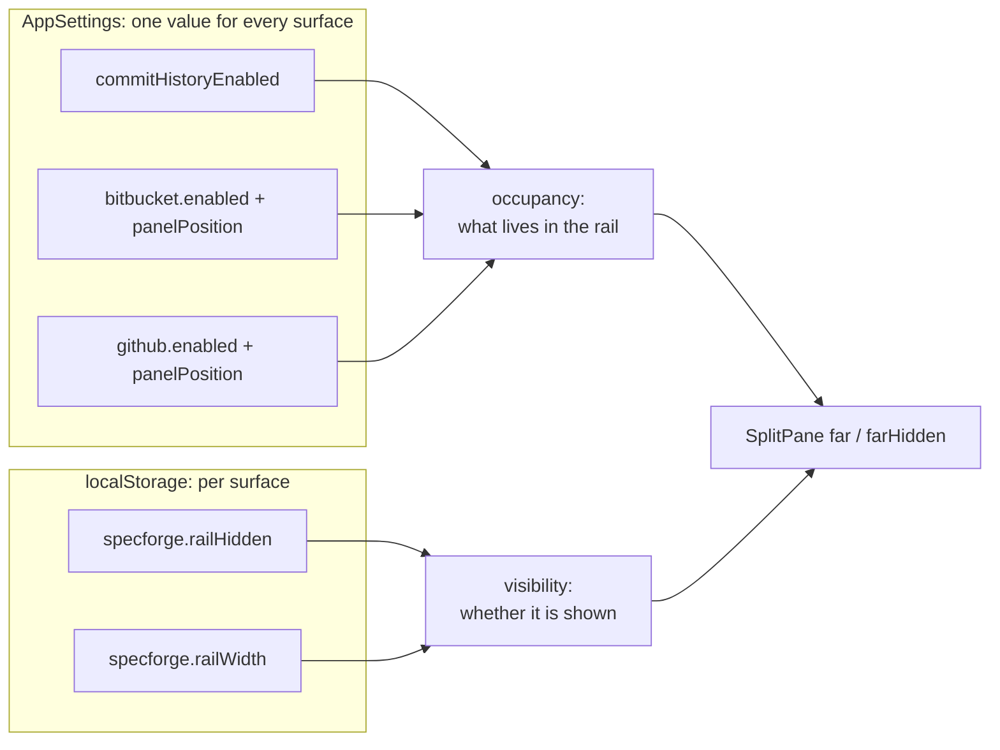
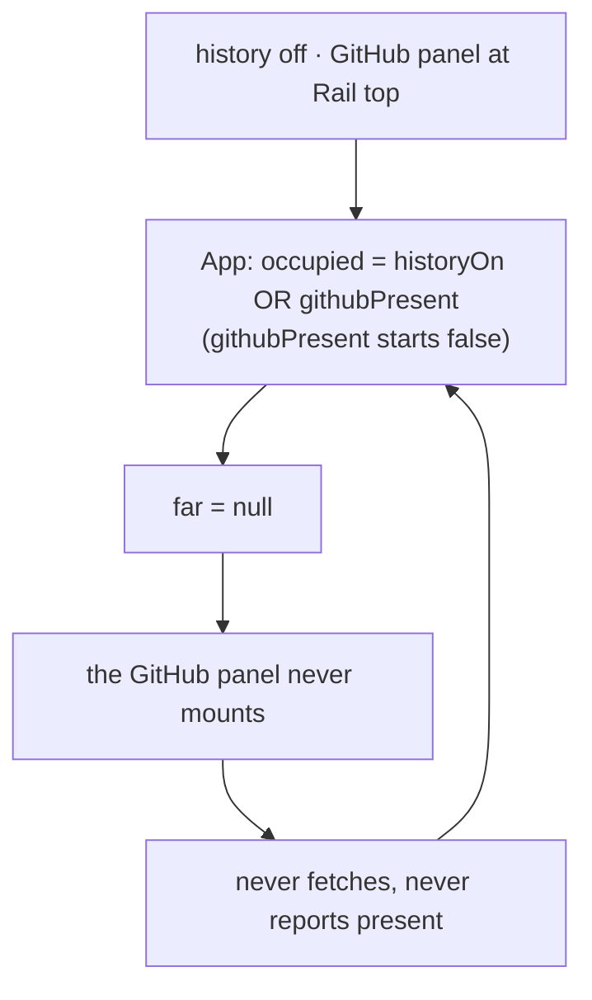
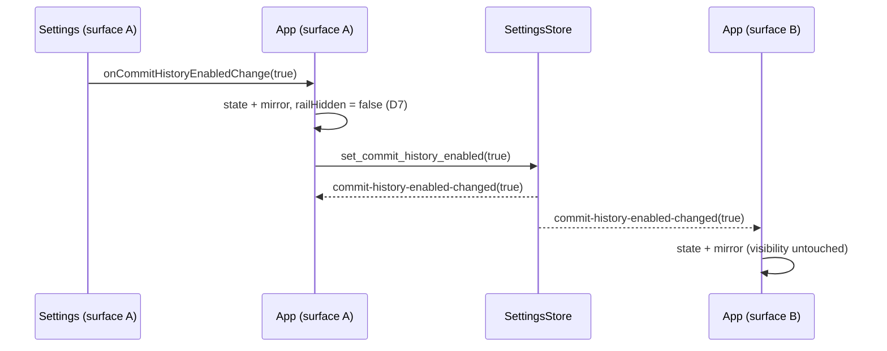
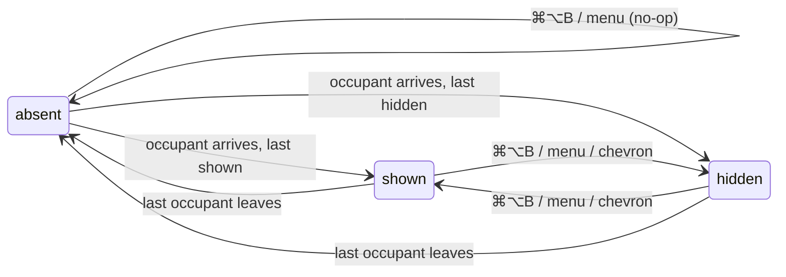

## Context

The main window is a three-slot `SplitPane` (`src/components/SplitPane.tsx`). `App.tsx` passes the commit graph (`GraphRail`) as its `far` slot. When a pull-request panel's position names a rail slot, `App` wraps the graph in a `.rail-column` with the panels above or below it.

Rail visibility is per-surface view state (`specforge.railHidden` in localStorage, `hide-side-panels` D1). It is toggled by Cmd/Ctrl+Alt+B and by the chevrons `SplitPane` draws. The binding is handled by the webview's keydown handler everywhere except the macOS desktop, where the View menu emits `toggle-commit-rail` instead (D4 there). A hidden rail does no git work because `App` passes `null` to `useCommitGraph`.

`SplitPane` already tells "hidden" from "doesn't exist" (`hide-side-panels` D2 kept them apart on purpose):

- `farHidden` keeps the pane's width and shows a restore chevron.
- `far == null` (`hasFar` false) renders no pane, no divider and no restore chevron.

Until now nothing has used the second path; this change is its first user.

Each `PullRequestPanel` fetches its own snapshot, re-reads it on `*-pull-requests-updated`, and reports whether it renders through `onPresenceChange`, but only once its first snapshot has arrived. `App` keeps `bitbucketPresent` / `githubPresent` and uses them only for the height reserve (`paneTakesReserve`). A panel that unmounts because its pane was hidden never reports `false`.

`document-width` is the precedent for an application-wide preference that changes layout on every surface. It has a field in `AppSettings`, getter and setter commands on both transports, and a direct `document-width-changed` event (not a `CacheEvent`). It is also kept in a synchronous localStorage mirror that the first frame reads, reconciled after mount.

## Goals / Non-Goals

**Goals:**

- One switch, set once for every surface, that turns the commit graph off and stops its git reads.
- The rail exists if and only if it has an occupant. An absent rail leaves no column, divider or restore chevron, and its toggles are inert.
- A rail holding only pull-request panels is a proper layout: they get the full height, with no reserve.
- No flash at launch for a reader who has turned history off.
- A default installation (history on) renders exactly as it does today.

**Non-Goals:**

- No terminal UI change. Its History is a screen the reader opens, and `terminal-ui` requires progress surfaces to render unconditionally.
- No change to how rail visibility is stored or what it means. It stays per-surface view state.
- No contextual auto-hide. A rail showing the graph's empty placeholder keeps its place, so the layout never shifts on navigation.
- No dynamic menu labels or enabled state, for the reason `hide-side-panels` declined them: it needs webview→Rust state sync.
- No renaming of the "commit rail" copy.
- No backend gating. Only the frontend fetches the graph, so Rust has nothing to switch off.
- No change to the commit garden, the commit-detail view, or reader windows.

## Decisions

### D1: The switch is an application setting; visibility stays view state



Turning history off is a statement about the reader ("I don't use git history here"), not about one window's layout. That puts it in the same category as which pull-request panels exist and where they sit, and those are already settings shared by every surface. Visibility stays the quick per-surface gesture that `hide-side-panels` D1 made it. So the rule is: settings decide what occupies the rail, and view state decides whether it is shown.

- **Rejected: a per-surface flag in localStorage beside `railHidden`.** It reproduces the problem being solved (every surface told separately) and gives the browser skin no Settings home for it.
- **Rejected: a third visibility state ("disabled") folded into `railHidden`.** It overloads a gesture with a preference, ⌘⌥B would have to learn to step over it, and it is still per surface.

### D2: An absent rail is `far={null}`, and `SplitPane` is unchanged

`App` computes whether the rail has an occupant and, when it has none, passes `far={null}`. `SplitPane`'s existing no-far-pane path then renders no pane, divider or restore chevron. Because `SplitPane` stays mounted, its `farWidth` state survives, so a rail that returns comes back at its remembered width through the existing clamps.

```svg
<svg xmlns="http://www.w3.org/2000/svg" viewBox="0 0 660 172" font-family="system-ui, -apple-system, sans-serif" font-size="11" fill="none">
  <g transform="translate(10,10)">
    <rect x="0.5" y="0.5" width="199" height="119" rx="4" stroke="#888"/>
    <rect x="0.5" y="0.5" width="44" height="119" fill="#888" fill-opacity="0.14" stroke="#888"/>
    <g stroke="#888" stroke-width="3" stroke-linecap="round" opacity="0.6">
      <line x1="8" y1="14" x2="36" y2="14"/><line x1="8" y1="26" x2="30" y2="26"/><line x1="8" y1="38" x2="34" y2="38"/>
      <line x1="56" y1="16" x2="138" y2="16"/><line x1="56" y1="28" x2="132" y2="28"/><line x1="56" y1="40" x2="138" y2="40"/><line x1="56" y1="52" x2="120" y2="52"/>
    </g>
    <rect x="150.5" y="0.5" width="49" height="119" fill="#888" fill-opacity="0.14" stroke="#888"/>
    <line x1="160" y1="12" x2="160" y2="70" stroke="#7c9cff" stroke-width="1.5"/>
    <g fill="#7c9cff"><circle cx="160" cy="14" r="2.5"/><circle cx="160" cy="28" r="2.5"/><circle cx="160" cy="42" r="2.5"/><circle cx="160" cy="56" r="2.5"/><circle cx="160" cy="70" r="2.5"/></g>
    <g stroke="#888" stroke-width="2" stroke-linecap="round" opacity="0.6">
      <line x1="168" y1="14" x2="192" y2="14"/><line x1="168" y1="28" x2="188" y2="28"/><line x1="168" y1="42" x2="192" y2="42"/><line x1="168" y1="56" x2="186" y2="56"/><line x1="168" y1="70" x2="190" y2="70"/>
    </g>
    <rect x="150.5" y="82.5" width="49" height="37" fill="#5cc6b0" fill-opacity="0.3" stroke="#888"/>
    <g stroke="#888" stroke-width="2" stroke-linecap="round" opacity="0.7">
      <line x1="156" y1="92" x2="180" y2="92"/><line x1="156" y1="102" x2="192" y2="102"/><line x1="156" y1="112" x2="188" y2="112"/>
    </g>
    <text x="100" y="138" text-anchor="middle" fill="#888">history on</text>
    <text x="100" y="152" text-anchor="middle" fill="#888">graph + panels, as today</text>
  </g>
  <g transform="translate(230,10)">
    <rect x="0.5" y="0.5" width="199" height="119" rx="4" stroke="#888"/>
    <rect x="0.5" y="0.5" width="44" height="119" fill="#888" fill-opacity="0.14" stroke="#888"/>
    <g stroke="#888" stroke-width="3" stroke-linecap="round" opacity="0.6">
      <line x1="8" y1="14" x2="36" y2="14"/><line x1="8" y1="26" x2="30" y2="26"/><line x1="8" y1="38" x2="34" y2="38"/>
      <line x1="56" y1="16" x2="138" y2="16"/><line x1="56" y1="28" x2="132" y2="28"/><line x1="56" y1="40" x2="138" y2="40"/><line x1="56" y1="52" x2="120" y2="52"/>
    </g>
    <rect x="150.5" y="0.5" width="49" height="119" fill="#5cc6b0" fill-opacity="0.3" stroke="#888"/>
    <g stroke="#888" stroke-width="2" stroke-linecap="round" opacity="0.7">
      <line x1="156" y1="10" x2="176" y2="10" stroke-width="3"/>
      <line x1="156" y1="22" x2="192" y2="22"/><line x1="156" y1="32" x2="186" y2="32"/><line x1="156" y1="42" x2="192" y2="42"/><line x1="156" y1="52" x2="184" y2="52"/><line x1="156" y1="62" x2="190" y2="62"/><line x1="156" y1="72" x2="188" y2="72"/><line x1="156" y1="82" x2="192" y2="82"/><line x1="156" y1="92" x2="182" y2="92"/><line x1="156" y1="102" x2="190" y2="102"/><line x1="156" y1="112" x2="186" y2="112"/>
    </g>
    <text x="100" y="138" text-anchor="middle" fill="#888">history off · panel in a rail slot</text>
    <text x="100" y="152" text-anchor="middle" fill="#888">the panel fills the rail</text>
  </g>
  <g transform="translate(450,10)">
    <rect x="0.5" y="0.5" width="199" height="119" rx="4" stroke="#888"/>
    <rect x="0.5" y="0.5" width="44" height="119" fill="#888" fill-opacity="0.14" stroke="#888"/>
    <g stroke="#888" stroke-width="3" stroke-linecap="round" opacity="0.6">
      <line x1="8" y1="14" x2="36" y2="14"/><line x1="8" y1="26" x2="30" y2="26"/><line x1="8" y1="38" x2="34" y2="38"/>
      <line x1="56" y1="16" x2="188" y2="16"/><line x1="56" y1="28" x2="176" y2="28"/><line x1="56" y1="40" x2="188" y2="40"/><line x1="56" y1="52" x2="160" y2="52"/>
    </g>
    <text x="100" y="138" text-anchor="middle" fill="#888">history off · nothing in the rail</text>
    <text x="100" y="152" text-anchor="middle" fill="#888">no rail, divider or chevron</text>
  </g>
</svg>
```

- **Rejected: keep the rail mounted but empty, or behind `display:none`.** An empty column is exactly what is being removed. A mounted-but-invisible pane also contradicts `hide-side-panels` D2 (a pane that isn't shown does no work).
- **Rejected: a new `farAbsent` prop.** It would duplicate what `far == null` already means to `SplitPane`.

### D3: Occupancy comes from provider snapshots read in `App`

Under the new rule, presence decides whether the rail exists. Today presence is reported only by a mounted panel, so a rail without the graph could never come into being:



Move the snapshot read and the `*-pull-requests-updated` re-read out of `PullRequestPanel` into `usePullRequestSnapshot(provider)`, called once per provider in `App`. `App` hands each snapshot to its panel and derives presence as `snapshot !== null && panelBodyState(snapshot) !== null`. `onPresenceChange` and the two presence states go away, and the reserve keeps using `paneTakesReserve` fed by the derived presence. Occupancy is a pure, bun-tested function, `railHasOccupant(historyOn, panels)`, which is `historyOn || paneTakesReserve("rail", panels)`:

$$\text{occupied} = \text{historyOn} \;\lor\; \exists\,p:\ \text{present}(p) \land \text{pane}(p) = \text{rail}$$

This also retires two latent problems:

- **Stale presence after hiding.** Unmounted panels never report `false`. That was harmless while presence only drove the reserve, but wrong once it decides whether a restore chevron exists.
- **The re-mount flicker.** The pull-request panel change guarded against it in its D8. It goes away because the data no longer lives in the panel.

- **Rejected: occupancy by position alone (`paneOf(position) === "rail"`).** A panel parked in a rail slot with its feature off would hold an empty column, which is the very case the reader asked to remove.
- **Rejected: keep the rail mounted while presence is pending.** It shows an empty column until the snapshot lands, and it leaves the loop above unresolved whenever presence is false.
- **Rejected: a second, presence-only read in `App` beside the panel's own.** That is two reads of one snapshot, which can briefly disagree mid-update: `App` sees a panel present while the panel renders nothing, or the other way round.
- **Rejected: derive presence from `config.enabled`.** The poller collapses the snapshot to `Disabled` on its next pass, so the config and the rendered panel can disagree. It would also need a config-changed signal that does not exist; only `*-pull-requests-updated` does.

### D4: The switch travels by two commands and a direct event, the `document-width` recipe

- **Setting.** `AppSettings.commit_history_enabled: bool` under `#[serde(default = "default_commit_history_enabled")]` (returns `true`), also listed in `Default`. A bare `#[serde(default)]` would load `false` for every existing file and switch the graph off on upgrade.
- **Store.** `SettingsStore::commit_history_enabled()` / `set_commit_history_enabled(bool)`, persisting the same way `set_document_width` does.
- **Commands.** `get_commit_history_enabled` / `set_commit_history_enabled`, registered in all four places: `src/api.ts`, `crates/specforge/src/commands.rs`, `crates/specforge/src/lib.rs` and `crates/specforge-web/src/dispatch.rs`.
- **Event.** `EVENT_COMMIT_HISTORY_ENABLED_CHANGED = "commit-history-enabled-changed"` in `crates/openspec-app/src/events.rs`, mirrored in `src/types.ts` and carrying the new bool. The desktop command emits it with `app.emit`; the web dispatch arm emits it on the app-event channel that SSE forwards.



- **Rejected: a `CacheEvent` variant.** It would force every consumer of that stream, in three frontends, to grow an arm that ignores it, which is the reason `events.rs` gives for `document-width-changed`.
- **Rejected: no event, re-read on focus.** Open windows would stay stale until they happened to regain focus, and the browser skin has no dependable cross-tab focus signal.

### D5: The first frame reads a synchronous mirror

`useCommitHistoryEnabled()` has the same shape as `useDocumentWidth`:

- It initialises from `localStorage["specforge.commitHistoryEnabled"]`; an absent or unreadable value means on.
- On mount it reconciles with `get_commit_history_enabled`.
- It adopts the change event.
- It writes the mirror on every change.

Reads and writes are wrapped in try/catch, as the panel's collapsed state already is. `App`'s first render therefore decides the rail from the mirror.

Provider presence is deliberately not mirrored. With history off and a panel in the rail, the rail appears when the snapshot lands, which is the moment a panel already pops into its slot today. Mirroring occupancy would add a second hint to reconcile, for one edge configuration.

- **Rejected: await the setting before rendering the shell.** It delays the whole window for one boolean.
- **Rejected: start from the default and correct.** Every launch of a history-off reader would paint the rail and then drop it, reflowing the document.

### D6: The rail toggles do nothing while the rail is absent



The webview keydown handler and the macOS menu listener are registered once (`useEffect(…, [])`). They read occupancy through a ref that is updated on every render, and return early while the rail is absent. The chevrons need no guard, because `SplitPane` draws none for an absent rail. The macOS View item keeps its static label and stays enabled. With no rail, Rust still shows the main window first, as it always has, and the webview ignores the toggle.

- **Rejected: flip `railHidden` anyway.** It is an invisible state change that surfaces later as a rail appearing hidden for no visible reason.
- **Rejected: grey out the native menu item.** It needs webview→Rust state sync, which `hide-side-panels` declined for labels on the same grounds.

### D7: Turning history on shows the rail on that surface

`App` passes `commitHistoryEnabled` and `onCommitHistoryEnabledChange` to `SettingsView`, as it already does for the reading width. Turning the switch on also sets `railHidden` to false on that surface; turning it off leaves visibility alone. Other surfaces adopt the value from the event and keep their own visibility.

- **Rejected: leave visibility untouched.** The reader flips the switch and sees only a chevron.
- **Rejected: clear `railHidden` whenever the rail becomes absent.** At startup presence is unknown and therefore counts as absent, so a deliberately hidden rail holding only panels would be un-hidden on every launch. Making that safe needs a tri-state occupancy.

### D8: In a rail without the graph, panels stack in slot order and lose their height cap

When history is off, `.rail-column` renders the `right-top` panels and then the `right-bottom` panels, with no `.rail-column-graph` between them. A modifier on the column lifts `.pull-request-list`'s `max-height: 40vh` there, so the panels can use the whole column (sketched in D2):

- They share its height when their rows need more than it has, each list scrolling internally.
- A collapsed panel does not shrink, so it keeps its one-line header.
- No reserve applies, because the reserve class lives on `.rail-column-graph`, which is not rendered.

- **Rejected: keep the 40vh bound.** A capped panel leaves most of the column blank; the reader chose "fill".
- **Rejected: send rail-slot panels to the sidebar while history is off.** It is the simplest build, since the rail would only ever hold history and D3 would not be needed. But it overrides where the reader placed the panel, and the reader chose against it.

### D9: The copy stays as it is

These keep their current names:

- the "Hide / Show / Resize commit rail" labels;
- the macOS "Toggle Commit Rail" item;
- the "Rail top" / "Rail bottom" position picker.

The first two are slightly loose for a rail holding only pull-request panels. That is a configuration the reader opts into by turning history off and placing a panel there, and the static menu label could not track the rail's content anyway (D6). A rename can follow separately if it grates.

- **Rejected: neutral "right pane" wording everywhere.** It churns copy and the `application-menu` spec for one edge configuration.

## Risks / Trade-offs

- **[Hoisting touches the panel shipped two changes ago]** → The pure decisions (`panelBodyState`, `paneTakesReserve`, sections, counts) and their tests are untouched; only where the snapshot is read moves. In the browser loop, verify both providers: enable and disable, move between slots, collapse, and relative-time relabelling.
- **[A missing default would switch every rail off on upgrade]** → `default_commit_history_enabled`, plus a bootstrap test with a settings file that lacks the key (the `workspace_management.rs` pattern). That test also kills the mutant that returns `false`.
- **[Mutation gate on `openspec-app`]** → Add tests for the default, for the setter persisting through a freshly opened store, and for the event name being distinct (the pattern of the `events.rs` tests).
- **[A rail holding only panels pops in on a history-off launch]** → Accepted (D5). It appears when panels already appear today.
- **[A standalone `specforge-serve` is a separate process, so its browsers miss desktop events]** → They adopt a change on the next load through mirror reconciliation, the same limit the reading width has.
- **[A commit's detail stays in the center pane when another surface turns history off]** → It is unaddressed view state and ends on the next navigation. On the same surface, opening Settings already ends it.
- **[A reader who forgot history is off presses ⌘⌥B and nothing happens]** → The Settings switch is the discoverable way back. A hint can follow if it bites.
- **[Downgrade]** → An older build ignores the unknown key. If it rewrites the settings file it drops the key, and history comes back on.

## Migration Plan

No data migration. The key is absent from every existing settings file and loads as on, so an upgraded installation renders exactly as before. Rolling back is a downgrade (see the last risk).

## Open Questions

_None blocking._ A separate follow-up could give the rail something useful to show on the Dashboard instead of the "No repository" placeholder. This change deliberately keeps an occupied rail stable and does not attempt that.
