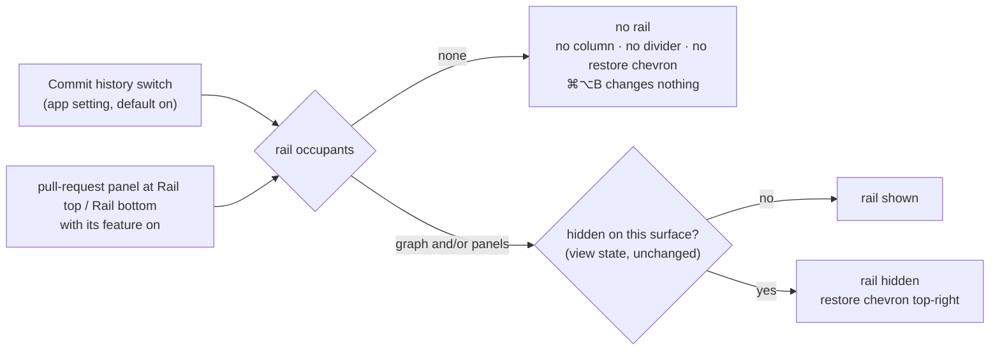

# Make the Commit Graph Optional

## Why

The commit-graph rail is the one part of the main window a reader cannot switch off. Hiding it (Cmd/Ctrl+Alt+B or its chevron) is a gesture built to be undone: by requirement a restore chevron stays in the detail pane's top-right corner, and the choice is remembered per surface, so the desktop app and every browser have to be told separately. A reader who never uses git history in SpecForge has no way to say so once. And since the pull-request panels can sit in the rail, "the graph is off" no longer means "the rail is empty". A rail holding a pull-request panel must stay. A rail holding nothing should leave no pane, divider or chevron behind.

## What Changes

The right-hand rail stops being "the commit graph's pane" and becomes a pane that exists only while something occupies it. The commit graph becomes one occupant that the reader can turn off.

- **A Commit history switch.** Settings gains a *Commit history* section with one switch, on by default, in the desktop app and the browser skin alike. It is an application setting (`commitHistoryEnabled`), so it is said once for every surface and survives a restart; a settings file written before this change loads with it on. A change is announced by a dedicated event on both transports, so open windows adopt it without a reload.

- **Off means no graph and no git work.** While the switch is off the commit graph is not rendered and no commit-graph read is made on its behalf. This is the guarantee a hidden rail already gives, now without the rail.

- **The rail exists only while occupied.** Its occupants are the commit graph (while the switch is on) and any pull-request panel positioned in a rail slot whose feature is on. With no occupant the main window has no rail at all: no column, no divider, no restore chevron, and the rail's keyboard toggle and macOS View menu item change nothing, not even the remembered visibility. Hidden-versus-shown stays per-surface view state, exactly as today, and applies only while the rail exists.

- **A rail of only pull-request panels.** With the switch off, panels positioned in the rail keep it and stack in slot order, and they may now use the rail's full height. The 40vh bound that keeps the graph its share is lifted, each panel still scrolls internally, and a collapsed panel keeps its one-line header. No height reserve applies.

- **Occupancy is known without rendering.** Whether a panel occupies the rail is read from its provider's snapshot, which `App` now reads and hands to the panel, rather than the panel reporting its presence once mounted. A panel that only ever reported from inside the rail could never make an absent rail appear. Nor could it retire the restore chevron of a hidden rail when its feature is turned off.

- **No flash at launch.** The switch is mirrored synchronously on each surface, the `document-width` pattern, so a window opened with history off never paints the rail and then removes it.

- **Turning history on shows it.** Switching history on from Settings shows the rail on that surface even if it had been hidden there. Other surfaces keep their own visibility.

## Capabilities

### New Capabilities

_None._

### Modified Capabilities

- `commit-graph`: adds *Commit History Can Be Turned Off*, covering the switch, its default and persistence, its delivery to open windows, no reads while off, the first frame, and showing the rail when switched on. *Commit-Graph Rail Pane* is qualified so that the graph occupies the rail only while history is on.
- `spec-browser`: adds *Rail Exists Only While Occupied* (occupants, absent versus hidden, occupancy decided from provider state). It modifies *Side-Pane Visibility Toggles* so an absent rail has no restore affordance and its toggle changes nothing, and *Side Panes Host the Pull-Request Panel* so that a rail without the graph lets its panels use the full height with no reserve.
- `application-menu`: *View Submenu Pane Toggles*. While the main window has no rail, Toggle Commit Rail changes no pane's visibility.

## Impact

- `crates/openspec-app/src/settings.rs`: `commit_history_enabled: bool` under `#[serde(default = "default_commit_history_enabled")]` (true), in `Default`, with `commit_history_enabled()` / `set_commit_history_enabled()` on the store. It must not be a bare `#[serde(default)]`, which loads `false` and would switch the graph off for every existing installation.
- `crates/openspec-app/src/events.rs`: `EVENT_COMMIT_HISTORY_ENABLED_CHANGED` (`commit-history-enabled-changed`), a direct emit carrying the new value on both transports, like `EVENT_DOCUMENT_WIDTH_CHANGED`. It is never a `CacheEvent`.
- `crates/specforge/src/commands.rs`, `crates/specforge/src/lib.rs`, `crates/specforge-web/src/dispatch.rs`: `get_commit_history_enabled` / `set_commit_history_enabled` on both transports. The setter emits the event: `app.emit` on the desktop, the app-event channel into SSE on the web.
- `src/types.ts`, `src/api.ts`: the event name mirror, the two wrappers, `onCommitHistoryEnabledChanged`.
- `src/hooks/useCommitHistoryEnabled.ts` (new): initialised from the mirror, reconciled with the store, and adopting the event.
- `src/hooks/usePullRequestSnapshot.ts` (new): each provider's snapshot read and its `*-pull-requests-updated` re-read, moved out of the panel.
- `src/components/PullRequestPanel.tsx`: renders a snapshot it is given. `onPresenceChange` is removed. The pure decisions and their tests are unchanged.
- `src/App.tsx`: rail occupancy, `far={null}` while unoccupied, the rail toggles guarded, `useCommitGraph` gated on the switch as well as visibility, the graph-less rail column, and showing the rail when the switch is turned on. The `bitbucketPresent` / `githubPresent` state becomes derived.
- `src/components/SettingsView.tsx`: the *Commit history* section, rendered on both hosts.
- `src/App.css`: the graph-less rail column.
- `src/CLAUDE.md`: the pull-request panel paragraph (presence is derived in `App`, and the rail exists only while occupied).
- Tests: the setting's default, persistence and absent-key load (in the mutation-gated `openspec-app`); the event name; the dispatch arm's emit and its appearance on the SSE stream; the rail-occupancy decision as a pure, bun-tested function.

**Deliberately unchanged.**
- *Terminal UI*: no change. Its History is a screen the reader chooses to open, not a pane taking width, and `terminal-ui` already requires its progress surfaces to render unconditionally.
- *Other surfaces*: the Dashboard's commit garden, the commit-detail view and reader windows (which have no rail).
- *Git work*: the watcher and every backend git path. The graph was already fetched only by a visible rail, so turning it off needs no Rust-side gating.
- *Visibility*: it stays view state, per surface and never a setting.
- *Layout*: no new pane, divider or toggle. `SplitPane` already renders no far pane, divider or restore chevron when given none, so it does not change.
- *Copy*: the "commit rail" labels and the static macOS "Toggle Commit Rail" item keep their names, and the panel position picker already reads "Rail top" / "Rail bottom".
- *Contextual emptiness*: a rail whose graph has nothing to show for the current selection (the Dashboard's "No repository" placeholder, a non-git workspace) still has an occupant and stays, so the layout never shifts as the reader navigates.
