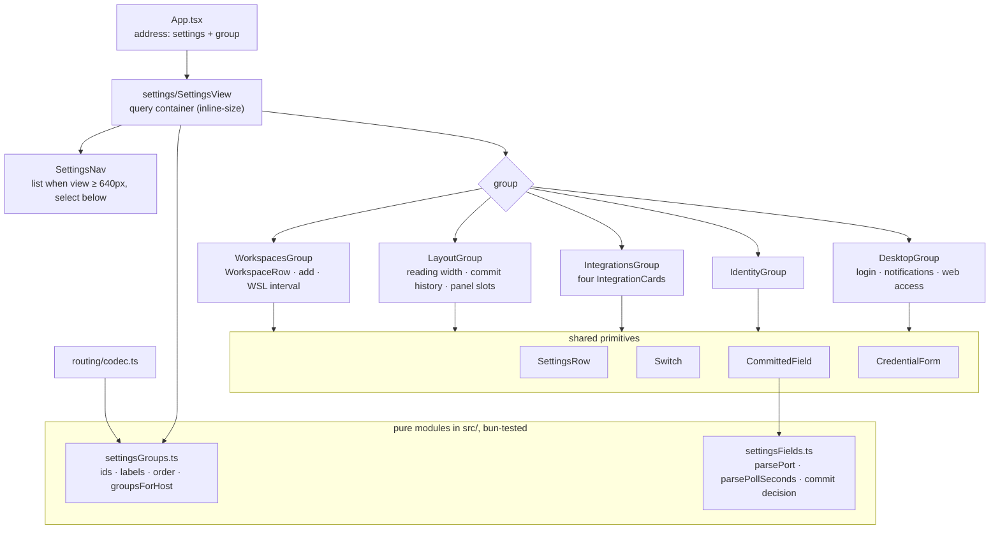
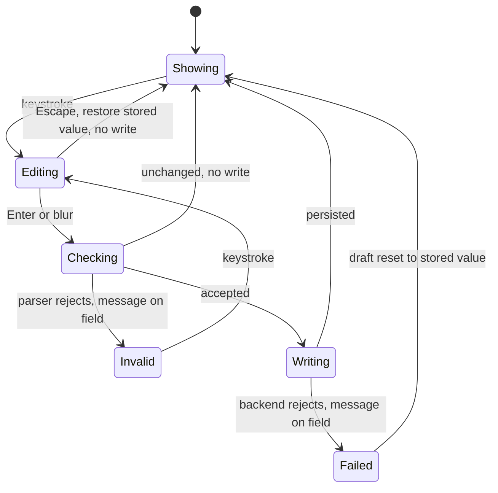
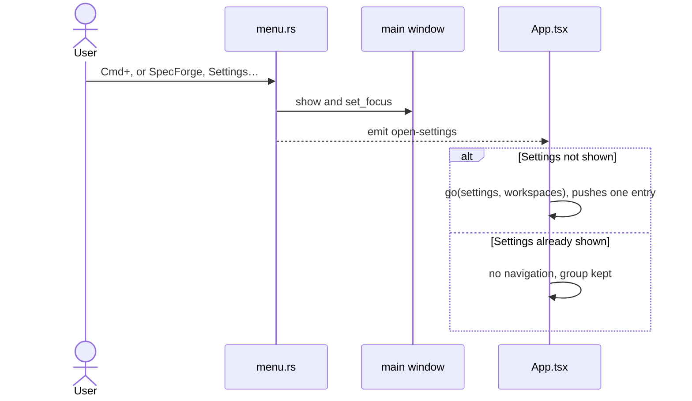

## Context

`src/components/SettingsView.tsx` is one 1,648-line component that renders twelve sections in a single column at the address `/settings`. That address is `{ kind: "settings" }` in `src/routing/address.ts`, with no further segments. The column grew one section per feature, and three sections arrived in the last fortnight.

The view lives in the center pane, the `right` slot of `SplitPane` in `App.tsx`. The sidebar stays beside it, and so does the commit rail, which is ambient and untouched by opening Settings. `App` gives Settings overlay semantics:

- `go()` replaces rather than pushes when leaving an overlay (`replace = options?.replace ?? wasOverlay`);
- `closeOverlay()` pops back to the pre-Settings view;
- a window-level Escape handler closes the view;
- the sidebar row toggles it.

The Dashboard's parked-workspace entries and `DisabledAddressNotice` both call `go({ kind: "settings" })`.

The constraints this design works within:

- **Width.** The window defaults to 900×650, the sidebar to 340px and the rail to 260px, and the center pane has a 320px floor. The view's own width therefore ranges from 320px at default size to well over 1,500px on a large display. `App.css` already has the precedent for responding to a pane rather than the window: `.doc-outline-rail` is a `container-type: inline-size` query container.
- **One bundle, two hosts.** The same bundle runs in Tauri and in the browser skin. Desktop-only settings are gated by `isTauri()`, and the WSL interval by its getter returning `null` off Windows. Those are the existing "backing query says not applicable" conventions.
- **Accent rationing.** *Accent Color* allows exactly four accent fills. The workspace row's switch (`.workspace-toggle[aria-checked="true"] { background: var(--accent) }`) is already a fifth, unsanctioned one.
- **Failure reporting.** Workspace rows already report write failures on the row. Every other section only calls `console.warn`.
- **Menu events.** The macOS menu reaches the webview by emitting events named in `crates/openspec-app/src/events.rs` and mirrored in `src/types.ts`; `EVENT_TOGGLE_SIDEBAR` is the precedent.
- **Backend.** No settings key, command or event changes.

## Goals / Non-Goals

**Goals:**

- Any setting is found in two steps (choose a group, scan one screen) at every view width from 320px up.
- Settings stays a center-pane view with its current overlay semantics, so tree tints and panel moves remain visible while editing.
- Every group has an address, and `/settings` keeps working.
- One switch, one row grammar and one save rule across all groups.
- Unused integrations shrink to one line.
- ⌘, opens Settings on macOS.

**Non-Goals:**

- Any change to the terminal UI's Settings screen.
- Settings search.
- Remembering the last-open group.
- Deep links to a single workspace row.
- Ctrl+, on Windows or Linux.
- A tray *Settings…* item.
- Live integration status in the cards.
- Exposing refresh intervals.
- Any change to the settings model, commands or events.

## Decisions

### D1. Groups are routed sub-views of the center pane

Settings stays where it is and shows one group at a time. The address names the group.



**Alternatives considered:**

- **One grouped page with a sticky jump strip.** Cheapest, but it leaves the length and the 320px column problem in place, and a jump strip at 320px is itself cramped.
- **The sidebar becoming the settings navigation (the Linear model).** It hides the tree, the Dashboard and Archive rows, the pull-request panels and the quota pills, and with them the live feedback the Workspaces and Layout groups benefit from. It also rewrites the *Settings Entrypoint in Sidebar Footer* semantics.
- **A routed settings dialog with its own navigation.** It sizes itself independently of the panes and is conventional, but it adds a second presentation model (scrim, focus trap) and dims the tree and rail behind it. It would also undo the premise `document-width` relies on, that Settings *replaces* the document.
- **A native settings window on the desktop.** The browser skin cannot open one, so the two hosts would present Settings differently.

### D2. Five groups, with panel positions in Layout

The groups are `workspaces`, `layout`, `integrations`, `identity` and `desktop`, labelled Workspaces, Layout, Integrations, Identity and Desktop app. Their membership is the table in *Settings Are Organised Into Groups*.

- **Desktop app** is exactly the set `isTauri()` already hides in the browser, so the platform boundary and the group boundary coincide.
- **Layout** holds the three settings that together decide what occupies the side panes (Commit history and both panel positions), plus the reading width.
- **Integrations** orders its cards pull requests first (GitHub, BitBucket), then usage (Claude, ChatGPT).
- **Layout** orders the panel positions BitBucket then GitHub, the order in which panels sharing a slot stack.

**Alternatives considered:**

- **"Appearance" instead of "Layout".** The desktop has no theme switch by requirement, and the terminal UI's *Appearance* row means colour scheme, so the name would promise something absent.
- **A separate "Web access" group.** It holds desktop-only settings, so splitting it from Desktop app would leave two desktop-only groups, one of them holding only two switches.
- **A "General" group.** A catch-all is how the single column happened.
- **Panel positions inside each provider's card.** The user chose Layout. Kept in the cards, they would leave the rail's occupants split across two groups.

### D3. The settings address always carries its group

`Address` gains `{ kind: "settings"; group: SettingsGroup }`. The codec behaves as follows:

- It encodes `/settings/<group>`.
- It decodes the bare `/settings` to `workspaces`.
- It decodes `/settings/<known group>` to that group.
- It decodes any other settings path, an unknown group or a deeper path, to unresolvable.

`resolve.ts` passes settings addresses through without consulting `views`, as it does today. The codec stays host-independent, as *Address and URL Round-Trip Through a Pure Codec* requires; host omission is decided at resolution (D5).

**Alternatives considered:**

- **An optional group.** `/settings` and `/settings/workspaces` would then be two addresses for one view, and every comparison (the sidebar row's active state, `closeOverlay`) would need normalising.
- **A `#group` fragment.** Fragments already carry in-document anchors for `DocumentView`.
- **A query parameter.** It would give the path-only codec a second parsing surface.

### D4. Moving between groups replaces the history entry

A group switch is a `go()` from an overlay to an overlay, so the existing `replace = options?.replace ?? wasOverlay` already replaces it without new code. `enteredOverlayViaPushRef` survives, because replacing keeps the stack depth, so `closeOverlay()` still pops back to the view shown before Settings. Back, Escape and the sidebar row continue to mean the same thing: leave Settings.

**Alternative considered:**

- **Pushing an entry per group, as GitHub's settings pages do.** Back would then walk the visited groups before closing Settings. That contradicts *Back closes the settings pane* and makes Back disagree with Escape.

### D5. A group the host omits falls back to Workspaces, in place

`groupsForHost({ desktop: isTauri() })` returns the offered groups. When the resolved group is not among them, `App` re-navigates to `{ kind: "settings", group: "workspaces" }` with `replace: true`, the same in-place canonicalisation *History Entry Discipline* already allows.

**Alternatives considered:**

- **A "This group is only in the desktop app" notice.** Extra UI for an address no control in the browser leads to.
- **Not found.** It would misreport a well-formed address as wrong.

### D6. Navigation: a container query picks a list or a native select

`.settings-view` becomes a query container, measured as below. The narrow form is the default stylesheet and the wide form is the enhancement:

$$w_{\text{view}} \ge 640\,\text{px} \;\Rightarrow\; \text{group list beside the content}, \qquad w_{\text{view}} < 640\,\text{px} \;\Rightarrow\; \text{native select above it}$$

On an engine without container queries the switcher therefore still works everywhere. No new platform floor is added either way, since the document outline already depends on container queries.

Both forms render; the inactive one is `display: none`, which removes it from the accessibility tree.

- **List entries** are buttons carrying `aria-current="page"` on the shown group, the same element the sidebar footer rows use.
- **The select** reuses the group labels and calls `go()` on change.

Choosing a group leaves focus where it was: on the list entry, or on the select.

The threshold of 640 leaves room for rows. A list of about 160px plus a 24px gap, inside 32px padding each side, still leaves at least 392px for rows: enough for a title and description beside a switch, while choice rows stack. At 1,280px with both side panes at their defaults, the view is 680px wide and shows the list. At the 900px default it is 320px and shows the switcher. The content column is capped at 720px (*Settings Rows*), so wide panes keep a readable measure.

**Alternatives considered:**

- **A viewport media query.** The window width does not tell how wide the pane is; the outline's comment records the same lesson.
- **A horizontal tab strip.** Five labels need roughly 520px, so at 320px they wrap or scroll and hide groups.
- **A `ResizeObserver` toggling a class.** It works, but container queries already exist in the stylesheet and keep the rule declarative.
- **A custom dropdown.** It would re-implement what the native select gives for free: keyboard operation, the OS picker on touch, and accessible semantics.
- **Anchors with `href` for the list.** They would need the per-host link handling of *Link Handling in the Browser Skin* in exchange for opening a settings group in a new tab.

### D7. Settings becomes a module of groups and primitives

`src/components/settings/` holds:

- the shell (`SettingsView`) and the navigation (`SettingsNav`);
- one component per group;
- the primitives every group shares: `SettingsRow`, `Switch`, `CommittedField`, `CredentialForm` and `IntegrationCard`.

`WorkspaceRow` moves into the Workspaces group unchanged apart from its switch.

The two pure modules sit at top-level `src/`, beside `docWidth.ts` and `commitHistory.ts`, and are bun-tested:

- `settingsGroups.ts` holds the ids, labels, order and `groupsForHost`. It lives outside the component tree because the routing codec needs the group ids, and `src/routing/` does not import components.
- `settingsFields.ts` holds the field parsers and the commit decision.

Both Layout and Integrations need the provider configurations. They read them through `useBitbucketConfig` and `useGithubConfig`, which fetch on mount and adopt `pull-request-panel-moved`, so the panel slot named in a card and the slot chosen in Layout cannot disagree. `App` keeps owning the reading width and Commit history and passes them through `SettingsView` to the Layout group, exactly as today.

**Alternatives considered:**

- **Keeping one file.** Its growth is the problem being solved.
- **A schema-driven renderer that builds rows from a declarative list.** Most of the view is bespoke (workspace rows, identity lists, credential forms, the width sample), so a schema would cover the easy third and push everything else into escape hatches.

### D8. One switch: a native checkbox drawn in accent ink

```svg
<svg viewBox="0 0 540 165" xmlns="http://www.w3.org/2000/svg" font-family="system-ui" font-size="11">
  <text x="8" y="12" opacity="0.5" font-size="9">settings row, wide</text>
  <rect x="8" y="18" width="300" height="46" rx="4" fill="none" stroke="currentColor" opacity="0.35"/>
  <text x="18" y="36">Notifications</text>
  <text x="18" y="53" opacity="0.65">Alert on new and archived changes.</text>
  <rect x="262" y="31" width="34" height="20" rx="10" fill="none" stroke="#6f7cf0"/>
  <circle cx="286" cy="41" r="7" fill="#6f7cf0"/>
  <text x="330" y="12" opacity="0.5" font-size="9">switch states</text>
  <rect x="330" y="18" width="34" height="20" rx="10" fill="none" stroke="currentColor" opacity="0.5"/>
  <circle cx="340" cy="28" r="7" fill="currentColor" opacity="0.45"/>
  <text x="372" y="32">off: neutral, knob leading</text>
  <rect x="330" y="46" width="34" height="20" rx="10" fill="none" stroke="#6f7cf0"/>
  <circle cx="354" cy="56" r="7" fill="#6f7cf0"/>
  <text x="372" y="60">on: accent ink, knob trailing</text>
  <text x="372" y="74" opacity="0.55" font-size="9">no accent fill, no glow</text>
  <text x="8" y="90" opacity="0.5" font-size="9">narrow row: control drops below</text>
  <rect x="8" y="96" width="170" height="64" rx="4" fill="none" stroke="currentColor" opacity="0.35"/>
  <text x="18" y="113">Launch at login</text>
  <text x="18" y="129" opacity="0.65">Start with your session.</text>
  <rect x="18" y="135" width="34" height="20" rx="10" fill="none" stroke="currentColor" opacity="0.5"/>
  <circle cx="28" cy="145" r="7" fill="currentColor" opacity="0.45"/>
  <text x="200" y="90" opacity="0.5" font-size="9">view 640px and wider</text>
  <rect x="200" y="96" width="150" height="64" rx="4" fill="none" stroke="currentColor" opacity="0.35"/>
  <text x="208" y="112" font-size="10">Workspaces</text>
  <text x="208" y="125" font-size="10" fill="#6f7cf0">Layout</text>
  <text x="208" y="138" font-size="10">Integrations</text>
  <text x="208" y="151" font-size="10" opacity="0.6">…</text>
  <line x1="276" y1="100" x2="276" y2="156" stroke="currentColor" opacity="0.25"/>
  <text x="284" y="112" font-size="10">Reading width</text>
  <text x="284" y="125" font-size="10" opacity="0.6">Commit history</text>
  <text x="365" y="90" opacity="0.5" font-size="9">view under 640px</text>
  <rect x="365" y="96" width="140" height="64" rx="4" fill="none" stroke="currentColor" opacity="0.35"/>
  <rect x="373" y="102" width="92" height="18" rx="3" fill="none" stroke="currentColor" opacity="0.6"/>
  <text x="380" y="115" font-size="10">Layout ▾</text>
  <text x="373" y="138" font-size="10">Reading width</text>
  <text x="373" y="151" font-size="10" opacity="0.6">Commit history</text>
</svg>
```

`Switch` renders `<input type="checkbox" role="switch">`, made invisible (`opacity: 0`) and laid over a drawn track, so the input takes every click and keeps every native behaviour. A sibling element draws the state:

- **Track:** a 34×20 fully rounded span. `box-sizing: border-box` is set explicitly, because this stylesheet has no global rule.
- **Knob:** a 14px span inside the track, moved by `input:checked + .settings-switch-track`.
- **Colours:** off is `--surface-2` with a `--border-strong` edge and a `--text-faint` knob. On is an `--accent` edge and an `--accent` knob over `--surface`. This is the same ink-not-fill rule `.settings-choice[aria-checked="true"]` already follows.
- **Focus:** `input:focus-visible + .settings-switch-track` uses the shared focus ring.
- **Motion:** the knob's transition drops under `prefers-reduced-motion`.

A sibling draws the state, rather than `appearance: none` plus a `::before` knob on the input itself, because pseudo-elements on form controls are unspecified and vary across engines, including the WebKitGTK the Linux build runs on. A sibling selector works the same everywhere.

A row's title is a `<label htmlFor>`, so the whole title is a hit target. The workspace row's switch keeps its `aria-label`, including the shared-scope suffix that *A shared toggle declares its scope before use* relies on. On coarse pointers the invisible input itself grows to 44×44, which changes nothing that is painted and stays inside the workspace row's padding.

A native checkbox toggles on Space but not Enter, whereas the `<button role="switch">` it replaces toggled on both. The WAI-ARIA switch pattern requires only Space, so the narrower behaviour is accepted.

**Alternatives considered:**

- **An accent-filled track.** This is today's workspace switch. It breaks *Accent Color*, and with a group's worth of switches on screen it would spend the accent on every row.
- **`--ok` green when on.** Status colours mean outcomes, not control state.
- **The native checkbox look.** It conflicts with the trailing-control row and with the workspace switch.
- **`<button role="switch">` everywhere.** It re-implements label association and form semantics, and would make *Settings toggle keeps its native control rendering* untrue.

### D9. One save rule, carried by three primitives

- **Switches and choices** go through `useSettingSwitch` (and its choice twin), which applies the change optimistically. On failure it reverts and sets an inline error on the row (`role="alert"`), replacing today's `console.warn`.
- **Text and number fields** go through `CommittedField`. Pure parsers validate number fields: `parsePort` accepts integers $$1 \le p \le 65535$$ and `parsePollSeconds` accepts integers $$s \ge 1$$.
- **Credentials** go through `CredentialForm`, which writes only on Save.



Escape in a `CommittedField` stops propagation, so `App`'s window-level Escape fallback does not also close Settings. It also sets an `abandoning` ref so the blur that follows does not commit; this is the pattern `WorkspaceRow`'s rename already uses. Number fields are `inputMode="numeric"` text inputs rather than `type="number"`. A number input reports an empty value for partial entries, which hides what was typed from the validation message, and its spinner and wheel change the value without the user noticing.

**Alternatives considered:**

- **Keeping per-keystroke writes for the port and the WSL interval.** Every intermediate value gets written: typing 4317 persists 4, 43 and 431 first.
- **An explicit Save for every field.** Heavier, and inconsistent with switches that apply immediately.

### D10. Integration cards collapse while off and disclose instructions until configured

`IntegrationCard` renders differently depending on state:

- **Off:** the header row (name, description and switch) and, when a credential is stored, a one-line "Token stored · Remove" affordance.
  - GitHub's Remove calls `setGithubToken("")`.
  - BitBucket's calls `setBitbucketCredentials(username ?? "", "")`, which clears the token and keeps the username: the specified *Clearing the token* behaviour.
- **On:** `CredentialForm`, plus a `<details>` holding the setup instructions the pull-request specs require, open by default only while no credential is stored. A pull-request card also shows a line naming its panel's slot, with a button to the Layout group.
- **The two usage cards** never show more than their header row.

Web access in the Desktop app group keeps today's progressive disclosure, so its help appears only while serving is on. Its SSH and Tailscale walkthrough moves under a `<details>` so the group's controls fit on one screen.

**Alternatives considered:**

- **Credentials visible while off.** This keeps the length problem. Turning an integration on before entering a credential is harmless: with nothing to authenticate with, the poller reports the unauthenticated state the panel already explains.
- **A separate "Accounts" group for credentials.** It would split one integration across two groups.

### D11. Layout gathers the side panes' occupants; an off provider's slot stays operable

The panel-position rows reuse the `.settings-choice` radio row. When a provider is off, its row adds "BitBucket pull requests are off" and a button to Integrations, and the choice stays operable. Choosing a slot early is harmless, and a disabled control with no visible reason is the "does nothing" control the specs rule out. The Commit history description no longer needs to explain in prose that rail-positioned panels keep the rail, because those rows sit directly beneath it.

**Alternative considered:**

- **Disabling the choice while the provider is off.** It looks broken, and it blocks a harmless choice.

### D12. *Settings…* emits `open-settings` from the macOS menu



The event name is defined once and mirrored:

- **`crates/openspec-app/src/events.rs`** gains `EVENT_OPEN_SETTINGS = "open-settings"`, beside `EVENT_TOGGLE_SIDEBAR`.
- **`menu.rs`** inserts `MenuItem::with_id(handle, EVENT_OPEN_SETTINGS, "Settings…", true, Some("Cmd+,"))`, with separators either side, between `.about(…)` and `.services()`. `handle_menu_event` accepts its id, then shows and focuses the main window before emitting.
- **`src/types.ts`** mirrors the name.
- **`src/api.ts`** gains `onOpenSettings`, which is a no-op in the browser because the event is Tauri-only, as the pane toggles are.

**Alternatives considered:**

- **An in-webview ⌘, key handler.** It would fire alongside the native accelerator for one keypress. It could not work in the browser either, where ⌘, belongs to the browser's own preferences.
- **`emit_to("main", …)`.** The existing toggles broadcast, and reader windows register no listener, so one pattern is kept.

## Risks / Trade-offs

- **[Settings is now one step deeper]** → Workspaces, the most-used group, is the default, and both re-enable paths name it. The list is visible whenever the view is at least 640px wide. Collapsed integration cards still name every integration, and ⌘, gives a direct route on macOS.
- **[The native select's popup looks different per OS]** → It matches the OS, gives the touch picker on phones, and appears only below 640px.
- **[Credentials are hidden while an integration is off]** → Turning one on without a credential makes no authenticated request. A stored token can be removed while off, which is the privacy-sensitive direction.
- **[Enter no longer flips the workspace switch]** → Space does, which is the WAI-ARIA switch contract. The title label also flips it.
- **[Two navigation forms in the DOM]** → The inactive one is `display: none`. Verification covers both widths, checking that exactly one form is exposed to assistive technology.
- **[Escape in a field must not close Settings]** → `CommittedField` stops propagation, which a *Settings Persist by One Rule* scenario pins.
- **[The mutation gate never runs, since this is a frontend change outside `openspec-core`]** → The group table, codec and parsers are pure bun-tested modules. The rest is verified visually through the served web UI at 320, 680 and 1,600px, and in `bun tauri dev` for the menu item.
- **[Old `/settings` links]** → They decode to Workspaces, and a scenario pins that.

## Migration Plan

No persisted state changes: every settings key, default and command is untouched, and the group lives only in the address. Links to `/settings` keep resolving, now to Workspaces. Rolling back means reverting the frontend, the menu item and the event constant; nothing on disk needs undoing.

## Open Questions

- Should each surface remember the last group it showed (as view state, like rail visibility), so the sidebar row and ⌘, reopen it? This is deferred: entry points open Workspaces for now.
- Should the Layout group draw a schematic of the four panel slots? This is deferred until the rows prove insufficient.
- There is a pre-existing tension, left untouched here. *Settings View* calls the enable toggle "the only surface" for disabling or re-enabling a workspace, while the disabled-workspace notice also re-enables one.
