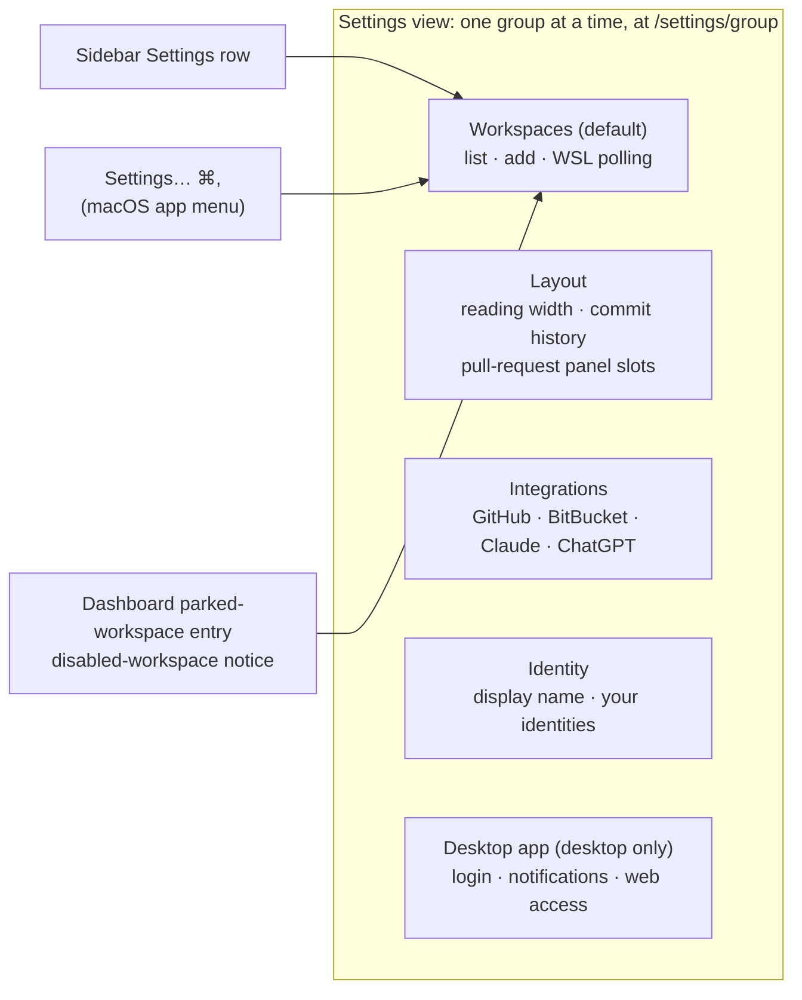

# Regroup Settings Into Routed Groups

## Why

Settings has grown from three sections at bootstrap to twelve, three of them added in the last fortnight. Each new section was appended to one long column with no group to put it in. Related controls drifted apart: WSL polling sits at the opposite end from Workspaces, and Notifications and Startup are four sections apart. One concept is split three ways: the Commit history switch and the two panel-position pickers jointly decide whether the rail exists, so the Commit history copy has to explain the coupling in prose. Features that are off still render every field: the BitBucket and GitHub sections carry seven help paragraphs, a credential form and a four-slot picker whether or not anyone uses them. The only address is `/settings`, so the Dashboard's parked-workspace entries and the disabled-workspace notice can aim only at the top of the page, and they work because Workspaces happens to be listed first. At the default 900px window the center pane sits at its 320px floor beside the sidebar and rail, so the whole column renders phone-width. On a wide display the help text runs edge to edge. Every further integration makes all of this worse.

## What Changes

Settings stays where it is, a view in the center pane, but it shows one group at a time. Every group has its own address.

- **Five groups, one at a time.** The single column becomes five groups, shown one at a time in the center pane: Workspaces, Layout, Integrations, Identity and Desktop app. Desktop app holds exactly the settings that only the desktop shell can honour, so the browser skin leaves it out entirely. The web UI's hide rule then removes one group instead of three scattered sections.

- **Every group has an address.**
  - Each group is reached at `/settings/<group>`.
  - The bare `/settings` (the only settings address minted so far) opens Workspaces.
  - Moving between groups replaces the history entry, so Back, Escape and the sidebar row still close Settings from any group.
  - The Dashboard's parked-workspace entries and the disabled-workspace notice name the Workspaces group instead of relying on it being listed first.

- **Navigation follows the pane's width.** While the Settings view is wide enough, a group list sits beside the content. Below that, including the 320px default, a single-line switcher sits above it. The decision is a container query on the view itself, the document outline's established pattern, never the window's width.

- **Layout gathers what occupies the side panes.** Reading width, the Commit history switch and both pull-request panel positions sit together. The rule that a rail exists while something occupies it is then visible in one place instead of being explained in prose. An enabled integration's card states its panel's slot and links to Layout.

- **Integrations collapse while off.**
  - **Off:** an integration shows its name, one line of description and its switch, and nothing else.
  - **On:** it adds its credential fields and Save. The token instructions the pull-request capabilities require sit in a disclosure, open while no credential is stored and closed once one is.
  - **Stored credential while off:** the card states it and offers to remove it without turning the integration on, which would start polling with it.

- **One row grammar, one switch.**
  - **Rows.** Every setting is a row: its title and description at the leading edge, its control at the trailing edge. On a narrow view the control drops below the text. The content column is width-bounded, so descriptions keep a readable measure on a wide pane.
  - **Switch.** Every on/off setting uses one switch, the workspace rows' enable toggle included. It is a native checkbox input exposed as `role="switch"` and drawn in accent ink and outline.
  - **Fix in passing.** The workspace switch's accent-filled track goes; it is a fill the *Accent Color* requirement does not sanction.

- **One save rule.**
  - Switches and choices save on change.
  - Text and numbers save on Enter or when focus leaves the field, never per keystroke. Today the web port and the WSL interval write on every keystroke.
  - Credentials save only on Save.
  - A rejected or failed write is reported on the control, which keeps showing the stored value. Workspace rows already follow this rule; it now covers every setting.

- **Settings… on macOS.** The SpecForge menu gains *Settings…* (⌘,) directly after *About SpecForge*. It shows and focuses the main window and opens Settings, leaving the current group alone if Settings is already open.

- **A capability that owns the structure.** The new `settings-view` capability covers the groups, navigation, rows, save rule and disclosure. `workspace-registry`'s *Settings View* keeps its workspace controls and points to it.

## Capabilities

### New Capabilities

- `settings-view`: the graphical Settings view of the desktop app and the browser skin. It covers the five groups and their membership, group navigation that follows the view's own width, omitting a group with nothing applicable on the host, which group each entry point opens, the row grammar and bounded width, the single save rule, integration disclosure, and the Layout group.

### Modified Capabilities

- `view-routing`:
  - *Addressable Viewing State*: the settings address names its group.
  - *Address and URL Round-Trip Through a Pure Codec*: the bare settings path decodes to Workspaces, and an unknown group is unresolvable.
  - *History Entry Discipline*: moving between groups replaces the entry.
  - *Cold-Load Address Resolution*: the disabled outcome offers the Workspaces group.
- `workspace-registry`: *Settings View*. The workspace controls live in the Workspaces group, and the launch-on-login and notification toggles in Desktop app. The view's structure is deferred to `settings-view`.
- `dashboard`: *Ship Selection Opens the Archive Browser*. An entry whose row is parked or unregistered opens the Workspaces group.
- `web-ui`: *Desktop-Only Settings Are Hidden in the Web UI*. A group left with no applicable setting is omitted from the group navigation.
- `visual-identity`:
  - Adds *Settings Switch Control*.
  - *Accent Color*: the settings switch replaces the settings-toggle checkbox among the accent's ink uses.
  - *List-Row Vertical Rhythm Tuned for 4K @ 100%*: the settings row replaces the toggle row.
  - *Markdown Task-Checkbox Treatment*: settings on/off controls render as that switch.
- `application-menu`: adds *Settings Menu Item* (macOS, ⌘,).

## Impact

- **`src/components/SettingsView.tsx`** (1,648 lines) becomes a `src/components/settings/` module:
  - the view shell and group navigation;
  - one file per group;
  - shared primitives: settings row, switch, committed text and number field, integration card.
  - `SettingsView` stays the export `App.tsx` imports.
- **`src/routing/address.ts`, `codec.ts`, `resolve.ts`** and their bun tests: the settings address carries a group, the bare path aliases Workspaces, and an unknown group is unresolvable.
- **`src/App.tsx`:**
  - the group reaches `SettingsView`;
  - the sidebar row, the Dashboard's parked-workspace entries and the disabled-workspace notice open Workspaces by name;
  - an address naming an omitted group is canonicalised in place;
  - the menu event is handled.
- **`src/App.css`:**
  - new: view shell, group list, narrow switcher, settings row, switch, bounded content column;
  - removed: `.settings-toggle-row` and `.workspace-toggle`.
- **`crates/openspec-app/src/events.rs` and `src/types.ts`:** `EVENT_OPEN_SETTINGS` (`open-settings`), a menu-emitted, Tauri-only event like `EVENT_TOGGLE_SIDEBAR`.
- **`src/api.ts`:** its listener.
- **`crates/specforge/src/menu.rs`:** the *Settings…* item (⌘,) after About, and its arm in `handle_menu_event`, which shows and focuses the main window, then emits.
- **Tests:**
  - bun tests for the codec and resolution, group membership and omission, and the save rule's commit and validation helpers;
  - the existing settings-related Rust tests are untouched.

**Deliberately unchanged.**
- **Settings model and IPC.** Every setting keeps its key, default, command and event, so this is a presentation change plus one menu event. `openspec-core` and the settings logic in `openspec-app` are untouched; the only `openspec-app` edit is the event-name constant. The mutation gate therefore has nothing to measure, and coverage comes from bun tests.
- **The terminal UI's Settings screen** (`terminal-ui`), including its toggle order and Appearance row.
- **The Settings view's place in the shell.** It stays a center-pane view. The sidebar row's toggle semantics, Escape to dismiss, and "selecting a tree node closes Settings" are unchanged, so `spec-browser` needs no delta.
- **The marketing site's docs.** `site/pages/docs/settings` (which walks the old single column "top to bottom") and the "Settings ▸ Web UI" path in `site/pages/docs/web-ui` still describe the current release. A master push touching `site/**` publishes the site at once, so rewriting them here would document a layout no released build has yet. They are updated alongside the release that ships the groups.
- **Specs that only say a value is "presented in Settings"** need no delta: reading width (`document-width`), Commit history (`commit-graph`), panel positions and token copy (`bitbucket-pull-requests`, `github-pull-requests`), and WSL polling (`wsl-workspaces`). Each is still presented in Settings.
- **Out of scope:**
  - search;
  - remembering the last-open group;
  - deep links to a single workspace row;
  - a Ctrl+, binding on Windows and Linux, which have no app menu (and browsers reserve ⌘, for their own preferences);
  - a tray *Settings…* item;
  - live integration status in the cards;
  - exposing the refresh intervals.
