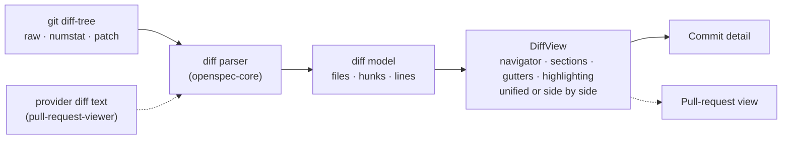

# Rich, Navigable Diff View

## Why

The commit-detail view renders each changed file as a raw unified diff in a prefix-coloured `<pre>`: no syntax highlighting, no line numbers, no way to move between files, and no limit on how much it renders. The richer viewer was planned from the start and deferred twice:
- as stage 3 of `add-commit-graph-rail` ("file-tree navigation, per-file collapse, syntax highlighting, +/- gutters");
- in `CommitDetailView.tsx`'s own comment ("a richer, navigable diff viewer is the documented follow-up").

It is due now because the read-only pull-request viewer (change `pull-request-viewer`) needs the same view for a pull request's files. Building it once, over a parsed diff model, upgrades commit detail today and gives the viewer its "Files changed" body without a second renderer. Reviewers also need to choose between a unified and a side-by-side diff. Both layouts render the same model, so the choice needs no second renderer either.

## What Changes

- **A parsed diff model in `openspec-core`.** A pure parser reads git's unified-diff output, and a second entry point reads a header-less per-file patch such as GitHub's. Both produce the same model:
  - **Files**, each with old and new paths, old and new modes, and a status: added, modified, deleted, renamed, copied, mode-only or type-changed.
  - **Each file's content**, in one of four states: its hunks, held back by the budget, too large to preview, or binary.
  - **Hunks**, each with old and new ranges and its section heading.
  - **Lines**, each context, added or removed, with old and new line numbers. A line that lacks a newline at the end of its file carries a flag saying so.

  Text in another encoding is decoded line by line, so one such file cannot blank a commit. The model carries no layout. The frontend renders it and parses nothing, and the pull-request viewer will feed it from the providers' diff text.
- **One bounded read per commit.** Commit detail reads the commit in a fixed number of `git` processes, instead of one IPC call and one process per file.
  - Files that fit the line and byte budgets arrive with their hunks.
  - Larger files arrive with their counts and load when the reader asks.
  - A file past the per-file ceiling says it is too large to preview.
  - Binary files are listed without a diff.
- **A file navigator.** A collapsible tree of the changed files, by directory, showing each file's status and counts. Activating a file scrolls to it, and the file being read is marked as the reader scrolls.
- **File sections.** Each file is a section with:
  - a sticky header: the path (old → new for a rename), the status, any mode change, the counts and a collapse toggle;
  - line-number gutters: old and new side by side in the unified layout, one beside each column in the side-by-side layout;
  - lines that keep their `+` and `−` markers in both layouts, so additions and removals are never conveyed by colour, or by column, alone.
- **Unified or side by side, as the reader chooses.** A control in the diff view's toolbar switches between two layouts of the same model:
  - **Unified:** one column, as today.
  - **Side by side:** the old file on the left and the new on the right.
    - Context lines face each other.
    - In each change block, the removed and added lines pair up row by row, in order.
    - A line with no partner faces an empty filler cell.
    - A file whose every line is on one side (an added or deleted file, or one emptied or filled from empty) uses one column. A file with any context line keeps both, so context lines always face each other.
    - Long lines wrap inside their cell, so paired rows stay aligned.
    - A selection stays in the column it started in.

  The choice is remembered per surface, like pane visibility: once for the desktop app, and once per browser for a served instance. It is unified by default, and it is never an application setting, so choosing unified on a phone never changes the desktop. Where the view is too narrow for two columns, it shows unified, says why, and keeps the choice. Both layouts draw highlighting and hidden-character escapes from the same computation per hunk side. The slots and the budgets are identical in both, and switching re-reads nothing.
- **Syntax highlighting.** Diff lines are highlighted by the file's language with the same grammars as fenced code in rendered markdown. A language the highlighter does not know renders plain. Every token colour keeps the palette's 4.5:1 contrast floor, in both layouts:
  - on the code well;
  - on the added, removed and context line backgrounds.
- **Hidden characters made visible.** A character that renders as nothing can no longer hide in a diff line or a path. That covers Unicode's default-ignorable characters, among them the bidirectional controls, zero-width characters and tag characters. Each renders as a visible, marked escape, and the file's header warns, as GitHub's diff does. On an added or removed line every such character is escaped, so a change that only adds or removes one never shows as two identical lines.
- **A file list that tells the truth.**
  - A rename is detected and shown as one renamed file, rather than a deletion plus an addition.
  - A type change (file ↔ symlink ↔ submodule) is one file.
  - A root commit lists the files it added, where today it says "This commit changed no files".
  - A merge commit shows its changes against its first parent, labelled as such, where today it shows no files.
- **One shared component.** `DiffView` takes the model, the names of the two sides, and two optional per-file slots: one in the header, and one between the header and the first hunk.
  - It owns the layout control, so commit detail and the pull-request view offer the same choice.
  - Both slots render the same in either layout. The header slot sits in the sticky header, and the preamble spans the section's full width.
  - The pull-request viewer can add its "viewed" mark and its review threads without forking the renderer.
- **BREAKING** for any external script that reads `get_commit_detail` or `get_commit_diff` over the browser skin's `/api/invoke`. Both keep their names and existing arguments; `get_commit_diff` gains an optional `oldPath`. Both return the new model. The bundled frontend moves in the same change.

## Capabilities

### New Capabilities

- `diff-view`: the shared diff presentation, independent of where a diff came from. It covers:
  - the model's meaning: statuses, modes, content states, hunks, line numbers and the no-newline flag;
  - the file navigator, file sections and their collapse, and the gutters;
  - the unified and side-by-side layouts: pairing, filler cells, one-column files, long lines, selection and copying, and where the hunk header and the no-newline flag sit in each;
  - the reader's per-surface choice between the layouts, and the narrow-width fallback;
  - each rendered line's side-qualified identity, which keeps the reader's place across a switch and is what a later anchor targets;
  - syntax highlighting, and visible hidden characters;
  - the line and byte budgets with on-request loading;
  - keyboard and accessibility behaviour in both layouts.

### Modified Capabilities

- `commit-graph`: *Commit Detail View* renders its files through the `diff-view` capability, in the layout the reader chose. It reads the commit in a bounded number of `git` processes, detects renames and type changes, lists a root commit's files, and shows a merge commit's changes against its first parent.
- `visual-identity`: *Syntax Highlight Palette* extends its 4.5:1 floor from the code well to the diff view's added, removed and context line backgrounds. This holds in both schemes and both layouts, for token-driven classes as well as literal ones. The side-by-side filler cell gets its own background token, distinct from every line background; it holds no text, so the floor does not apply to it.

## Impact

- `crates/openspec-core/src/diff.rs` (new): the two pure parsing entry points, the model types and the budget decision. It ships with fixture tests, so the mutation gate has assertions to catch. Fixtures cover:
  - renames, and type changes in a commit, in provider text and in a one-file read;
  - a submodule change, mode changes and binary markers;
  - no-newline markers after a removed line, after an added line, after a context line, and on both sides of one change block, including a change that only adds or removes the final newline;
  - C-quoted non-ASCII paths, names containing spaces, a non-UTF-8 path in the `-z` list, and a Latin-1 line between two UTF-8 files;
  - empty, added and root diffs;
  - a diff cut mid-section;
  - a one-line change to a very long line, many files with long lines, and the line-budget boundary.
- `crates/openspec-core/src/git.rs`:
  - one `diff-tree --raw --numstat -z` file list;
  - a streamed, budgeted patch read whose child process `git.rs` stops and reaps deliberately;
  - lossy decoding per line and per record;
  - a first-parent diff for merges;
  - literal pathspecs for the per-file read;
  - every reference still passed after the end-of-options marker (`commit-graph`: *Commit References Are Injection-Safe Arguments*).
- `crates/openspec-app/src/service.rs`: commit detail decides the eager set and assembles the model, and the per-file read returns one file on request. The hex-id check (`is_object_id`) stays where it is.
- `crates/specforge/src/commands.rs`, `crates/specforge-web/src/dispatch.rs`, `src/api.ts`: the two commit-detail commands return the model on both transports.
- `crates/openspec-app/tests/wire_shape.rs`, `src/types.ts`: the model's types, mirrored by hand. Every variant and field is populated, discriminants are asserted by exact value, and `noNewline` is asserted as a field of the line it qualifies. The layout adds nothing to the wire shape.
- `src/components/DiffView.tsx` (new), `src/components/CommitDetailView.tsx`, `src/App.css`: the navigator, sections and gutters; both layouts' row structures, filler cells and one-column files; the narrow-width fallback; highlighting and hidden-character escapes; and per-scheme line tints, filler background and token values that keep the palette's floor. Commit detail becomes its header over a `DiffView`.
- `src/diffLayout.ts` and `src/diffLayout.test.ts` (new): the layouts' pure decisions, tested with bun. The repository has no component tests, and a `src/`-only change short-circuits the mutation gate, so these hand-written fixtures are the layouts' only automated coverage. The decisions are:
  - the pairing of a hunk into side-by-side rows;
  - whether a file renders in one column;
  - the layout in effect, from the view's chosen layout, the sections column's width in `ch` of the code font, and the layout already in effect (on at 104 ch, off below 96 ch);
  - the stored choice's read and write, with an injectable store;
  - the clipboard text a selection yields, with one side named or none.
- `src/components/ChoiceGroup.tsx` (new): the `.settings-choice` radio-group vocabulary, with the workspace tint palette's arrow-key contract, used by the layout control. Settings' own choice rows are not changed by this change.
- `package.json`: `lowlight` becomes a direct dependency at the version `rehype-highlight` already resolves, so diffs and markdown code blocks share one highlighter.

**Deliberately unchanged.**
- **Not added:**
  - no word-level emphasis and no pairing by similarity (side by side pairs a change block's lines by position);
  - no ignore-whitespace toggle;
  - no virtualised rendering;
  - no layout per file or per window;
  - no keyboard shortcut, menu item or Settings row for the layout.

  The model leaves room for the first three, and the budgets bound the lines on the page in either layout (not the number of files; see the design's risks).
- **Navigation untouched:** no change to the commit graph, the rail or the address grammar. Commit detail stays the unaddressed center-pane view it is today, and the layout is in neither the address nor any window's URL.
- **Terminal untouched:** the terminal frontend has no commit detail.
- **The header message stays as it is.** It shows only the subject, which already falls short of the "full message" *Commit Detail View* requires. That is a separate fix, so this change stays about the diff.
- **Still read-only:** no `git` operation that writes is added.
