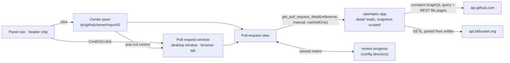

# Read-Only Pull-Request Viewer

## Why

SpecForge lists the open pull requests on both hosts, with their review state, checks, conflicts and the worktree each comes from. Reading one still means leaving, though: every panel row and header chip opens the provider's web page. A reviewer of a mixed queue of human and agent pull requests asks three questions: what changed, which files have I already read, and what is new since I last looked. Today those get answered in a browser tab that knows nothing about the worktree or the OpenSpec change behind the pull request.

Exploring the placement on 2026-10-04 settled it: the viewer belongs in SpecForge rather than in a standalone app.
- Its users are SpecForge's users.
- The inboxes, credentials and worktree links it needs already exist here.
- A standalone app would duplicate them without making anything safer.

It ships read-only; acting on pull requests is a separate change. The same day, the user decided that a pull request opens the way a document does: in the main window, with an address, or in its own window on request.

## What Changes

- **A pull request opens the way a document does.**
  - **A click** on a pull-request row or a header pull-request chip opens it in the main window's center pane, at its own address (`/pr/github/<owner>/<repo>/<number>`, `/pr/bitbucket/<workspace>/<repo>/<id>`). That gives it Back and Forward, deep links and reloads, like an artifact.
  - **Cmd-click on macOS, or Ctrl-click elsewhere**, opens it in its own window, a desktop window or a browser tab, as an artifact opens in a reader window. A visible "Open in its own window" control on the view does the same. One window per pull request is reused and focused, and the launching view is left as it was.
  - **The provider's page** opens from "Open on GitHub" / "Open on BitBucket" in the view's header.
  - **One view, two presentations.** It shows the header signals, the description, the conversation, the checks and the changed files, whether in the center pane or in its own window.
- **Detail is read on demand, for listed pull requests only.** Opening a pull request reads its detail through a new request class in `openspec-app`, separate from the pollers. Listed means authored or awaiting your review on GitHub, and authored on BitBucket.
  - A read names the pull request by its provider, repository and number, never by a URL, and the service finds it in the current snapshot.
  - A read happens only while that provider is enabled. It never writes, and it follows no redirect.
  - GitHub: one compile-time constant GraphQL query, its variables taken from the snapshot row, plus REST pages of per-file patches, which GraphQL cannot supply.
  - BitBucket: the pull request, its diffstat and diff, its comments and its build statuses, ported from artifex's client as the panel's recipe was.
  - A fresh cached read is answered without a request.
  - Each provider has an hourly detail-request budget.
  - Backoff is shared with the provider's poller. GitHub's GraphQL and REST limits are tracked apart.
  - A read started under a credential that has since changed is discarded.
- **Changed files through the shared diff view.** The providers' files become `rich-diff-view`'s model, with that change's line and byte budgets applied, and render in its `DiffView`. A file held back by the budget loads from the cached detail when asked. Commit detail and pull requests read the same, unified or side by side, under the per-surface layout choice `rich-diff-view` keeps. The pull-request window's default size fits the side-by-side layout.
- **Review progress kept on this machine.** Each file can be marked viewed.
  - The mark is keyed to the SHA-256 of the file's patch. When there is no patch, the key falls back to GitHub's blob id, and otherwise to the head commit. A later push or a retarget that changes the file therefore clears the mark and flags the file as changed since viewed.
  - The view shows how many files are viewed.
  - Marks live in a SpecForge-owned file in the shared configuration directory and are never sent to either host. BitBucket has no API for them, and writing GitHub's own viewed state would be an action.
- **Conversation and checks, read-only.**
  - Review threads appear with their file, side and line, above that file's diff and across its full width in either layout; a thread on a file the view does not list, such as one past GitHub's thousandth file, follows the files. The side is old or new, as GitHub's `diffSide` gives it and as BitBucket's anchor on `inline.from` (old) or `inline.to` (new) does.
  - Pull-request-level comments and every submitted review summary with a body appear under the description, in submission order. A minimised one stays collapsed behind its reason.
  - Checks are listed by name and state, with a link out.
  - Nothing can be posted.
- **Content handled as untrusted, in every window that shows it.** Descriptions and comments render through the shared markdown renderer in a pull-request mode:
  - Raw HTML stays unrendered, and HTML comments are dropped after parsing.
  - Mermaid fences show as source, because a diagram can fetch remote images.
  - Remote images are not loaded. A standalone image becomes a labelled link, and an image inside a link becomes part of that link.
  - Characters that render as nothing are made visible in titles and branch names, using the diff view's escapes.
  - On the desktop, a link opens only as an absolute `http(s)` URL, through a dedicated opener.

  That mode is the guard wherever the content renders: in the main window, which keeps its broad permissions and has no content-security policy governing what it loads, and in the pull-request window. The pull-request window adds two backstops: a policy that refuses remote images, and a capability with only the core permissions it uses. DNS prefetching is off in every SpecForge page.
- **Exposure stated where it applies.** A served instance reachable beyond this machine can disclose the listed pull requests' content, read with this machine's credentials. That covers an explicit network bind, and Tailscale Serve access with no logins listed. The bind announcement, the release notes and the Tailscale Serve setting say so, and the served shell refuses to be framed.
- **The linked change, one gesture away.** When the pull request is linked to a worktree that hosts an OpenSpec change, the view names that change. In the center pane, activating the name navigates to the change the way the panel's worktree marker does, and Back returns to the pull request.

## Capabilities

### New Capabilities

- `pull-request-viewer`: the pull-request view and everything it reads and shows. That covers:
  - its two presentations: the center pane at a pull-request address, and the pull-request window opened by the reader-style gesture or control, with its identity, reuse, title, capability, navigation guard and size;
  - the on-demand, snapshot-scoped detail reads for each provider, with their caching, budget, credential checks and shared backoff;
  - the rendered description, conversation and checks;
  - the changed files through `diff-view`, in its unified or side-by-side layout, with on-request loading, and each review thread's side;
  - local review progress;
  - untrusted-content handling and the desktop link opener;
  - the linked-change strip;
  - the terminal frontend's absence.

### Modified Capabilities

- `view-routing`:
  - *Addressable Viewing State* adds a pull request to what an Address can name.
  - *Workspace Identity Is a Registry Slug* confines its slug rule to addresses that name a workspace, since a pull-request address names a provider repository. Its rule that no Address contains an absolute filesystem path keeps covering every Address.
  - *Cold-Load Address Resolution* adds a pull-request address's outcomes: pending until its provider's first list, provider off, unavailable, listed, or not listed.
  - A new *Pull-Request Addresses* requirement carries the grammar, the round trip, the snapshot lookup and the history rules for pull requests, as *File Addresses* does for files.
- `spec-browser`:
  - *Master-Detail Layout* adds the pull-request view to what the center pane renders.
  - *Pull-Request Chip in the Change Header* makes a click open the pull request in the center pane, and Cmd/Ctrl-click open its own window.
  - *Mermaid Diagram Rendering* draws diagrams for workspace markdown (change artifacts, archived artifacts and file-browser previews). Pull-request content in the detail pane shows `mermaid` fences as source.
  - *Link Handling in Rendered Artifacts* confines its link classes and its single-opener rule to workspace markdown. Pull-request content follows `pull-request-viewer`'s link rules, whose `open_pull_request_link` is the one other open operation reachable from rendered content.
- `github-pull-requests`:
  - *GitHub Privacy and Safety* admits the viewer's detail query and REST file pages on `api.github.com` beside the poller's query, under the same no-log, no-proxy, no-redirect and enabled-only rules.
  - *GitHub Polling With Caching and Backoff*: the poller also waits out the GraphQL deadline that a detail query's rate limit or any secondary limit sets, and the deadline survives a disable/enable cycle.
  - *Opening a GitHub Pull Request* opens the pull request the way a document opens, with the web page in the view's header.
- `bitbucket-pull-requests`:
  - *Privacy and Safety* admits the viewer's detail GETs on `api.bitbucket.org`. Those GETs follow a payload link only under `https://api.bitbucket.org/2.0/` and never a redirect; the poller's GETs are unchanged.
  - *Polling With Caching and Backoff*: the poller shares one deadline with the detail reads, and the deadline survives a disable/enable cycle.
  - *Opening a Pull Request* opens the pull request the way a document opens. `open_pull_request` stays, snapshot-scoped, behind the header's "Open on BitBucket", and stays absent from the web transport.
  - *Credentials Are Stored Write-Only* names the read scopes the detail reads need.
- `pull-request-worktree-links`: in *Pull-Request Rows Lead to Their Worktree*, activating the row now navigates the center pane to the pull request. The marker still leads to the worktree's change.
- `web-ui`:
  - *Local Self-Served Web Server*'s network-bind announcement also states that the listed pull requests' content is served.
  - *Localhost Trust Boundary* adds that the served shell refuses to be framed and turns off DNS prefetching.
  - *Tailscale Serve Access* requires the setting's description to state the same disclosure while no logins are listed.
- `release-pipeline`: *Network Bind Exposure Documented For Downloaders* states that a network-bound `specforge-serve` also discloses the listed pull requests' content, read with the serving host's credentials.

## Impact

- **Detail and progress (`openspec-app`).**
  - `src/pull_request_detail.rs` (new): the detail recipes for both providers, the pull-request reference and its snapshot lookup, the in-memory detail cache and its freshness rule, the request budget, and the credential-generation check. Its send functions sit behind an injected transport, so every decision is testable.
  - `src/review_progress.rs` (new): the progress store, the SHA-256 mark keys and their fallbacks, the viewed and changed-since-viewed decisions, and pruning.
  - `src/github.rs`, `bitbucket.rs`: each provider's backoff becomes shared state that the detail reads observe and set. GitHub gets separate GraphQL and REST deadlines, and both deadlines and the detail budget survive a disable/enable cycle and a credential save.
  - `src/usage_http.rs`: a GET builder that follows no redirect, used by the detail reads, with a loopback test as for `post`. The pollers' `get` is unchanged.
  - `src/service.rs`, `events.rs`:
    - `get_pull_request_detail`, `get_pull_request_file`, `get_review_progress` and `set_file_viewed`, all keyed by the pull-request reference;
    - two notices on a service-owned broadcast, like the document notices: `review-progress-changed`, and `pull-request-provider-changed`, raised whenever a provider's enabled flag is set.
  - `src/settings.rs`: the pull-request window's own remembered size, whose default fits the navigator beside a side-by-side diff.
  - `Cargo.toml`: `sha2`, already in `Cargo.lock` as a transitive dependency, for the mark keys.
  - `tests/wire_shape.rs`, plus `src/types.ts`: the reference, detail, review, thread, check and progress types, mirrored by hand.
- **Desktop shell (`crates/specforge`).**
  - `src/reader.rs` → a shared detached-window helper, parameterised by kind: label prefix, query flag, minimum size, size source, work-area clamp (readers have none) and offset group. Readers keep their behaviour byte for byte, and each kind keeps its own setter floor in `settings.rs`.
  - `src/pull_request_window.rs` (new): the pull-request window on that helper, keyed by the pull request's encoded address, with the same navigation guard as the main and reader windows.
  - `src/commands.rs`, `src/lib.rs`: handlers and `generate_handler!` entries for:
    - `get_pull_request_detail`, `get_pull_request_file`, `get_review_progress` and `set_file_viewed`;
    - the desktop-only `open_pull_request_window`, `open_pull_request_link` and `set_pull_request_window_size`.

    One shared detached-label check excludes the new windows from the window-state plugin.
  - `src/events.rs`, `src/lib.rs`: a forwarder for the two notices, spawned beside the document forwarder.
  - `capabilities/pull-request.json` (new): matches `pull-request-*` and grants only `core:event:allow-listen`, `core:event:allow-unlisten` and `core:window:allow-close`. The window never appears in `default.json`. Its title follows `document.title` through the window builder's title hook, set from Rust.
- **Web transport (`crates/specforge-web`).**
  - `src/dispatch.rs`: arms for the detail, file and progress commands. There is no arm for the window, link or size commands, and tests pin them as unknown, the way `open_pull_request` is pinned.
  - `src/sse.rs`: a `select!` arm for the two notices.
  - `src/lib.rs`: the served shell carries `Content-Security-Policy: frame-ancestors 'none'`, `X-Frame-Options: DENY` and `X-DNS-Prefetch-Control: off`.
  - `src/main.rs`: the network-bind announcement names the listed pull requests.
- **Frontend (`src/`).**
  - `routing/address.ts`, `routing/codec.ts`, `routing/resolve.ts` and their tests: the `pullRequest` address kind, the `/pr/...` grammar, its canonical spelling, and resolution against the provider snapshots and enabled flags.
  - `App.tsx`:
    - the center-pane branch for the pull-request view, and its pending, provider-off, unavailable and not-listed states;
    - the providers' enabled flags, kept current by `pull-request-provider-changed`;
    - one `openPullRequest`, handed to the panels and, through `components/DetailPane.tsx`, to the header chips.
  - `components/PullRequestView.tsx` (new): the view both presentations render.
  - `components/PullRequestWindowRoot.tsx` (new): the pull-request window's root. It resolves its own address with the same lookup, and Escape and Cmd/Ctrl-W close the window.
  - `components/ReaderRoot.tsx`: its title, close and size-saving effects become a hook shared with the pull-request window's root, parameterised by the size command.
  - `components/DocumentView.tsx`: `OpenReaderControl`, private there today, moves to its own module and serves as the pull-request view's pop-out control.
  - `App.css`: the pop-out control's hover reveal, today keyed to `.detail-identity:hover`, extends to the pull-request view's header, plus the view's and the window's styles and the header's macOS titlebar clearance.
  - `main.tsx`:
    - selects the pull-request window root from its query flag, as it selects the reader;
    - installs the content-security-policy `<meta>` in `document.head` only in that branch, before rendering;
    - installs the DNS-prefetch `<meta>` in every root.
  - `pullRequestOpen.ts` and its test (new): the pure gesture decision (click, Cmd/Ctrl-click, macOS secondary click), the pull-request window path and name, and the pull-request window title.
  - `platform.test.ts`: tests that pin `isNewWindowModifier` on each platform.
  - `pullRequestLinks.ts` and its test: the worktree marker's label stops saying "Open in SpecForge", which now describes the row too.
  - `api.ts`: `openPullRequestWindow` and the new commands.
  - `components/MarkdownView.tsx`: a pull-request mode with:
    - a link mode that calls only `open_pull_request_link`;
    - image overrides for a standalone image and for an image inside a link;
    - mermaid fences as source;
    - HTML comments removed after parsing.

    Tests pin that this mode emits no remote image and draws no diagram.
  - `components/PullRequestPanel.tsx`, `PullRequestChip.tsx`:
    - desktop rows and chips stay buttons;
    - in the browser skin they become links to their `/pr/...` address. The click and the Cmd/Ctrl-click are handled, and Space is handled the way the chip's `isActivationSpace` handles it, since a link activates on Enter only;
    - the rows' provider-URL tooltip goes.
  - `components/settings/IntegrationsGroup.tsx`: each provider card says that opening a pull request reads its files, conversation and checks. The GitHub card's "it sends one fixed query" becomes "it sends fixed, read-only requests".
  - `components/settings/DesktopGroup.tsx`: the Tailscale Serve setting's disclosure.
- **Mutation gate.** `.cargo/mutants.toml` excludes the detail recipes' send functions with written reasons, as it does the pollers'.
- **Notes.** `crates/CLAUDE.md`, `src/CLAUDE.md`: the four pollers are no longer the only network callers; the pull-request address, the window, the commands and the notice.

**Depends on** `rich-diff-view`, which lands first and provides:
- the model;
- the line and byte budgets;
- `parse_diff` and `parse_hunks`;
- the two `DiffView` slots and its side names;
- the hidden-character escapes;
- the unified and side-by-side layouts, the per-surface choice between them and its narrow-width fallback;
- each rendered line's side-qualified identity, which a later inline anchor targets.

**Deliberately unchanged.**
- **No pull-request actions.** Nothing is posted, approved, merged or marked on either host, and the Settings copy keeps recommending read scopes. The decision recorded on 2026-10-04 is that actions follow in their own change, `pull-request-actions`:
  - desktop-only comment, approve and request changes;
  - write-scoped tokens moved to the OS keyring;
  - merge left on the host's page;
  - the public read-only promise rewritten to "never changes your local work; acts on a pull request only when you click".

  Until then the landing page's promise stays true.
- **No reader-window change.** The pull-request window is its own window kind that reuses the reader's launch machinery, so every `reader-window` requirement stays as it is.
- **No content-security policy for the main window.** A policy there would also block remote images in the user's own artifacts. The pull-request renderer mode is the main window's guard.
- **No BitBucket review queue.** BitBucket pull requests awaiting your review are not listed, so they cannot be opened.
- **No local git.** No `git fetch`, no local computation of pull-request diffs and no new `git` operation: diffs come from the providers.
- **No per-window command allowlist, and no content check on desktop links.** Every window can still call every app command, including `open_artifact_link`. A per-window allowlist needs an application permission manifest and is an open question.
- **No new user-facing setting or switch.** The viewer rides on each provider's existing opt-in. Only the pull-request window's remembered size is stored in settings, as the readers' is. The diff layout is `rich-diff-view`'s per-surface choice, shared with commit detail, and not a setting.
- **No rail re-scoping and no current-row marking.** While a pull request is shown, the commit rail shows its placeholder, as it does for the Dashboard, because a pull-request address selects no tree node. The panels mark no row as current.
- **No terminal surface.** There is no pull-request list or viewer in the terminal frontend.
- **No spec-aware review** beyond naming the linked change.
- **No documentation fix.** The site's "only network calls" sentence, already stale since the pull-request panels, is left to a documentation change.
