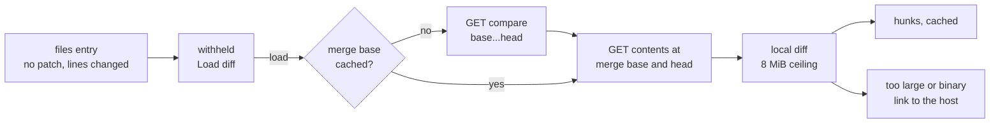

# Load Oversized Pull-Request Files

## Why

GitHub's files API leaves out the `patch` of any file whose diff it considers too big, and that threshold is low. In avantmedialtd/avantmedia #18, a 93 KB page rewritten into a 17 KB one (158 added and 1,477 removed lines) arrives without one. The pull-request view then says "Diff too large to preview" and offers no way to see the change. That is exactly the file a reviewer most needs to read. SpecForge's own per-file ceiling is 8 MiB, so nothing on SpecForge's side stops it from showing a file of that size.

## What Changes

- A GitHub file that arrives without a `patch` but with changed lines is **withheld** rather than too large, and its "Load diff" control works.
- Loading such a file reads its two versions from GitHub: the file at the merge base and at the head. SpecForge diffs them locally and caches the result, so a second load sends nothing.
  - The merge base is read once per cached detail.
  - The reads go through the same deadlines, hourly budget, in-flight limit and credential checks as a detail read.
  - A version or a diff past the 8 MiB per-file ceiling is still too large, and a version that is not text is binary.
- `get_pull_request_file` answers with a typed outcome on both transports, one of three kinds. **BREAKING** for the command's return shape; both transports and the frontend change together.
  - `file`: the loaded file.
  - `changed`: the cached detail no longer matches what the view rendered, and the view reads the pull request again.
  - `failed`: a load could not complete. The view shows the reason on the file and leaves "Load diff" to retry, without reading the pull request again.
- A file that is still too large in the pull-request view gets a link to that file's diff on its host: GitHub's files tab or BitBucket's diff page, anchored to the file. Commit detail is unchanged.

## Capabilities

### New Capabilities

_None._

### Modified Capabilities

- `diff-view`: a file whose provider left out its patch for size arrives withheld and loadable through the host's loader, rather than too large. A host may add a link to view a too-large file elsewhere.
- `pull-request-viewer`: GitHub reads gain the on-request file read and its requests (compare for the merge base, contents for the two versions), with their reply rules and its local diff. `get_pull_request_file` answers `file`, `changed` or `failed`, and only `changed` makes the view read again. A too-large file links to its diff on the host.
- `github-pull-requests`: *GitHub Privacy and Safety* lists the new GET requests among those a detail read may send.

## Impact

- **`openspec-core`:**
  - `diff.rs` gains `diff_versions`, the pure local diff of two file versions, with the binary and ceiling rules.
  - The workspace gains the `similar` crate.
- **`openspec-app`:**
  - `github_detail.rs`: patch-less files become withheld and fetchable. The file read's recipe and reply verdicts.
  - `pull_request_read.rs`: a raw-bytes GET on `DetailIo`, and the admitted file read.
  - `pull_request_cache.rs`: the merge base and the loaded hunks are kept.
  - `pull_request_detail.rs`: `PullRequestFileOutcome`.
  - `service.rs`: `pull_request_file` becomes async.
- **Frontends:**
  - `crates/specforge/src/commands.rs` and `crates/specforge-web/src/dispatch.rs` return the outcome.
  - `src/api.ts`, `src/types.ts` and `src/components/PullRequestView.tsx` handle the three kinds and add the host link.
  - `src/pullRequestView.ts` builds the host link, and `src/sha256.ts` provides GitHub's anchor digest.
- **Not changed:**
  - BitBucket reads. Its too-large files only gain the host link.
  - Commit detail, the line and byte budgets, review-progress keys (a patch-less file is still keyed by its blob id), the detail query's text, and the hourly budget's size.
  - The terminal frontend, which has no pull-request view.
