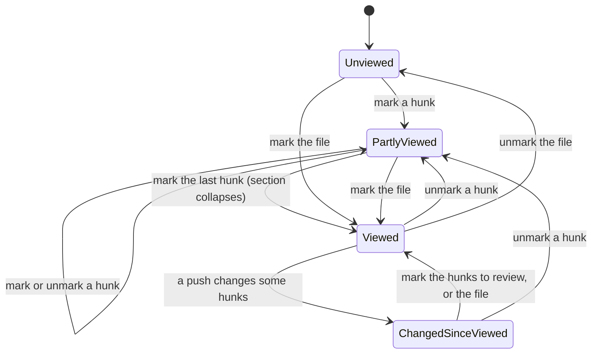

# Review Hunks Viewed

## Why

The pull-request view lets a reader mark a whole file viewed, and keys that mark by the SHA-256 of the file's entire patch. On a large file this falls short twice:

- **No progress within a file.** A 2,000-line rewrite has no way to record "I've read the first twelve hunks", and a marked file stays fully expanded, so finished code never leaves the screen.
- **A push resets everything.** One changed line anywhere in the file flips it to "changed since viewed", and the reader starts again from the top, with nothing saying which part changed.

Marking hunks lets a reader work through a large file piece by piece. Keying each hunk by its content makes re-review after a push incremental: only the hunks the push actually changed reopen.

## What Changes

- Each hunk of a pull request's file can be marked viewed and unmarked. A **viewed hunk folds** to one row: its toggle, its `@@` heading and a control that shows its lines again without unmarking it.
  - The toggle sits in the free gutter left of the heading.
  - An unviewed hunk longer than 40 lines also ends with a slim "Mark hunk viewed" row, so a reader can mark it where they finish reading.
- **A hunk's mark is keyed by its content**: the SHA-256 of the hunk's body bytes as the provider sent them, line numbers left out, with an occurrence number for identical hunks in one file. A push that shifts a hunk without changing it keeps it viewed; one that changes it reopens it.
- **A file is viewed exactly when all its hunks are.**
  - Marking the file marks every hunk, and marking its last unviewed hunk marks the file.
  - A file the reader's own mark completes, through its box or its last hunk, collapses its section, as GitHub does. A mark from another window or tab, and opening the pull request, collapse nothing.
  - Unmarking a hunk unmarks the file. Unmarking the file clears its hunks.
- **File states gain detail.**
  - A file's header box shows a mixed state when some of its hunks are viewed: "4 of 9 hunks viewed".
  - A file viewed before a push shows "changed since viewed · 3 hunks to review", with only those hunks unfolded.
- A new command, `set_hunk_viewed(reference, path, hunk, viewed, head, base)`, is served on both transports with `set_file_viewed`'s refusals. `get_review_progress` gains each file's hunk states and a `partlyViewed` state. The wire shape grows, and both transports and the frontend change together.
- `DiffView` stays host-agnostic. It gains:
  - per-hunk slots (at the heading and at the end);
  - folds the host supplies, with a "show" override that is view state and never saved;
  - a way for the host to collapse a section once.

  Commit detail passes none of these and is unchanged. Copying leaves a folded hunk's lines out, and a layout switch keeps folds and the reader's place.

## Capabilities

### New Capabilities

_None._

### Modified Capabilities

- `diff-view`: hosts gain per-hunk slots (a gutter extra in the heading row and an optional end row), host-supplied hunk folds with a view-state "show" override, and a one-shot request to collapse a section. Copying leaves out a folded hunk's lines. A layout switch keeps folds, overrides and the reader's place, including at a folded heading. Folding moves no unrelated line.
- `pull-request-viewer`: *Review Progress* gains hunk marks with content keys, the rule that a file is viewed exactly when every hunk is, the `partlyViewed` state, hunk-level counts for changed files, `set_hunk_viewed`, stored hunk keys pruned on each mark, and an addition to the two-writers note. *Changed Files in the Pull-Request View* gains the hunk toggles, end rows, the mixed file box, collapse on the reader's completing mark, and a progress re-read after a file load.

## Impact

- **`openspec-core`:**
  - `diff.rs`'s hunk reader reports each hunk's body byte range beside the hunk it parses.
  - `diff_versions` reports the same for the patch text it generates. Neither changes the `Hunk` type that crosses IPC.
- **`openspec-app`:**
  - `github_detail.rs` and `bitbucket_detail.rs` digest each hunk's body while they hold the patch bytes, as they take the patch digest today.
  - `pull_request_detail.rs` and `pull_request_cache.rs` keep the digests on `CachedFile`, for shown, withheld and fetched files alike.
  - `review_progress.rs`: hunk keys, the stored `hunks` map, the derived states and the store's hunk marks.
  - `service.rs`: `set_hunk_viewed`; `set_file_viewed` also stores or clears hunk keys.
- **Frontends:**
  - `crates/specforge/src/commands.rs` and `lib.rs`, and `crates/specforge-web/src/dispatch.rs`, register `set_hunk_viewed`.
  - `src/api.ts` and `src/types.ts` mirror the new command and wire shape.
  - `src/components/DiffView.tsx` and `src/diffLayout.ts` get the hunk slots, folds, the collapse request and fold-aware copy.
  - `src/components/PullRequestView.tsx`, `src/pullRequestView.ts` and `App.css` get the toggles, chips and the mixed box.
- **Not changed:**
  - **File keys.** A file still has one key with the same three cases, so a file mark made before this change keeps its state.
  - **Unchanged machinery.** The store's file name, location, pruning rule and notice; the detail reads' requests, budgets and limits; and the command `set_file_viewed`'s signature.
  - **Other surfaces.** Commit detail, the navigator, the terminal frontend, and everything sent to either host. Marks never leave the machine, and SpecForge never writes GitHub's own viewed state.
  - **Deferred.** There's no keyboard loop for marking hunks, no sticky hunk headings, and no collapsing of viewed files when a pull request opens.
