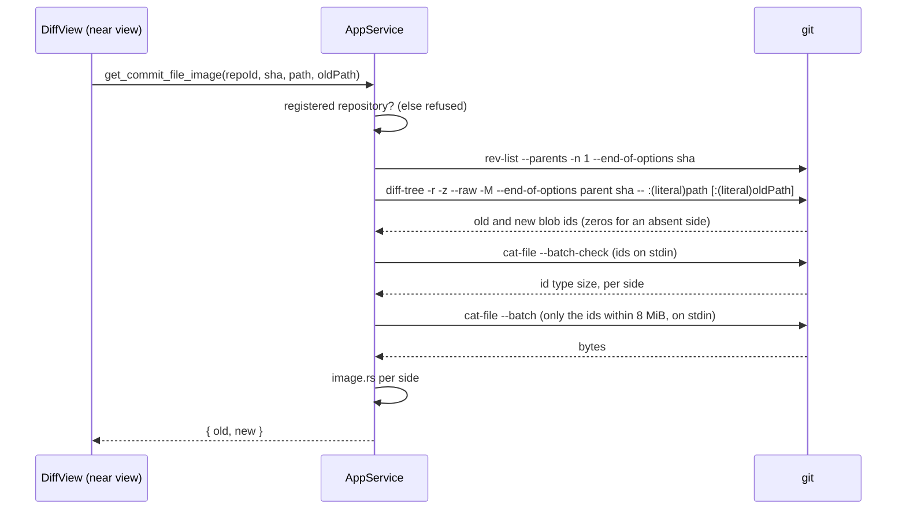
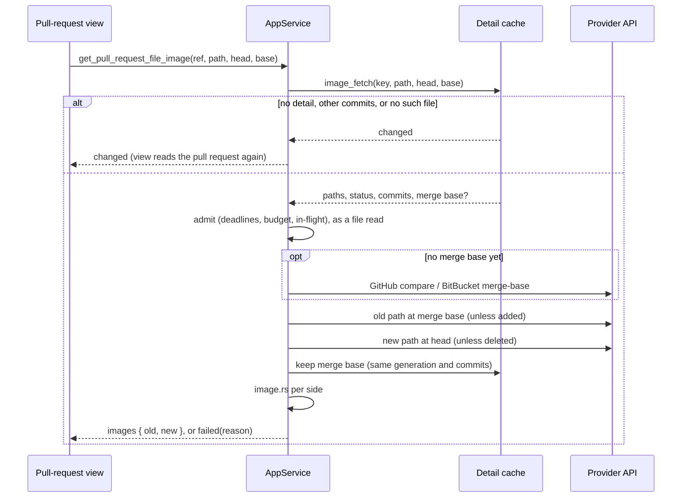

## Context

The diff model has four content states: `hunks`, `withheld`, `tooLarge` and `binary`. `DiffView` draws a state row for every state except `hunks`, and offers a control only for `withheld`. A changed image reaches that row by three routes, and none of them carries its bytes:

| Source | How an image arrives today | What the reader sees | Where its bytes are |
|---|---|---|---|
| Commit detail | `diff-tree --numstat` reports `-`, so it is `binary` | "Binary file not shown" | `parse_raw_record` parses both blob ids from `--raw`, then drops them |
| GitHub pull request | a files entry with no `patch` and 0/0 counts is `hunks: []` | "No textual changes" | `contents?ref=` with the raw media type, already sent by the file read |
| BitBucket pull request | `Binary files … differ` is `binary` | "Binary file not shown" | `src/{commit}/{path}`, not requested today |

Three existing guards shape the design:
- **Commit reads.** They run a fixed number of `git` processes whatever the commit's size, and every revision comes from `commit_base`.
- **Pull-request reads.** They are admitted by the provider's deadlines, hourly budget and in-flight limit. They follow no redirect, and they send only what the provider's privacy requirement lists.
- **Pull-request content.** It never makes a request of its own: `ContentImage` turns a remote image into a link, and the pull-request window's content-security policy allows only `'self'`, `data:` and `blob:` images.

The real workload is "a commit full of images". In this repository, PNGs changed 224 times across 12 commits this year, mostly about twenty icons at a time at up to 1.4 MB each.

## Goals / Non-Goals

**Goals:**
- **Coverage.** Show an image file's two versions in commit detail and in GitHub and BitBucket pull requests, side by side or stacked as the layout says, with a Difference mode when they share their dimensions.
- **No decoding before a check.** Nothing the WebView decodes has not passed a signature check, a byte ceiling and a pixel ceiling first.
- **Guards hold.** Keep every guard above:
  - opening a commit reads no image;
  - a pull-request image read is a governed detail read;
  - no URL from a pull request is ever loaded.
- **Additive only.** Change no existing wire shape.

**Non-Goals:**
- **SVG.** It stays a text diff, so no SVG source is ever turned into an image by this path.
- **Images in pull-request descriptions and comments.** They still render as labelled links.
- **Swipe, onion skin and pixel counts.** These are later polish. Zoom is in scope (D11), added after the first build was tried.
- **Rendering Git LFS objects.** A pointer is labelled, never resolved, whether from `.git/lfs/objects` or through `git lfs`.
- **Working-tree diffs, and the terminal frontend.** Neither has a diff view.

## Decisions

### D1. An image file is a frontend predicate on the path, not a fifth content state

`src/diffFiles.ts` decides which files are image files. Rust never classifies a file before it reads the bytes. With $$E$$ the extensions `png`, `jpg`, `jpeg`, `gif`, `webp`, `ico`, `bmp` and `avif`, compared case-insensitively on the new path (or the old path of a deleted file):

$$\text{image}(f) \iff \text{ext}(f) \in E \;\wedge\; \bigl(\text{binary}(f) \;\vee\; \text{hunks}(f) = \varnothing \;\vee\; \text{lfs}(f)\bigr)$$

where $$\text{lfs}(f)$$ means every line of every hunk belongs to a Git LFS pointer (D9). Any other file named like an image (a `.png` that git diffed as text, or one withheld or too large) renders as before.

- *Rejected: an `image` content state.* It is a breaking change to three commands' payloads. It also cuts across the content states it would sit beside: an LFS image has hunks, and a GitHub image has none.
- *Rejected: sniffing in the detail read.* It would read every binary blob of a commit on open, which breaks the fixed-process rule, and every binary file of a pull request on every read, which spends the budget.

### D2. Bytes travel base64 in the invoke JSON and render from `blob:` URLs

Both commands return each side's bytes as a base64 string inside the ordinary JSON reply. The frontend decodes them once into a `Uint8Array`. Each mounted `` gets an object URL of a `Blob` typed with the sniffed MIME type, revoked when it unmounts. With $$n$$ bytes per side, the reply carries $$4\lceil n/3\rceil$$ characters per side, so at the 8 MiB ceiling one read is at most

$$2 \times \tfrac{4}{3} \times 8\,\text{MiB} \approx 21.3\,\text{MiB}$$

- *Rejected: raw bytes.* That means Tauri's `ipc::Response` on desktop plus a `GET /api/…` route on the web. The web transport is invoke-only on purpose. A `GET` can be embedded by any page with no preflight, so it would widen the served instance's trust boundary just to save a third of the bytes on a read the reader asked for.
- *Rejected: the asset protocol.* It needs `protocol-asset` and a filesystem scope, and still cannot read a revision or a provider.
- *Rejected: `data:` URLs.* Each `` would hold another full copy of the string. `blob:` is allowed by the same policy and shares one buffer.

### D3. The service sniffs and measures, so the WebView decodes only what passed

`openspec-core`'s new `image.rs` is pure, with no I/O, and is mutation-tested. A side becomes an image only if its signature is one of seven:

| Type | Signature |
|---|---|
| `image/png` | `89 50 4E 47 0D 0A 1A 0A` |
| `image/jpeg` | `FF D8 FF` |
| `image/gif` | `GIF87a` or `GIF89a` |
| `image/webp` | `RIFF`, four bytes, `WEBP` |
| `image/bmp` | `BM` |
| `image/x-icon` | `00 00 01 00` |
| `image/avif` | an ISO-BMFF `ftyp` box `imagesize` reads as HEIF with AV1 compression |

Its dimensions come from `imagesize::blob_size`, which reads headers only. An ICO's dimensions are its largest entry's. `imagesize` 0.15, already in the lockfile through `resvg`, becomes a direct dependency of `openspec-core` with only the `png`, `jpeg`, `gif`, `webp`, `bmp`, `ico` and `heif` features. A side is refused, in this order:

1. `lfs` when it is a Git LFS pointer (D9);
2. `tooLarge` past 8 MiB, the per-file ceiling every on-request read uses;
3. `notImage` when no signature matches or the header cannot be read;
4. `tooManyPixels` when $$w \cdot h > 40{,}000{,}000$$.

The pixel ceiling admits an 8K screenshot ($$7680 \times 4320 \approx 33.2$$ MP) and refuses the classic bomb, a few kilobytes of PNG declaring a $$30000 \times 30000$$ canvas. That canvas would be 3.6 GB once decoded to RGBA in the WebView.

- *Rejected: trusting the extension.* A JPEG named `.png` still renders, but a text file named `.png` would reach the decoder, and the `Blob`'s type would lie.
- *Rejected: decoding in Rust with the `image` crate,* for example to produce thumbnails. It is a heavy dependency, and decoding untrusted images is exactly what the ceilings exist to avoid.
- *Rejected: leaving it to the WebView.* No WebView offers a pixel ceiling, and an oversized decode can take the whole window down.

### D4. Commit detail reads blob ids, then sizes, then bytes: at most four processes per image file



`git.rs` gains `commit_file_blobs`, which reuses `commit_base`. A root commit therefore has an absent old side, and a merge is read against its first parent, exactly as its diff is. Object ids are the only values written to `cat-file`'s stdin: hex from git's own output, never a path. So `rev:path` parsing, and a path containing a newline, never arise. Sizes are known before any bytes are read, so a 2 GB asset named `.png` costs one `batch-check` line. An LFS pointer is small, and is read and recognised by its bytes.

$$\text{git processes per image file} \le 4$$

The bytes process does not run when no side is within the ceiling, so an image file whose versions are both past 8 MiB costs three.

- *Rejected: `git show sha:path` per side.* It puts the path in `argv` in `rev:path` form, cannot bound the size before streaming the bytes, and needs a process per side.
- *Rejected: carrying blob ids on `DiffFile`.* That is a wire change, and a later command taking caller-supplied ids could read any object of a registered repository. Deriving the ids from the commit keeps the read scoped to the file the commit changed.
- *Rejected: one `cat-file --batch`, killed on an oversized object.* The other side would then need a second process anyway, and a deliberate kill is harder to test than a size read first.

### D5. A pull-request image read is a governed detail read that keeps the merge base and no bytes



The cache answers what an image read needs from the cached detail alone: the file's old and new paths, its status, the commits and any merge base. The caller names only the path and the commits it rendered, so no URL and no provider path ever comes from the frontend. The merge base shares the slot the file read already keeps on `CachedDetail`. A GitHub image read after a file read, or after another image read, sends only its contents GETs.

$$\text{requests per image read} \le 1 + 2$$

The bytes are not kept in the service. The view keeps what it read for as long as it shows that detail.

- *Rejected: keeping bytes in the 32-entry detail cache.* The worst case is $$32 \times$$ a file count $$\times\ 2 \times 8$$ MiB, which needs a byte-capped LRU for a re-click that is rare once the view holds its reads.
- *Rejected: reading images during the detail read.* A twenty-icon pull request would spend forty extra requests on every read, against an hourly budget sized for whole reads.

### D6. BitBucket reads `merge-base` and `src`, with URLs built from the row

`bitbucket_detail.rs` gains the image recipe. Both URLs are built from the matched row's workspace and repository and the cached detail's commits, never from a payload link:

- `GET https://api.bitbucket.org/2.0/repositories/{workspace}/{repo}/merge-base/{head}..{base}` is read as JSON whose `hash` is a 40-character hexadecimal commit.
- `GET https://api.bitbucket.org/2.0/repositories/{workspace}/{repo}/src/{commit}/{path}`, with each path segment percent-encoded, reads raw bytes up to 8 MiB plus one byte.

Replies follow *BitBucket Detail Reads*:
- 401 and 403 are unauthenticated;
- 429 sets the shared deadline;
- 404 is unavailable;
- any other failure is transient.

A redirect is the one new verdict. It is answered `failed` with the reason `redirected`, and the view links to the file's diff on BitBucket. That is the user's choice from the exploration (2026-10-07), keeping "the credential only ever goes to the URL the read named". The token needs no new scope: Settings already asks for repository read.

- *Rejected: following the redirect without the credential.* It would loosen *Privacy and Safety* for a case nobody has observed yet.
- *Rejected: diffing against the destination commit instead of the merge base.* The "before" image would then include the destination branch's own later changes to the file.

### D7. Commit images read as they near the view, and pull-request images on request

Each image file's section mounts a placeholder. In commit detail, an `IntersectionObserver` rooted at the scroll port, with a margin of one viewport height, queues the file's read when the placeholder enters it. The view's queue runs at most two reads at once, and a queued read whose section leaves the margin before it starts is dropped. In a pull request the placeholder carries a "Show image" button, so a read is always a reader's act, matching the view's rule that reads are never triggered by a timer or by scrolling.

`DiffView` holds each finished read by file key: the decoded bytes, dimensions and type per side. It drops them when the host passes a new model, as it drops shown folds. A collapsed section unmounts its images and revokes their URLs. Expanding it again creates fresh URLs from the held bytes with no read.

- *Rejected: eager reads on open.* An icon-regeneration commit would read up to $$20 \times 2 \times 1.4$$ MB before the reader sees one.
- *Rejected: on request in commit detail.* The read is local and free, and twenty clicks per icon commit is the friction this change removes.
- *Rejected: near view in pull requests.* Scrolling would spend the hourly budget.

### D8. Two versions side by side or stacked, on a checkerboard, with Difference on black

```svg
<svg xmlns="http://www.w3.org/2000/svg" viewBox="0 0 640 300" font-family="sans-serif" font-size="12">
  <defs>
    <pattern id="cb" width="12" height="12" patternUnits="userSpaceOnUse">
      <rect width="12" height="12" fill="#ffffff"/>
      <rect width="6" height="6" fill="#d9d9d9"/>
      <rect x="6" y="6" width="6" height="6" fill="#d9d9d9"/>
    </pattern>
  </defs>
  <rect x="1" y="1" width="638" height="298" fill="#f7f7f7" stroke="#999"/>
  <rect x="1" y="1" width="638" height="30" fill="#e8e8e8" stroke="#999"/>
  <text x="12" y="20">crates/specforge/icons/icon.png   modified</text>
  <text x="520" y="20">☐ Viewed</text>
  <rect x="12" y="40" width="58" height="20" rx="3" fill="#ffffff" stroke="#666"/>
  <text x="22" y="54">Both</text>
  <rect x="70" y="40" width="86" height="20" rx="3" fill="#e8e8e8" stroke="#666"/>
  <text x="80" y="54">Difference</text>
  <rect x="20" y="72" width="280" height="160" fill="url(#cb)" stroke="#999"/>
  <circle cx="160" cy="152" r="56" fill="#4a7bd0"/>
  <rect x="340" y="72" width="280" height="160" fill="url(#cb)" stroke="#999"/>
  <circle cx="480" cy="152" r="56" fill="#4a7bd0"/>
  <rect x="456" y="128" width="48" height="48" fill="#f0c040"/>
  <text x="20" y="252">old · abc1234</text>
  <text x="20" y="270">512 × 512 · 345 KB</text>
  <text x="340" y="252">new · def5678</text>
  <text x="340" y="270">512 × 512 · 298 KB · −47 KB (−14%)</text>
</svg>
```

- **Layouts.** Side by side, the two versions sit in the layout's two halves, old left. In unified they stack, old above new. Each is captioned with its side's name, its dimensions and its size, and the new side also shows the change in size. An added or deleted file shows its one version full width.
- **Size.** Each `` carries `width` and `height` from the service, so its box is reserved before it decodes. It renders at its natural CSS size, scaled down to fit its column, and never scaled up.
- **Transparency.** A checkerboard drawn from theme tokens sits behind every version, so a transparent icon reads in both themes.
- **Difference.** One full-width frame on black, `isolation: isolate`, with the new version over the old in `mix-blend-mode: difference`: unchanged pixels are black.
  - It is offered only when both sides are images of equal dimensions.
  - The mode is a per-file radio group of "Both" and "Difference", view state like a section's collapse: never persisted, and dropped with a new model.
- **Placeholder swap.** The only height change an image read causes is the placeholder becoming the comparison. The view records the reader's place before that render and restores it after, through the same `recordPlace`, `anchorAt` and `restoreAnchor` its folds use, so an image loading above the reader moves nothing they are reading.
- *Rejected: a canvas pixel diff.* It needs every bitmap in JS memory through `getImageData`, plus CPU per file. CSS blending is composited and free, and a changed-pixel count can come later.
- *Rejected: one Difference choice for the whole surface,* stored like the layout. It would apply to files where it cannot (other sizes, added files) and leak between unrelated diffs.
- *Rejected: upscaling small icons inline.* A 16 × 16 favicon needs zoom (D11), not a blurry stretch in the diff.

### D9. Git LFS is recognised from the hunks when both sides are pointers, and from the bytes otherwise

A pointer is a text file under 1,024 bytes:
- its first line is `version https://git-lfs.github.com/spec/v1`;
- then `oid sha256:` and 64 hex digits, and `size` and a decimal number, with any `ext-` lines LFS allows.

When an image file's hunks hold nothing but such lines, `diffFiles.ts` labels it "Stored in Git LFS" with no read and no control: the hunks already say everything a read would. When only one side is a pointer, git or the provider calls the file binary (a pointer replacing a PNG, for instance). The read then refuses that side as `lfs` from its bytes.

- *Rejected: reading `.git/lfs/objects`.* None of the registered workspaces uses LFS, and the user chose detection only.
- *Rejected: running `git lfs smudge`.* It is an external binary that may fetch over the network.

### D10. Wire shapes

```rust
// pull_request_detail.rs (shared by both commands); every enum tagged by `kind`
// with rename_all + rename_all_fields = "camelCase"
pub struct ImageVersions { pub old: ImageSide, pub new: ImageSide }
pub enum ImageSide {
    Image { mime: String, width: u32, height: u32, data: String /* base64 */ },
    Absent,
    Refused { reason: ImageRefusal },
}
pub enum ImageRefusal { TooLarge, NotImage, TooManyPixels, Lfs }   // camelCase strings
pub enum PullRequestImageOutcome {
    Images { old: ImageSide, new: ImageSide },
    Changed,
    Failed { reason: FileReadFailure, until_unix: Option<u64> },
}
// FileReadFailure gains `Redirected`, produced only by BitBucket image reads.
```

`get_commit_file_image` returns `Result<ImageVersions, String>`, as `get_commit_diff` returns its errors. `crates/openspec-app/tests/wire_shape.rs` gains a fixture for each shape and asserts `tooManyPixels` and `redirected` by exact wire value: an enum attribute is not a mutable line, so only that test can catch a dropped `rename_all`.

- *Rejected: a separate failure enum for images.* It would duplicate five reasons and their wording for one new one.

### D11. Zoom opens the versions in a window of their own, both in lockstep, under the platform's gestures

Trying the first build showed what the inline comparison cannot do. A 16 × 16 icon is too small to judge, and a 13,000-pixel-tall screenshot is too large to see, at its natural size and never larger. So each comparison offers a **Zoom** control, and a click on a version, that open the image file's versions in a **window of their own**. Trying the second build, an overlay inside the window, showed that a window is what a reviewer wants: to put the versions beside the diff, or on another display, and keep both.

```
┌─ icons/app.png — zoom ─────────────────────────────────────┐
│ icons/app.png   Both|Difference   − 400% + ⤢ 1:1  ✕       │
│ master                     │ feature                       │
│ ┌────────────────────────┐ │ ┌────────────────────────┐    │
│ │  same region, same     │ │ │  same region, same     │    │
│ │  scale on both sides   │ │ │  scale on both sides   │    │
│ └────────────────────────┘ │ └────────────────────────┘    │
└─────────────────────────────────────────────────────────────┘
```

- **The window.** It is a detached window, the third kind beside readers and pull-request windows (`crates/specforge/src/reader.rs`'s `DetachedKind`).
  - It is labelled `image-<hash>`, loads `index.html?imageWindow=1&at=<address>`, and opening the same file again focuses it.
  - It opens at a fixed size clamped to the work area and remembers none.
  - Its capability grants closing itself and nothing else.
  - Its page installs the pull-request window's content-security policy, since a pull request's versions are a stranger's bytes.
  - In the browser skin it is a tab, named from the address's hash, as a pull-request window's is.
  - `open_image_window` is desktop-only and has no web arm, like `open_pull_request_window`.
- **The address.** It names the versions by reference, never by bytes:
  - a commit file's repository, commit, paths and side names;
  - or a pull request's reference, path, commits and side names.

  The window reads the versions again through the same command its host uses. A commit's read is local, and costs at most four `git` processes. A pull request's is an image read, governed as any is, at two requests once the merge base is known. Bytes are never handed from window to window: a second webview has its own memory, and an address it can reload itself survives the diff being re-read or closed.
- **Lockstep.** Both versions share one scale and one pair of scroll offsets, so the same pixel of each sits at the same place in its frame. The two frames are equal halves. Their content is the union of the two versions' extents, top-left aligned, so the arithmetic is exactly one viewport over one content box: `figureZoom.ts`'s `zoomAt`, `panBy` and `fitScale` apply unchanged. Every offset is written to both frames, and a frame scrolled by any other means is followed by the other.
- **Gestures.** The window follows the platform's, as Preview does:
  - two-finger scrolling and the mouse wheel pan, natively, with momentum;
  - a pinch zooms at the pointer. WebKit, the desktop's web view and Safari, delivers it as `gesturestart`/`gesturechange`. Chromium and Firefox deliver it as a wheel event with `ctrlKey`, which a mouse wheel with Control also gives;
  - dragging pans, and two contacts pinch, for a touch screen;
  - ⌘+ (or ⌘=) and ⌘− zoom at the centre, ⌘0 shows actual size and ⌘9 fits, Control in place of ⌘ elsewhere;
  - Escape and ⌘W close the window.
- **Scale.** It opens at fit, with $$s_{\text{fit}}$$ taken over the union. It is bounded between $$\min(s_{\text{fit}}, 1)$$ and $$32$$, not the figure view's $$8$$, because a 16-pixel icon at 8 times is still only 128 pixels. `figureZoom.ts` takes the ceiling as an optional argument, so the figure view keeps its own.
- **Anchoring.** While a version is smaller than its frame it is centred there, so `zoomAt` takes that inset into account: the point under the pointer stays under it once the version overflows. The figure view, which centres its figure the same way, gains the fix too.
- **Pixels.** Above 100% each version is drawn with `image-rendering: pixelated`, so an enlarged icon shows its pixels rather than a blur. That is what a reviewer is checking.
- **Mode.** The window offers Both/Difference for two versions of equal dimensions, starting at Both. Its choice is its own, since it lives in another window.

$$\text{zoom scale} \in \bigl[\min(s_{\text{fit}}, 1),\ 32\bigr]$$

- *Rejected: an overlay `<dialog>` inside the window.* It was the second build. It cannot sit beside the diff or on another display, and it took the whole window from the diff while open.
- *Rejected: handing the decoded bytes to the window,* by an event, by `BroadcastChannel` or through a short-lived store in the service. Each moves up to 21 MiB of base64 again, and a window that cannot re-read itself is lost on reload. The re-read costs a commit nothing and a pull request two governed requests.
- *Rejected: a wheel that zooms,* as the figure view's does. On macOS two-finger scrolling is how a trackpad pans, and zooming on it makes every attempt to move around a zoom instead.
- *Rejected: maximizing one version at a time.* Two separately zoomed windows cannot be compared region by region, which is the point of zooming a diff.
- *Rejected: inline zoom levels.* A screenshot thousands of pixels tall makes a section unusable at 200%.

## Risks / Trade-offs

- **[BitBucket's two endpoints are untested live: there is no BitBucket token on this machine]** → Recipes and verdicts are pinned over the fake transport from documented shapes. Any surprise lands as `failed` with the host link, never as a broken view. The smoke records BitBucket as not walked.
- **[BitBucket may serve large files through a redirect to a media host]** → Refused by design (D6), worded as such, with the host link.
- **[Formats the WebView cannot draw: AVIF on an older WebKitGTK, ICO in some builds]** → An `` error turns that side into "Can't be shown here". In a pull request, the host link follows.
- **[Memory: a reply's base64, the decoded bytes, and the decoded bitmaps]** → The 8 MiB and 40 MP ceilings, reads on demand, two in flight, and URLs revoked on unmount. The view drops its reads with each new model.
- **[Layout shift from images loading above the reader]** → Reserved boxes and the view's place-keeping (D8). A scenario pins it.
- **[Smoke testing near-view reads: a hidden Chrome automation tab stalls `IntersectionObserver`]** → The queue's decisions live in the pure `diffImage.ts` and are bun-tested. The smoke uses a visible window or the known observer shim.
- **[Difference on black hides changes to alpha alone]** → "Both" stays the default, and the mode's caption says what it shows.
- **[Mutation gate]** → `image.rs` gets a test per signature and per refusal, exact-boundary tests for both ceilings ($$8\,\text{MiB}$$ and $$8\,\text{MiB} + 1$$; $$40{,}000{,}000$$ and one pixel more), and LFS grammar edges. `commit_file_blobs` is tested against a fixture repository with an added, a deleted, a renamed and an oversized image.
- **[Windows and WSL: binary stdout through `wsl.exe`]** → The bytes pass through unchanged, but this is unverified on a real WSL box, like the rest of WSL support.
