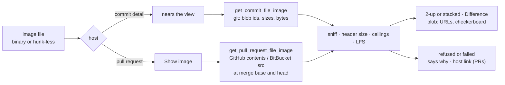

# Show Changed Images in the Diff View

## Why

A changed image is the one kind of file the diff view cannot show:
- Commit detail and BitBucket pull requests say "Binary file not shown".
- GitHub pull requests say "No textual changes", so a regenerated icon reads as though nothing changed.

In this repository alone, PNGs changed 224 times across 12 commits this year. Most of those commits are icon regenerations touching about twenty files at once, at up to 1.4 MB each. Reviewing any of them means leaving SpecForge for a host page or an image viewer. All three sources can already supply the bytes:
- commit detail parses each side's blob id and then drops it;
- GitHub's raw contents read already exists for oversized files;
- BitBucket serves a file at a commit, and the merge base, under the repository read scope its token already needs.

## What Changes

- **What counts as an image.** A changed file whose path ends in `.png`, `.jpg`, `.jpeg`, `.gif`, `.webp`, `.ico`, `.bmp` or `.avif` is an **image file**, provided it is binary or has no hunks. It shows its two versions instead of a state row. This applies in commit detail and in both providers' pull requests. SVG keeps its text diff.
- **Two new commands, on both transports:**
  - `get_commit_file_image(repoId, sha, path, oldPath)` answers both versions.
  - `get_pull_request_file_image(reference, path, head, base)` answers `images`, `changed` or `failed`, as `get_pull_request_file` does.
  - Each side is an `image` (its sniffed type, its width and height, and its bytes), `absent` (the file was added or deleted), or `refused`. A refusal is one of: past 8 MiB, past 40 million pixels, not an image, or a Git LFS pointer.
- **The service decides what an image is:**
  - It sniffs the bytes' signature, never the extension.
  - It reads the dimensions from the header alone, so an image declaring a huge canvas is refused before anything decodes it.
  - The bytes cross the existing invoke transport as base64 and render from in-memory `blob:` URLs. No image is ever loaded from a URL.
- **When images load:**
  - **Commit detail:** an image file reads its versions as its section nears the view, with at most two reads in flight.
  - **Pull requests:** an image file offers "Show image". Each read is up to three requests, counted against the provider's hourly detail budget.
- **Pull-request requests:**
  - GitHub reuses the file read's `compare` and raw `contents` GETs, and their cached merge base.
  - BitBucket gains `GET …/merge-base/{head}..{base}` and `GET …/src/{commit}/{path}`, still on `api.bitbucket.org` and following no redirect.
  - A refused redirect, or any version that cannot be shown, links to the file's diff on its host.
- **How the two versions render:**
  - Side by side in that layout, stacked in unified, each captioned with its side's name.
  - A checkerboard behind transparency.
  - Each side's dimensions and size, and the change in size.
  - A per-file **Difference** mode, offered only when both versions share their dimensions: unchanged pixels show black.
  - **Zoom:** a control, or a click on a version, opens the versions in a window of their own: a native window on the desktop, a tab in the browser. There both versions zoom up to 32 times, with crisp pixels, and pan together. The window follows the platform's gestures: two-finger scrolling pans, a pinch zooms at the pointer, and ⌘+, ⌘−, ⌘0 and ⌘9 work as in Preview.
- **Git LFS:** an image whose diff is a Git LFS pointer reads "Stored in Git LFS" with no read at all. A side that a read finds to be a pointer is refused as one.

## Capabilities

### New Capabilities

_None._

### Modified Capabilities

- `diff-view`: new *Image Comparison* requirement covering image files, the two versions' rendering, the Difference mode, the Git LFS label and how image reads keep the reader's place. Hosts pass an image reader and say whether it reads as a section nears the view or on request. An image file is the one binary file that offers a control, and in both layouts it shows its versions instead of the state row.
- `commit-graph`: commit detail reads an image file's two versions as its section nears the view, through `get_commit_file_image`. That read is a commit-reading operation under the reference-safety and registered-repository rules. Opening a commit still reads no image.
- `pull-request-viewer`: new *Pull-Request Image Reads* requirement covering the command, its outcomes, its governance as a detail read, and each provider's requests and reply rules. The changed files offer "Show image" and link to the host when a version cannot be shown. A patchless GitHub image file shows its images. The untrusted-content rules separate image files, read as bytes through the provider's API, from remote images in text, which still never load.
- `bitbucket-pull-requests`: *Privacy and Safety* names the image read's `merge-base` and `src` GETs among the requests that carry the credential.
- `github-pull-requests`: *GitHub Privacy and Safety* names the image read alongside the file read, with the same two request kinds.

## Impact

- **`openspec-core`:**
  - New `image.rs`: the pure sniff (signature to type), header dimensions through `imagesize` (made a direct dependency, with only the seven formats' features), the 8 MiB and 40-megapixel ceilings, and the LFS pointer test.
  - `git.rs` gains `commit_file_blobs`: one `diff-tree` for the file's blob ids, one `cat-file --batch-check` for their sizes, and one `cat-file --batch` for the sides within the ceiling.
- **`openspec-app`:**
  - `service.rs`: `commit_file_image` and `pull_request_file_image`.
  - `pull_request_cache.rs`: what an image read needs, and keeping the merge base it learns.
  - `github_detail.rs`: an image recipe over the existing compare and contents GETs.
  - `bitbucket_detail.rs`: a merge-base and `src` recipe with its reply verdicts.
  - `pull_request_read.rs`: a raw GET for BitBucket on `DetailIo`, and the admitted image read.
  - `pull_request_detail.rs`: `ImageVersions`, `ImageSide`, `PullRequestImageOutcome`, and the `redirected` failure reason.
  - `tests/wire_shape.rs`: fixtures for every new shape.
- **Shells:** a handler and a `generate_handler!` entry per command in `crates/specforge`, and a `dispatch.rs` arm per command in `crates/specforge-web`.
- **Frontend:**
  - `src/types.ts` and `src/api.ts`.
  - `src/diffFiles.ts`: the image-file predicate and the hunk-side LFS test.
  - A new pure `src/diffImage.ts`: base64 to bytes, the size and delta wording, Difference availability.
  - `src/components/DiffView.tsx`: the comparison, near-view reads, keeping the reader's place, and the per-file mode.
  - The zoom window:
    - `src/components/ImageZoom.tsx` (the surface) and `src/components/ImageWindowRoot.tsx` (its root);
    - pure `src/imageZoom.ts` and `src/imageWindow.ts` (its address);
    - a new window kind in `windowKind.ts` and `main.tsx`.

    `figureZoom.ts` gains an optional scale ceiling and centred anchoring.
- **Desktop shell:** a third detached-window kind, `image_window.rs`, and the desktop-only command `open_image_window`, with a close-only capability, `capabilities/image.json`.
  - `CommitDetailView.tsx` and `PullRequestView.tsx`: the readers and the host link.
- **Not changed:**
  - The diff model and its four content states, so `DiffFile` crosses the wire as before.
  - The line and byte budgets.
  - Review-progress keys: an image file is still viewed as a whole.
  - The detail reads' and file reads' own requests.
  - The pull-request window's content-security policy, which already allows `blob:` images.
  - SVG, which stays a text diff.
  - Images in pull-request descriptions and comments, which still never load.
  - The terminal frontend, which has no diff view.
  - Working-tree diffs, of which there are none.
  - The BitBucket token's scopes: Settings already asks for repository read.
