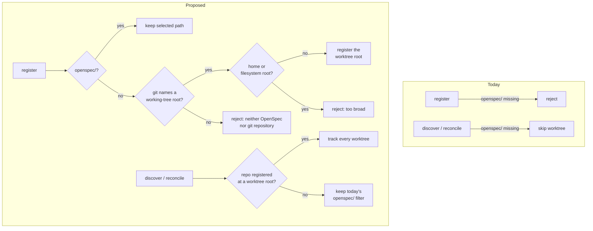
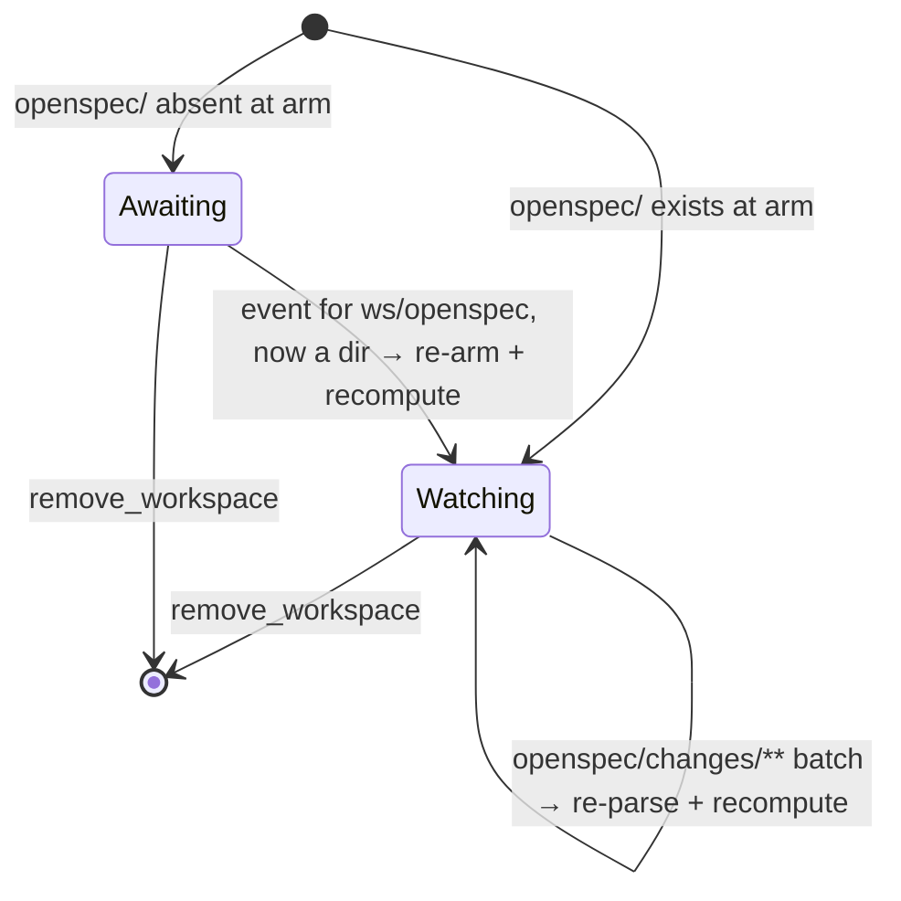

## Context

The registry has exactly three checks for `openspec/`, all in `crates/openspec-core/src/registry.rs`:

- `register` rejects a folder without `openspec/`, at `:143`.
- `reconcile_repo` skips a worktree without it, at `:257`.
- `discover_and_collect` does the same, at `:411`.

Downstream, a tracked folder with no `openspec/` already degrades cleanly:

- The parser treats a missing `openspec/changes` as an empty list.
- The archive lister treats a missing `archive/` as empty.
- The tree renders an empty top-level row as a selectable leaf that opens the file browser.

The repository-scoped features never read `openspec/`. They are the file browser, the commit graph, working-tree status, the pull-request ⇄ worktree join and the dashboard's commit mining. Pull-request discovery is account-wide and never reads the registry.

Two pieces of state depend on whether the folder is there:

- The **change watcher** is rooted at `<workspace>/openspec` and only calls `watch()` when that folder exists (`watcher.rs:340-344`, `:368-372`, `:822`). A workspace that gains `openspec/` later stays deaf until restart.
- **Discovery** is filtered on `openspec/`, contradicting the *Worktree Auto-Discovery* requirement's "SHALL NOT be filtered by path".

## Goals / Non-Goals

**Goals:**
- Register a git repository without `openspec/` as an ordinary peer row with:
  - the file browser, commit graph and dirty status;
  - links from its pull requests to its worktrees;
  - commits counted on the dashboard.
- Track every worktree of a root-registered repository, which fixes the discovery drift for existing OpenSpec repositories too.
- Derive OpenSpec presence on every aggregation, so `openspec init` and `rm -rf openspec` need no migration or re-registration.
- Pick up an `openspec/` created after the watcher started, without a restart.

**Non-Goals:**
- Grouping several repositories into one project, or linking a pull request in one repository to a change in another.
- Browsing non-markdown files. The file browser stays markdown-only.
- Registering a non-git folder without `openspec/`.
- Re-arming the root watch after `openspec/` is **deleted** and later re-created in the same session. Re-registering or restarting picks it up, exactly as today.
- Changing how a subfolder registration with `openspec/` discovers its siblings.

## Decisions

### D1. Gate: `openspec/` **or** a containing git worktree

`register` computes `git_common_dir` *before* the `openspec/` check. It already computes it right after, so this only moves the call. A folder is accepted if:
- it has `openspec/`, which is the existing path; or
- `git_common_dir` resolves **and** `git rev-parse --show-toplevel` (`git::worktree_toplevel`) names the root of the working tree containing it.

In the second case the **worktree root** is registered, not the selected subfolder. Git, not SpecForge, decides what that root is:
- the deepest linked worktree when worktrees nest;
- a submodule's own work tree;
- a `--separate-git-dir` repository's work tree. For that layout `git worktree list` names the git *store* as the main worktree, which is why matching ancestors against that list was rejected in review.

A WSL repository's answer is translated to the UNC form `worktree_list` already uses.

A root without OpenSpec that is the user's home directory (`$HOME`, else `%USERPROFILE%`) or a filesystem root is refused as `TooBroad`. Tracking one would watch, `git status` and list the whole of it. It is what a mistaken pick of `~/Downloads` turns into when home is a dotfiles repository.

`RegistrationError::NotAnOpenSpecWorkspace` becomes `NotOpenSpecOrGit(PathBuf)`, displayed as:

> neither an OpenSpec workspace nor a git repository (no `openspec/` subdirectory, and not inside a git working tree): {path}

The message still uses the term "OpenSpec", as the `product-identity` capability requires.

*Alternatives rejected:*
- **Accept any directory.** A mistaken pick like `~/Downloads` would be accepted silently and get the bounded markdown walk. Nothing else useful works without git.
- **The deepest ancestor among `git worktree list`'s entries** (the first implementation). It is wrong for submodules and `--separate-git-dir` repositories, whose listed main worktree is the git store. It also needs a host-name normalisation for WSL that `--show-toplevel` makes unnecessary.
- **Refuse by `git check-ignore` or "no tracked files" instead of by location.** A dotfiles home often relies on `status.showUntrackedFiles=no` rather than ignore rules, so `~/Downloads` is neither ignored nor tracked. The location rule catches it; those signals would not.
- **Register the selected subfolder as-is.** The union lister runs `git ls-files` in each entry's own folder (`service.rs:1634-1672`), so a subfolder entry lists paths relative to itself. Once discovery stops filtering, that repository's worktree roots would join the union with a different base, and the same file would appear under two paths.
- **A persisted "companion" kind.** See D2.

### D2. `hasOpenSpec` is derived on every aggregation, never stored

`repo_view.rs` sets `has_open_spec` on `RepoView` and on `WorkspaceView::Flat`. The Rust field name serialises as `hasOpenSpec` under the existing `rename_all` / `rename_all_fields`. The value is computed as:

$$\text{hasOpenSpec}(\text{repo}) = \bigvee_{w \in \text{tracked worktrees}} \texttt{is\_dir}(w/\texttt{openspec})$$

For a flat workspace it is `is_dir(<folder>/openspec)`. This is one `stat` per tracked worktree per aggregation and no git process, so cold, disabled rows compute it too.

*Alternatives rejected:*
- **A `kind` field in `workspaces.json`.** The *Registration Persistence* requirement keeps that file a plain array with no schema version. A stored kind also goes stale the moment the user runs `openspec init`.
- **Computing it in the frontend.** The web skin cannot stat, and the terminal frontend would duplicate the rule. Keeping logic out of the frontends is the architecture's standing rule.
- **Using the main worktree's folder alone.** A repository adding OpenSpec on a feature branch would read as "no OpenSpec" while its active change is on screen.

### D3. Discovery tracks every worktree of a root-registered repository

`discover_and_collect` and `reconcile_repo` drop the `openspec/` filter for a repository that has at least one user-registered entry equal to one of its worktree roots. After D1, every repository without OpenSpec qualifies, as does every repository with OpenSpec registered at its root, which is the common case.

A repository whose user-registered entries all lie *below* their worktree roots, such as an `openspec/` inside a monorepo package, keeps today's filter unchanged. That avoids the mixed-base union described in D1.

A listed root with no `.git` entry is never a candidate. That covers a bare repository's directory, and the git store a submodule or `--separate-git-dir` repository lists as its main worktree. Before, the `openspec/` filter hid them by accident. Without it, they would be tracked as worktrees.

*Alternatives rejected:*
- **Drop the filter unconditionally.** This regresses subfolder registrations: their own worktree root would be discovered beside them.
- **Keep the filter for repositories with OpenSpec and drop it only for plain ones.** "Has OpenSpec" is derived and changes over time (D2), so discovery would flip whenever a branch adds or removes `openspec/`. It would also keep hiding pre-OpenSpec worktrees from pull-request links, which is the drift this change fixes.

### D4. The watcher waits on the workspace root while `openspec/` is absent

`add_workspace` chooses its watch root when it arms:
- `<workspace>/openspec`, recursive, when the folder exists, as today; or
- `<workspace>`, non-recursive, when it does not ("awaiting").

In awaiting mode, the workspace's task checks on every batch whether `<workspace>/openspec` is now a directory. If it is, the task re-arms in place: it calls `arm` with `Arm::IfStillTracked`, rebuilding a `WatcherManager` from its upgraded `Weak<Inner>`.
- **The new task waits.** It does nothing until a oneshot fires, and that fires only after its entry is installed. If the workspace was removed meanwhile, the entry is not installed, the sender drops, and the new task ends unstarted.
- **Its first act is a replay.** The cache's last parse did not see `openspec/`, so the new task replays the re-parse-and-recompute step a relevant `openspec/changes/` batch runs (`needs_replay`). It runs as a batch of that workspace's own, so it never runs beside another, and the view, badge and `hasOpenSpec` all update in one emission.
- **The old task ends quietly.** Installing the new entry aborts it at its next await.
- **A failed re-arm retries.** It leaves the old task running, so the next batch tries again.
- **`add_workspace` uses the same replay.** If `openspec/` appears between its parse and its `arm`, the replay covers it.
- **A removal mid-batch cannot resurrect a workspace.** `handle_events` writes the cache only while the workspace still has an entry. A batch that finishes after a removal records and announces nothing.

*Rejected in review:* re-arming from a detached task, then running the replay on that task. A removal could not cancel it, so a removed workspace's cache entry came back. It could also run beside the new entry's own batches, duplicating `ChangeAdded` and achievements.

*Alternatives rejected:*
- **Watch the workspace root recursively.** Every `target/` and `node_modules/` write would reach the debouncer.
- **An extra non-recursive root watch on every workspace.** This would also handle delete-then-recreate, but every OpenSpec workspace on macOS would pay for it (see Risks).
- **Waiting for the repository monitor's `.git/index` signal.** `openspec init` and `openspec new change` touch no git file until the user stages them, and SpecForge's point is to show changes before they are committed.

### D5. The tree shows a "no OpenSpec" marker in place of the `0` badge

A top-level row with `hasOpenSpec: false` renders a muted "no OpenSpec" marker where the change-count badge goes. It stays a selectable leaf that opens the workspace file browser. The terminal frontend renders the row dimmed with the same note, and shows a one-line explanation in its detail pane. It has no file browser or pull-request panel to offer.

*Alternatives rejected:*
- **Keep the `0` badge.** It is indistinguishable from an OpenSpec repository with nothing active.
- **Hide such rows in the terminal frontend.** That adds frontend-specific filtering, which the disabled-rows work deliberately concentrated in one shared exclusion point.

### D6. The dashboard and pull-request links need no new logic

- The heatmap and commit garden already mine every `WorkspaceView::Repo` (`service.rs:2027-2043`). Lifecycle mining runs `git log -- openspec/changes`. That is cached per repository, returns nothing for a repository without OpenSpec, and is kept rather than skipped, so a repository whose `openspec/` was deleted keeps its history.
- `pull_request_links` joins every warm repository's `worktree_refs`.
- `worktreeDestination` already falls back to `{ kind: "files" }` when a linked worktree hosts no change.

*Alternative rejected:* **Skip lifecycle mining when `hasOpenSpec` is false.** It saves one cached `git log` per history move, but it would drop a deleted-OpenSpec repository's shipped history from the dashboard.

## Risks / Trade-offs

- **Existing OpenSpec repositories start tracking worktrees without `openspec/`.** Each costs one more change watcher (in awaiting mode), one `git status` per refresh, and possibly a `dirty` rollup that was previously hidden. → These are real worktrees of the repository: the spec already promised them, and the disable toggle parks a whole repository. The watcher footprint stays one per tracked worktree, bounded by the user's worktree count.
- **On macOS a non-recursive watch is not non-recursive at the OS level.** notify 6's FSEvents backend subscribes to the whole subtree and drops non-direct children in its callback (`fsevent.rs:518-529`), so a build in an awaiting workspace costs one path-prefix compare per file event. → Nothing past the filter reaches the debouncer. Linux (inotify) and the Windows WSL poller watch the root folder alone. Only awaiting workspaces pay this, which is also why D4 rejects a root watch on every workspace.
- **Without `git` on PATH, a repository without OpenSpec cannot be registered.** The rejection then says "not inside a git working tree", which is technically what SpecForge could determine. → This matches the existing *`git` is missing on PATH* degradation. The rejection names both accepted forms, so the user can tell what to fix.
- **The registered path can differ from the picked path.** Picking `acme-api/docs/` registers `acme-api/`. → Settings shows the registered path. The scenario in the `workspace-registry` delta makes this the specified behaviour rather than a surprise.
- **`openspec/` deleted then re-created in one session** stays deaf, as today (a Non-Goal). → `hasOpenSpec` still flips to false on the deletion batch, because deleting `openspec/changes/**` is a relevant event, and a restart or re-registration re-arms the watcher.
- **A non-loopback `specforge-serve` can reach more repositories.** In that mode the allowlist is deliberately off and the network is the whole trust boundary (`web-ui`: *Localhost Trust Boundary*). `register_workspace` could already add any folder on the host containing `openspec/`. After D1 it can add **any git working tree the serving user can read**, and the commit graph and `get_commit_diff` then serve that repository's full history, not just its markdown. The `openspec/` gate was never designed as a security control, but it did narrow what a remote caller could reach. → **Accepted as-is, by decision.** The mode already gives a remote caller every `set_*` arm and every registered repository's history. It is unreachable unless the invocation explicitly asks for it, and the embedded server can never enter it. Neither the startup announcement nor `register_workspace` changes. If that posture changes later, a refusal of `register_workspace` in this mode would be its own `web-ui` change.
- **Discovered worktrees without OpenSpec can linger until restart.** This happens in one rare case: a repository registered both at a worktree root and at an OpenSpec subfolder. Unregistering the root, while the subfolder stays, re-imposes the `openspec/` filter. But reconciliation drops only worktrees that git no longer lists, so the plain worktrees discovered under the old rule stay until the next startup re-derives the set. → Accepted. The double registration is unusual, the leftovers are real worktrees of the repository, and a restart converges.
- **`openspec/` vanishing between `arm`'s check and the debouncer's `watch()`** leaves a watcher installed in recursive mode that watches nothing, deaf until re-registration. → A microsecond window in a case that was already deaf before this change (a workspace whose `openspec/` was deleted). Accepted.
- **The wire shape changes.** `hasOpenSpec` is a new key on both view variants. The `WorkspaceView::Flat` struct-variant trap is documented in `crates/CLAUDE.md`. → Extend the `crates/openspec-app/tests/wire_shape.rs` fixtures so a snake_case `has_open_spec` fails the guard, and mirror it in `src/types.ts`.
