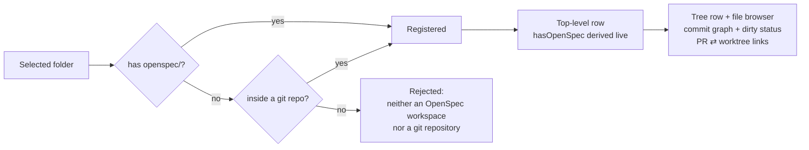

# Register Repositories Without OpenSpec

## Why

Multi-repo projects usually keep their OpenSpec folder in one repository, while the code ships through pull requests in its siblings, such as an API and a web client. Today SpecForge refuses to register a folder without an `openspec/` subdirectory. Those sibling repositories therefore get no tree row, no file browser, no commit graph and no link from their pull requests back to a local worktree, even though none of those features reads `openspec/` at all.

## What Changes

- **Registration accepts a git repository that has no `openspec/`.** A folder is accepted when it contains an `openspec/` subdirectory **or** lies inside a git repository. A folder that is neither is still rejected. The message still names OpenSpec, and now also says that a git repository would have been accepted.
- **Worktree discovery stops filtering on `openspec/`.** Every non-prunable worktree of a tracked repository is tracked, whether or not it has an `openspec/` folder. The *Worktree Auto-Discovery* requirement already says discovered worktrees are not filtered; the code filtered anyway. That silently hid every worktree older than `openspec init` from pull-request links, the file browser's union listing and the dirty rollup.
- **OpenSpec presence is derived, never stored.** Each top-level row in the aggregated view carries a `hasOpenSpec` flag, read from disk on every aggregation. The registry file stays the plain ordered array the *Registration Persistence* requirement mandates. Running `openspec init` in a registered repository, or deleting its `openspec/`, changes the flag without any migration.
- **A later `openspec init` is picked up without a restart.** While a workspace has no `openspec/`, its watcher observes the workspace root non-recursively. It re-arms on `openspec/` the moment that folder appears.
- **The tree marks a repository without OpenSpec.** Its top-level row shows a "no OpenSpec" marker where its change count would be. It is still a selectable leaf that opens the file browser, so it no longer reads like an OpenSpec repository with nothing active. The terminal frontend lists such rows dimmed rather than hiding them.
- **The copy changes:** the folder-picker title, the settings help text, the tree's empty state, the dashboard's empty state and the terminal add-prompt. Each now asks for "an OpenSpec workspace or a git repository".

What a repository without OpenSpec gets, with no feature work of its own:
- A tree row and the repository-wide markdown file browser.
- The commit graph and working-tree status.
- Pull-request rows linked to its worktrees. The marker opens the file browser, because the linked worktree hosts no change (*Pull-Request Rows Lead to Their Worktree*).
- Commits that count toward the dashboard's heatmap, streak and commit garden.

It contributes zero to change counts, the tray badge and notifications.

## Capabilities

### New Capabilities

_None._

### Modified Capabilities

- `workspace-registry`:
  - *Manual Workspace Registration* accepts an `openspec/` folder **or** a git repository.
  - *Worktree Auto-Discovery* tracks worktrees without `openspec/`.
  - *Filesystem Watching of Registered Workspaces* picks up an `openspec/` that appears after the watcher starts.
  - A new requirement derives `hasOpenSpec` on every aggregation and never persists it.
- `spec-browser`: *Workspace Tree Hierarchy* shows a "no OpenSpec" marker on a top-level row without OpenSpec, in place of its `0` count badge.
- `product-identity`: *OpenSpec Format References Preserved* changes the picker-title and invalid-folder scenarios. The picker offers an OpenSpec workspace or a git repository. The rejection still uses the term "OpenSpec".
- `web-ui`: *Web-Flavoured Workspace Registration* follows the shared rule, which is no longer an `openspec/`-only rule.
- `terminal-ui`:
  - *Workspace Management from the Terminal* accepts a git repository by path and rewords the rejection.
  - A new requirement lists rows without OpenSpec dimmed in the Browse tree, rather than hiding them.

## Impact

- **`openspec-core`:**
  - `registry.rs`: the registration gate (resolve `git_common_dir` before the check) and the two discovery filters. `RegistrationError::NotAnOpenSpecWorkspace` is replaced by a variant whose message names both accepted forms.
  - `repo_view.rs`: `has_open_spec` on `RepoView` and `WorkspaceView::Flat`.
  - `watcher.rs`: arm on the workspace root while `openspec/` is absent, and re-arm when it appears.
- **`openspec-app`:** no new orchestration. `add_workspace` already starts a watcher for every newly tracked folder, including discovered siblings. `tests/wire_shape.rs` fixtures gain the new field.
- **Frontends:**
  - `src/types.ts` mirrors `hasOpenSpec`.
  - `WorkspaceTree.tsx` renders the marker.
  - The copy changes in `WorkspacesGroup.tsx`, `WorkspaceTree.tsx` and `DashboardView.tsx`.
  - `specforge-tui` changes its add-prompt copy, dims these rows in the Browse tree, and updates the assertion in `render_tests.rs`.
- **Deliberately unchanged:**
  - The file browser stays markdown-only. Browsing source code is out of scope.
  - Pull-request discovery stays account-wide and never reads the registry.
  - `workspaces.json` gets no new field.
  - Nothing groups a repository with OpenSpec and its companions. Peer rows share a tint or name through the existing presentation store. A "project" grouping with cross-repository PR → change links is a possible later change.
  - The `dashboard` and `pull-request-worktree-links` requirements already cover every registered git repository, so neither needs a delta.
  - A non-git folder still needs `openspec/`.
  - If `git` is missing from PATH, only folders with `openspec/` can be registered.
- **Behaviour change for existing users:** an existing OpenSpec repository whose worktrees include one without `openspec/` now tracks that worktree. Its pull requests can link, its markdown joins the file browser's union, and its uncommitted edits count in the repository's dirty rollup.
