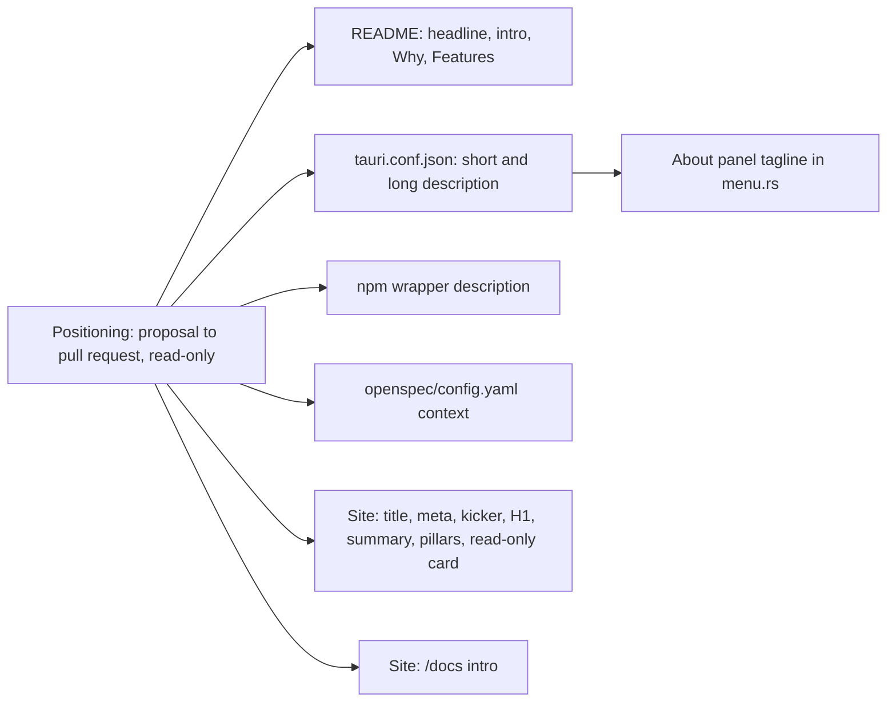

# Reframe SpecForge From Menu-Bar Viewer To Proposal-To-Pull-Request

## Why

SpecForge still introduces itself the way v0.0.1 did ("a menu-bar companion for your OpenSpec workspaces", `releases/v0.0.1.md`):

- The README headline (`README.md:7`) is "A menu-bar viewer for spec-driven development across all your workspaces", and the intro (`README.md:19`) calls it "a small desktop app" that "lives in your menu bar".
- The bundle short description (`crates/specforge/tauri.conf.json:36`) and the About panel tagline (`crates/specforge/src/menu.rs:61`) both say "menu-bar viewer".
- The npm wrapper's description (`npm/packaging.mjs:130`) is "browse OpenSpec workspaces in a browser".
- The project context injected into every artifact-creation prompt (`openspec/config.yaml:7`) says "a Tauri 2 desktop app that browses OpenSpec workspaces". Every agent writing a SpecForge spec or doc therefore starts from the old framing.
- The marketing site gets closer but stops at Git: its kicker and title say "A visual companion" (`site/pages/index/+Page.tsx:87`, `site/pages/index/+documentProps.ts:4`), and "One change, end to end" ends at commits and diffs (`site/pages/index/+Page.tsx:222-262`).

By v0.27.0 SpecForge is three frontends over one service (the desktop app, `specforge-tui` and `specforge-serve`). It has a Dashboard with a commit garden, an archive and file browser pooled across worktrees (v0.23.0), GitHub and BitBucket pull request panels, an in-app pull request reader with per-hunk review progress and PR-to-worktree links (v0.25.0–v0.26.0), image diffs, and repositories without specs (v0.27.0). No headline surface mentions pull requests or the Dashboard, and the README's feature list (`README.md:37-48`) has no bullet for either.

Two README statements are now false:

- `README.md:47` says "This is SpecForge's only network call" about the Claude gauge. The ChatGPT gauge and both pull request panels also make network requests. All four are opt-in.
- `README.md:73` says the terminal UI's Settings "toggles the two quota gauges". It has four toggles (`crates/specforge-tui/src/app.rs:39`).

## What Changes

One positioning statement replaces "menu-bar viewer" and "visual companion" on every surface that introduces the product: *SpecForge follows each OpenSpec change across your repositories and worktrees, from the proposal to the pull request, read-only.* The menu bar, tray and status area stay on those surfaces, named as one place the active-change count appears.

- **README.md**
  - The headline becomes "**Follow spec-driven work across all your repositories, from proposal to pull request.**"
  - The intro (L19) and Why (L29-33) are rewritten. Why drops "A dedicated menu-bar app" and the "read-only in v1" hedge.
  - Features (L35-48) gains bullets for the Dashboard, pull requests (opt-in) and image diffs. The change-following bullets now come before the ambient ones (badge, notifications, Dock).
  - L47 and L73 are corrected (see Why).
- **Bundle, About and npm metadata**
  - `bundle.shortDescription` becomes "SpecForge — follow OpenSpec changes from proposal to pull request, across your repositories", and `bundle.longDescription` is rewritten.
  - The About tagline becomes "Follow OpenSpec changes from proposal to pull request, across your repositories.", so it stays consistent with the short description as the *About Panel States Product and Format* requirement demands.
  - The npm wrapper's `description` becomes "Run the SpecForge web server: follow OpenSpec changes from proposal to pull request, in a browser."
- **`openspec/config.yaml`**: the first sentence of `context` describes the product by its scope and its three frontends.
- **Marketing site**
  - The title becomes "SpecForge — Spec-driven work, from proposal to pull request", the meta description is rewritten, and `modified` is bumped.
  - The kicker becomes "A read-only companion for spec-driven development", and the H1 becomes "Spec-driven work, from proposal to pull request."
  - The hero summary adds the pull request.
  - In "One change, end to end", the H2 becomes "Follow the thinking all the way to the pull request.", 01 / Navigate names the Dashboard, and 03 / Verify reaches pull requests and review progress. It stays at three articles, so the three-column grid and its dividers stay as they are.
  - The "Never changes your work" card adds that pull requests are read only after a token is added and are never commented on, approved or merged.
  - The `/docs` intro (`site/pages/docs/+Page.tsx:8`) is rewritten.
- **Site E2E reconciled**: `site/e2e/tests/landing.spec.ts:126` (H1), `:139-140` (H2 list), and `site/e2e/tests/routes.spec.ts:6`.

The draft copy for each surface is in design.md.

## Capabilities

### New Capabilities

_None._

### Modified Capabilities

- `marketing-site`:
  - *Landing page states the product's positioning*: the H1 becomes "Spec-driven work, from proposal to pull request.", and the title and meta description carry the same framing. A new scenario requires "One change, end to end" to name the Dashboard and reach the pull request.
  - *Read-only is framed as a design choice*: the read-only section also says that pull requests are read only once a token is added, and never posted to.
- `product-identity`: adds *Positioning Is Consistent Across Product Surfaces*. The README headline, the bundle descriptions, the About tagline, the npm wrapper description and the OpenSpec project context describe SpecForge by its proposal-to-pull-request scope, and none calls it a "menu-bar viewer".

## Impact

- `README.md`: L7, L19, L29-48, L73.
- `crates/specforge/tauri.conf.json`: `bundle.shortDescription`, `bundle.longDescription`.
- `crates/specforge/src/menu.rs`: the credits tagline string (L61). The comment above it (L57-59) stays accurate as written.
- `npm/packaging.mjs`: the wrapper `description` (L130).
- `openspec/config.yaml`: the first paragraph of `context`.
- `site/pages/index/+Page.tsx`, `site/pages/index/+documentProps.ts`, `site/pages/docs/+Page.tsx`.
- `site/e2e/tests/landing.spec.ts`, `site/e2e/tests/routes.spec.ts`.
- `openspec/specs/marketing-site/spec.md`, `openspec/specs/product-identity/spec.md`: receive the deltas at archive.
- Deliberately NOT changed:
  - Code and styles. This is copy only: no Rust behaviour, no IPC types, no frontend code under `src/`, no `site/src/styles.css`. The pillar grid stays three columns.
  - The README's Download & install, Getting started and Architecture sections. The two-layer Architecture diagram is stale but is a follow-up.
  - `docs/screenshot.png` and `site/public/screenshot.*`, still the v0.2.0 capture. Replacing them is a follow-up.
  - The story section H2 "Specs give work structure. SpecForge gives it a view."
  - Release notes, which are history, and `crates/specforge-tui/README.md`.
- No ordering constraint against other changes. The companion change `reframe-specforge-landing-page` in the istvan-xyz repository moves the author's own SpecForge page to the same framing and is independent of this one.
