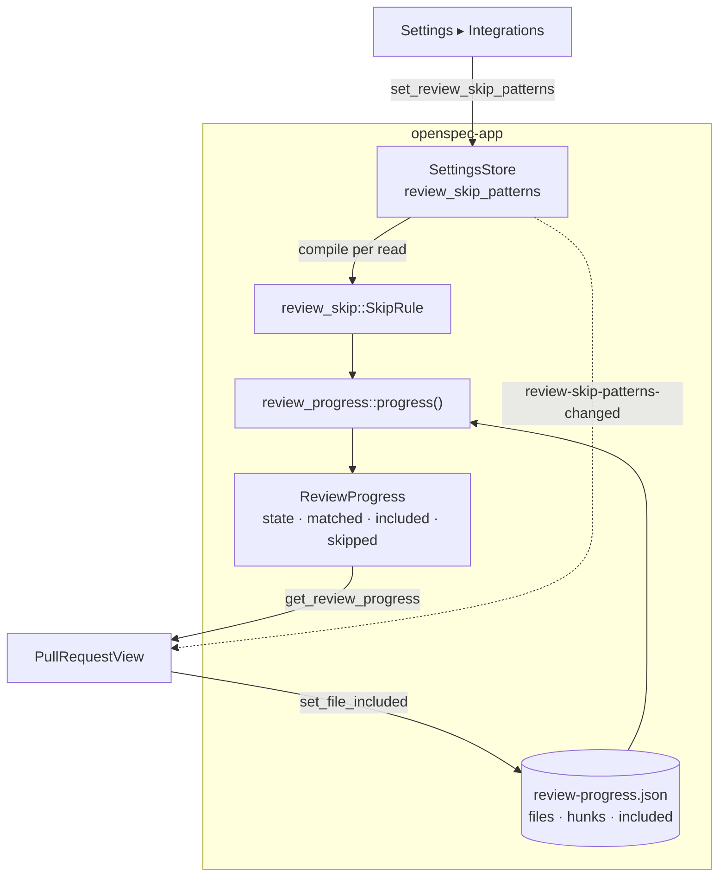
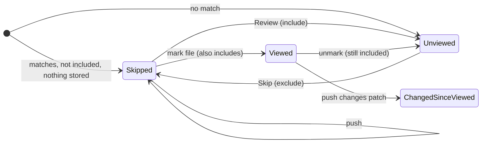

## Context

Review progress (see the *Review Progress* requirement in the `pull-request-viewer` capability) is computed in `openspec-app`: `review_progress::progress(detail, files, entry)` derives each file's state from the keys stored in `review-progress.json` and the cached detail. `AppService::review_progress` serves it to both transports, and every write raises `review-progress-changed`. The view (`src/components/PullRequestView.tsx`, with its pure helpers in `src/pullRequestView.ts`) renders a box per file and per hunk, folds viewed hunks, and can ask the diff view to collapse a section once.

Settings are global (`AppSettings` in `settings.rs`), and each setting reaches other windows through its own direct-emit event. Nothing in the workspace matches globs today. `regex` 1.13 is already in `Cargo.lock` through other crates, and `globset` is not.

## Goals / Non-Goals

**Goals:**
- Files the reader never means to read, tests above all, get out of the way and out of the viewed count, with one global list that starts empty and that the reader fills.
- No noise from pushes: a skipped file never becomes "changed since viewed".
- Editing the patterns updates every open pull request, in every window and tab.
- The reader's own marks are never overridden by the rule.

**Non-Goals:**
- Per-repository patterns, or reading `.gitattributes` (`linguist-generated`) from the repository.
- Skipping parts of a file. Rust's inline `#[cfg(test)]` modules stay in review. A later rule on hunk headings could build on the same state.
- Writing anything to GitHub or BitBucket.
- Expanding a section when the reader activates Review. The diff view's host API only collapses once, and the section's own toggle sits beside Review.
- A terminal UI setting: the TUI has no pull-request view.

## Decisions

### D1. Skipped is worked out on every read, never stored as a mark

`progress()` takes the compiled rule and gives a matching file with nothing stored the state `Skipped`. Nothing is written to make it so.

*Rejected: writing real viewed marks for matching files when a pull request opens.* Marks are keyed by content, so the next push touching a test would show "changed since viewed" again, which defeats the feature. It would also move `lastMarkedHead` for marks the reader never made, leave stale marks behind when the patterns change, and re-mark files the reader had deliberately unmarked.

### D2. Inclusion is stored per path, beside the marks

The entry gains `included: [path]`, which is skipped when empty so older entries are unchanged on disk. `set_file_included` reuses `write_review_marks`' refusal checks: provider enabled, cached detail present, path among its files, commits as rendered. An exclusion never creates an entry, and inclusion never advances `lastMarkedHead`.

*Rejected: keying inclusion by the file key.* A push would then silently undo "Review", and that undo is exactly the surprise D1 exists to avoid.

### D3. Touching a file's marks includes it

Every stored mark or unmark of a matching file, or of one of its hunks, also adds its path to `included`.

*Rejected: letting marks merely take precedence, without including.* Then unchecking a viewed test file, which a reader does when they want to look again, would leave nothing stored. The file would fall back to skipped and its section would collapse under the reader. Precedence still holds in the formula, for entries written before this change.

### D4. Globs that behave like `.gitignore`, plus `/…/` regexes, matched in Rust

A glob without `/` matches the file's name, and a glob with `/` matches the whole path. They are compiled with `globset` using `literal_separator(true)`, so `*` never crosses a `/`. A line of three or more characters that starts and ends with `/` is a `regex` crate expression, searched unanchored. Renamed and deleted files are matched by both of their paths.

$$\text{matches}(p, q) = \begin{cases} \text{regex}(p) \text{ finds a match in } q & p = /r/,\ |p| \ge 3 \\ \text{glob}(p) \text{ matches } q & {/} \in p \\ \text{glob}(p) \text{ matches } \text{basename}(q) & \text{otherwise} \end{cases}$$

*Rejected: regular expressions only.* A path list reads far better as globs. Every repository already speaks `.gitignore` and CODEOWNERS, and a regex for `*.test.ts` needs escaping most people get wrong.

*Rejected: matching in the frontend with JavaScript's `RegExp`.* Progress, counts and the skipped state are derived in `openspec-app`, and the counts would disagree with the states if a second matcher existed. JavaScript's regex syntax (lookaround) would also accept patterns Rust refuses.

### D5. A new `review_skip` module, compiled on each progress read

`openspec-app/src/review_skip.rs` owns `SkipRule::compile(&[String]) -> (SkipRule, Vec<PatternError>)` and `SkipRule::first_match(paths) -> Option<&str>`. Compiling skips bad patterns (D7), so a hand-edited file degrades instead of failing. The setter uses the same compile and refuses when any error is returned. `AppService::review_progress` and every write compile the rule from the settings they read.

*Rejected: caching the compiled rule in `AppService` and invalidating it on save.* At most 64 patterns of at most 256 bytes compile in microseconds, and progress is read on opening, on marks and on notices, not in a loop. A cache adds invalidation to get wrong for no measurable gain.

### D6. Empty by default, with no defaults concept at all

`AppSettings.review_skip_patterns: Vec<String>` with `#[serde(default)]`, so a settings file from before this change reads as the empty list and nothing is skipped until the reader adds a pattern. There is no shipped list, no "Restore defaults", and no `defaults` flag on the wire. The empty add field's placeholder suggests `**/tests/**`, so the row shows what a pattern looks like.

*Rejected: shipping a default test list.* Every existing user's open pull requests would change on upgrade. Test layouts differ by language, so any fixed list is wrong for someone (a production file under a `test` directory, say). The person this is for chose an empty default.

*Rejected: keeping `Option<Vec<String>>` with an empty default list.* With nothing to restore, the defaults flag, the restore path and their tests would be dead weight.

### D7. Validation at the setter, tolerance at the reader

The setter enforces the accepted-values rule (at most 64 patterns, each trimmed, 1–256 bytes, compiling, no glob starting with `/`) and returns every refused pattern with its reason, so the Settings view can report each on its own field. The `regex` crate guarantees linear-time matching, and its default size limit bounds compilation. Together with the caps, a pattern sent over the web transport by a tailnet peer cannot stall the service.

*Rejected: refusing the whole settings file when a stored pattern is bad.* One typo would take every other setting down with it.

### D8. A list of single-line fields, not a textarea

Each pattern is a `CommittedField`, followed by an empty "add" field. Remove is a button. This fits *Settings Persist by One Rule* unchanged: Enter commits, Escape restores, and the field reports a refusal. It also gives each refused pattern its own place to say why.

*Rejected: a multi-line textarea.* Enter would have to insert a newline, which breaks the one save rule and would need a modified `settings-view` requirement plus a commit chord. A refusal could only be reported for the whole block.

### D9. Its own event, `review-skip-patterns-changed`

The event carries the list in effect and is emitted directly by the setter on both transports, like `commit-history-enabled-changed`. Pull-request views re-read progress on it, and Settings re-renders.

*Rejected: reusing `review-progress-changed`.* It carries one pull request's reference, while a rule change touches every pull request. A reference-less variant would change the payload shape every listener relies on.

### D10. The view collapses each file once, when it newly becomes skipped

`pullRequestView.ts` gains a pure helper: given the previous progress (by path) and the next, it returns the paths that became skipped. The view asks the diff view to collapse those once. The comparison is by path and ignores which detail the progress is for, so a push that leaves a file skipped doesn't collapse a section the reader expanded.

*Rejected: a collapsed-by-default flag passed to the diff view.* That would make collapse host-held state, which the *File Sections* requirement in the `diff-view` capability forbids. It would also fight the reader's own toggle on every re-render.

## Risks / Trade-offs

- **The feature does nothing until it is configured**, so it may go unnoticed. → The row's description explains it, the empty field suggests `**/tests/**`, and the release notes should point to it.
- **A pattern can catch a file that matters**, such as a production file under a directory named `test`. → Each skipped header names the matching pattern and offers Review in one click.
- **Rust inline tests aren't caught.** → Stated as a non-goal. The state and the `matched` field leave room for a hunk-heading rule later.
- **A standalone `specforge-serve` keeps its own in-memory settings.** Patterns saved in the desktop app don't reach it until restart, which is already true of every setting. → No new mechanism. It is noted here so it isn't mistaken for a bug in this feature.
- **An older SpecForge rewrites an entry without `included`.** → It's the same downgrade story as `hunks`, written into the *Two writers* paragraph. Marks survive, and only inclusions are lost.
- **The mutation gate.** Every matching branch (basename vs. path, regex detection at three characters, caps at 64 and 256 bytes, the precedence order) is a mutant. → `review_skip.rs` gets table-driven unit tests at each boundary (2 and 3 characters, 64 and 65 patterns, 256 and 257 bytes), and `review_progress` tests cover each precedence step.
