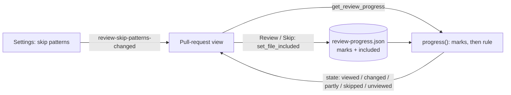

# Review Skip Patterns

## Why

Most of a pull request's test files are not worth a line-by-line read. Today every one of them sits expanded in the pull-request view and counts against "n of m files viewed", so finishing a review means opening, or blindly ticking, files the reader never meant to look at. Ticking them is worse than it looks: a viewed mark is keyed by the file's content, so the next push that touches a test brings it back as "changed since viewed".

## What Changes

- A global list of **skip patterns** decides which of a pull request's files the reader does not intend to review. The list starts empty: nothing is skipped until the reader adds a pattern such as `**/tests/**`. A pattern is a glob, matched against the file's name when it has no `/` and against its whole path when it has one. A line written as `/…/` is a regular expression searched in the path.
- A file that matches a pattern, and that the reader has stored nothing about, is in a new review state, **skipped**. Nothing is written to make it so: the state is derived every time progress is read. A push therefore never turns a skipped file into "changed since viewed", and editing the patterns updates every open pull request.
- A skipped file's section starts collapsed. Its header says `skipped · matches <pattern>` and offers **Review**, which includes the file in this pull request's review. An included file offers **Skip** to undo that. The reader's own marks always take precedence over the rule: marking a skipped file viewed works as it does today. Marking or unmarking a matching file also includes it, so unchecking a viewed test file leaves it unviewed rather than skipped again.
- The header counts skipped files apart from the rest: "4 of 7 files viewed · 3 skipped". Skipped files are left out of the total rather than counted as viewed.
- The patterns are edited in Settings ▸ Integrations, below the pull-request cards, while at least one pull-request integration is on. Each pattern is its own field and is checked when committed.
- **No behaviour change on upgrade:** the list starts empty, so every pull request looks as it does today until the reader adds a pattern.

## Capabilities

### New Capabilities

_None._

### Modified Capabilities

- `pull-request-viewer`:
  - *Review Progress* gains the skipped state, the stored `included` paths, `set_file_included` and the skipped count.
  - *Changed Files in the Pull-Request View* gains the skipped header, the Review and Skip controls, and the initial collapse.
  - A new *Review Skip Patterns* requirement defines the pattern syntax, matching, the empty starting list, validation and change notice.
- `settings-view`: *Settings Are Organised Into Groups* assigns the review skip patterns to the Integrations group.

## Impact

- **`openspec-app`**
  - A new `review_skip` module that compiles and matches the patterns. This adds `globset` and `regex` as dependencies.
  - `settings.rs`: a `review_skip_patterns` list, empty when absent, and a validating setter.
  - `review_progress.rs`: the `Skipped` state, the `included` storage, and `matched`, `included` and `skipped` on the wire.
  - `service.rs`: `set_file_included`, and progress reads that take the rule.
  - `events.rs`: `review-skip-patterns-changed`.
  - `tests/wire_shape.rs`: the new keys.
- **`specforge`**: `commands.rs` and `lib.rs` get `get_review_skip_patterns`, `set_review_skip_patterns` and `set_file_included`, plus the event's emit.
- **`specforge-web`**: `dispatch.rs` gets the same three commands, and the SSE stream carries the event.
- **Frontend**
  - `src/types.ts` and `src/api.ts` mirror the new types and commands.
  - `PullRequestView.tsx` (and `pullRequestView.ts`) handles the header, the skipped header extra, Review and Skip, and the collapse-once request for skipped files.
  - A new skip-patterns row in `src/components/settings/IntegrationsGroup.tsx`.
- **What doesn't change**
  - No change to the diff view: skipped sections use the existing "collapse once" request.
  - Nothing is sent to GitHub or BitBucket, and GitHub's own viewed state is still never written.
  - No per-repository patterns.
  - No matching inside a file: inline `#[cfg(test)]` modules in Rust sources are not skipped.
  - The terminal UI has no pull-request view and gets no setting.
  - File and hunk keys and the existing states' rules are unchanged.
