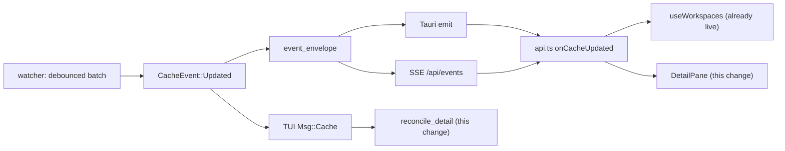
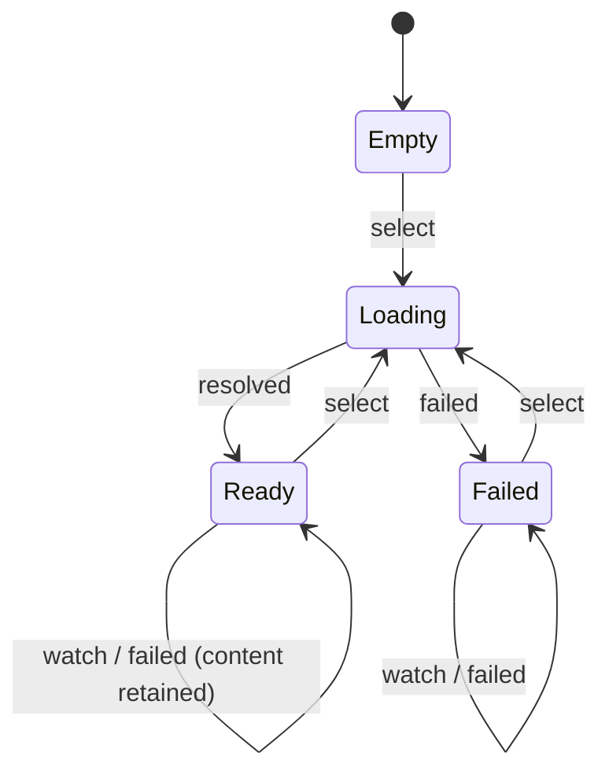
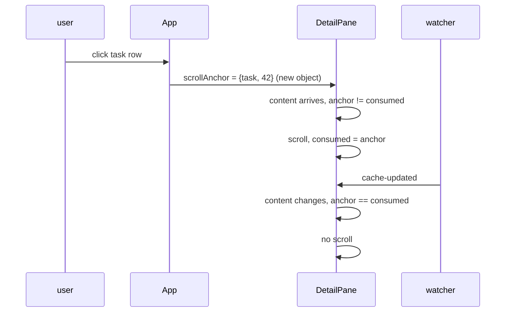

## Context

`spec-browser`'s *Reactive Updates from Filesystem* requirement already covers the detail pane, and neither frontend satisfies it. The desktop `DetailPane` keys its fetch effect on the artifact's identity and subscribes to no cache event; the terminal frontend's `reconcile_detail` returns early exactly when the selected change has not moved. Both panes are therefore frozen at selection time while the tree beside them updates live.

The backend needs nothing. `WatcherManager` already emits `CacheEvent::Updated` per debounced batch, `openspec_app::event_envelope` already maps it identically onto the Tauri emitter and the web SSE bridge, and `useWorkspaces` already consumes it for the tree. The work is entirely in the two view layers, and the difficulty is not "subscribe and refetch" — it is that both frontends contain a reading-position reset on the refresh path that is inert only because refresh is currently manual.

## Goals / Non-Goals

**Goals:**

- Satisfy the existing *Detail pane updates when shown file is edited* scenario on both the desktop pane and the terminal pane.
- Keep the reader's position across a refresh they did not initiate.
- Make a refresh whose bytes are unchanged completely unobservable — no re-render, no spinner, no scroll movement.
- Keep a failed background read from destroying content the user is reading.
- Land testable logic without inventing a testing stack this repository does not have.

**Non-Goals:**

- Layout-stable scroll anchoring (holding the *text* under the viewport when content is inserted above it). Numeric scroll preservation only — see *Preserve the scroll offset, not the visual anchor*.
- Any change to `CacheEvent`, event names, payload shapes, or IPC commands.
- Showing the user *what* changed (changed-line highlight, task-flip pulse). A separate feature with its own design surface.
- Follow/tail behaviour that pins a bottom-parked reader to a growing document.
- Live refresh for `FileBrowserView`. The `workspace-file-browser` capability specifies manual refresh and forbids any watcher beyond the `openspec/`-scoped one; that staleness is a decision, not a gap.
- Bounding the terminal pane's scroll offset in general. `detail_scroll` is still incremented with an unbounded `saturating_add(1)` on keypress; only the watcher-driven re-read clamps, because only it can move content out from under a stationary reader. A general bound is still a separate concern.

## Decisions

### Subscribe unconditionally and discriminate on content, not on the event payload

The pane subscribes to `cache-updated` and refetches on every occurrence, regardless of which workspace the payload names. Redundant reads are neutralised at the other end: the fetched text is compared with the current content and state is left untouched when equal.

The invariant the guard buys, for a watch-triggered load $L$ producing text $t$ against current content $c$:

$$t = c \implies \text{renders}(L) = 0$$

which is what makes an unfiltered subscription affordable — the common case (an edit elsewhere in the workspace) costs one small file read and produces no visible event at all.

**Rejected: filter on `payload.workspace`.** This is the obvious implementation and it is wrong. `WatcherManager::refresh_status_and_notify` and `refresh_status_for` emit `Updated` with a *carrier* workspace — whichever entry happens to be first in `last_views`, or a repo's main worktree — because their consumers refetch everything and do not need the distinction:

> One nudge is enough: `cache-updated` consumers refetch *all* views, so any tracked workspace path serves as the carrier.

A pane that filters on that field drops legitimate refreshes whenever the nudge is carried by a different repo. The failure is invisible with a single workspace registered and routine in the multi-worktree setups this application is built to aggregate, which makes it exactly the kind of defect that ships.

**Rejected: narrow the carrier paths in `openspec-core`.** Making those paths emit one `Updated` per workspace would restore the field's meaning, but it multiplies event volume across every consumer to serve one that does not need it, and it changes headless behaviour for a view-layer convenience.

**Rejected: enrich `CacheEvent::Updated` with the batch's changed paths.** This would allow precise invalidation, but it puts an unbounded payload across two transports and both frontends to buy an optimisation the equality guard already delivers for a single small markdown read. It remains available to a later change that needs path granularity for its own sake — changed-row highlighting in the tree, for instance.

### Model the pane's content as a reducer; keep the component a thin binding

The load lifecycle becomes a pure transition over `(state, event)`, where events are `select`, `watch`, `resolved`, and `failed`, and the state carries the content, the error, and whether a load is in flight. `DetailPane` holds the state, dispatches, and renders; it decides nothing.

The transition table is where every interesting rule lives — the equality guard, the trigger-dependent failure policy, the suppression of the loading flag on watch-triggered loads — so it is also where the tests belong.

**Rejected: add a DOM test environment and test the component.** `bun test` currently covers only `src/routing/`, with no `happy-dom` and no `@testing-library/react`. Introducing them would make this change carry a testing-stack decision that has nothing to do with refresh, and component tests of an async fetch effect are the slowest and flakiest way to assert a transition table. The repository already set the opposite precedent in `view-routing`, which extracted a pure codec and in-memory history adapter specifically so navigation semantics were unit-testable without a DOM.

**Rejected: leave the logic inline and rely on manual verification.** Nothing would gate it. `cargo mutants` excludes `crates/specforge-tui/**` outright and does not reach TypeScript at all, so an untested policy here is untested permanently.

### Consume the scroll anchor by identity, not by content arrival

`DetailPane`'s anchor effect currently depends on `[scrollAnchor, content]`, and `App.tsx` sets a section/task anchor on tree selection and never clears it. Once the pane is live, every batch re-fires that effect and smooth-scrolls the reader back to the node they clicked — with the worst case being the primary use case, parked on a task while `tasks.md` changes.

The fix is a consumed-anchor ref: the effect still waits on `content` (it must, because it measures DOM that does not exist until the markdown commits), but it acts only when the current anchor is not the one it last consumed, and records the anchor on the way out. It also stands down entirely while a `select` load is in flight: that load deliberately leaves the *outgoing* artifact rendered, so an anchor effect running then would measure the previous document, scroll it, and burn the anchor before the artifact the user actually clicked ever mounted. `scrollAnchorForSelection` returns a fresh object per selection, so identity comparison distinguishes "the user clicked a task" — including clicking the same task twice — from "bytes arrived under a stable anchor."

**Rejected: clear the anchor from `App` once consumed.** Semantically the cleanest reading — an anchor is an event, not state — but it needs a callback from pane to shell, or a one-shot token added to the `ScrollAnchor` union in `src/types.ts`, to coordinate two components over something only one of them cares about.

**Rejected: drop `content` from the effect's dependencies.** The effect exists to measure committed layout; without the content dependency it runs against markdown that has not rendered and finds no target node.

### Preserve the scroll offset, not the visual anchor

A refresh preserves `scrollTop` numerically, which React gives for free — the scroll container is an ancestor of the markdown and is never unmounted, so a content diff leaves the offset alone.

This is the correct trade for the mutations that actually occur in a watched `openspec/` tree. A checkbox flip from `- [ ]` to `- [x]` changes no line count and no layout; an appended task or section shifts nothing above the viewport. Only insertion *above* the reader moves the text under a fixed offset, and that is the rare case here.

**Rejected: manual layout anchoring** — recording the nearest heading or `li[data-line]` at the viewport top and restoring its offset after commit. It is buildable from parts the pane already has, but it is the majority of the change's complexity in service of the least common mutation, and it introduces its own failure mode when the anchor element is the thing that was edited.

**Rejected: rely on CSS `overflow-anchor`.** Chromium implements it, WebKit does not, so `specforge-web` in a Chromium browser would get anchoring the macOS desktop shell could never have. Behaviour that differs by host on a property the specification pins for both frontends is worse than uniformly not having it.

### Trigger-dependent failure and loading policy

A read failure nulls the content and replaces the pane with an error state. That is right when the user just selected something and wrong when an event they did not cause arrives — an artifact becoming unreadable underneath a reader (its change archived, its file removed mid-write) must not blank the text they were reading. Failure handling therefore branches on the trigger: `select` keeps today's behaviour, `watch` retains the last good content and discards the error. The loading flag is likewise set only for `select`, so a live pane never flashes a spinner at a reader who asked for nothing.

The existing `loading && content == null` guard in the render path was written for exactly this and is unreachable today; it becomes live rather than being replaced.

**Rejected: surface background failures as a transient banner.** It is more truthful, but it needs a dismissal model and a decision about persistence across subsequent successful refreshes, and the most common trigger — a mid-write read landing between truncate and flush — resolves itself on the next batch a few hundred milliseconds later. Reporting it would be noise about a condition that has already passed.

### Terminal pane: reload on cache events, and make the scroll reset conditional

`reconcile_detail` gains a content path: when the selected change is unchanged it re-issues the artifact load rather than returning. `Msg::Artifact`'s unconditional `model.detail_scroll = 0` becomes conditional on the load having been selection-driven, so a watch-driven reload leaves the offset in place. The existing `artifact_gen` counter continues to discard replies for a selection or tab the user has already left, and needs no change.

**Rejected: a separate `Msg` variant for background reloads.** It duplicates the handler body and the generation check to carry one boolean, and doubles the surface every future artifact-load caller must choose between.

**Rejected: clamping the preserved offset to the reloaded document's height.** There is no clamp anywhere in the terminal pane's scroll model today — `detail_scroll` is a `u16` incremented with `saturating_add(1)`, and ratatui renders blank past the end — so a preserved offset past a shrunken document behaves exactly as scrolling past the end already does. Adding a bound is a real improvement to make deliberately, not a side effect of this change.

### Order reads by issue sequence, not by artifact identity

Each issued read takes the next value of a monotonic counter and may only dispatch its result while it still holds the latest value. A read that a later read superseded is discarded even when it targets the artifact still on screen.

The first implementation compared the settling read's artifact identity against the pane's current artifact. That correctly drops a read the user navigated away from, but it cannot order two live reads of the *same* artifact: navigating A → B → A leaves two A-reads in flight, both matching the identity, and whichever settles last repaints — which is not necessarily the one issued last. The result is silently stale markdown that the equality guard then pins in place, because every later refresh compares equal to it.

Superseding also has to answer *who is waiting*. A watcher read that cancels an outstanding user-initiated read inherits its `select` presentation (`effectiveTrigger`), so the reader still lands at the top of the artifact they chose and still sees an error if it cannot be read. This mirrors `pending_trigger` in the terminal frontend, so both surfaces resolve the race identically.

**Rejected: keeping the per-effect `cancelled` closure.** It is a genuine per-request token and orders same-artifact reads correctly, but it is only reachable from the effect that created it — the watcher subscription fires outside any such closure, so a second mechanism would have been needed for watch reads and the two would have to agree.

**Rejected: dropping a watcher result whenever a user read is outstanding.** This was the original rule. It inverts the freshness ordering: the watcher read was issued later and therefore opened the file later, so discarding it in favour of the older read installs stale bytes.

## Risks / Trade-offs

- **A rich block whose position shifts remounts and re-renders asynchronously, collapsing its height mid-scroll.** `MermaidBlock` renders in an effect keyed on its source, so an unchanged diagram is preserved by reconciliation and does not redraw — but an edit that inserts content *above* a diagram changes its position, remounting it and briefly rendering nothing where it was. → The equality guard already removes the overwhelming majority of refreshes from consideration, and the mutation that triggers this (inserting a fence above an existing diagram) is both rare and one the reader caused indirectly. If it proves annoying, keying rich blocks by a hash of their fence source makes them position-independent, which is a contained follow-up.

- **An unfiltered subscription reads a file on every batch in every workspace.** → One `read_artifact` of a markdown file per debounced batch, coalesced by `useCoalescedRefetch` so a multi-event batch produces a single read, and only while an artifact is open. This is strictly less work than the `getWorkspaceViews()` round trip the tree already performs on the same events.

- **The reader is mid-selection when a batch lands, and the wrong content wins.** → Both frontends order reads by a monotonic issue token — `artifact_gen` in the terminal, `loadSeq` on the desktop — so only the most recently *issued* read may land, and the most recently issued read is the one that opened the file last. See *Order reads by issue sequence* below for why identity comparison was not enough.

- **Nothing in CI gates either side of this change.** `cargo mutants` excludes `crates/specforge-tui/**` (`.cargo/mutants.toml` records that `app.rs` has no tests, so every mutant there would be noise) and never sees TypeScript; `bun test` runs in CI but only covers `src/routing/`. → The reducer decision exists largely to answer this: the policy lands as a pure module with `bun test` coverage that the existing CI step picks up automatically, and the terminal-side transition gets the first `#[cfg(test)]` module in `app.rs` — which, per that config file's own note, is the precondition for removing exclusions later.

- **Live refresh makes a half-written file visible.** An editor or agent writing a large artifact non-atomically can be read mid-write, briefly rendering truncated markdown. → The watcher's 200 ms debounce absorbs the common case, the next batch corrects it, and the retain-on-failure policy means the degenerate case (read error rather than partial content) shows nothing at all rather than blanking the pane.
