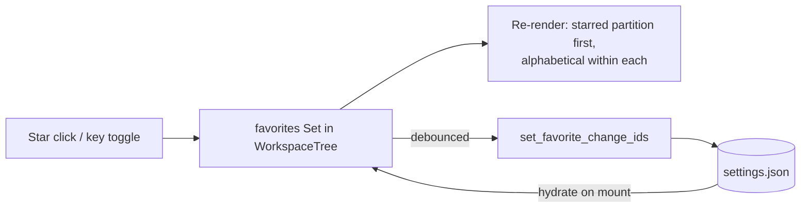

# Favorite Changes in the Workspace Tree

## Why

Active changes under a repo group render in fixed alphabetical order, so in a busy repository the one or two changes a user is actively driving are buried among a dozen dormant ones, and nothing lets the user say "keep these on top." A star (favorite) toggle on change rows gives the tree a user-controlled priority signal with the smallest possible mechanism.

## What Changes

- **Star affordance on change rows.** Every logical-change row in the workspace tree — the two-line flattened singleton row, the one-line multi-instance disclosure parent, and the flat-workspace change row — gains a star toggle at the trailing edge of its primary line: hover-revealed (outline) when unstarred, persistently visible (filled) when starred. This is the tree's first nested per-row action button besides the disclosure chevron, and it follows the chevron's contract: it stops click propagation so toggling never selects the row, and it is reachable without a pointer via a keyboard toggle on the focused row.
- **Starred changes float to the front ("quiet float").** Within each top-level group (repo group or flat workspace), starred changes render before unstarred ones, alphabetical within each partition. No divider or section header is added — the filled star glyph itself explains the ordering. This contracts change-row ordering for the first time (today's alphabetical order is an uncontracted implementation detail of the core aggregation).
- **Stars attach to position-independent change identity.** A favorite is keyed on the containing group's identity plus the change directory name — never on tree-position node IDs — so a star survives singleton↔multi-instance promotion, worktree churn, and archive round-trips. While a starred change is archived its entry is inert (the tree shows active changes only) and it resurfaces if the change returns; inert entries are ignored, never garbage-collected, matching the collapse-state precedent.
- **Persistence clones the collapse-state pattern.** A new favorites id-list lives in `AppSettings` (config-dir `settings.json`), hydrated at tree mount and written back with the same debounce the collapse/expand sets use. Two new commands (get/set) are exposed by the desktop shell and mirrored in the web dispatch table, per the web UI's command-mirror contract. Ordering is applied entirely in the frontend; core continues to emit alphabetical views.

## Capabilities

### New Capabilities

_None._

### Modified Capabilities

- `spec-browser`: adds requirements for the change-row star affordance (visual states, propagation and keyboard contract), starred-first ordering within each top-level group, position-independent favorite identity with inert-while-archived semantics, and settings-backed persistence across sessions mirroring the collapse-state requirement.

## Impact

**Touched:**

- `crates/openspec-app/src/settings.rs` — new `#[serde(default)]` favorites id-list field on `AppSettings` plus a whole-list setter, cloning `collapsed_tree_node_ids` / `expanded_tree_node_ids`.
- `crates/specforge/src/commands.rs` + `crates/specforge/src/lib.rs` — `get_favorite_change_ids` / `set_favorite_change_ids` command pair, registered alongside the collapse-state commands.
- `crates/specforge-web/src/dispatch.rs` — matching allowlist arms (the exhaustive match rejects unknown commands, so the web UI breaks without them).
- `src/api.ts` — TypeScript wrappers mirroring the collapse-state wrappers.
- `src/components/WorkspaceTree.tsx` — star button in the row primitive's trailing slot for change-row types, favorites `Set` with hydrate-on-mount and debounced write-back, partition-before-render of each group's logical-change list, keyboard toggle wiring.
- `src/App.css` — hover-reveal and filled-star styles composing with existing row hover/selection treatment.
- `openspec/specs/spec-browser/spec.md` — delta spec (via this change's `specs/` directory).

**Deliberately unchanged:**

- `crates/openspec-core` — no parser, view, or aggregation changes; core output remains a pure function of disk state and stays alphabetical. The reorder is presentation, applied in the frontend.
- No writes into any workspace's `openspec/` tree — favorites are app-side configuration, preserving the read-only contract.
- `crates/specforge-tui` — the terminal frontend keeps core's order (it already ignores collapse state; favorites are likewise a desktop/web presentation preference).
- Dashboard, Archive view, tray badge, notifications, and the Address/routing scheme — favorites are ambient view preference, not navigable state, and archived-change surfaces keep their date ordering.
- No new SSE/Tauri event — settings setters emit none today (collapse-state precedent); a second connected web client re-sorts on its next fetch.
