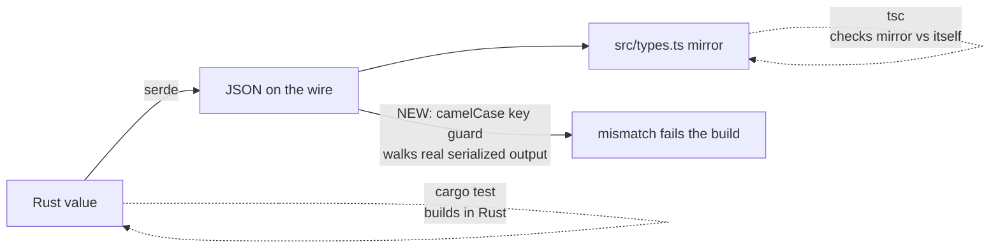

# Make Every IPC Key camelCase, and Keep It That Way

## Why

Renaming a **flat (non-git) workspace** in Settings appears to work and does nothing. The name saves, and the Settings row echoes it back — but the tree row, the window label, the file-browser header and the reader title all keep showing the folder basename.

`WorkspaceView::Flat` is a struct variant of a tagged enum, and `#[serde(rename_all = "camelCase")]` on an **enum** renames its *variants*, not the fields inside a struct variant. So the row goes out as `display_name` while `src/types.ts` declares `displayName`, every `view.displayName ?? view.workspace.name` read is `undefined`, and the fallback silently wins. Measured on the wire:

```
{"kind":"flat","workspace":{…},"changes":[],"display_name":"Nice Name","color":null}
```

The tint set in the same dialog *does* apply, because `color` is a single word and identical in both cases — so the user watches half their edit take effect, which reads as flakiness rather than a bug. Repository rows are unaffected: `Repo(RepoView)` is a newtype variant whose inner struct carries its own `rename_all`.

This violates an existing requirement rather than filling a gap: `workspace-registry`'s *Presentation Fields on Listed Workspaces* already states that "flat workspace entries in the same view also include their per-workspace display name and colour".

**This is the second time this exact trap has fired.** `ArchiveScope::Repo { repo_id }` shipped with the same defect and broke every repository-scoped archive listing at runtime — while `cargo test`, `tsc`, `bun test` and the mutation gate were all green, because Rust tests build values in Rust and `tsc` only checks the mirror against itself. Nothing in the repo can currently see a Rust/TypeScript disagreement, so the fix has to include a way to notice.

## What Changes



- **Fix the bug.** Add `rename_all_fields = "camelCase"` to `WorkspaceView`, so its one struct variant emits `displayName`. Its other fields (`workspace`, `changes`, `color`) are single-word and unchanged; `disabled` stays `skip_serializing`. No TypeScript change — `src/types.ts` already declares `displayName`.

- **Add a recurrence guard.** A test that serializes representative values of the types the frontend actually reads, walks the resulting JSON **recursively**, and fails on any key containing `_`. This is behavioural rather than source-scraping: it observes what serde really emits, so it catches every shape of this mistake — a missing `rename_all`, an enum's struct variant, a nested type whose parent is correct — including in types that do not exist yet.

- **Close the one latent twin.** `CacheEvent` (`crates/openspec-core/src/watcher.rs`) derives `Serialize` with `rename_all` only and has struct variants carrying `change_id`, `repo_id`, `change_name`, `worktree_path`. Its serialized form does not currently cross the IPC boundary — the shell translates each variant into an explicit payload — so this is **not** a live bug. It is the same loaded trap for whoever wires it up, and the attribute costs nothing.

- **Record the rule.** The trap is not obvious from serde's documentation and has now cost two bugs, so it is written down where the next person adding a struct variant will look.

An exhaustive audit of the IPC surface — every serialized enum, every struct mirrored in `src/types.ts`, every event name and payload, and the three-way agreement between `api.ts`, `commands.rs` and `dispatch.rs` — found **no other live mismatch**. Six further candidates were examined and rejected; three are real defects of *different* classes and are listed under Impact as explicitly out of scope.

## Capabilities

### New Capabilities

_None._

### Modified Capabilities

- `workspace-registry`: *Presentation Fields on Listed Workspaces* gains the wire-level contract its existing flat-workspace scenario assumes — that the keys the frontend reads are the keys the backend emits, for a struct variant as much as a struct — plus a scenario covering a flat workspace's display name surviving the boundary.

## Impact

**Rust.** `crates/openspec-core/src/repo_view.rs` (one serde attribute on `WorkspaceView`), `crates/openspec-core/src/watcher.rs` (the same attribute on `CacheEvent`, pre-emptively), and a new wire-shape test module. serde is pinned at 1.0.229, well past the 1.0.184 that introduced `rename_all_fields`, so no dependency change.

**Frontend.** None. `src/types.ts` already declares `displayName`; it is Rust that has been wrong. The bug is fixed by making the wire match the mirror, never by editing the mirror to match the bug.

**Documentation.** `crates/CLAUDE.md` already warns about the neighbouring version of this trap (string-valued enums and `kebab-case`) but not this one; the struct-variant case is added beside it.

**Deliberately unchanged.** No command, event name, or payload shape is added or removed, and no frontend behaviour changes beyond a flat workspace's name finally rendering. The mutation gate covers `openspec-core`, so the changed attribute needs a test that fails without it — a bare attribute edit would otherwise be an uncovered line.

**Found but out of scope** — different defect classes, each deserving its own change rather than being folded in here:

- `workspace-presentation-updated` and `document-width-changed` are emitted on two disconnected channels (the Tauri app handle and the embedded web server's `extra_tx`), so a change made on one surface never reaches the other. Both sides agree on the event *name*; the delivery is what is split.
- Seven web/Tailscale commands, plus `open_reader_window` and `set_reader_window_size`, are in `generate_handler!` with no `dispatch.rs` arm. They are desktop-only by design, but they fall through to the generic `unknown command` rather than the explicit desktop-only rejection used elsewhere.
- `getChanges` and `getActiveCount` are exported from `src/api.ts` and called nowhere.
