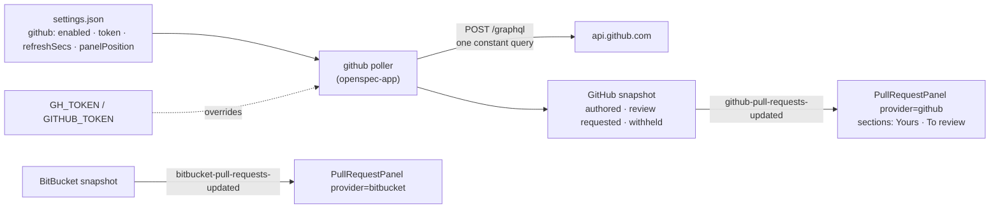

# GitHub Pull-Request Panel Beside the BitBucket One

## Why

SpecForge now shows the BitBucket pull requests a developer authored, but most repositories — this one included — live on GitHub, where the same question ("what is open, and what is waiting on me?") is still answered in a browser tab. GitHub's GraphQL API answers it in a single request that also carries check status, mergeability and review threads, signals the BitBucket recipe had to leave out because each cost extra requests per pull request, so a GitHub panel can say more for less.

## What Changes

A second opt-in pull-request feature, a structural twin of the BitBucket one: its own background poller in the headless app layer, its own write-only credential, its own panel in one of the same four side-pane slots, and its own position setting. The two features are independent — either, both or neither can be on — and the panel component, the row type and the "open this pull request" command are shared rather than copied.

- **Opt-in, off by default.** A `github.enabled` setting gates everything, with the same posture as BitBucket and the two quota gauges: no credential read and no request while it is off.

- **Credential: a stored token, write-only, environment-overridable.** One GitHub token is stored in the shared settings file and is never returned by any command; the getter reports only whether one is set. `GH_TOKEN`, then `GITHUB_TOKEN` — the order the GitHub CLI uses — override the stored token, so a headless `specforge-serve` needs no Settings UI. The Settings copy explains the classic-versus-fine-grained trade (a classic token's `repo` scope can write; a fine-grained token is read-only but sees one account or organisation), single-sign-on authorisation, and that `gh auth token` prints a token that can be pasted in.

- **One request per refresh, a fixed read-only query.** The poller sends one GraphQL query — a compile-time constant that is never a mutation — to `https://api.github.com/graphql`. It returns the viewer's open authored pull requests and the open pull requests awaiting the viewer's review (including through a team), at most 50 of each, newest-updated first, pull requests in archived repositories excluded. The query costs 4 of the 5,000 hourly GraphQL points, measured against a live account.

- **Richer rows.** Each row carries what the BitBucket row carries — repository, title, branches, draft, updated time, review summary — plus the author, a checks indicator (passing, failing, pending, or none when no checks ran), a conflict marker shown only when GitHub reports the pull request as conflicting, and the count of unresolved review conversations. The review summary maps GitHub's latest opinionated reviews and outstanding review requests onto the existing approvals / changes requested / pending cell.

- **GitHub-shaped failure handling.** A rate limit can arrive as a 403 or 429 with an exhausted-quota header, or as a 200 whose body reports `RATE_LIMITED`; all three back off and never read as a credential problem. Results GitHub withholds — typically an organisation that enforces single sign-on the token is not authorised for — are counted and surfaced in the panel header's tooltip, the GitHub counterpart of BitBucket's skipped workspaces.

- **The panel.** The existing panel component gains a provider. The GitHub panel's header shows two counts (yours · to review); its body has a "Yours" and a "To review" section, a section rendered only when it has rows. Review rows show the author, since it is someone else — often a bot such as the Copilot coding agent. Collapsed state is per-viewer and per-provider.

- **Twin panels may share a slot.** `github.panelPosition` is independent of `bitbucket.panelPosition`, defaulting to the same `left-bottom`. Two panels in one slot stack BitBucket first, each keeping its own height cap; so that stacking never squeezes the pane's own content to nothing, the workspace tree (and, in the rail, the commit graph) keeps a minimum height while any panel shares its pane, and the panels yield first.

- **BitBucket names made honest.** With a twin in place, names that say "pull requests" but mean BitBucket gain the provider: the `pull-requests-updated` event becomes `bitbucket-pull-requests-updated`, `get_my_pull_requests` becomes `get_bitbucket_pull_requests`, and the cache variant and snapshot types are prefixed likewise. `pull-request-panel-moved` stays one event and gains a `provider` field. **BREAKING** for any external script that invokes `get_my_pull_requests` over the browser skin's `/api/invoke`; the bundled frontend moves in the same change.

- **One open command for both.** The desktop's `open_pull_request` accepts a URL that is a row of the current BitBucket or GitHub snapshot and nothing else; the web transport still has no such command.

- **Terminal: the toggle only.** The terminal's Settings screen gains a fourth toggle row for the GitHub opt-in; the terminal neither polls nor renders the list, as with BitBucket.

## Capabilities

### New Capabilities

- `github-pull-requests`: the opt-in GitHub feature end to end — the setting and its write-only token with the environment override, the single constant GraphQL query and what it lists, the row signals (review, checks, conflicts, unresolved conversations, author), rate-limit and withheld-result handling, polling and its event, the two-section panel, its position, opening a row, privacy, and the terminal's toggle-only stance.

### Modified Capabilities

- `bitbucket-pull-requests`: the snapshot event and getter are renamed to carry the provider (`bitbucket-pull-requests-updated`, `get_bitbucket_pull_requests`); the panel-moved event carries a `provider` field; `open_pull_request` accepts a URL from either provider's snapshot.
- `spec-browser`: *Side Panes Host the Pull-Request Panel* now hosts one panel per enabled provider, lets two share a slot (BitBucket first, each with its own cap), and gives the workspace tree and the commit graph a minimum height while a panel shares their pane.
- `terminal-ui`: *Terminal Settings Screen* gains the GitHub pull-requests opt-in as a fourth toggle row.

## Impact

**Cross-cutting: two library crates, three frontends, one bundle.**

- `crates/openspec-core/src/watcher.rs`: `CacheEvent::PullRequestsUpdated` renamed `BitbucketPullRequestsUpdated`; new `GithubPullRequestsUpdated`. Every exhaustive match — the Tauri forwarder, tray badge and glyph updaters, notifications, the TUI `select!` mapping, `event_envelope` — gains an arm; no wildcard.
- `crates/openspec-app/src/pull_requests.rs` (new): the shared row types moved out of `bitbucket.rs` — `PullRequestSummary` (gaining `author`, `checks`, `conflicting`, `unresolvedThreads`), `ReviewSummary`, `ChecksState`, `PullRequestsStatus` — and `merge_newest_first`.
- `crates/openspec-app/src/github.rs` (new): the constant query, the defensive parser and row mapping, the GitHub-aware verdict (rate-limit headers and body errors), and the poller — a structural twin of `bitbucket.rs`, as `chatgpt_quota.rs` is of `quota.rs`.
- `crates/openspec-app/src/bitbucket.rs`: imports the shared types; its state and handle are renamed `BitbucketPullRequestsState` / `BitbucketPullRequestsHandle`; rows fill the new fields with their "not known" values.
- `crates/openspec-app/src/usage_http.rs`: a `post` builder beside `get`, with redirects disabled.
- `crates/openspec-app/src/settings.rs`: a `github: GithubConfig` block (`enabled`, `token`, `refresh_secs`, `panel_position`) and a `GithubConfigView`; accessors mirror BitBucket's, with the token handed only to the poller.
- `crates/openspec-app/src/events.rs`: the two per-provider update events; `PanelMovedPayload` gains `provider`.
- `crates/openspec-app/src/service.rs`: the GitHub handle, `spawn_github_poller`, `github_pull_requests`, the rename of `my_pull_requests`, and `open_pull_request` checking both snapshots.
- `crates/openspec-app/tests/wire_shape.rs`: the GitHub snapshot and config roots, the widened row, the payload's `provider`, the `ChecksState` wire values.
- `crates/specforge/src/commands.rs`, `lib.rs`; `crates/specforge-web/src/dispatch.rs`, `main.rs`: `get_github_config`, `set_github_enabled`, `set_github_token`, `set_github_panel_position`, `get_github_pull_requests`, the renamed BitBucket getter, and the GitHub poller spawned on both runtimes. Still no web arm for `open_pull_request`.
- `crates/specforge-tui/src/app.rs`, `ui.rs`: `SETTINGS_TOGGLE_COUNT` becomes 4.
- `src/types.ts`, `src/api.ts`, `src/components/PullRequestPanel.tsx`, `src/App.tsx`, `src/components/SettingsView.tsx`, `src/App.css`: the mirrored shapes and wrappers, the provider-aware panel with sections and the new cells, eight insertion points (two per slot), the GitHub Settings section, the tree and graph minimum height.
- `crates/CLAUDE.md`, `src/CLAUDE.md`: the poller list, the network-calls sentence (now four pollers, one of them POST), the event names.

**Persisted state.** A settings file written by this version carries a `github` block; an older version ignores it and drops it on its next write, the trade `bitbucket` and `document-width` already accept. The BitBucket block is untouched, and the BitBucket panel's collapsed state keeps its existing `localStorage` key.

**Dependencies.** None added: the request body is serialised with `serde_json` and sent as a string, so `ureq`'s `json` feature is not needed.

**Deliberately unchanged.** No pull-request actions — the query is read-only on every transport. No GitHub Enterprise Server or `ghe.com` host: the credential goes only to `api.github.com`. No OAuth device flow and no live borrowing of the GitHub CLI's login. No pagination beyond 50 per list. No matching of pull requests to worktrees — that is the follow-up change `link-pull-requests-to-worktrees`, which covers both providers. No shared poller abstraction: the twin modules share row types and the panel, not the loop. No terminal list. No change to BitBucket's fetch recipe or its rows' content beyond the fields they now carry as "not known".
