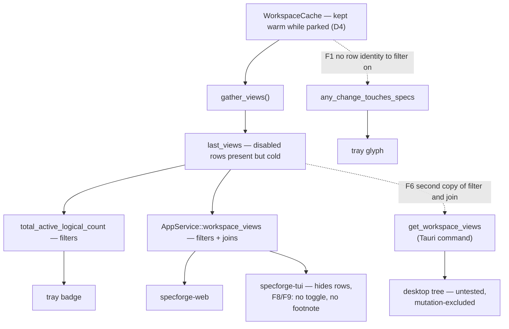

# Harden Temporarily-Disabled Workspaces

## Why

v0.16.1 shipped the disable toggle on a single premise: the aggregated snapshot
is a chokepoint, so one well-placed cut reaches everything. Its proposal said so
in as many words — "because the tree filter lives inside the shared
`get_workspace_views` command rather than in each frontend, the desktop React
tree, `specforge-web`, and `specforge-tui` all inherit it with no
frontend-specific work" — and its Impact section concluded that
"`crates/specforge-tui` and `crates/specforge-web` require no changes".

A review of the shipped code found eleven code defects. They are not scattered:
the premise was wrong in three separate ways, and most of the rest are the
consumer-side gaps a filter creates.

**The chokepoint was not the only consumer.** The tray has two surfaces. The
badge reads the aggregated snapshot and filters
(`WatcherManager::total_active_logical_count`,
`crates/openspec-core/src/watcher.rs`). The *glyph* reads the raw cache
(`WatcherManager::any_change_touches_specs` →
`WorkspaceCache::any_change_touches_specs`, `crates/openspec-core/src/cache.rs`),
which iterates a `HashMap<PathBuf, Vec<ChangeData>>` — no top-level-row identity,
therefore no disabled predicate expressible there at all. Because Decision 4
deliberately keeps the cache warm while a workspace is parked, a parked
repository's spec deltas keep flipping the menu-bar icon while contributing
nothing to the badge beside it (F1).

**The chokepoint was not the only implementation.** `AppService::workspace_views`
(`crates/openspec-app/src/service.rs`) filters disabled rows and joins the
presentation overrides; `get_workspace_views` in `crates/specforge/src/commands.rs`
does both again, inline. `specforge-web` (`dispatch.rs`) and `specforge-tui`
(`app.rs`, `modes.rs`) call the shared accessor — the desktop, the primary
surface, calls its own copy. `.cargo/mutants.toml` excludes
`crates/specforge/**/*.rs` and `commands.rs` has no tests, so that copy is
invisible to both CI gates by construction (F6).

**Inheriting the filter is not inheriting the feature.** `specforge-tui` does
hide a parked row — but `SettingsWorkspace` (`crates/specforge-tui/src/app.rs`)
drops the `disabled` field `AppService::list_workspaces` supplies, no key is
bound to `set_workspace_disabled`, and the terminal Dashboard carries none of the
"includes N disabled workspaces" note that `dashboard`'s *Dashboard Unaffected by
Workspace Disable* requires of "the Dashboard" with no frontend qualifier.
`grep -rn disabled crates/specforge-tui/src` returns exactly one hit: the
`disabled: _` discard in `flatten`. A terminal-only user can neither park a
workspace nor discover that one is parked (F8, F9).

Then a second cluster, where *cold* turned out to cost more than intended.
Decision 1's cold path resolves a repository's main worktree with "the parent of
the common dir". Checked against `git worktree list --porcelain` on real
repositories, git's own rule (`worktree.c: get_main_worktree`) is the real path
of the common dir with a trailing `/.git` component stripped — the parent is
correct only for the `<work>/.git` layout. For a submodule
(`<super>/.git/modules/<name>`), a `--separate-git-dir` store, or a bare
repository, parking the repository renames it: `RepoView::name` is the main
worktree's basename, so a parked submodule reads `modules`. That name is
user-visible precisely because the Dashboard is deliberately unfiltered —
`repo_breakdowns` and `repo_ships` both label with `display_name.unwrap_or(name)`
(F3).

Then the consumer-side gaps the filter created:

- Every ship in today's feed renders as a `<button>`, but `handleOpenShip`
  (`src/App.tsx`) resolves the worktree against the *filtered* `views` and
  returns on a miss. A parked repository's ships render and do nothing —
  contradicting the shipped scenario *Ships from a disabled workspace still
  appear*. The same dead click hits an **enabled** repository whose ship was
  archived inside a feature worktree that hosts no active change, which is this
  repository's own workflow (F2).
- The footnote counts registered folders — it filters the `list_workspaces`
  array on `disabled` and takes its length. The flag is keyed per top-level row,
  so one repository registered at two worktrees reports "includes 2 disabled
  workspaces" while the tree loses one row (F5).
- An address into a parked workspace renders "Address not found — This link
  doesn't match anything currently registered." That is false: `list_workspaces`
  still reports it, and park-is-not-unregister is the feature's central promise
  (F10).
- The Settings switch is rendered per registered folder and written per
  repository key, so flipping one row moves its siblings with no warning. Users
  reach that state by registering `~/proj` and then `~/proj-feature`:
  `WorkspaceRegistry::register` promotes the already-discovered sibling to
  user-registered and saves it *before* `add_workspace` reports the empty result
  as an error (F11).
- A failed toggle goes to `console.warn` in a desktop app with no visible
  console. The switch is prop-driven, so it does not even snap back — the user
  gets no signal at all (F7).

And one durability defect. `AppService::remove_workspace` snapshots the entry
with `std::fs::canonicalize`, while the registry keys entries with the
dunce-backed `openspec_core::canonicalize` — the only such divergence left in
`crates/openspec-app/src` and `crates/specforge/src`. On Windows those spellings
differ (`\\?\C:\…` and `\\?\UNC\wsl.localhost\…` versus `C:\…`), so the lookup
misses, `was_user_registered` is false, and the whole presentation cascade is
skipped — while `unregister`, handed the raw path, canonicalises with dunce and
removes the registry row anyway. The orphaned entry keeps `disabled: true`, so
re-registering the folder silently re-parks it, and Decision 7 removed the
ambient cue that would have explained it. It looks like registration failed
(F4).

## What Changes

Nothing about the design changes. Every decision the predecessor recorded stands:
disabled rows are still aggregated cold (D1), the flag still lives in the
presentation store (D2), the filter still lives in one shared accessor (D3), the
watcher and activity log still run while parked (D4), granularity is still the
top-level row (D5), and the Dashboard is still deliberately unfiltered (D7).
What changes is that the code now matches them.

**The tray becomes one attention surface.** The glyph predicate moves off the
cache and onto `last_views`, and the badge count and the glyph share a single
named row-exclusion helper in `crates/openspec-core/src/watcher.rs`.
`WorkspaceCache::any_change_touches_specs` is deleted rather than left as a
correct-looking unfiltered twin.

**The desktop stops re-implementing the shared accessor.** `get_workspace_views`
delegates to `AppService::workspace_views`, deleting the duplicated filter *and*
the duplicated presentation join, and moving the desktop's behaviour into the
crate `cargo test` and `cargo mutants` can reach.

**A parked repository keeps the identity it had while enabled.** The
no-subprocess fallback is rewritten to reproduce git's own rule as
`git::main_worktree_for_common_dir`, so cold and warm agree by construction for
every layout — and the same helper fixes the identical latent bug in
`default_branch`'s third fallback step, which today runs `git branch
--show-current` against a submodule's *superproject*.

**The terminal gets the whole feature.** `SettingsWorkspace` carries `disabled`,
Space toggles the focused workspace row through `AppService::set_workspace_disabled`,
the row renders a `(disabled)` marker, and the terminal Dashboard gains the same
"includes N disabled workspaces" note the React one has.

**The Dashboard's rows stay actionable and its footnote counts rows.**
`ShipEntry` gains the `repoId` of its owning top-level row, so a ship resolves by
repository identity instead of by worktree path — which fixes the parked case and
the enabled-feature-worktree case together. A ship whose row is parked is marked
and routes to Settings instead of silently swallowing the click. The footnote
counts *top-level rows*, deduplicated by presentation key, on both frontends.

**A parked address says so.** Address resolution gains a fourth outcome,
`disabled`, reconstructing a parked row's slug from the registered listing, and
renders a notice that names the workspace and offers a one-click re-enable.

**A shared switch says what it governs, and a failed one says it failed.** Rows
that share a presentation key with siblings carry a note saying so; a rejected
write renders inline in the row instead of `console.warn`.

**Unregister always cleans up.** `remove_workspace` snapshots the entry through
`openspec_core::canonicalize` and hands that same value to `unregister`, so the
entry it inspects and the entry the registry drops are provably the same one.

## Capabilities

### New Capabilities

_None._ Every requirement below already has an owner; this change corrects
contracts rather than opening new ground.

### Modified Capabilities

- `workspace-registry` — *Cold Aggregation of Disabled Rows* stops prescribing
  the mechanism ("the same fallback the application already applies when git is
  unavailable") and states the outcome instead: a row's identity does not change
  when it is disabled. *Workspace Presentation Persistence* gains a scenario for
  cleanup when the registry lookup is spelled differently from the stored key.
  *Settings View* gains a failed-write requirement and a legible-scope
  requirement for shared repository rows.
- `tray-indicator` — *Spec-Activity Glyph Variant* currently mandates today's
  behaviour verbatim ("any non-archived change in any registered workspace"); a
  disabled workspace *is* registered. It is amended to exclude disabled rows, so
  the glyph and the badge agree about what the tray is for.
- `dashboard` — *Dashboard Unaffected by Workspace Disable* pins the resolution
  source for an actionable Dashboard row (the registered listing, not the
  filtered view), amends *Ships from a disabled workspace still appear* — whose
  "opens the archive browser as it would for an enabled workspace" clause is not
  implementable without reversing the tree filter — and defines the note's figure
  as disabled top-level rows rather than registered folders.
- `terminal-ui` — *Settings Screen* and *Workspace Management from the Terminal*
  both enumerate the terminal's workspace controls and both omit disable; each
  gains it, with scenarios for the toggle and for sibling rows moving together.
- `view-routing` — *Cold-Load Address Resolution* moves from three outcomes to
  four: resolved, ambiguous, disabled, not found. A not-found outcome goes back
  to meaning that the address names nothing the user has registered.

## Impact

**Rust core** — `crates/openspec-core/src/watcher.rs` (the shared attention-row
helper; the glyph predicate reads `last_views`);
`crates/openspec-core/src/cache.rs` (the unfiltered predicate is deleted);
`crates/openspec-core/src/git.rs` (`main_worktree_for_common_dir`, replacing the
private `main_worktree_path` and fixing `default_branch`'s step-3 fallback);
`crates/openspec-core/src/repo_view.rs` (`resolve_main_worktree`'s cold fallback
calls it); `crates/openspec-core/src/dashboard.rs` (`ShipEntry::repo_id`, set in
`repo_ships`). Tests: `tests/glyph_predicate.rs` rewritten around a real
registry, `tests/cold_aggregation.rs` extended with a warm/cold identity
assertion.

**Shell** — `crates/openspec-app/src/service.rs` (the canonicalisation that forms
`remove_workspace`'s entry-lookup key); `crates/specforge/src/commands.rs`
(`get_workspace_views` delegates to the `AppService`);
`crates/openspec-app/tests/workspace_management.rs` (the unregister-clears-the-flag
regression and the first direct assertion that `workspace_views` joins
presentation). `crates/specforge/src/lib.rs` needs no change: the `AppService` is
already managed state, and `list_workspaces` still needs the watcher and
presentation handles.

**Terminal** — `crates/specforge-tui/src/app.rs` (the `disabled` mirror, the
Space binding, the spawned toggle, the disabled-row count),
`crates/specforge-tui/src/ui.rs` (the `(disabled)` marker, the footer and help
hints, the Dashboard note), `crates/specforge-tui/src/render_tests.rs`.

**Frontend** — new `src/workspaceRows.ts` (row-key dedupe, sibling lookup, ship
row state) and `src/components/errors.ts` (the extracted `prettifyError`);
`src/routing/slug.ts` and `src/routing/resolve.ts` (the `disabled` outcome);
new `src/components/DisabledAddressNotice.tsx`; `src/App.tsx`,
`src/components/DashboardView.tsx`, `src/components/SettingsView.tsx`,
`src/App.css`, and `src/types.ts` (the hand-mirrored `ShipEntry.repoId` — the
only new field crossing the IPC boundary). Tests are `bun test` suites over the
pure modules: `workspaceRows`, `errors`, `slug`, and `resolve`; the repo has no
DOM harness, so rendering is verified by `tsc` plus a manual pass.

**Deliberately unchanged.** The Dashboard stays unfiltered: a parked workspace
keeps contributing to summary metrics, the per-repository breakdown, the activity
chart, lifecycle throughput, today's ships, streaks, the heatmap, season score,
and career tier. The watcher, the parsed cache, and the activity log keep running
while a workspace is parked, so no achievement is lost. `workspaces.json` is
untouched — no new field, no schema version, no migration; the flag stays in
`presentation.json`. `disabled` stays `#[serde(skip_serializing)]` on both
`WorkspaceView` variants: no frontend receives a cold row, and none should be
able to mistake a cold row's defaulted `dirty`/`branch` fields for real git
state. Granularity remains the top-level row.

`releases/v0.16.1.md` is **deliberately not modified.** v0.16.1 is tagged and its
GitHub release is published; those notes stand as the record of what shipped, and
rewriting them to describe post-fix behaviour would substitute a second falsehood
for the first. Four further review findings about that file are therefore
knowingly left unaddressed, by the maintainer's decision: the "Park…/Parking"
vocabulary contradicts Decision 6, which chose `disabled` precisely because
"parked" implies the watcher stops; an Improvements bullet describes two
intra-branch bugs in regression tense ("can no longer clobber", "is no longer
pruned") for a feature that had no prior release to regress from; "Flip it back
on and it returns immediately" contradicts *Re-enable Freshness*, which requires
the scoped git sweep to be awaited before the call returns; and "the already-warm
cache plus a single directory read" understates the cold path, whose archive
listing is per worktree and which still performs `newest_mtime`'s recursive walk
per change. The corrected wording for each belongs in the next release's notes,
where it will be true of the build being shipped.
