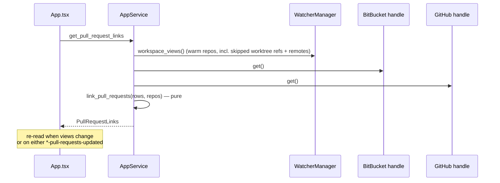
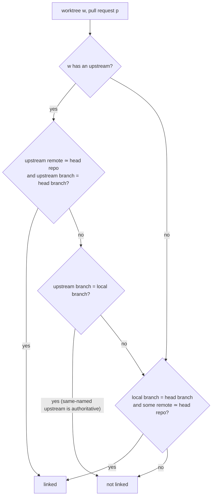
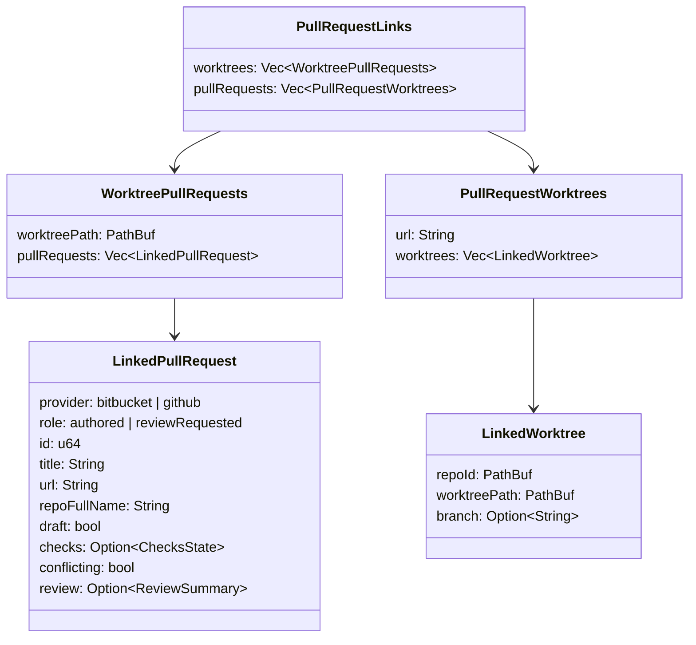
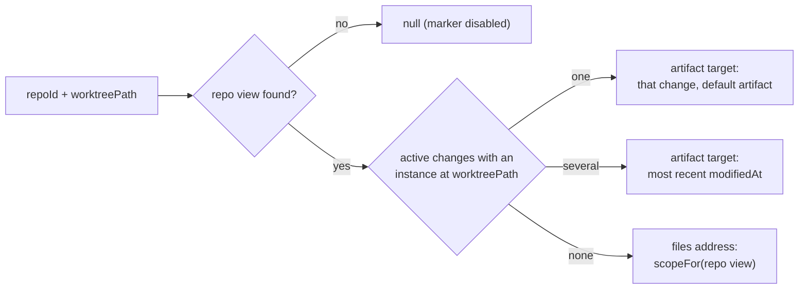

## Context

This change assumes `github-pull-requests-panel` has been applied and archived: the shared `PullRequestSummary` lives in `crates/openspec-app/src/pull_requests.rs`, `github.rs` exists with its constant query, and the BitBucket names carry the provider.

What SpecForge knows today, and where:

- **Worktrees and branches.** `git::worktree_list` discovers worktrees; the per-worktree `git status --porcelain=v2 --branch` behind `worktree_branch_and_status` yields each worktree's branch. `parse_status_porcelain_v2` reads `# branch.head` and explicitly ignores `# branch.upstream`, which the same invocation already prints. Internally `WorktreeSnapshot` holds the branch of **every** tracked worktree, but `build_repo_view` drops it: on the wire a branch reaches the frontend only through a `ChangeInstance`, so a worktree hosting no active change is a bare path in `RepoView.worktrees`. The registry tracks only worktrees with an `openspec/` directory.
- **Remotes.** Nothing reads a remote URL. A private `remotes()` lists remote *names* for commit-log decoration; `RepoMonitor` watches `.git/config` and, on change, re-runs `git::default_branch` and invalidates the identity cache — emitting nothing to the frontend.
- **Git invocations are counted.** `git_command` records every spawn in `invocation_log`; tests pin spawn counts, and disabled ("cold") repositories must spawn none.
- **Joins happen in `openspec-app`.** `workspace_views()` joins presentation onto the watcher's views; `dashboard()` joins four sources. The pull-request pollers keep their snapshots in handles on `AppService`.
- **Navigation.** There is no worktree-level address. A change in a chosen worktree is reached through `goToArtifact(worktreePath, changeId, tab)` → `renderTargetToAddress`; the fallback for a repository is its pooled file browser. An address never contains a host path.
- **Controls.** A pull-request row is one `<button>` (desktop) or `<a>` (browser skin), so nothing interactive can live inside it. The header's change name is a copy control that shares a flex row with the non-focusable branch chip. The instance switcher's options are buttons. A tree row's only nested control is the favorite star, by spec.

## Goals / Non-Goals

**Goals:**

- Link pull requests from both providers to tracked worktrees by a rule that is right for the common cases — pushed with or without tracking, renamed local branches, checked-out forks, SSH aliases — and never links a local branch to a fork's same-named one.
- Show the link both ways: a pull-request chip in the change header and a marker in the instance switcher; a worktree marker on the pull-request row that navigates to the change.
- Add no network request, no credential and no new `CacheEvent` variant; add exactly one git invocation per warm repository, and none for disabled ones.
- Keep the matching logic in `openspec-app` as pure, tested functions under the mutation gate.

**Non-Goals:**

- Tree-row markers; a worktree-level address; tracking worktrees without `openspec/`; reading `~/.ssh/config`; a terminal surface; any change to the pullers' fetches beyond one head-repository field each.

## Decisions

### D1. Join in `openspec-app`, on read, as its own snapshot



`AppService::pull_request_links()` reads the two snapshots and the current views, and calls the pure `pull_request_links::link_pull_requests`. The frontend holds the result in one hook in `App.tsx` and passes it to the detail pane and both panels.

*Rejected — join into `workspace_views()`, like presentation.* It would re-fetch the whole tree on every pull-request refresh, and it still would not give the panels their per-row worktrees, since a worktree without an active change has no place in the view payload.

*Rejected — join in TypeScript.* The frontend lacks the branch of change-less worktrees and every remote, and logic there sits outside the mutation gate.

*Rejected — a background recompute thread with its own `CacheEvent`.* The inputs already announce themselves: views re-read on repository events, snapshots announce their own updates. Re-reading a derived value when its inputs change needs no new variant in five exhaustive matches.

### D2. Remote URLs from one `git remote -v` per repository, cached in the monitor

`git::remote_urls(&RepoId) -> Vec<Remote { name, url }>` runs `git --git-dir <common> remote -v` through `git_command` (so it is WSL-routed and counted) and keeps the `(fetch)` lines. `RepoMonitor` holds `remotes: Arc<RwLock<Vec<Remote>>>` beside `default_branch`, filled when the monitor starts and refreshed in the same branch of its loop that handles the `.git/config` concern; `WatcherManager::remotes(&RepoId)` reads it as `default_branch` is read. When the refreshed list differs, the monitor emits `CacheEvent::Updated { workspace: <main worktree> }`, the event that already means "re-read this repository". A cold repository gets no monitor work and no spawn.

*Rejected — parsing `.git/config` directly.* It misses `include`/`includeIf` and `insteadOf` rewrites, which `git remote -v` applies.

*Rejected — `git remote get-url` per remote.* One spawn per remote instead of one per repository.

*Rejected — reusing the private `remotes()`.* It serves commit-log decoration on its own cadence; coupling the two would change log spawn counts for no gain.

### D3. Upstreams from the status already read; split against remote names in the app

`parse_status_porcelain_v2` returns a `BranchState { head, upstream }` — `upstream` the raw `# branch.upstream` value — instead of the bare head, and `WorktreeSnapshot` carries it. Splitting `origin/mirror/feature` needs the remote names, since a remote name may contain `/`; the pure `split_upstream(raw, remote_names)` in `pull_request_links.rs` takes the longest remote name followed by `/`.

*Rejected — `git for-each-ref --format=%(upstream:remotename)` per repository.* It resolves the split exactly, but costs a spawn the status call makes unnecessary; the longest-prefix rule is exact whenever remote names do not nest ambiguously, which git itself discourages.

### D4. Worktree refs and remote identities ride on `RepoView`, unserialised

`RepoView` gains `#[serde(skip_serializing)] worktree_refs: Vec<WorktreeRef { path, branch, upstream }>` for every tracked worktree, and `#[serde(skip_serializing)] remotes: Vec<RemoteIdentityRef { name, identity: Option<RemoteIdentity> }>`, filled by `build_repo_view` from `WorktreeSnapshot` and `WatcherManager::remotes`. The existing skipped `archived` and `disabled` fields set the precedent: the app layer sees them, the wire does not.

*Rejected — a separate `WatcherManager::worktree_facts()`.* A second walk over the same snapshots, kept in step with view assembly by hand.

*Rejected — serialising them.* No frontend consumer; every `RepoView` literal in two `wire_shape.rs` suites would grow for nothing. (Adding skipped fields still touches the struct literals in tests; they gain `Vec::new()`.)

### D5. Parsing a remote URL to an identity

`git::parse_remote_url(url) -> Option<RemoteIdentity { host, path }>` is pure and lives in `openspec-core` beside the reader:

| Form | Example | Host | Path |
|---|---|---|---|
| scp-like | `git@github.com:Acme/Api.git` | `github.com` | `acme/api` |
| `ssh://` | `ssh://git@github.com:22/acme/api` | `github.com` | `acme/api` |
| `https://` | `https://user@bitbucket.org/acme/api/` | `bitbucket.org` | `acme/api` |
| alias | `git@github-work:acme/api.git` | `github-work` | `acme/api` |
| local | `/srv/git/api.git`, `file://…` | — | — |

Host and path are lower-cased; a trailing `.git` and `/` are dropped; a path that is not exactly two segments has no identity.

### D6. The matching rule, and why the branch-name rule ignores the destination

The rule is the spec's:

$$\text{linked}(w,p) \iff \big(u_w \ne \varnothing \wedge \iota(u_w.\text{remote}) \simeq H_p \wedge u_w.\text{branch} = b_p\big) \vee \big(\beta_w = b_p \wedge (u_w = \varnothing \vee u_w.\text{branch} \ne \beta_w) \wedge \exists r \in R: r \simeq H_p\big)$$



The branch-name rule compares only against the head repository. A contributor's pull request from their fork's `main` into `acme/api` would otherwise link the maintainer's own `main` worktree, which is the most common false positive such a feature can produce. A same-named upstream (`main` tracking `origin/main`) is authoritative for the same reason: it already says where the branch lives.

The host rule treats `github.com`/`ssh.github.com` and `bitbucket.org`/`altssh.bitbucket.org` as known; any other host is taken to be an SSH alias and matches on path alone. The one false positive this admits — the same `owner/name` on both providers reached through an alias — requires a developer to host the same-named repository on both.

`link_pull_requests(rows, repos) -> PullRequestLinks` evaluates every pair — both inputs are small (at most 150 rows; worktrees in the tens) — and orders results as the spec states.

*Rejected — matching on branch name and destination repository.* Simpler, and wrong for forks in exactly the case above.

*Rejected — reading `~/.ssh/config` to resolve aliases.* It reaches outside the repository into the user's SSH setup, and `Include`/`Match` blocks make faithful resolution a project of its own.

### D7. The links snapshot on the wire



Pull requests are keyed by web URL, which is unique across providers; a row without one links nothing. Paths cross IPC as `ChangeInstance.worktreePath` already does; the frontend never puts them in an address.

`get_pull_request_links` is served on both transports: it reads in-memory state and has no host-side effect, unlike `open_pull_request`.

### D8. The header chip, the switcher marker, and the restructured row

- **Header.** `DetailPane` receives the links; `ChangeHeader` renders `PullRequestChip`s as siblings after the branch chip — never inside `CopyableIdentity` — up to two, then a passive `+N`. On the desktop a chip is a `<button>` calling `openPullRequest(url)`; in the browser skin an `<a target="_blank" rel="noopener noreferrer">`. It reuses the panel's checks dot, conflict chip and draft treatment, in neutral ink.
- **Switcher.** `SwitcherOption` (`src/changeNavigation.ts`) gains `pullRequests: number[]`; `instanceOptions` fills it; `SwitcherControl` renders a passive `#n` / `+N` span and folds the numbers into the control's accessible name.
- **Row.** Each `<li>` becomes a two-column grid: the existing row control, unchanged, and — when linked — a sibling `<button className="pull-request-worktree">` showing the branch or basename. The marker's handler is supplied by `App.tsx`.

```svg
<svg viewBox="0 0 300 70" xmlns="http://www.w3.org/2000/svg" font-family="system-ui" font-size="11">
  <rect x="4" y="4" width="226" height="62" rx="4" fill="none" stroke="currentColor"/>
  <text x="12" y="20" opacity="0.7">acme/api</text>
  <text x="12" y="36">Add a rate-limit middleware</text>
  <text x="12" y="54" opacity="0.7">rate-limit → main   ✓1 ✗0 ○0</text>
  <rect x="236" y="22" width="60" height="26" rx="4" fill="none" stroke="currentColor"/>
  <text x="244" y="39">⤷ rate-limit</text>
  <text x="60" y="20" opacity="0.5" font-size="9">row control: opens the PR</text>
  <text x="228" y="62" opacity="0.5" font-size="9">marker: opens the worktree</text>
</svg>
```

*Rejected — a clickable marker inside the row's `<button>`/`<a>`.* Interactive content inside interactive content is invalid HTML and unreachable by keyboard.

*Rejected — making the switcher marker a control.* The option is already a button; a nested control would be invalid, and switching instance is what the option is for.

### D9. Where the marker lands

`src/pullRequestLinks.ts` exports a pure `worktreeDestination(views, repoId, worktreePath)`:



`App.tsx` turns an artifact target into navigation through the existing `goToArtifact` (which adds the instance token) and a files destination through `go`. The function is unit-tested with `bun test`.

*Rejected — a new worktree-level address.* It would need a grammar segment, cold-load resolution and history rules, all to serve a fallback the repository file browser already covers.

## Risks / Trade-offs

- **Spawn-count tests move** → each warm repository gains one `git remote -v` at monitor start; the affected assertions in `repo_monitor.rs` and `dashboard.rs` are updated deliberately with a comment naming this change, and `cold_aggregation.rs` still asserts zero for disabled rows.
- **An SSH alias for one provider shadows the other** → accepted as described in D6; the host rule still separates the providers whenever both hosts are known.
- **Nested remote names split ambiguously** → the longest-prefix rule picks the most specific; git discourages such names and the case is tested.
- **A branch switch links a beat late** → the link follows the status refresh that already announces the branch change, typically within a second.
- **A remote change emits `Updated` for the main worktree** → the event already means "re-read"; the tree and detail pane re-fetch once, which is the point.
- **Several active changes in one worktree** → the marker lands on the most recently modified; the header chip still appears on every change in that worktree, so the others are one click away.
- **Two clones of the same repository** → both link; the marker lands on the first (main worktree first, then path order) and its tooltip names both.
- **Worktrees without `openspec/` are untracked** → a pull request checked out only there does not link; stated as a non-goal because widening registry tracking changes spawn budgets and tree contents.
- **Frontend logic outside the mutation gate** → kept to `worktreeDestination` and rendering; the matching rule, the URL parser and the upstream split are Rust and gated.

## Migration Plan

No persisted state changes. `RepoView`'s wire shape is unchanged; the two new fields are skipped. `PullRequestSummary` gains `sourceRepoFullName`, an additive wire key, and GitHub's constant query gains one field, so its query-constant test is updated in the same commit. Rollback is a revert.

## Open Questions

- Should the tree's change row show a passive pull-request marker too? It is where a worktree's branch chip already sits, but it needs a delta to *Two-Line Sole-Change-Row Layout* and is left for a follow-up once the header chip has been lived with.
