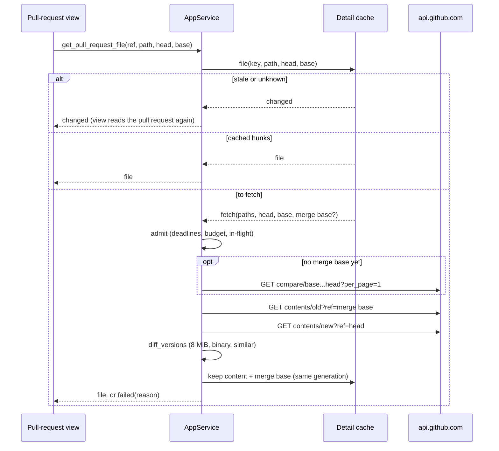

## Context

GitHub's REST files API omits a file's `patch` once its diff passes an undocumented size, and for TSX pages that happens well under 100 KB. `github_detail::read_file` turns such an entry into `DiffContent::TooLarge`, which `diff-view` renders as "Diff too large to preview" with no control. In avantmedialtd/avantmedia, #18 and #14 each have one such file, with about 1,600 and 2,300 changed lines. Both are far below SpecForge's own 8 MiB per-file ceiling (`REQUESTED_FILE_BYTES_LIMIT`).

A withheld file today loads only from the cached detail: `PullRequestDetails::file` answers with no request, and `get_pull_request_file` is synchronous. Loading a patch-less file needs a request, so it must run where requests run, on the blocking pool, under the provider's limits.



## Goals / Non-Goals

**Goals:**
- Show a GitHub file that arrives without a patch, inside SpecForge, at the cost of at most three requests the first time and none after that.
- Keep every existing guard: the snapshot scope, the deadlines, the hourly budget, the in-flight limit, the credential generation and no redirects.
- Give a file that is still too large a way out: a link to its diff on the host.

**Non-Goals:**
- Loading BitBucket's too-large files. They lie past SpecForge's own read ceiling, and only gain the host link.
- Commit detail. Its too-large files are past 8 MiB of local diff text.
- Recomputing GitHub's counts. The files entry's counts stay authoritative.

## Decisions

### D1. Fetch both versions and diff locally

A file read sends `GET contents/{path}?ref=…` with `application/vnd.github.raw` for the old side at the merge base and for the new side at the head, then diffs the two locally.

- *Rejected: the pull request's diff media type* (`application/vnd.github.diff`). It is one request, but it downloads every file's diff to show one, and GitHub refuses it with a 406 on exactly the large pull requests that omit patches (the module doc of `github_detail.rs` already records this).
- *Rejected: the blob API.* The files entry carries only the head blob's `sha`, so the old side would still need a commit and a path. `contents` serves both sides the same way.

### D2. The merge base comes from `compare`, once per detail

GitHub computes a pull request's files against the merge base of its base and head, not against `baseRefOid`, the base branch's tip. Diffing against the tip would show the base branch's own later changes as removals. `GET compare/{base}...{head}?per_page=1` answers `merge_base_commit.sha`. On #18 the reply is 46 KB: `per_page` limits commits, and files are capped at 300 by GitHub. The merge base is kept on the cached detail, so a second file read sends only its two contents GETs. A new read of the pull request replaces the detail and drops the merge base.

- *Rejected: using `baseRefOid`.* It is correct only until the base branch moves, and wrong silently after that.
- *Rejected: adding the merge base to the detail query.* GraphQL's `PullRequest` exposes no merge-base field, and the query's fixed text is part of a spec contract.

### D3. `diff_versions` in `openspec-core`, on `similar`

`openspec_core::diff::diff_versions(old: Option<&[u8]>, new: Option<&[u8]>) -> DiffContent` is pure. It applies the rules in this order:

1. a version past 8 MiB → `TooLarge`;
2. a NUL byte or invalid UTF-8 → `Binary`;
3. otherwise a Myers line diff through `similar` with three lines of context and a deadline, rendered as unified hunks and parsed by the existing `parse_hunks`;
4. a diff text past 8 MiB → `TooLarge`.

The no-newline marker comes from `similar`'s missing-newline hint, and `parse_hunks` already folds it into the flag. Living in core keeps it mutation-gated and testable without I/O.

- *Rejected: shelling out to `git diff --no-index`.* It needs temporary files and a `git` binary, and it routes through WSL on Windows, all for a pure computation.
- *Rejected: a hand-written diff.* `similar` is the de facto Rust diff crate, with a deadline to bound pathological inputs.

### D4. `get_pull_request_file` answers a typed outcome

```text
PullRequestFileOutcome =
  | { kind: "file", file: DiffFile }
  | { kind: "changed" }
  | { kind: "failed", reason: "deferred", untilUnix }
  | { kind: "failed", reason: "unauthenticated" | "unavailable" | "refused" | "transient" }
```

Only `changed` makes the view read the pull request again. A rate limit or a network error must not trigger a read the limits would then also defer. The service never words a reason: the view does, in `pullRequestView.ts`, as it words every other outcome.

- *Rejected: keeping `Result<DiffFile, String>` and recognising failures by their text.* It would be untyped across two transports, and every refusal would read again.

### D5. The host link is built in the frontend, with a synchronous SHA-256

GitHub anchors a file at `#diff-` followed by `sha256(path)` in hex. BitBucket anchors at `#chg-{path}`. `src/sha256.ts` is a small synchronous implementation tested against the FIPS 180-2 vectors, and `pullRequestView.ts`'s `hostFileLink(provider, page, path)` builds the link.

- *Rejected: `crypto.subtle.digest`.* It is asynchronous, and it is undefined outside a secure context, which a served instance reached over a plain-HTTP tailnet address is.
- *Rejected: carrying the link on the model.* `DiffFile` is the shared diff model of every surface (`diff-view`: *The model SHALL carry no layout*), and a provider URL does not belong in it.

### D6. Where a file read's results live

`CachedFile` gains `fetch: Option<FetchPaths>`: the old and new paths a file read asks for, set only for a patch-less file with lines. Once read, the content is stored in `withheld`, as `Hunks`, or as a new `loaded` slot for `TooLarge` and `Binary`. `CachedDetail` gains `merge_base: Option<String>`. Both are written only while the provider's credential generation is the one the file read started under, checked under the cache lock, exactly as `store` checks a detail. No single flight is kept per file: two presentations loading the same file at once may read it twice, which the budget bounds.

## Risks / Trade-offs

- [A large compare reply] → It is read with the body limit of a files page, 10 MB in `ureq`, at most once per detail, and only when a patch-less file is loaded.
- [The local diff's lines may differ from GitHub's] → Myers on the same two versions reproduces git's (`git diff --no-index` on #18's file gives 158 and 1,477, GitHub's counts). The counts shown stay GitHub's either way.
- [A pathological diff takes long] → `similar`'s deadline (2 seconds) falls back to a coarser diff rather than blocking the pool.
- [Budget spend] → A file read costs at most three of the hourly budget's requests, only on an explicit "Load diff", and none once loaded.
- [A file read races a push] → The commits come from the cached detail. A push read since makes the next ask answer `changed`, and a file read that lands after a newer detail is stored only when the detail's commits still match.
