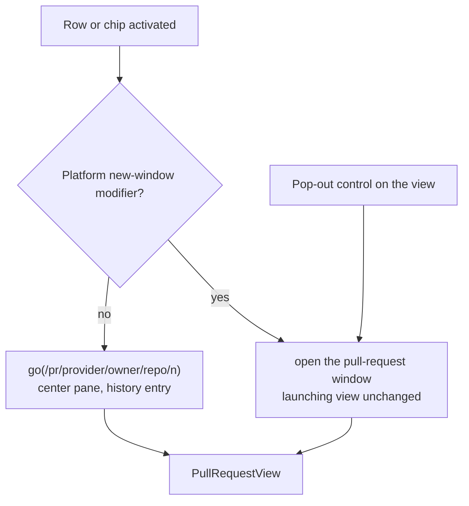
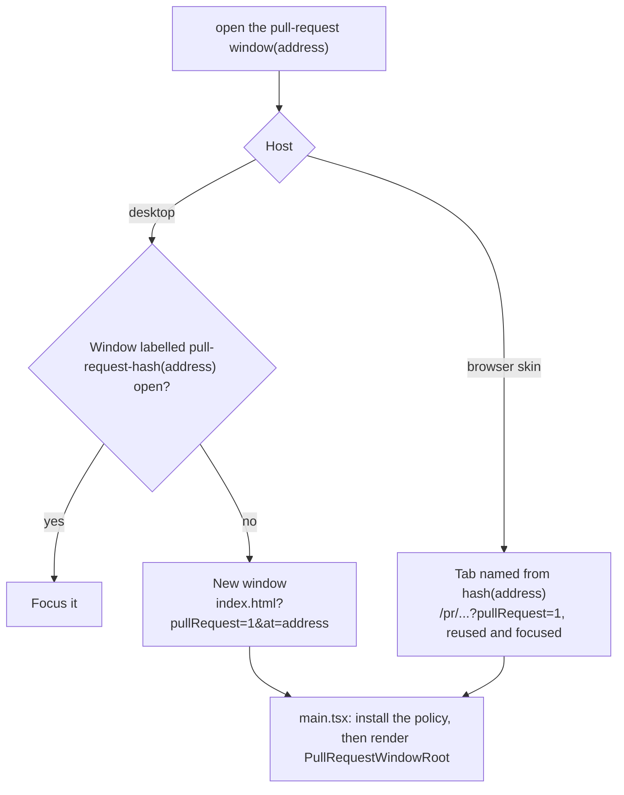
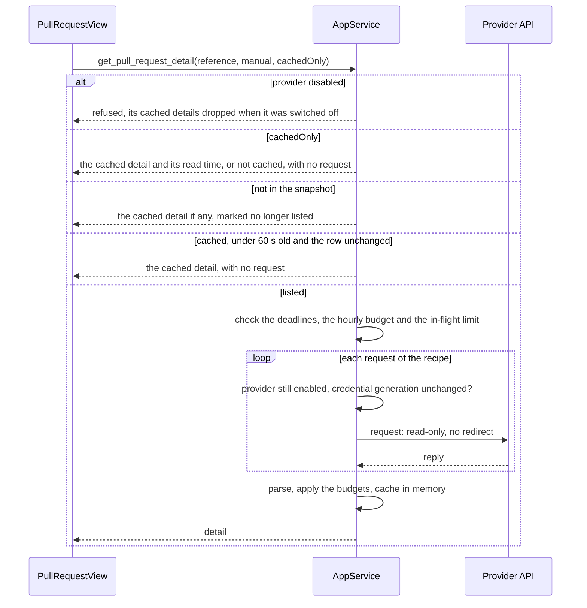
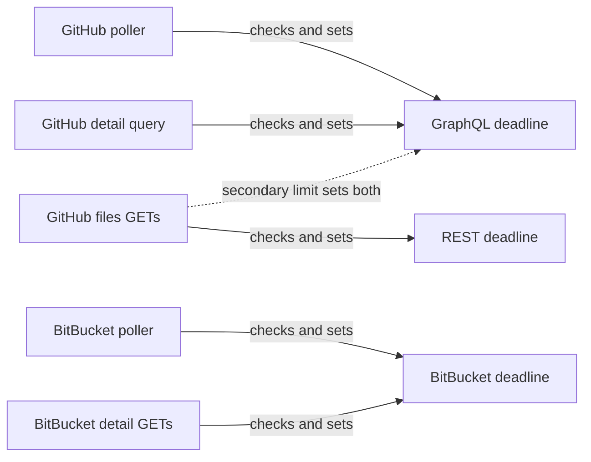
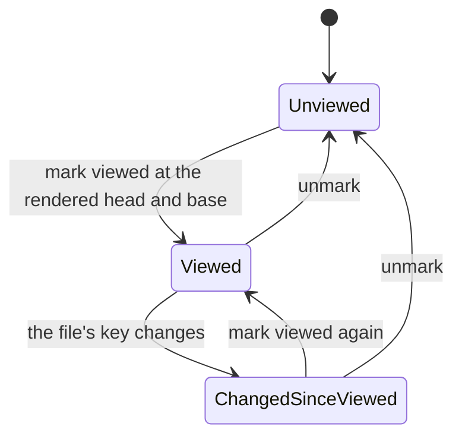

## Context

The pull-request features archived as `2026-09-22-bitbucket-pull-requests-panel`, `2026-09-27-github-pull-requests-panel` and `2026-09-30-link-pull-requests-to-worktrees` built everything up to the point of reading a pull request:
- **Pollers.** Two background pollers in `openspec-app` keep one snapshot per provider. GitHub sends one constant GraphQL query per refresh and lists at most 50 authored and 50 review-requested pull requests. BitBucket sends 2 + W GETs per refresh, W being the workspace count, and lists the account's authored pull requests only. Both clear their backoff when their provider is disabled, and both snapshots read `disabled` from startup until their first poll completes.
- **Credentials.** Tokens are stored write-only in `settings.json`. Environment variables (`GH_TOKEN`/`GITHUB_TOKEN`, `BITBUCKET_USERNAME`/`BITBUCKET_API_TOKEN`) override them, so saving a credential does not always change the token in use.
- **`usage_http`'s posture.** A 15-second timeout and no ambient proxy. POST follows no redirect, but the GET builder the BitBucket poller uses still follows ureq's default redirects. The `Authorization` header is built only inside `Auth`.
- **Opening.** `open_pull_request` is snapshot-scoped and desktop-only.
- **Navigation.** The panels, the worktree links and markers, and the header chips. A desktop row or chip is a button that opens the provider's page. A browser-skin row or chip is a link to that page in a new tab. The worktree marker beside a row already navigates the main window through `go()`.

**How a document opens**, which this change copies:
- **A click.** A plain click on a tree row calls `go(address)`: the center pane shows the document and a history entry is added.
- **The gesture.** A click with the platform's new-window modifier, as `isNewWindowModifier` decides it, opens the document in a reader window. The modifier is Cmd on macOS and Ctrl elsewhere, never Ctrl on macOS, where a Ctrl-click is the secondary click. The gesture changes nothing else.
- **The control.** A rendered document carries a visible "Open in its own window" control, `OpenReaderControl`. It is shown at rest on devices without hover and gets a larger hit area on coarse pointers.
- **The window.** A reader window is identified by its document's encoded address:
  - desktop: `index.html?reader=1&at=<address>`, under a `reader-<hash>` label;
  - browser skin: `<path>?reader=1`, in a tab named from the same hash.

  It is reused and focused when already open, closes on Escape or Cmd/Ctrl-W, shares one remembered size, and installs the same navigation guard as the main window. The reader-window spec limits a reader to one markdown document, and the archived reader design decided that only documents detach.

**The address grammar** has six kinds: home, settings, archive, files, file and artifact. They are encoded under the closed top-level words `settings`, `archive`, `w` and `r`, and any other first segment is unresolvable. Resolution is pure and runs against data already loaded. App shows "Loading…" while the views a cold address needs are still loading, so the home surface never flashes. A disabled workspace is reported by its own notice. Commit detail is an unaddressed overlay.

**Permissions.** App commands carry no per-window restriction today. There is no application permission manifest, so any local window can invoke any registered app command, including `open_artifact_link`, which opens any external URL once given a registered root. The main window and reader windows share one capability file, which grants the dialog, autostart and notification plugins. No window sends a content-security policy.

**What the exploration found.** The placement was explored on 2026-10-04 with parallel investigations, each re-checked adversarially. They covered the reuse surface, SpecForge's posture, artifex, the product's positioning and the review-tool landscape. Further adversarial rounds reviewed the drafts of this design. Together they established:
- **Diffs and git reach.** SpecForge's only diff is one commit against its parent. No fetch, merge-base or range diff exists, and git reads are confined to registered OpenSpec repositories. For most pull requests an in-app viewer therefore depends on the providers' APIs exactly as a standalone one would.
- **GitHub.**
  - GraphQL's `PullRequestChangedFile` carries no patch text.
  - REST `/pulls/{n}/files` does, per file, for up to 3,000 files, and omits it for binary files and for large ones.
  - The one-call diff media type fails above 20,000 lines, 1 MB or 300 files.
  - GraphQL and REST draw on separate primary rate limits.
- **BitBucket Cloud.**
  - It exposes no fetchable pull-request refs (BCLOUD-5814, open since 2012).
  - It allows 1,000 requests an hour per user to `/2.0/repositories/*`, where every detail read goes. Whether the poller's `/2.0/user` and `/2.0/workspaces/…` calls draw on the same budget is undocumented.
  - The pull-request-scoped `/diff` and `/diffstat` endpoints answer with a redirect.
  - Its per-file viewed marks have no public API.
- **Rendering untrusted text.**
  - Mermaid 11 fetches a remote image for a node declared with `@{ img: … }` while laying out, whatever the security level.
  - `MarkdownView` loads markdown images as written.
  - Firefox resolves the host of every link on a plain-http page unless told not to.
- **The web transport.** `specforge-serve` has no authentication:
  - with Tailscale Serve on and no logins listed, the whole tailnet can call `/api/invoke`;
  - under `--bind`, so can any peer and any DNS-rebinding page.

  Its exposure was accepted as "disclosure and reconfiguration, not execution", on top of the operator's declared trust in the network.
- **The public promise.** The site promises "a local, read-only interface", and the GitHub Settings card says SpecForge "never changes anything on GitHub". A read-only viewer keeps both true.
- **The user's inputs.**
  - The user wants to read the diff in place, unified or side by side, act on pull requests and track review progress.
  - Authors are a mix of people and agents, and the audience is SpecForge's public users.
  - The user decided to build the viewer into SpecForge, read-only first, with actions in a later, desktop-only change.
  - A pull request opens the way a document opens: a click in the center pane, Cmd/Ctrl-click or a control in its own window. An earlier draft of this design opened it only in its own window.

artifex's BitBucket client already reads a pull request, its diff, its comments (with inline anchors and resolution) and its build statuses. It reads diffstats for commits and revspecs but not for a pull request. It is the same source the panel's recipe was ported from.

## Goals / Non-Goals

**Goals:**

- Read any listed pull request in place, the way a document is read: in the center pane at an address with Back, Forward and deep links, or in its own window on the reader gesture or control. Both cover the desktop and the browser skin, and show header signals, description, conversation, checks and changed files.
- Review progress that survives restarts and pushes, on both providers, without writing to either.
- No new trust:
  - detail reads only for listed pull requests, and only while the provider is enabled and its credential unchanged;
  - read-only, with no redirect;
  - bounded in rate;
  - the token never in the webview or a log;
  - no remote content loaded from pull-request text in any window;
  - nothing served after a provider is switched off.
- Room for `pull-request-actions`: thread and comment ids and anchors kept in the model, a header slot for actions, and a desktop-only command pattern to copy. Each anchor carries its side: GitHub's `diffSide` and `startDiffSide`, or BitBucket's `inline.from`, `inline.to`, `start_from` and `start_to`.
- Pure, separately tested decisions:
  - the address codec, the snapshot lookup and the gesture decision in bun-tested frontend modules;
  - the detail, budget and progress decisions in `openspec-app`, where the mutation gate reaches them.

**Non-Goals:**

- Any action, including marking a file viewed on GitHub.
- Local git diffs and fetching.
- Anchoring threads inline in the diff. It arrives with actions, which needs anchors to post. The anchor will be a side and a line, so it works in either layout through `diff-view`'s side-qualified line identities. A comment on a context line takes the new side, as GitHub's `RIGHT` does.
- A commits tab, or a diff between two pushes.
- Rendering the OpenSpec files a pull request carries at its head.
- BitBucket pull requests awaiting the user's review. The BitBucket snapshot lists authored ones only.
- GitHub Enterprise or `ghe.com`.
- A terminal viewer.
- A new user-facing setting. The diff layout belongs to `rich-diff-view`, as per-surface view state.
- A content-security policy for the main window.
- Any change to reader windows.
- Per-window restriction of app commands. It is an open question.

## Decisions

### D1. One pull-request view, two presentations, opened the way a document opens



`PullRequestView` renders a pull request: its header, description, conversation, checks and changed files. It renders the same in two presentations:
- **The center pane** of the main window, at the pull request's address (D2). This is the default, like an artifact's.
- **The pull-request window** (D3), opened by the reader gesture or by the view's pop-out control, like a reader window.

The center-pane view carries:
- the shared pop-out control, labelled "Open in its own window";
- the "Open on GitHub" / "Open on BitBucket" control.

Both are visible at rest on devices without hover. In the macOS main window the view's header keeps its controls clear of the titlebar drag strip at every scroll position, as the change header does (`spec-browser`: *Change Identity Header in the Detail Pane*). The pull-request window carries the provider control but no pop-out control: like a reader, it is already detached, and its native titlebar needs no inset. The center pane and the window share one URL path for a pull request, and the presentation rides outside it, so presentation is never part of the address.

This reverses the earlier draft, in which a pull request opened only in its own window and the center pane never showed one. The user's decision to open pull requests the way documents open is the reason. The concern that rejected the center pane, that the pull request would displace the artifact under review, is answered as it is for documents: Cmd/Ctrl-click or the pop-out control keeps the artifact in place.

*Rejected — open pull requests only in their own window.* It makes a pull request behave unlike every other thing SpecForge shows. It gives no Back or Forward and no deep link in the main window, and on a phone it costs a browser tab per pull request.

*Rejected — an unaddressed center-pane overlay, as commit detail is.* It vanishes on the next navigation and cannot be linked, reloaded or reached with Back.

### D2. The pull-request address, and resolving it against the snapshot

The Address union gains `{ kind: "pullRequest", provider, owner, repo, number }`. It is encoded as:
- `/pr/github/<owner>/<repo>/<number>`;
- `/pr/bitbucket/<workspace>/<repo>/<id>`.

`pr` is a new top-level word in the closed vocabulary, and `github` and `bitbucket` are a closed set beneath it, so decoding stays free of data. Owner and repository names are percent-encoded segment by segment, as every identifier is. Both providers' names use only characters `encodeURIComponent` leaves alone, so paths stay readable. The number is a positive decimal integer written without a sign or leading zeros, and no larger than the codec represents exactly. Any other shape is unresolvable, never a partial address.

Like *File Addresses*, the new kind arrives as one added requirement in `view-routing` carrying its grammar, round trip, lookup and history rules. It also needs three modified requirements:
- *Addressable Viewing State*, so an Address can name a pull request;
- *Workspace Identity Is a Registry Slug*, whose slug rule is confined to addresses that name a workspace, while its rule that no Address contains an absolute filesystem path keeps covering every Address;
- *Cold-Load Address Resolution*, for the outcomes below.

**The reference.** The address's provider, owner, repository and number are the pull request's **reference**.
- The read, file and progress commands take it (D5, D9), and `open_pull_request_link` takes it beside the href it opens and never fetches (D10).
- No new command identifies a pull request by a URL. Only the existing, snapshot-checked `open_pull_request` keeps doing so, behind "Open on GitHub".
- No URL from the frontend ever reaches a provider request.

Two references are equal when their providers and numbers are equal and their owners and repositories are equal ignoring ASCII case, as `pull_request_links.rs` already compares repositories.

**Resolution** is a pure lookup in `routing/resolve.ts`. App runs it for the center pane, and `PullRequestWindowRoot` for the pull-request window (D3). Both run it against two inputs, as that root last read them: the provider snapshots and each provider's enabled flag.
- Each root reads the flag from `get_github_config` and `get_bitbucket_config` on mount.
- It keeps the flag current through a `pull-request-provider-changed` notice (provider, enabled), which the service raises whenever a flag is set. The notice travels on the service-owned broadcast D9 adds, so it reaches every window and every tab of one service, including a tab served by the desktop's embedded server. A direct emit from the command would reach only its own transport.

Resolution reaches the first of these outcomes:

| Outcome | When | The center pane shows |
|---|---|---|
| **pending** | The flag or the snapshot has not been read yet, or the provider is enabled and its first poll is running | "Loading…" (the home surface never flashes) |
| **provider off** | The provider's configuration says `enabled: false` | A notice naming the provider, with a way to Settings › Integrations |
| **unavailable** | The provider's list is unauthenticated or unavailable | A notice saying which, pointing to Settings when unauthenticated |
| **listed** | The list, fresh or stale, holds a row with an equal reference and a non-empty URL | The pull request |
| **not listed** | Otherwise | The view asks the service for a cached detail (D5): a cached one shows marked "no longer listed", and none gives a notice that the pull request is not in the provider's list |

A provider's snapshot reads `disabled` until its first poll completes, so "pending" and "provider off" are told apart by the enabled flag, never by the snapshot's status. "Pending" covers only reading and a first poll that is running. A provider re-enabled while it waits out a backoff deadline publishes `unavailable` at once (D8), so its addresses resolve to the unavailable notice, never to an hour of "Loading…". Resolution is never ambiguous.

**Canonical spelling.** A pull-request address whose owner or repository differs from the matched row only in ASCII case is replaced in place with the row's spelling, as an omitted settings group is canonicalised (*History Entry Discipline*). Both launches of the pull-request window, the Cmd/Ctrl-click and the pop-out control, encode the address from the matched row. One pull request therefore has one window, however a link spelled it. A pull request shown from its cached detail after it left its list pops out under the spelling of the row that detail was read through.

A row whose URL is empty, such as a GitHub row whose link is foreign, never resolves. A row that is not openable today stays so (`github-pull-requests`: *GitHub Row Signals*).

**History.** Opening a pull request from a row, a chip or a link adds a history entry, as opening an artifact does. Back and Forward re-resolve the address. Nothing that only changes what the view shows adds an entry: switching files, switching the diff layout, marking files viewed, refreshing. Leaving the pull request from the center pane, through its linked change's name or a pointer to Settings, adds one, as any navigation does. A reload of a pull-request address resolves it cold, by the table above.

*Rejected — name the pull request by its web URL in the address.* A URL is a payload rather than an identifier, the host would ride in the path, and the case of the owner in a URL varies between sources. The reference is what the snapshot and the service compare anyway.

*Rejected — build a URL from the address and fetch it, so any pull request resolves.* Only listed pull requests may spend the host's credential (D5). A row that is not openable today would become openable through a hand-made address.

### D3. The pull-request window: a window kind of its own, on the reader's machinery



`reader.rs` becomes a shared detached-window helper, parameterised by kind:
- label prefix;
- query flag;
- minimum size;
- size source;
- work-area clamp, which readers do not have;
- offset group.

Readers keep their label, URL, size and offset behaviour byte for byte, so `reader.rs`'s tests pass unchanged. The setter floor is not a helper parameter: it stays in each kind's own settings setter, so readers keep 320×240 and the pull-request setter floors at 600×400. The pull-request window is the helper's second kind.

- **Identity.**
  - Desktop: the window is identified by the encoded pull-request address, `index.html?pullRequest=1&at=<address>`, under a `pull-request-<hash>` label. The existing `at` comparison focuses an open window rather than opening a second.
  - Browser skin: the tab is `/pr/...?pullRequest=1`, named `specforge-pull-request:<hash>`.
- **Root.** `main.tsx` selects `PullRequestWindowRoot` from the flag before the app's router runs, as it selects the reader. A root renders only its own address kinds: a reader shown a pull-request address reads "Document not found", and the reverse reads "Pull request not found".
- **Resolution in the window.** `PullRequestWindowRoot` resolves its address with D2's pure lookup, against provider flags and snapshots it reads and keeps current itself, as ReaderRoot reads the workspace views. It shows the same pending, provider-off, unavailable and not-listed outcomes as the center pane.
  - Its notices name Settings › Integrations as text rather than linking there, since the window cannot navigate the main window (D11).
  - When its provider is switched off, it replaces the pull request with the provider-off notice.
- **Navigation.** The window installs the same `on_navigation` guard as the main and reader windows. Only the app's own origin may load (and, in a dev build, the dev server), so a link the webview activates itself never loads a stranger's page in the window.
- **Capability.** `capabilities/pull-request.json` matches `pull-request-*` and grants only `core:event:allow-listen`, `core:event:allow-unlisten` and `core:window:allow-close`. It grants no dialog, autostart, notification, menu or tray permission, and the prefix never appears in `default.json`.
  - Like a reader, the window reads its size from the DOM and saves it through an app command, so it needs no window permission for that.
  - A cold-start check proves the window loads, listens and closes.
- **Window state.** One shared detached-label check excludes `pull-request-` labels from the window-state plugin, as it excludes readers, so no per-pull-request entry accumulates.
- **Size.** Pull-request windows share one remembered size of their own, held in settings and set by the desktop-only `set_pull_request_window_size`.
  - The default is about 1280×860, wide enough for the navigator beside a side-by-side diff (`rich-diff-view` D8).
  - It is clamped to the work area of the launching window's monitor.
  - The minimum is 600×400, and the setter's floor equals it.
  - The size is saved 400 ms after a resize ends, as a reader's is.
  - New windows offset only from other pull-request windows.
- **Title.** A pure, tested `pullRequestTitle` gives `#<number> <title> — <owner>/<repo>`, or `#<number> — <owner>/<repo>` before the title is known.
  - It removes every default-ignorable and control character, and caps the length; Rust re-sanitises the result before setting it.
  - It updates when a detail read brings a new title. On the desktop, the title is set when the window is built. After that, the builder's `on_document_title_changed` hook re-sanitises `document.title` and sets the native title from Rust, so the capability needs no title permission.
  - In the browser skin it is the tab's `document.title`.
- **Closing.** Escape and Cmd/Ctrl-W close the window, as they close a reader, unless a control inside claims Escape first. Closing destroys the window.
- **The main window.** Opening a pull-request window changes nothing in the main window.

*Rejected — open the pull request in a reader window.*
- Eight of the ten reader-window requirements would have to change.
- It would reverse the archived decision that only documents detach.
- It would give up this design's narrower backstop: readers hold `default.json`'s dialog, autostart and notification plugins, which the pull-request window's capability leaves out. The center pane accepts that exposure deliberately; the pop-out is where it can be narrowed.
- Readers and pull requests would have to share one remembered size, though a side-by-side diff needs a wider window than a document.

*Rejected — `core:default` alone.* It does not include closing the window, so Escape and Cmd/Ctrl-W would fail, and it grants every menu and tray command.

### D4. Gestures, the provider's page, and the row elements

- **A click.** A plain click, Enter or Space on a panel row or a header chip calls App's `openPullRequest`, which App hands to both panels and, through `DetailPane`, to the change header's chips. Like `openWorktree`, it first clears the tree's unaddressed state (the empty-change pane and the clicked row), because going to the address already shown changes nothing. Then it calls `go(pullRequestAddress)`, with the address taken from the matched row (D2).
- **The gesture.** A click with `isNewWindowModifier` opens the pull-request window. The call is made synchronously inside the click handler, so no popup blocker intervenes, and it returns before any selection, pane or history change. On macOS a Ctrl-click is the secondary click and opens nothing.
- **Pure and tested.** The decision lives in the pure `pullRequestOpen.ts` with bun tests, with `isNewWindowModifier` pinned on each platform.
- **The address.** It is built only from a row with a non-empty provider URL.
- **Elements.**
  - Desktop rows and chips stay buttons. An in-app link there would let the webview's own "Open Link" item reload the main window at that path. The app protocol answers an unknown path with the app shell, but the desktop's history is in memory and restarts at the home surface, so the shown view and its Back history would be lost.
  - In the browser skin they become links whose href is the SpecForge path `/pr/...`. The click and the Cmd/Ctrl-click are handled, and Space is handled the way the chip's `isActivationSpace` handles it today, since a link activates on Enter only. Middle-click, "Open Link in New Tab" and Copy Link then give a full SpecForge tab, or a shareable deep link, at that address.
  - The rows' provider-URL tooltip goes, since a click no longer opens it.
- **The provider's page.** "Open on GitHub" / "Open on BitBucket" in the view's header:
  - on the desktop it goes through `open_pull_request`, still snapshot-scoped;
  - for a pull request no longer listed, it goes through `open_pull_request_link(reference, url)` with the pull request's own URL from the cached detail (D10);
  - in the browser skin it is an opener-isolated link.

  `open_pull_request` stays absent from the web transport.
- **The worktree marker** keeps navigating the main window to the worktree's change. Its label stops saying "Open in SpecForge", which now describes the row as well.

The MODIFIED requirements keep every existing scenario name. A scenario whose gesture moved is rewritten under its existing name, and new scenarios are added for the click, the modifier click and the macOS secondary click, because `openspec archive` refuses a delta that drops a live scenario.
- "A row opens in the desktop's browser" becomes the header control opening the page in the system browser.
- "A review-requested row opens on the desktop" becomes a click on a To review row showing that pull request in the center pane, with the provider's page one control away in the view's header.
- "A row opens a new tab in the browser skin" becomes the Cmd/Ctrl-click opening the pull request's own tab.
- "The chip opens the pull request" and "The marker and the row do different things" become the center pane showing the pull request.

*Rejected — keep a click opening the provider's page and add a view control beside the row.* The primary gesture would keep leaving the application, which is the problem this change exists to solve.

*Rejected — keep the provider URL as the browser-skin rows' href.* The intercepted Cmd/Ctrl-click would open SpecForge's window while the browser's own middle-click opened the provider's page. The same link would do two different things.

### D5. Detail reads are keyed by reference, scoped to the snapshot, cached, and tied to the credential



The service looks the reference up in the current snapshots by the rule D2 states, and takes the repository, number and URL from the matched row. Nothing the caller supplies reaches a request beyond the reference itself.

A remote browser can therefore spend the host's credential only on pull requests the host's account already lists: on GitHub, those authored or awaiting its review; on BitBucket, those authored.

The last detail of each pull request is cached in memory, keyed by reference, at most 32, dropping the least recently used. The cache serves four uses:
- a reopened view paints immediately;
- a pull request that leaves the snapshot keeps its last detail, marked "no longer listed", while its provider stays enabled;
- withheld files load from it;
- review marks are keyed against it (D9).

**Credential changes.** Disabling a provider, or saving a credential for it, drops that provider's cached details at once and advances its credential generation. A read records the generation it started under. Before each of its requests, it re-checks that generation and the enabled flag, as the BitBucket poller's chain re-checks enabled. A read that finds either changed sends nothing more, and its result is neither cached nor returned. While a provider is disabled, every read refuses without content.

**Freshness.** A view asks for a read in four cases, never on a timer:
- when it opens, in either presentation, after painting whatever a `cachedOnly` call returns;
- when its provider's snapshot announcement shows that row's updated time, checks or, on GitHub, count of unresolved conversations changed, or is the first announcement after the time a deferral named (D8);
- when the service refuses a withheld file it asked for;
- on a manual refresh.

A `cachedOnly` call answers from the cache alone, whatever the detail's age, and never sends a request. The service answers a read from the cache, with no request, while the cached detail is under 60 seconds old and the row is unchanged since it was read. A manual refresh bypasses that unless a manual refresh of the same pull request sent a read in the last 30 seconds. At most one read per pull request is in flight, whichever presentation asks.

**Withheld files.** `get_pull_request_file(reference, path, head, base)` returns a file the budgets withheld (D6, D7), from the cached detail and with no request. Like `set_file_viewed`, it names the head and base commits the view rendered and refuses when either differs from the cached detail's; the view then re-reads. It is mirrored on both transports.

*Rejected — accept a repository, number or URL from the frontend as the request's target.* Any caller of `/api/invoke` could then make the host's token read any repository it can see.

*Rejected — poll detail in the background for every listed pull request.* That is up to a hundred pull requests times several requests per refresh, which BitBucket's 1,000 requests an hour cannot carry.

*Rejected — drop the cache on credential change without a generation check.* A read already in flight under the old credential, up to two dozen requests, would land in the cache after the drop. It would then be served as "no longer listed" after an account switch.

### D6. GitHub: one constant detail query with variables, and REST pages for patches

The shape below is a sketch, to be confirmed against a live account as the poller's query was:

```graphql
query PullRequestDetail($owner: String!, $name: String!, $number: Int!) {
  repository(owner: $owner, name: $name) {
    pullRequest(number: $number) {
      body author { login } createdAt updatedAt isDraft mergeable
      baseRefName headRefName baseRefOid headRefOid
      latestOpinionatedReviews(first: 50) { nodes { state author { login } } }
      reviews(first: 50, states: [APPROVED, CHANGES_REQUESTED, COMMENTED, DISMISSED]) { nodes {
        id author { login } state body submittedAt url isMinimized minimizedReason } }
      reviewRequests(first: 50) { totalCount }
      commits(last: 1) { nodes { commit { statusCheckRollup { contexts(first: 100) { nodes {
        ... on CheckRun { name status conclusion detailsUrl }
        ... on StatusContext { context state targetUrl } } } } } } }
      comments(first: 100) { nodes { id author { login } body createdAt url isMinimized minimizedReason } }
      reviewThreads(first: 100) { nodes { id isResolved isOutdated path line originalLine
        startLine originalStartLine diffSide startDiffSide
        comments(first: 50) { nodes { id author { login } body createdAt url state isMinimized minimizedReason } } } }
      files(first: 100) { totalCount }
    }
  }
}
```

The query text is a compile-time constant, never a mutation or subscription, and is tested as the poller's is. The poller's design rejected variables because nothing in its query varies and a query with no runtime input cannot be steered. Here the values come only from the matched snapshot row (D5), never from the caller, and they travel in GraphQL's `variables`, so the text stays byte-identical and testable.

The `states` filter leaves out the viewer's own pending review, which nobody else can see. `reviewThreads` still returns that review's inline comments to their author, so each thread comment's `state` is read, and every `PENDING` comment is dropped, with any thread it leaves empty, before the detail is cached. Review summaries are ordered by `submittedAt`. Thread and comment ids are read now, so `pull-request-actions` can reply and resolve without changing this constant. Each thread's `diffSide` and `startDiffSide` are read now for the same reason. The view names a thread's side today, which side by side needs, because a bare line number could be in either column, and a later inline anchor needs no new field.

**Patches** come from `GET https://api.github.com/repos/{owner}/{name}/pulls/{number}/files?per_page=50&page=n`, at most twenty pages, which is a thousand files.
- `per_page=50` follows a reported omission of `patch` past the 70th file of a page, to be confirmed against a live account with the query.
- Files beyond the thousandth are counted rather than listed, with a pointer to the provider's page.
- Each entry becomes a `DiffFile`: paths from `filename` and `previous_filename`, counts from its fields, and hunks from `rich-diff-view`'s `parse_hunks`, since the patch has no file header. GitHub gives no modes.
- Statuses map explicitly. GitHub reports a mode-only change as `modified`, with no patch and no counted lines.

  | GitHub status | Model status |
  |---|---|
  | `added` | Added |
  | `removed` | Deleted |
  | `modified` | Modified |
  | `renamed` | Renamed, with no similarity |
  | `copied` | Copied, with no similarity |
  | `changed` | TypeChanged (git's `T`) |
  | `unchanged` | Modified, with no textual change |
- A file without a `patch` that has added or removed lines is `TooLarge`. One with neither gets `Hunks` with no hunks and is shown by its status alone. GitHub does not say which it is: a rename or type change without content changes, a mode-only change, or a binary or empty file. It is never called too large or binary.
- The line and byte budgets are then applied (`rich-diff-view` D2).

**Replies.** Every detail request goes through a `usage_http` GET or POST that follows no redirect, and carries the token only in `Authorization`. Replies share the status half of the GitHub verdict and its delay formula:
- a 401, and a 403 without a rate-limit signal, are unauthenticated;
- a 403 with a signal, and a 429, are rate-limited.

The query's body keeps the poller's GraphQL rules: a `RATE_LIMITED` error is rate-limited, and no data with `INSUFFICIENT_SCOPES` is unauthenticated. Otherwise it reads `data.repository.pullRequest`, where a null reads as unavailable. A files page reads its JSON array. Unlike the poller, a redirect or a 404 on a files GET reads as unavailable for that pull request rather than transient, so a moved or deleted repository is reported instead of retried.

*Rejected — GraphQL alone.* `PullRequestChangedFile` has paths and counts but no patch.

*Rejected — the diff media type (`application/vnd.github.diff`).* It takes one request, but GitHub refuses it with a 406 above 20,000 lines, 1 MB or 300 files, on exactly the large agent pull requests a reviewer most needs help with.

### D7. BitBucket: the artifex reads, following the payload's own links

Each read sends these GETs to `api.bitbucket.org`, none of them following a redirect:
1. `/2.0/repositories/{workspace}/{repo}/pullrequests/{id}`, for the description, author, branches and commits, participants, and the `links.diff` and `links.diffstat` URLs;
2. the diffstat, by `links.diffstat`, for statuses, renames and counts, paginated up to ten pages;
3. the diff, by `links.diff`: raw unified text parsed by `rich-diff-view`'s `parse_diff`.
   - It is read up to 8 MiB.
   - Files past the ceiling are `TooLarge` and keep their diffstat counts.
   - The line and byte budgets are then applied.
4. `/comments?pagelen=100`, paginated up to ten pages, for:
   - general comments;
   - inline comments, each with its path and its old-side line `inline.from` or new-side line `inline.to` (plus `start_from` and `start_to` for a range);
   - replies, resolution and the deleted flag;
5. `/statuses`, for build statuses.

A payload link is followed only when it parses as an `https` URL with exactly the host `api.bitbucket.org`, no user information, no explicit port, and a path under `/2.0/`. Each read is five requests plus pagination, against 1,000 an hour for `/2.0/repositories/*`. The shared deadline (D8) assumes the poller draws on the same budget.

**Replies.**
- A 401, or a 403 on any detail GET (the token lacks a scope the read needs), is unauthenticated and points to Settings.
- A 429 sets the shared deadline by the poller's rule: `Retry-After`, else 300 seconds, never more than an hour.
- Unlike the poller, a redirect or a 404 reads as unavailable for that pull request.
- A transport error or any other status is transient.

*Rejected — the pull-request-scoped `/diff` endpoint.* It answers with a redirect to the repository-level diff, and detail reads follow no redirect. The payload's `links.diff` names that destination directly.

*Rejected — derive the file list from the diff text alone.* The diffstat is what gives a file past the ceiling its counts and status.

### D8. Shared backoff deadlines, and an hourly budget per provider



A rate-limited reply sets a deadline by its provider's existing delay rule, capped at an hour. For GitHub that rule is the *GitHub Failure Classification* formula.
- **GitHub keeps two deadlines.** GraphQL's is set by the poller's and the detail query's rate limits. REST's is set by a files GET's rate limit that reports no secondary limit, whether or not it names `x-ratelimit-resource: core`. A secondary limit sets both.
- **BitBucket** keeps one deadline, shared by its poller and its detail reads.

Each provider also has an hourly detail-request budget. Deadlines and the budget belong to the provider. Both survive disabling and re-enabling it and saving a credential, and neither event resets them. Re-enabling a provider while its deadline holds publishes and announces an `unavailable` snapshot at once, as a rate-limited refresh with no previous rows does, and its first refresh then waits out the deadline. The panel and any pull-request address therefore say the provider is unavailable rather than loading.

While a deadline or the budget holds, a view says when a read becomes possible and sends nothing. The first announcement after that time, whether or not it changes the view's row, or the first manual refresh after it, reads. A poller announces only when its snapshot has news, so waiting for the view's own row to change could leave a deferred view, perhaps with nothing cached, waiting indefinitely. Any later announcement ends the wait, and the stated time tells the reader when a manual refresh will read. No timer fires a read at that time.

$$\text{send}(r) \iff \text{enabled}(p) \;\wedge\; \text{now} \ge \max_{d \in D(r)} \text{deadline}(d) \;\wedge\; \text{inflight}(p) < 2 \;\wedge\; \text{spent}_{\text{hour}}(p) < \text{budget}(p)$$

Here $$D(r)$$ is the set of deadlines a detail read $$r$$ checks: both GitHub deadlines for a GitHub read, and BitBucket's for a BitBucket read. The rule governs detail reads only. The pollers check their own provider's deadline (GraphQL's on GitHub) and never the detail budget or the in-flight count. A spent budget sets no shared deadline, so it never stalls the panels. BitBucket's budget $$B$$ is a documented constant with $$B + (2 \times 23 - 1) + 60\,(2 + W) \le 1000$$. A BitBucket read sends at most 23 requests, so two reads admitted just under $$B$$ can send $$2 \times 23 - 1$$ past it, and the poller sends $$2 + W$$ a refresh at its 60-second floor. The total stays within BitBucket's 1,000 an hour.

*Rejected — independent backoffs per caller.* The viewer would keep spending a quota the poller is waiting out, and the reverse, which is how a secondary rate limit escalates.

*Rejected — one GitHub deadline.* A REST quota exhausted by other tools on the same token would freeze the GitHub panel, whose GraphQL quota is untouched.

*Rejected — reset the budget with the provider's state, as the pollers reset their backoff today.* Both resetting events are mirrored on the web transport, so any `/api/invoke` caller could then spend without bound.

### D9. Review progress: local, and keyed to what was actually shown



**Storage.** Progress lives in `review-progress.json` in the shared configuration directory, owned by `openspec-app` as `activity.json` is. It is keyed by the canonical reference: the provider, the owner and repository in lowercase, and the number. Each entry holds `{ lastMarkedHead, files: { path: key }, touchedAt }`, and the file is written atomically.

**Marking.** `set_file_viewed(reference, path, viewed, head, base)` names the head and base commits the view rendered: GitHub's `headRefOid` and `baseRefOid`, or BitBucket's source and destination commits. The service refuses in three cases:
- the reference has no cached detail;
- the path is not among its files;
- either commit differs from the cached detail's. A retarget changes patches without a push, just as a push does.

An unmark never creates an entry.

**Keys.** The service computes each file's key itself; the caller never supplies one.
- A file with patch text, including one the budgets withheld (its patch sits in the cached detail), is keyed by the SHA-256 of its patch bytes, hex-encoded. It is never keyed by `DefaultHasher` or a short hash: the author controls the patch, and keys persist across runs and toolchains.
- A file without patch text (`Binary`, `TooLarge`, or a GitHub entry with no `patch`) is keyed by GitHub's blob `sha`, with its status, previous filename and the base branch's name, when GitHub gives one.
- A file without patch text and without such a `sha`, which includes every one on BitBucket, is keyed by the head commit and the base branch's name. Any push or retarget then flags it changed since viewed, and the view says why.

**States.**
- A file is **viewed** when its stored key equals its current one.
- It is **changed since viewed** when the two differ.
- It is **unviewed** when nothing is stored.

The header shows "n of m files viewed" and how many are changed since viewed, a count taken from the keys alone. `lastMarkedHead` advances only when a file is marked, and it only dates that count ("since you last marked, at `abc1234`").

**Reading progress.** `get_review_progress(reference)` answers for one pull request, never the whole store, and only while that pull request's provider is enabled. It returns the states of the cached detail's files. While the provider is disabled, it refuses without content, as `get_pull_request_detail` does.

**Pruning.** Entries untouched for 90 days whose own provider is enabled and no longer lists their pull request are pruned. A disabled provider's entries are kept, since its empty list proves nothing. That happens only after each enabled provider has completed a successful, non-stale refresh in this run, never at load, when no snapshot exists yet.

**Notifying other views.** A `review-progress-changed` notice, carrying the reference, is raised by the service on a service-owned broadcast, as the document notices are. A new forwarder in the desktop shell, spawned beside the document forwarder, carries it to every window, and a new arm in the web transport's event stream carries it to every tab. It is never a direct emit from a command. Every view of one pull request in one service therefore stays in step: the center pane, a pull-request window, and a tab served by the desktop's embedded server. A standalone `specforge-serve` beside the desktop app remains the documented two-writer case, as for `activity.json`. Re-reading the file before each write narrows lost marks but does not close the race, and neither process sees the other's marks until it re-reads.

**Transports.** Both commands are mirrored on the web transport, as favorites are, because they are local state of the person using the app, not a write to either host.

*Rejected — GitHub's server-side viewed state.* Setting it is a mutation, which is an action this change excludes. BitBucket has no API for it, and two sources of truth would disagree.

*Rejected — `localStorage`.* It is per surface, so the desktop window and a browser tab would disagree, and progress is the user's data rather than view state.

*Rejected — keying every mark by the head commit.* Every push would clear every mark, which is the opposite of "what changed since I looked". The head commit is only the fallback for files with nothing finer to key on.

*Rejected — a `CacheEvent` variant for the notice.* It would reach every exhaustive consumer of the cache stream: the desktop notifications, the tray, the Dock badge and the terminal, which would re-read every workspace view on each mark.

### D10. Pull-request content is untrusted, in every window that shows it

Descriptions and comments render through `MarkdownView` in a pull-request mode, in both presentations. That mode is the guard:

- **Raw HTML** stays unrendered. HTML comments, the boilerplate of pull-request templates, are removed after parsing: a remark plugin drops `html` nodes whose whole value is a comment. The source text is never edited, so removing a comment cannot create a fence, a link or an image, and a comment inside code stays visible.
- **Mermaid fences** render as their source, as plain unhighlighted text the way `MarkdownView` already treats `mermaid` code. A diagram is not drawn, because mermaid's image shape fetches its URL while laying out, whatever the security level, and its labels and styles can carry further loads.
- **Maths** renders as in artifacts, and KaTeX keeps `trust: false`.
- **svg fences** keep their inert image rendering.
- **Remote images** are not loaded.
  - A standalone image renders as a labelled link showing its alt text and host.
  - An image inside a link renders as its alt text and host only, as part of the enclosing link, with no link or handler of its own, so one activation opens one destination.
  - There is no image proxy like GitHub's, and a remote image is a tracking pixel that would tell any author or commenter when and from where the pull request was read. Private attachments need the provider's session anyway.
- **Hidden characters.** Titles and branch names in the view's header use `diff-view`'s escapes, with the exemptions it gives text outside changed lines. The pull-request window's title has every default-ignorable character removed.
- **Minimised comments and reviews** render collapsed behind GitHub's stated reason.
- **Links.**
  - In the browser skin, a link opens in a new opener-isolated tab (`web-ui`: *Link Handling in the Browser Skin*).
  - On the desktop, the pull-request mode's links call only `open_pull_request_link(reference, href)`. It is desktop-only, absent from the web dispatch, and pinned as unknown there by a test. It hands the platform opener only an href that parses as an absolute `http` or `https` URL with a host, and only while the reference has a cached detail. Every other scheme (`file`, `javascript`, `data`, custom application schemes) is refused.
  - A relative link shows its target without navigating.

Tests pin the mode's guarantees: it emits no `` for a remote source, draws no diagram, removes comments only as whole `html` nodes, and routes every desktop link through `open_pull_request_link`.

Two `spec-browser` requirements were written for everything the shared renderer shows in the detail pane: *Mermaid Diagram Rendering* (draw every `mermaid` fence) and *Link Handling in Rendered Artifacts* (`mailto`/`tel` links open, and the artifact opener is the only one). Pull-request content now renders in that same pane, so both are confined to workspace markdown: change artifacts, archived artifacts and file-browser previews. Pull-request content follows this decision instead, and `open_pull_request_link` becomes the one other open operation reachable from rendered content.

**Per window.**
- **The main window.**
  - It now renders this content in its center pane. It keeps its broad capability (the dialog, autostart and notification plugins) and has no content-security policy governing what it loads.
  - Its guard is the pull-request mode, its existing navigation guard, and a DNS-prefetch `<meta>` that `main.tsx` installs in every root.
- **The pull-request window** adds two backstops.
  - **A content-security policy.** `PullRequestWindowRoot.tsx` exports an installer that `main.tsx` calls only in its pull-request-window branch, before `createRoot().render`. The installer appends to `document.head` a content-security-policy `<meta>`: `img-src 'self' data: blob:; font-src 'self' data:; media-src 'none'; object-src 'none'`.
    - Engines honour a policy meta only inside `head`, and only for fetches that start after it. So the installer never runs at module scope, because `main.tsx` imports every root statically, and never in an effect, which runs only after children mount.
    - A test pins that the policy is in `head` in that branch and absent from the main and reader branches.
    - The bundle's own fonts and icons are local, so the policy breaks nothing there.
  - **Its narrow capability (D3).**
- **The served shell** also sends `X-DNS-Prefetch-Control: off` (D13).

`open_pull_request_link` does not compare the href with the content, because no such check could hold while every window can call every app command (see Open Questions).

*Rejected — a content-security policy for the main window's whole document, or at the host (Tauri's `app.security.csp` plus a served-shell header).* Either would also refuse remote images and mermaid image nodes in the user's own artifacts, a change to how SpecForge renders documents. The pull-request mode already loads nothing remote, which the tests pin.

*Rejected — admit only the link destinations a CommonMark and GFM parse extracts from the cached content.* The check would bind only honest code. Script in a window, the case it exists for, could call `open_artifact_link` with any registered root and open any URL. It would also put a parser of strangers' text, the `markdown` crate, into the service process. That crate's own documentation warns that small crafted inputs can crash it. Under the release profile's `panic = "abort"`, a panic or a stack overflow on deeply nested input takes the whole application or served instance down. The check becomes worth adding with an application permission manifest that takes `open_artifact_link` away from windows showing pull requests.

*Rejected — draw mermaid with a stricter configuration.* Its image shape fetches remote images at every security level, so only not drawing the diagram stops the load in the main window, which has no policy behind it.

*Rejected — `rehype-raw` behind a sanitiser allowlist.* Rendering third-party HTML is a security decision of its own. It is deferred until a concrete need.

*Rejected — reuse `open_artifact_link`.* It needs a registered workspace root, and pull-request content has none. Once a root is authorised, it opens any `http(s)`, `mailto` or `tel` href.

### D11. The linked change

When the pull request is linked to worktrees (`pull-request-worktree-links`), the view's header names the change the panel's worktree marker would land on: the worktree's one active change, else its most recently modified. A worktree with no change shows its branch only.
- **In the center pane,** activating the change's name navigates the main window to it, exactly as the worktree marker does, through `go()`. Back returns to the pull request.
- **In the pull-request window,** the name is passive text. The window cannot navigate the main window, and launching reader windows from it would add a reader launch point that the `reader-window` spec does not define.

*Rejected — reader-window launches from the pull-request window.* The reader-window spec defines where a reader opens from, and adding a third place would change it for a convenience the center-pane view already provides.

*Rejected — a cross-window channel that navigates the main window from the pull-request window.* It is new machinery on both hosts, and it would disturb whatever the user has open there.

### D12. Nothing for the terminal

The terminal frontend renders no pull-request list for either provider (`bitbucket-pull-requests`: *The Terminal Frontend Does Not Render the Panel*; `github-pull-requests`: *The Terminal Frontend Does Not Render the GitHub Panel*), and it gains no viewer. Review progress is not a setting, and the window size is a desktop-only setting, so the terminal's Settings screen gains no row. The terminal has no address bar, so the new address kind does not reach it.

*Rejected — a terminal viewer.* The terminal has no pull-request list to open one from. A list comes first, in its own change.

### D13. Exposure beyond the machine is stated where it is chosen

After this change a served instance can disclose the listed pull requests' files and conversations, read with this machine's credentials, to everyone it is reachable by. That includes repositories never cloned here. The disclosure is stated in three places:
- **the network-bind announcement**: `web-ui`, *Local Self-Served Web Server*, implemented in `specforge-web`'s `main.rs`;
- **the release notes**: `release-pipeline`, *Network Bind Exposure Documented For Downloaders*;
- **the Tailscale Serve setting's description** (`web-ui`: *Tailscale Serve Access*), which also suggests a login allow-list. This matters because Tailscale Serve exposes the server to the tailnet while it stays bound to loopback, so no bind announcement ever prints.

The served shell also carries `Content-Security-Policy: frame-ancestors 'none'`, `X-Frame-Options: DENY` and `X-DNS-Prefetch-Control: off` (`web-ui`: *Localhost Trust Boundary*). An unrelated page therefore cannot host SpecForge in a frame, and Firefox does not resolve the hosts of the links a pull request contains. A page that opens `/pr/...` addresses in new tabs can only make reads the cache freshness rule and the hourly budget allow (D5, D8).

*Rejected — leave the disclosure to the existing "unauthenticated" wording.* It names the workspace-reading API, and a reader of it would not guess that private repositories' pull requests are now served too.

## Risks / Trade-offs

- [The main window now renders strangers' content, with broad permissions and no content-security policy] → The pull-request mode loads nothing remote and executes nothing, which tests pin. The main window keeps its navigation guard, and DNS prefetching is off in every root. The pull-request window adds a policy and a narrow capability for anyone who reads untrusted pull requests there.
- [A served instance reachable beyond this machine discloses the listed pull requests' content] → Reads are read-only and scoped to listed pull requests. The bind announcement, the release notes and the Tailscale Serve setting say so, and the default bind stays loopback.
- [Every window can call every app command, so a link check cannot contain script] → Containment rests on no content executing. A per-window command allowlist is an open question.
- [The desktop link opener opens any `http(s)` URL while a pull request is cached] → It is no wider than `open_artifact_link` is for any window today, and it refuses every other scheme.
- [Everyone who reaches the browser skin shares one reviewer's progress and can change it] → This is the trust already extended to settings and favorites ("reconfiguration"). Marks are refused for anything not in the cached detail, and progress is answered only while its provider is enabled.
- [A click on a pull request no longer opens the provider's page] → The page is one control away in the view's header, and the release notes say so. In the browser skin, middle-click and Copy Link now give SpecForge's own address, which is shareable.
- [A pull-request address loaded cold before the provider's first list] → It shows "Loading…" and never the home surface. A provider that is off is told apart by its configuration, not by its snapshot.
- [A reload of a pull request that has since merged] → It shows the cached detail marked "no longer listed" while the service still holds one, and otherwise a notice. No request goes out for a pull request that is not listed.
- [BitBucket's detail endpoints may need a scope beyond the three the Settings copy names] → Verify with a live token before writing the copy. Until then a 403 on a detail read reads as unauthenticated and points to Settings, as a 403 on the account resources does today.
- [Very large pull requests] → GitHub is capped at twenty pages of 50 files. BitBucket is capped at 8 MiB of diff and ten pages of diffstat and comments. `rich-diff-view`'s line and byte budgets bound the page in either layout, and withheld files load from the cache.
- [Raw HTML, diagrams and remote images are not shown] → Some templates, diagrams and screenshots read as text, source and links. The trade is deliberate, and a sanitised subset can follow.
- [New network code meets the mutation gate] → Transports are injected, and the send functions are excluded with written reasons, as the pollers' are.

## Migration Plan

There is nothing to migrate: `review-progress.json` is created on the first mark, and older versions ignore it. An address under `/pr/` is unresolvable in older versions and shows their "Address not found". The change ships after `rich-diff-view`, and the release notes describe the new click behaviour and the disclosure.

## Open Questions

- Which BitBucket token scopes do the diffstat, diff and statuses reads need beyond account, workspace membership and pull requests? Repository read is likely. Confirm against a live token, as the panel's recipe was confirmed.
- Does GitHub still omit `patch` past the 70th file of a 100-file page? Confirm `per_page` against a live account alongside the query sketch.
- Should SpecForge declare an application permission manifest, so each window's capability lists only the commands it calls? Every window's capability would then have to list its commands, `main`'s and the readers' included. With it, windows showing pull requests could lose `open_artifact_link`, and a check of links against the content would become worth adding.
- Should a panel mark the row of the pull request shown in the center pane as current, as the tree marks the addressed change? That would modify both panel requirements.
- While a pull request is shown, the commit rail shows its placeholder, as it does for the Dashboard, because a pull-request address selects no tree node (`commit-graph`: *Commit-Graph Rail Pane*). Should it instead re-scope to the pull request's linked repository? That would modify the rail requirement.
- Should a pull request that is not listed and has nothing cached offer its provider's page, built from its address on the provider's fixed host?
- Should GitHub's own viewed state seed local progress the first time a pull request is opened? Reading it needs no write.
- Spec-aware review is the gap the landscape research found no tool fills: rendering the `openspec/changes/<id>/` files a pull request carries, read at its head, ahead of the code. Should it come before or after `pull-request-actions`?
- Computing the diff locally when both commits are already present (with no fetch) would spare BitBucket's budget for the user's own pull requests. Is it worth a later change?
