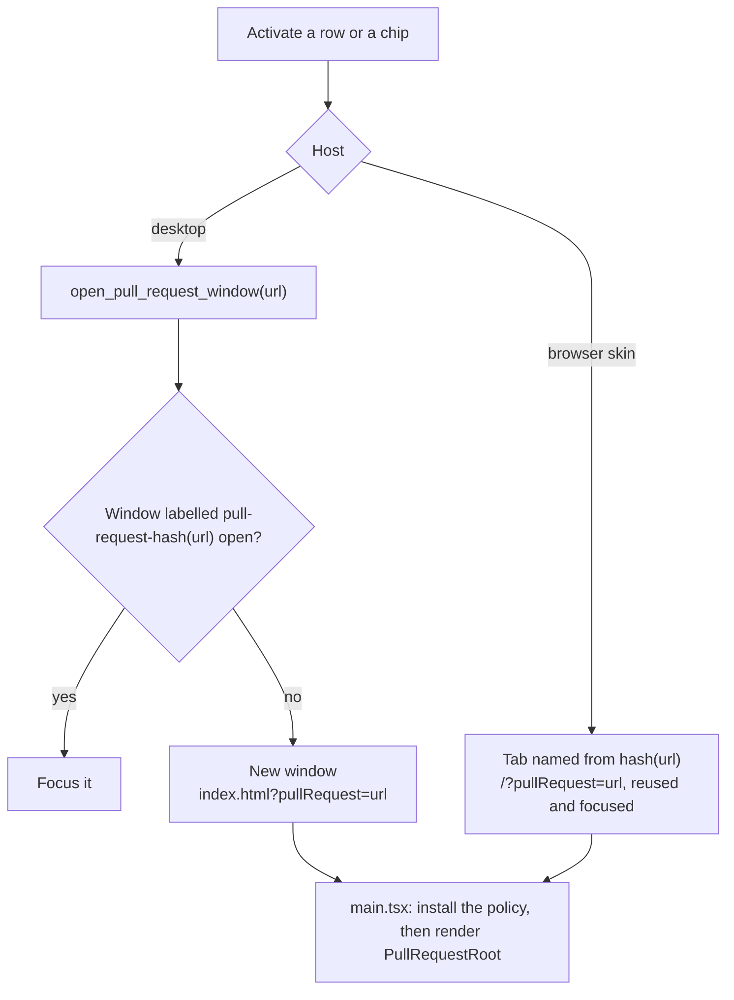
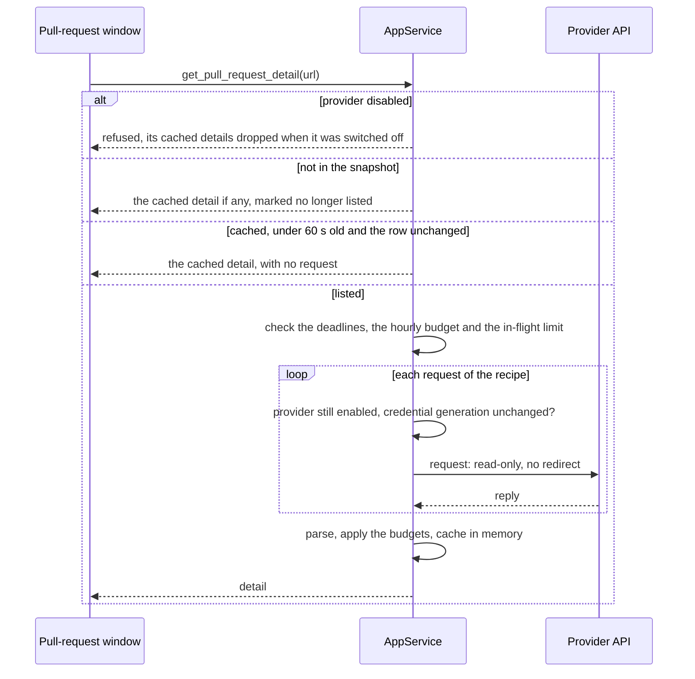
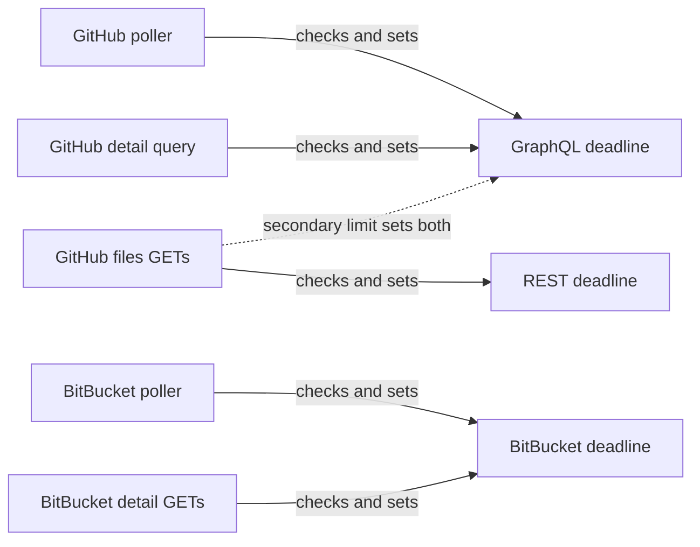
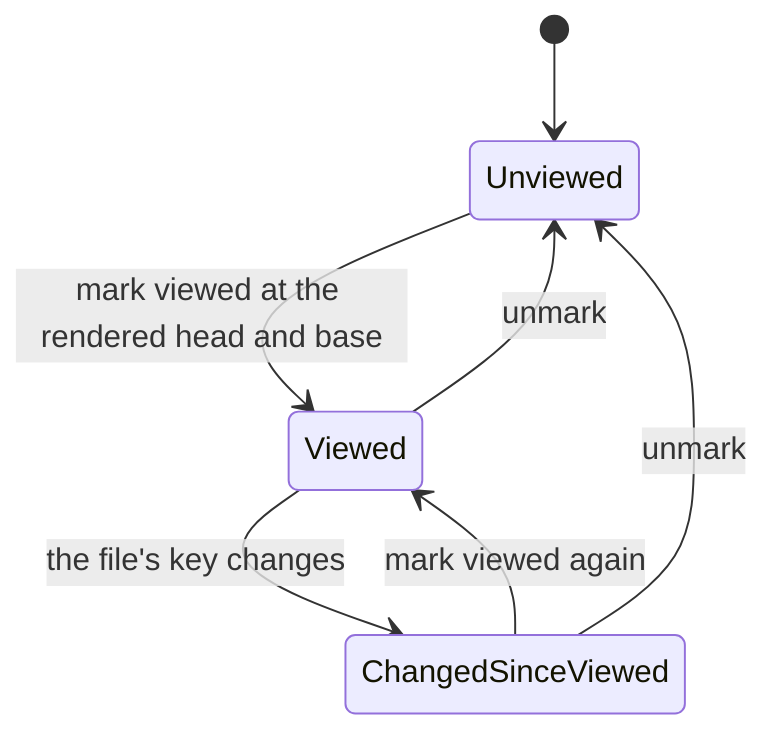

## Context

The pull-request features archived as `2026-09-22-bitbucket-pull-requests-panel`, `2026-09-27-github-pull-requests-panel` and `2026-09-30-link-pull-requests-to-worktrees` built everything up to the point of reading a pull request:
- **Pollers.** Two background pollers in `openspec-app` keep one snapshot per provider. GitHub sends one constant GraphQL query per refresh and lists at most 50 authored and 50 review-requested pull requests. BitBucket sends 2 + W GETs per refresh, W being the workspace count, and lists the account's authored pull requests only. Both clear their backoff when their provider is disabled.
- **Credentials.** Tokens are stored write-only in `settings.json`. Environment variables (`GH_TOKEN`/`GITHUB_TOKEN`, `BITBUCKET_USERNAME`/`BITBUCKET_API_TOKEN`) override them, so saving a credential does not always change the token in use.
- **`usage_http`'s posture.** A 15-second timeout and no ambient proxy. POST follows no redirect, but the GET builder the BitBucket poller uses still follows ureq's default redirects. The `Authorization` header is built only inside `Auth`.
- **Opening.** `open_pull_request` is snapshot-scoped and desktop-only.
- **Navigation.** The panels, the worktree links and markers, and the header chips. Every row and chip opens the provider's page.

Reader windows (archived as `2026-08-29-spec-reader-windows`) supply the window pattern this change reuses:
- one bundle with a `?reader=1` root, selected in `main.tsx`;
- a hashed `reader-*` window label, matched by the desktop capability and excluded from the window-state plugin;
- the same `on_navigation` guard as the main window;
- a browser-skin tab per document that is reused and focused;
- an address codec left untouched.

App commands carry no per-window restriction today. There is no application permission manifest, so any local window can invoke any registered app command, including `open_artifact_link`, which opens any external URL once given a registered root.

The placement was explored on 2026-10-04. Parallel investigations covered the reuse surface, SpecForge's posture, artifex, the product's positioning and the review-tool landscape, each re-checked adversarially, and two further adversarial rounds reviewed the drafts of this design. Together they established:

- **Diffs and git reach.** SpecForge's only diff is one commit against its parent. No fetch, merge-base or range diff exists, and git reads are confined to registered OpenSpec repositories. For most pull requests an in-app viewer therefore depends on the providers' APIs exactly as a standalone one would.
- **GitHub.**
  - GraphQL's `PullRequestChangedFile` carries no patch text.
  - REST `/pulls/{n}/files` does, per file, for up to 3,000 files, and omits it for binary files and for large ones.
  - The one-call diff media type fails above 20,000 lines, 1 MB or 300 files.
  - GraphQL and REST draw on separate primary rate limits.
- **BitBucket Cloud.**
  - It exposes no fetchable pull-request refs (BCLOUD-5814, open since 2012).
  - It allows 1,000 requests an hour per user to `/2.0/repositories/*`, where every detail read goes. Whether the poller's `/2.0/user` and `/2.0/workspaces/…` calls draw on the same budget is undocumented.
  - The pull-request-scoped `/diff` and `/diffstat` endpoints answer with a redirect.
  - Its per-file viewed marks have no public API.
- **Rendering untrusted text.**
  - Mermaid 11 fetches a remote image for a node declared with `@{ img: … }` while laying out, whatever the security level.
  - `MarkdownView` loads markdown images as written.
  - Neither host sends a content-security policy.
  - Firefox resolves the host of every link on a plain-http page unless told not to.
- **The web transport.** `specforge-serve` has no authentication:
  - with Tailscale Serve on and no logins listed, the whole tailnet can call `/api/invoke`;
  - under `--bind`, so can any peer and any DNS-rebinding page.

  Its exposure was accepted as "disclosure and reconfiguration, not execution", on top of the operator's declared trust in the network.
- **The public promise.** The site promises "a local, read-only interface", and the GitHub Settings card says SpecForge "never changes anything on GitHub". A read-only viewer keeps both true.
- **The user's inputs.** The user wants to read the diff in place, unified or side by side, act on pull requests and track review progress. Authors are a mix of people and agents, and the audience is SpecForge's public users. The user decided to build the viewer into SpecForge, read-only first and in its own window, with actions in a later change that is desktop-only.

artifex's BitBucket client already reads a pull request, its diff, its comments (with inline anchors and resolution) and its build statuses. It reads diffstats for commits and revspecs but not for a pull request. It is the same source the panel's recipe was ported from.

## Goals / Non-Goals

**Goals:**

- Read any listed pull request in place, on the desktop and in the browser skin: header signals, description, conversation, checks and changed files.
- Review progress that survives restarts and pushes, on both providers, without writing to either.
- No new trust:
  - detail reads only for listed pull requests, and only while the provider is enabled and its credential unchanged;
  - read-only, with no redirect;
  - bounded in rate;
  - the token never in the webview or a log;
  - no remote content loaded from pull-request text;
  - nothing served after a provider is switched off.
- Room for `pull-request-actions`: thread and comment ids and anchors kept in the model, a header slot for actions, and a desktop-only command pattern to copy. Each anchor carries its side: GitHub's `diffSide` and `startDiffSide`, or BitBucket's `inline.from`, `inline.to`, `start_from` and `start_to`.
- Pure, separately tested decisions, so the mutation gate on `openspec-app` has assertions to catch.

**Non-Goals:**

- Any action, including marking a file viewed on GitHub.
- Local git diffs and fetching.
- Anchoring threads inline in the diff. It arrives with actions, which needs anchors to post. The anchor will be a side and a line, so it works in either layout through `diff-view`'s side-qualified line identities. A comment on a context line takes the new side, as GitHub's `RIGHT` does.
- A commits tab, or a diff between two pushes.
- Rendering the OpenSpec files a pull request carries at its head.
- BitBucket pull requests awaiting the user's review. The BitBucket snapshot lists authored ones only.
- GitHub Enterprise or `ghe.com`.
- A terminal viewer.
- A new user-facing setting. The diff layout belongs to `rich-diff-view`, as per-surface view state.
- Per-window restriction of app commands. It is an open question.

## Decisions

### D1. A third window root, identified outside the address codec



The window is identified by the pull request's web URL, the key the snapshot and `open_pull_request` already use.

**On the desktop**, `pull_request_window.rs`, modelled on `reader.rs`, opens the bundle with `?pullRequest=<url>`.
- **Label.** The window gets a `pull-request-` label hashed from the URL, so a second activation focuses the open window.
- **Capability.** The label prefix has its own capability file, granting `core:default` alone: no dialog, autostart or notification plugin.
- **Window state.** The window-state plugin's filter excludes the prefix, as it excludes readers, so no per-pull-request entry accumulates.
- **Navigation.** The window installs the same `on_navigation` guard as the main and reader windows. Only the app's own origin may load (and, in a dev build, the dev server), so a link the webview activates itself, such as the native Open Link item or a dropped link, never loads a stranger's page in the window.
- **Title.** `#<number> <title> — <repository>`, with every default-ignorable character removed.
- **Size.** Every pull-request window shares one remembered size, held in settings and set by the desktop-only `set_pull_request_window_size`. The default is wide enough for the navigator beside a side-by-side diff (`rich-diff-view` D8), clamped to the screen's work area. It is wider than a reader's.
- **Closing** the window destroys it.

**In the browser skin**, activation opens `/?pullRequest=<url>` in a tab named from the same hash, which the browser reuses and focuses.

`main.tsx` selects the pull-request branch from the query before the app's router runs, exactly as it selects the reader. So the codec, the Address union and every `view-routing` requirement stay untouched. The shell fallback (`web-ui`: *Deep-Link Durability of the Served Bundle*) already serves the URL on reload.

*Rejected — a new Address kind rendered in the center pane.*
- A pull request's identity is a network identity, not a registry slug (`view-routing`: *Workspace Identity Is a Registry Slug*).
- Resolving it would wait on an asynchronous snapshot (*Cold-Load Address Resolution*).
- In the center pane the pull request would displace the artifact it is being reviewed against, which is the reason it gets a window.

*Rejected — an unaddressed center-pane overlay, as commit detail is.* It vanishes on the next navigation and cannot be a browser tab.

*Rejected — widening reader windows.* A reader presents exactly one markdown document by design (`reader-window`: *Reader Window Surface*).

### D2. Rows and chips open the window; the provider's page stays one gesture away

Activating a panel row or a header chip opens the pull-request window. The provider's page still opens three ways:
- from the window header's "Open on GitHub" / "Open on BitBucket" control. On the desktop it goes through `open_pull_request_link(url, url)` (D8), which keeps working once the pull request is no longer listed; in the browser skin it is an opener-isolated link;
- from a Cmd-activation of the row on macOS, Ctrl elsewhere. This follows the browser's convention that a Cmd/Ctrl-click opens a link's own page. It is not the reader gesture, whose meaning (a detached SpecForge window) is what a plain activation of the row now does.
- in the browser skin, from the browser's own new-tab gestures, because the row stays an anchor to the provider's page while a plain activation opens the viewer.

The worktree marker keeps navigating the main window to the change.

The MODIFIED requirements keep every existing scenario name. A scenario whose gesture moved is rewritten under its existing name, and new scenarios are added for the window, because `openspec archive` refuses a delta that drops a live scenario.

*Rejected — keep the row opening the web page and add a sibling "view" control.* The primary gesture would keep leaving the application, which is the problem this change exists to solve, and the row already carries a sibling worktree marker.

### D3. Detail reads are keyed by URL, scoped to the snapshot, cached, and tied to the credential



The service resolves the URL against the current snapshots exactly as `open_pull_request` does, and takes the provider, repository and number from the matched row. Nothing the caller supplies reaches a request.

A remote browser can therefore spend the host's credential only on pull requests the host's account already lists: on GitHub, those authored or awaiting its review; on BitBucket, those authored.

The last detail of each pull request is cached in memory, at most 32, dropping the least recently used. The cache serves four uses:
- a reopened window paints immediately;
- a pull request that leaves the snapshot keeps its last detail, marked "no longer listed", while its provider stays enabled;
- withheld files load from it;
- review marks are keyed against it (D7).

**Credential changes.** Disabling a provider, or saving a credential for it, drops that provider's cached details at once and advances its credential generation. A read records the generation it started under. Before each of its requests, it re-checks that generation and the enabled flag, as the BitBucket poller's chain re-checks enabled. A read that finds either changed sends nothing more, and its result is neither cached nor returned. While a provider is disabled, every read refuses without content.

**Freshness.** A window asks for a read in three cases, never on a timer:
- when it opens;
- when its provider's snapshot announcement shows that row's updated time, checks or thread count changed;
- on a manual refresh.

The service answers from the cache, with no request, while the cached detail is under 60 seconds old and the row is unchanged since it was read. A manual refresh may bypass that at most once every 30 seconds per pull request. At most one read per pull request is in flight.

**Withheld files.** `get_pull_request_file(url, path, head, base)` returns a file the budgets withheld (D4, D5), from the cached detail and with no request. Like `set_file_viewed`, it names the head and base commits the window rendered and refuses when either differs from the cached detail's; the window then re-reads. It is mirrored on both transports.

*Rejected — accept the repository and number from the frontend.* Any caller of `/api/invoke` could then make the host's token read any repository it can see.

*Rejected — poll detail in the background for every listed pull request.* That is up to a hundred pull requests times several requests per refresh, which BitBucket's 1,000 requests an hour cannot carry.

*Rejected — drop the cache on credential change without a generation check.* A read already in flight under the old credential, up to two dozen requests, would land in the cache after the drop. It would then be served as "no longer listed" after an account switch.

### D4. GitHub: one constant detail query with variables, and REST pages for patches

The shape below is a sketch, to be confirmed against a live account as the poller's query was:

```graphql
query PullRequestDetail($owner: String!, $name: String!, $number: Int!) {
  repository(owner: $owner, name: $name) {
    pullRequest(number: $number) {
      body author { login } createdAt updatedAt isDraft mergeable
      baseRefName headRefName baseRefOid headRefOid
      latestOpinionatedReviews(first: 50) { nodes { state author { login } } }
      reviews(first: 50, states: [APPROVED, CHANGES_REQUESTED, COMMENTED, DISMISSED]) { nodes {
        id author { login } state body submittedAt url isMinimized minimizedReason } }
      reviewRequests(first: 50) { totalCount }
      commits(last: 1) { nodes { commit { statusCheckRollup { contexts(first: 100) { nodes {
        ... on CheckRun { name status conclusion detailsUrl }
        ... on StatusContext { context state targetUrl } } } } } } }
      comments(first: 100) { nodes { id author { login } body createdAt url isMinimized minimizedReason } }
      reviewThreads(first: 100) { nodes { id isResolved isOutdated path line originalLine
        startLine originalStartLine diffSide startDiffSide
        comments(first: 50) { nodes { id author { login } body createdAt url isMinimized minimizedReason } } } }
      files(first: 100) { totalCount }
    }
  }
}
```

The query text is a compile-time constant, never a mutation or subscription, and is tested as the poller's is. The poller's design rejected variables because nothing in its query varies and a query with no runtime input cannot be steered. Here the values come only from the matched snapshot row (D3), never from the caller, and they travel in GraphQL's `variables`, so the text stays byte-identical and testable.

The `states` filter leaves out the viewer's own pending review, which nobody else can see. Review summaries are ordered by `submittedAt`. Thread and comment ids are read now, so `pull-request-actions` can reply and resolve without changing this constant. Each thread's `diffSide` and `startDiffSide` are read now for the same reason. The window names a thread's side today, which side by side needs, because a bare line number could be in either column, and a later inline anchor needs no new field.

**Patches** come from `GET https://api.github.com/repos/{owner}/{name}/pulls/{number}/files?per_page=50&page=n`, at most twenty pages, which is a thousand files.
- `per_page=50` follows a reported omission of `patch` past the 70th file of a page, to be confirmed against a live account with the query.
- Files beyond the thousandth are counted rather than listed, with a pointer to the provider's page.
- Each entry becomes a `DiffFile`: paths from `filename` and `previous_filename`, counts from its fields, and hunks from `rich-diff-view`'s `parse_hunks`, since the patch has no file header. GitHub gives no modes.
- Statuses map explicitly. GitHub reports a mode-only change as `modified`, with no patch and no counted lines.

  | GitHub status | Model status |
  |---|---|
  | `added` | Added |
  | `removed` | Deleted |
  | `modified` | Modified |
  | `renamed` | Renamed, with no similarity |
  | `copied` | Copied, with no similarity |
  | `changed` | TypeChanged (git's `T`) |
  | `unchanged` | Modified, with no textual change |
- A file without a `patch` that has added or removed lines is `TooLarge`. One with neither gets `Hunks` with no hunks and is shown by its status alone. GitHub does not say which it is: a rename or type change without content changes, a mode-only change, or a binary or empty file. It is never called too large or binary.
- The line and byte budgets are then applied (`rich-diff-view` D2).

**Replies.** Every detail request goes through a `usage_http` GET or POST that follows no redirect, and carries the token only in `Authorization`. Replies share the status half of the GitHub verdict and its delay formula:
- a 401, and a 403 without a rate-limit signal, are unauthenticated;
- a 403 with a signal, and a 429, are rate-limited.

The query's body keeps the poller's GraphQL rules: a `RATE_LIMITED` error is rate-limited, and no data with `INSUFFICIENT_SCOPES` is unauthenticated. Otherwise it reads `data.repository.pullRequest`, where a null reads as unavailable. A files page reads its JSON array. Unlike the poller, a redirect or a 404 on a files GET reads as unavailable for that pull request rather than transient, so a moved or deleted repository is reported instead of retried.

*Rejected — GraphQL alone.* `PullRequestChangedFile` has paths and counts but no patch.

*Rejected — the diff media type (`application/vnd.github.diff`).* It takes one request, but GitHub refuses it with a 406 above 20,000 lines, 1 MB or 300 files, on exactly the large agent pull requests a reviewer most needs help with.

### D5. BitBucket: the artifex reads, following the payload's own links

Each read sends these GETs to `api.bitbucket.org`, none of them following a redirect:
1. `/2.0/repositories/{workspace}/{repo}/pullrequests/{id}`, for the description, author, branches and commits, participants, and the `links.diff` and `links.diffstat` URLs;
2. the diffstat, by `links.diffstat`, for statuses, renames and counts, paginated up to ten pages;
3. the diff, by `links.diff`: raw unified text parsed by `rich-diff-view`'s `parse_diff`.
   - It is read up to 8 MiB.
   - Files past the ceiling are `TooLarge` and keep their diffstat counts.
   - The line and byte budgets are then applied.
4. `/comments?pagelen=100`, paginated up to ten pages, for:
   - general comments;
   - inline comments, each with its path and its old-side line `inline.from` or new-side line `inline.to` (plus `start_from` and `start_to` for a range);
   - replies, resolution and the deleted flag;
5. `/statuses`, for build statuses.

A payload link is followed only when it parses as an `https` URL with exactly the host `api.bitbucket.org`, no user information, no explicit port, and a path under `/2.0/`. Each read is five requests plus pagination, against 1,000 an hour for `/2.0/repositories/*`. The shared deadline (D6) assumes the poller draws on the same budget.

**Replies.**
- A 401, or a 403 on any detail GET (the token lacks a scope the read needs), is unauthenticated and points to Settings.
- A 429 sets the shared deadline by the poller's rule: `Retry-After`, else 300 seconds, never more than an hour.
- Unlike the poller, a redirect or a 404 reads as unavailable for that pull request.
- A transport error or any other status is transient.

*Rejected — the pull-request-scoped `/diff` endpoint.* It answers with a redirect to the repository-level diff, and detail reads follow no redirect. The payload's `links.diff` names that destination directly.

*Rejected — derive the file list from the diff text alone.* The diffstat is what gives a file past the ceiling its counts and status.

### D6. Shared backoff deadlines, and an hourly budget per provider



A rate-limited reply sets a deadline by its provider's existing delay rule, capped at an hour. For GitHub that rule is the *GitHub Failure Classification* formula.
- **GitHub keeps two deadlines.** GraphQL's is set by the poller's and the detail query's rate limits. REST's is set by a files GET's primary limit (`x-ratelimit-resource: core`). A secondary limit sets both.
- **BitBucket** keeps one deadline, shared by its poller and its detail reads.

Each provider also has an hourly detail-request budget. Deadlines and the budget belong to the provider. Both survive disabling and re-enabling it and saving a credential, and neither event resets them.

While a deadline or the budget holds, a window says when a refresh becomes possible and sends nothing. The next announcement or manual refresh after that time reads.

$$\text{send}(r) \iff \text{enabled}(p) \;\wedge\; \text{now} \ge \max_{d \in D(r)} \text{deadline}(d) \;\wedge\; \text{inflight}(p) < 2 \;\wedge\; \text{spent}_{\text{hour}}(p) < \text{budget}(p)$$

Here $$D(r)$$ is the set of deadlines a detail read $$r$$ checks: both GitHub deadlines for a GitHub read, and BitBucket's for a BitBucket read. The rule governs detail reads only. The pollers check their own provider's deadline (GraphQL's on GitHub) and never the detail budget or the in-flight count. A spent budget sets no shared deadline, so it never stalls the panels. BitBucket's budget leaves room for the poller's 2 + W per refresh.

*Rejected — independent backoffs per caller.* The viewer would keep spending a quota the poller is waiting out, and the reverse, which is how a secondary rate limit escalates.

*Rejected — one GitHub deadline.* A REST quota exhausted by other tools on the same token would freeze the GitHub panel, whose GraphQL quota is untouched.

*Rejected — reset the budget with the provider's state, as the pollers reset their backoff today.* Both resetting events are mirrored on the web transport, so any `/api/invoke` caller could then spend without bound.

### D7. Review progress: local, and keyed to what was actually shown



**Storage.** Progress lives in `review-progress.json` in the shared configuration directory, owned by `openspec-app` as `activity.json` is. It is keyed by the pull request's URL, holds `{ lastMarkedHead, files: { path: key }, touchedAt }`, and is written atomically.

**Marking.** `set_file_viewed(url, path, viewed, head, base)` names the head and base commits the window rendered: GitHub's `headRefOid` and `baseRefOid`, or BitBucket's source and destination commits. The service refuses in three cases:
- the URL has no cached detail;
- the path is not among its files;
- either commit differs from the cached detail's. A retarget changes patches without a push, just as a push does.

An unmark never creates an entry.

**Keys.** The service computes each file's key itself; the caller never supplies one.
- A file with patch text, including one the budgets withheld (its patch sits in the cached detail), is keyed by the SHA-256 of its patch bytes, hex-encoded. It is never keyed by `DefaultHasher` or a short hash: the author controls the patch, and keys persist across runs and toolchains.
- A file without patch text (`Binary`, `TooLarge`, or a GitHub entry with no `patch`) is keyed by GitHub's blob `sha`, with its status, previous filename and the base branch's name, when GitHub gives one.
- A file without patch text and without such a `sha`, which includes every one on BitBucket, is keyed by the head commit and the base branch's name. Any push or retarget then flags it changed since viewed, and the window says why.

**States.**
- A file is **viewed** when its stored key equals its current one.
- It is **changed since viewed** when the two differ.
- It is **unviewed** when nothing is stored.

The header shows "n of m files viewed" and how many are changed since viewed, a count taken from the keys alone. `lastMarkedHead` advances only when a file is marked, and it only dates that count ("since you last marked, at `abc1234`").

**Reading progress.** `get_review_progress(url)` answers for one pull request, never the whole store, and only while that pull request's provider is enabled. It returns the states of the cached detail's files. While the provider is disabled, it refuses without content, as `get_pull_request_detail` does.

**Pruning.** Entries untouched for 90 days whose pull request is in neither snapshot are pruned. That happens only after each enabled provider has completed a successful, non-stale refresh in this run, never at load, when no snapshot exists yet.

**Notifying other windows.** A `review-progress-changed` notice, carrying the URL, is raised by the service on a service-owned broadcast, as the document notices are. A new forwarder in the desktop shell, spawned beside the document forwarder, carries it to every window, and a new arm in the web transport's event stream carries it to every tab. It is never a direct emit from a command, so every window and tab of one service stays in step, including a tab served by the desktop's embedded server. A standalone `specforge-serve` beside the desktop app remains the documented two-writer case, as for `activity.json`. Re-reading the file before each write narrows lost marks but does not close the race, and neither process sees the other's marks until it re-reads.

**Transports.** Both commands are mirrored on the web transport, as favorites are, because they are local state of the person using the app, not a write to either host.

*Rejected — GitHub's server-side viewed state.* Setting it is a mutation, which is an action this change excludes. BitBucket has no API for it, and two sources of truth would disagree.

*Rejected — `localStorage`.* It is per surface, so the desktop window and a browser tab would disagree, and progress is the user's data rather than view state.

*Rejected — keying every mark by the head commit.* Every push would clear every mark, which is the opposite of "what changed since I looked". The head commit is only the fallback for files with nothing finer to key on.

*Rejected — a `CacheEvent` variant for the notice.* It would reach every exhaustive consumer of the cache stream: the desktop notifications, the tray, the Dock badge and the terminal, which would re-read every workspace view on each mark.

### D8. Pull-request content is untrusted

Descriptions and comments render through `MarkdownView` in a pull-request mode.

- **Raw HTML** stays unrendered. HTML comments, the boilerplate of pull-request templates, are removed after parsing: a remark plugin drops `html` nodes whose whole value is a comment. The source text is never edited, so removing a comment cannot create a fence, a link or an image, and a comment inside code stays visible.
- **Mermaid fences** render as their source, as plain unhighlighted text the way `MarkdownView` already treats `mermaid` code. A diagram is not drawn, because mermaid's image shape fetches its URL while laying out, whatever the security level, and its labels and styles can carry further loads.
- **Maths** renders as in artifacts, and KaTeX keeps `trust: false`.
- **svg fences** keep their inert image rendering.
- **Remote images** are not loaded.
  - A standalone image renders as a labelled link showing its alt text and host.
  - An image inside a link renders as its alt text and host only, as part of the enclosing link, with no link or handler of its own, so one activation opens one destination.
  - There is no image proxy like GitHub's, and a remote image is a tracking pixel that would tell any author or commenter when and from where the pull request was read. Private attachments need the provider's session anyway.
- **Policy installation.** `PullRequestRoot.tsx` exports an installer that `main.tsx` calls only in its pull-request branch, before `createRoot().render`. The installer appends two `<meta>` elements to `document.head`:
  - a content-security policy: `img-src 'self' data: blob:; font-src 'self' data:; media-src 'none'; object-src 'none'`;
  - `x-dns-prefetch-control: off`.

  Engines honour a policy meta only inside `head`, and only for fetches that start after it. So the installer never runs at module scope, because `main.tsx` imports every root statically, and never in an effect, which runs only after children mount. A test pins that the elements are in `head` in the pull-request branch and absent from the main and reader branches. The bundle's own fonts and icons are local, so the policy breaks nothing.
- **Hidden characters.** Titles and branch names in the window header use `diff-view`'s escapes for every default-ignorable character, and the window title has them removed.
- **Minimised comments and reviews** render collapsed behind GitHub's stated reason.
- **Links.**
  - In the browser skin, a link opens in a new opener-isolated tab (`web-ui`: *Link Handling in the Browser Skin*).
  - On the desktop, the pull-request mode's links call only `open_pull_request_link(url, href)`. It is desktop-only, absent from the web dispatch, and pinned as unknown there by a test. It hands the platform opener only an href that parses as an absolute `http` or `https` URL with a host, and only while `url` names a pull request with a cached detail. Every other scheme (`file`, `javascript`, `data`, custom application schemes) is refused.
  - A relative link shows its target without navigating.

The containment for this window is that it executes no content: no raw HTML, no drawn diagrams, KaTeX without `trust`, inert svg fences, and the navigation guard (D1). `open_pull_request_link` does not compare the href with the content, because no such check could hold while every window can call every app command (see Open Questions).

*Rejected — admit only the link destinations a CommonMark and GFM parse extracts from the cached content.* The check would bind only honest code. Script in the window, the case it exists for, could call `open_artifact_link` with any registered root and open any URL. It would also put a parser of strangers' text, the `markdown` crate, into the service process. That crate's own documentation warns that small crafted inputs can crash it. Under the release profile's `panic = "abort"`, a panic or a stack overflow on deeply nested input takes the whole application or served instance down. The check becomes worth adding with an application permission manifest that takes `open_artifact_link` away from this window.

*Rejected — draw mermaid with a stricter configuration.* Its image shape fetches remote images at every security level, so only not drawing the diagram, or the policy backstop, stops the load. The backstop alone would still leave a stranger's diagram depending on mermaid's sanitiser for every other kind of injected markup.

*Rejected — `rehype-raw` behind a sanitiser allowlist.* Rendering third-party HTML is a security decision of its own. It is deferred until a concrete need.

*Rejected — reuse `open_artifact_link`.* It needs a registered workspace root, and pull-request content has none. Once a root is authorised, it opens any `http(s)`, `mailto` or `tel` href.

### D9. The linked change opens in reader windows

When the pull request is linked to worktrees (`pull-request-worktree-links`), the window's header names the change the panel's worktree marker would land on: the worktree's one active change, else its most recently modified. It offers that change's artifacts as reader-window launches. A worktree with no change shows its branch only. The pull-request window never navigates the main window.

*Rejected — navigate the main window from the pull-request window.* That needs a new cross-window channel on both hosts, and it would disturb whatever the user has open there.

### D10. Nothing for the terminal

The terminal frontend renders no pull-request list for either provider (`bitbucket-pull-requests`: *The Terminal Frontend Does Not Render the Panel*; `github-pull-requests`: *The Terminal Frontend Does Not Render the GitHub Panel*), and it gains no viewer. Review progress is not a setting, and the window size is a desktop-only setting, so the terminal's Settings screen gains no row.

*Rejected — a terminal viewer.* The terminal has no pull-request list to open one from. A list comes first, in its own change.

### D11. Exposure beyond the machine is stated where it is chosen

After this change a served instance can disclose the listed pull requests' files and conversations, read with this machine's credentials, to everyone it is reachable by. That includes repositories never cloned here. The disclosure is stated in three places:
- **the network-bind announcement**: `web-ui`, *Local Self-Served Web Server*, implemented in `specforge-web`'s `main.rs`;
- **the release notes**: `release-pipeline`, *Network Bind Exposure Documented For Downloaders*;
- **the Tailscale Serve setting's description** (`web-ui`: *Tailscale Serve Access*), which also suggests a login allow-list. This matters because Tailscale Serve exposes the server to the tailnet while it stays bound to loopback, so no bind announcement ever prints.

The served shell also carries `Content-Security-Policy: frame-ancestors 'none'`, `X-Frame-Options: DENY` and `X-DNS-Prefetch-Control: off` (`web-ui`: *Localhost Trust Boundary*). An unrelated page therefore cannot host the viewer in a frame, and Firefox does not resolve the hosts of the links a pull request contains. The cache freshness rule and the hourly budget (D3, D6) bound what a page that merely opens viewer URLs can spend.

*Rejected — leave the disclosure to the existing "unauthenticated" wording.* It names the workspace-reading API, and a reader of it would not guess that private repositories' pull requests are now served too.

## Risks / Trade-offs

- [A served instance reachable beyond this machine discloses the listed pull requests' content] → Reads are read-only and scoped to listed pull requests. The bind announcement, the release notes and the Tailscale Serve setting say so, and the default bind stays loopback.
- [Every window can call every app command, so the window's containment is that it executes no content] → The window renders no raw HTML, draws no diagrams, keeps KaTeX without `trust` and svg fences inert, and installs the navigation guard. Its capability is `core:default` alone, without the dialog, autostart and notification plugins. A per-window command allowlist is an open question.
- [The desktop link opener opens any `http(s)` URL a window names while a pull request is cached] → It is no wider than `open_artifact_link` is for any window today, and it refuses every other scheme. The content check becomes worth adding with the permission manifest.
- [Everyone who reaches the browser skin shares one reviewer's progress and can change it] → This is the trust already extended to settings and favorites ("reconfiguration"). Marks are refused for anything not in the cached detail, and progress is answered only while its provider is enabled.
- [Row activation changes what a familiar click does] → The provider's page stays one gesture away (the header control, Cmd/Ctrl-activation, the browser's new-tab gestures), and the release notes say so.
- [BitBucket's detail endpoints may need a scope beyond the three the Settings copy names] → Verify with a live token before writing the copy. Until then a 403 on a detail read reads as unauthenticated and points to Settings, as a 403 on the account resources does today.
- [Very large pull requests] → GitHub is capped at twenty pages of 50 files. BitBucket is capped at 8 MiB of diff and ten pages of diffstat and comments. `rich-diff-view`'s line and byte budgets bound the page in either layout, and withheld files load from the cache.
- [Raw HTML, diagrams and remote images are not shown] → Some templates, diagrams and screenshots read as text, source and links. The trade is deliberate, and a sanitised subset can follow.
- [New network code meets the mutation gate] → Transports are injected, and the send functions are excluded with written reasons, as the pollers' are.

## Migration Plan

There is nothing to migrate: `review-progress.json` is created on the first mark, and older versions ignore it. The change ships after `rich-diff-view`, and the release notes describe the new row behaviour and the disclosure.

## Open Questions

- Which BitBucket token scopes do the diffstat, diff and statuses reads need beyond account, workspace membership and pull requests? Repository read is likely. Confirm against a live token, as the panel's recipe was confirmed.
- Does GitHub still omit `patch` past the 70th file of a 100-file page? Confirm `per_page` against a live account alongside the query sketch.
- Should SpecForge declare an application permission manifest, so the pull-request window's capability lists only the commands it calls? Every window's capability would then have to list its commands, `main`'s and the readers' included. With it, the window would lose `open_artifact_link`, and a check of links against the content would become worth adding.
- Should GitHub's own viewed state seed local progress the first time a pull request is opened? Reading it needs no write.
- Spec-aware review is the gap the landscape research found no tool fills: rendering the `openspec/changes/<id>/` files a pull request carries, read at its head, ahead of the code. Should it come before or after `pull-request-actions`?
- Computing the diff locally when both commits are already present (with no fetch) would spare BitBucket's budget for the user's own pull requests. Is it worth a later change?
