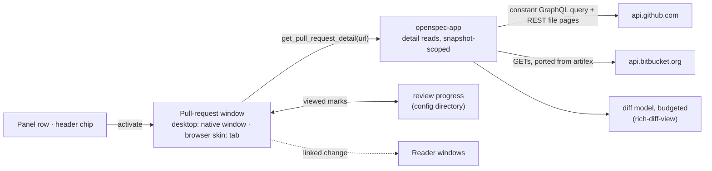

# Read-Only Pull-Request Viewer

## Why

SpecForge lists the open pull requests on both hosts, with their review state, checks, conflicts and the worktree each comes from. Reading one still means leaving, though: every panel row and header chip opens the provider's web page. A reviewer of a mixed queue of human and agent pull requests asks three questions: what changed, which files have I already read, and what is new since I last looked. Today those get answered in a browser tab that knows nothing about the worktree or the OpenSpec change behind the pull request.

Exploring the placement on 2026-10-04 settled it: the viewer belongs in SpecForge rather than in a standalone app.
- Its users are SpecForge's users.
- The inboxes, credentials and worktree links it needs already exist here.
- A standalone app would duplicate them without making anything safer.

It ships read-only; acting on pull requests is a separate change.

## What Changes

- **A pull-request window.** Activating a pull-request row or a header pull-request chip opens that pull request in its own window: a native window on the desktop, a browser tab in the browser skin.
  - There is one window per pull request, reused and focused when it is already open.
  - It shows the header signals, the description, the conversation, the checks and the changed files. It never changes what the main window shows.
  - The provider's page stays one gesture away, through "Open on GitHub" / "Open on BitBucket" in the window's header and through a Cmd/Ctrl-activation of the row.
- **Detail is read on demand, for listed pull requests only.** Opening a window reads that one pull request through a new request class in `openspec-app`, separate from the pollers. Listed means authored or awaiting your review on GitHub, and authored on BitBucket.
  - A read happens only while the pull request's provider is enabled. It never writes, and it follows no redirect.
  - GitHub: one compile-time constant GraphQL query, its variables taken from the snapshot row, plus REST pages of per-file patches, which GraphQL cannot supply.
  - BitBucket: the pull request, its diffstat and diff, its comments and its build statuses, ported from artifex's client as the panel's recipe was.
  - A fresh cached read is answered without a request.
  - Each provider has an hourly detail-request budget.
  - Backoff is shared with the provider's poller. GitHub's GraphQL and REST limits are tracked apart.
  - A read started under a credential that has since changed is discarded.
- **Changed files through the shared diff view.** The providers' files become `rich-diff-view`'s model, with that change's line and byte budgets applied, and render in its `DiffView`. A file held back by the budget loads from the cached detail when asked. Commit detail and pull requests read the same.
- **Review progress kept on this machine.** Each file can be marked viewed.
  - The mark is keyed to the SHA-256 of the file's patch. When there is no patch, the key falls back to GitHub's blob id, and otherwise to the head commit. A later push or a retarget that changes the file therefore clears the mark and flags the file as changed since viewed.
  - The window shows how many files are viewed.
  - Marks live in a SpecForge-owned file in the shared configuration directory and are never sent to either host. BitBucket has no API for them, and writing GitHub's own viewed state would be an action.
- **Conversation and checks, read-only.**
  - Review threads appear with their file and line, above that file's diff.
  - Pull-request-level comments and every submitted review summary with a body appear under the description, in submission order. A minimised one stays collapsed behind its reason.
  - Checks are listed by name and state, with a link out.
  - Nothing can be posted.
- **Content handled as untrusted.** Descriptions and comments render through the shared markdown renderer in a pull-request mode:
  - Raw HTML stays unrendered, and HTML comments are dropped after parsing.
  - Mermaid fences show as source, because a diagram can fetch remote images.
  - Remote images are not loaded. A standalone image becomes a labelled link, and an image inside a link becomes part of that link. A content-security policy refuses remote images in the window, and DNS prefetching is off, because any pull-request author could otherwise learn when it was read.
  - Characters that render as nothing are made visible in titles and branch names, using the diff view's escapes.
  - On the desktop, a link opens only as an absolute `http(s)` URL, through the window's own opener, and the window itself navigates nowhere but SpecForge.
  - The window gets its own capability, `core:default` alone.
- **Exposure stated where it applies.** A served instance reachable beyond this machine can disclose the listed pull requests' content, read with this machine's credentials. That covers an explicit network bind, and Tailscale Serve access with no logins listed. The bind announcement, the release notes and the Tailscale Serve setting say so, and the served shell refuses to be framed.
- **The linked change, one gesture away.** When the pull request is linked to a worktree that hosts an OpenSpec change, the window names the change and opens its artifacts in reader windows.

## Capabilities

### New Capabilities

- `pull-request-viewer`: the pull-request window and everything it reads and shows. That covers:
  - the window on both windowed hosts: identity, reuse, title, capability, navigation guard, freshness, and a pull request that leaves the snapshot;
  - the on-demand, snapshot-scoped detail reads for each provider, with their caching, budget, credential checks and shared backoff;
  - the rendered description, conversation and checks;
  - the changed files through `diff-view`, with on-request loading;
  - local review progress;
  - untrusted-content handling and the desktop link opener;
  - the linked-change strip;
  - the terminal frontend's absence.

### Modified Capabilities

- `github-pull-requests`:
  - *GitHub Privacy and Safety* admits the viewer's detail query and REST file pages on `api.github.com` beside the poller's query, under the same no-log, no-proxy, no-redirect and enabled-only rules.
  - *GitHub Polling With Caching and Backoff*: the poller also waits out the GraphQL deadline that a detail query's rate limit or any secondary limit sets, and the deadline survives a disable/enable cycle.
  - *Opening a GitHub Pull Request* opens the pull-request window, with the web page one gesture away.
- `bitbucket-pull-requests`:
  - *Privacy and Safety* admits the viewer's detail GETs on `api.bitbucket.org`. Those GETs follow a payload link only under `https://api.bitbucket.org/2.0/` and never a redirect; the poller's GETs are unchanged.
  - *Polling With Caching and Backoff*: the poller shares one deadline with the detail reads, and the deadline survives a disable/enable cycle.
  - *Opening a Pull Request* opens the pull-request window.
  - *Credentials Are Stored Write-Only* names the read scopes the detail reads need.
- `pull-request-worktree-links`: in *Pull-Request Rows Lead to Their Worktree*, activating the row opens the pull-request window rather than the web page. The worktree marker is unchanged.
- `spec-browser`: *Pull-Request Chip in the Change Header* opens the pull-request window.
- `web-ui`:
  - *Local Self-Served Web Server*'s network-bind announcement also states that the listed pull requests' content is served.
  - *Localhost Trust Boundary* adds that the served shell refuses to be framed and turns off DNS prefetching.
  - *Tailscale Serve Access* requires the setting's description to state the same disclosure while no logins are listed.
- `release-pipeline`: *Network Bind Exposure Documented For Downloaders* states that a network-bound `specforge-serve` also discloses the listed pull requests' content, read with the serving host's credentials.

## Impact

- **Detail and progress (`openspec-app`).**
  - `src/pull_request_detail.rs` (new): the detail recipes for both providers, the snapshot-scope check, the in-memory detail cache and its freshness rule, the request budget, and the credential-generation check. Its send functions sit behind an injected transport, so every decision is testable.
  - `src/review_progress.rs` (new): the progress store, the SHA-256 mark keys and their fallbacks, the viewed and changed-since-viewed decisions, and pruning.
  - `src/github.rs`, `bitbucket.rs`: each provider's backoff becomes shared state that the detail reads observe and set. GitHub gets separate GraphQL and REST deadlines, and both deadlines and the detail budget survive a disable/enable cycle and a credential save.
  - `src/usage_http.rs`: a GET builder that follows no redirect, used by the detail reads, with a loopback test as for `post`. The pollers' `get` is unchanged.
  - `src/service.rs`, `events.rs`: `get_pull_request_detail`, `get_pull_request_file`, `get_review_progress` and `set_file_viewed`, and a `review-progress-changed` notice on a service-owned broadcast, like the document notices.
  - `src/settings.rs`: the shared pull-request-window size.
  - `Cargo.toml`: `sha2`, already in `Cargo.lock` as a transitive dependency, for the mark keys.
  - `tests/wire_shape.rs`, plus `src/types.ts`: the detail, review, thread, check and progress types, mirrored by hand.
- **Desktop shell (`crates/specforge`).**
  - `src/pull_request_window.rs` (new): the window, with the same navigation guard as the main and reader windows.
  - `src/commands.rs`, `src/lib.rs`: handlers and `generate_handler!` entries for:
    - `get_pull_request_detail`, `get_pull_request_file`, `get_review_progress` and `set_file_viewed`;
    - the desktop-only `open_pull_request_window`, `open_pull_request_link` and `set_pull_request_window_size`.

    The window-state plugin's filter excludes the new window label.
  - `src/events.rs`, `src/lib.rs`: a forwarder for the progress notice, spawned beside the document forwarder.
  - `capabilities/`: a `pull-request-*` capability file granting `core:default` alone.
- **Web transport (`crates/specforge-web`).**
  - `src/dispatch.rs`: arms for the detail, file and progress commands. There is no arm for the window, link or size commands, and tests pin them as unknown, the way `open_pull_request` is pinned.
  - `src/sse.rs`: a `select!` arm for the progress notice.
  - `src/lib.rs`: the served shell carries `Content-Security-Policy: frame-ancestors 'none'`, `X-Frame-Options: DENY` and `X-DNS-Prefetch-Control: off`.
  - `src/main.rs`: the network-bind announcement names the listed pull requests.
- **Frontend (`src/`).**
  - `main.tsx`: a third root, selected by query as the reader root is. Only in that branch it calls `PullRequestRoot`'s policy installer before rendering.
  - `components/PullRequestRoot.tsx` (new): the window's root, as `ReaderRoot.tsx` is the reader's. It exports the installer, which appends the content-security-policy and DNS-prefetch `<meta>` elements to `document.head`.
  - `components/MarkdownView.tsx`: a pull-request mode with:
    - a link mode that calls only `open_pull_request_link`;
    - image overrides for a standalone image and for an image inside a link;
    - mermaid fences as source;
    - HTML comments removed after parsing.
  - `components/PullRequestPanel.tsx`, `PullRequestChip.tsx`, `api.ts`, `App.css`: the entry points, command wrappers and window styles.
  - `components/settings/IntegrationsGroup.tsx`: each provider card says that opening a pull request reads its files, conversation and checks. The GitHub card's "it sends one fixed query" becomes "it sends fixed, read-only requests".
  - `components/settings/DesktopGroup.tsx`: the Tailscale Serve setting's disclosure.
- **Mutation gate.** `.cargo/mutants.toml` excludes the detail recipes' send functions with written reasons, as it does the pollers'.
- **Notes.** `crates/CLAUDE.md`, `src/CLAUDE.md`: the four pollers are no longer the only network callers; the window, command and notice notes.

**Depends on** `rich-diff-view`, which lands first and provides:
- the model;
- the line and byte budgets;
- `parse_diff` and `parse_hunks`;
- the two `DiffView` slots;
- the hidden-character escapes.

**Deliberately unchanged.**
- **No pull-request actions.** Nothing is posted, approved, merged or marked on either host, and the Settings copy keeps recommending read scopes. The decision recorded on 2026-10-04 is that actions follow in their own change, `pull-request-actions`:
  - desktop-only comment, approve and request changes;
  - write-scoped tokens moved to the OS keyring;
  - merge left on the host's page;
  - the public read-only promise rewritten to "never changes your local work; acts on a pull request only when you click".

  Until then the landing page's promise stays true.
- **No BitBucket review queue.** BitBucket pull requests awaiting your review are not listed, so they cannot be opened.
- **No local git.** No `git fetch`, no local computation of pull-request diffs and no new `git` operation: diffs come from the providers.
- **No per-window command allowlist, and no content check on desktop links.** Every window can still call every app command, including `open_artifact_link`. A per-window allowlist needs an application permission manifest and is an open question.
- **No new user-facing setting or switch.** The viewer rides on each provider's existing opt-in. Only the pull-request window's remembered size is stored in settings, as the readers' is.
- **No change to the address grammar.** The window is identified outside the codec, as reader windows are.
- **No terminal surface.** There is no pull-request list or viewer in the terminal frontend.
- **No spec-aware review** beyond naming the linked change.
- **No documentation fix.** The site's "only network calls" sentence, already stale since the pull-request panels, is left to a documentation change.
