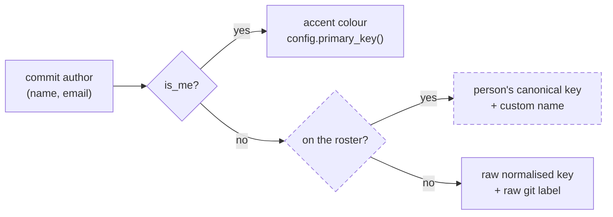

## Context

Two features are entangled here, and the entanglement is the whole design question.

The **leaderboard** is self-contained: a pure function in `openspec-core`, one field on the IPC payload, one React component, one terminal renderer. Removing it is mechanical.

The **named-people roster** is not. It is a persisted settings field, two IPC commands wired through four registration sites each, a `Person` type re-exported across five crates, and a Settings section. It was built for the leaderboard — the Settings help copy names the leaderboard explicitly — but a second consumer accreted onto it: `compute_garden` resolves each commit through `roster_index` to pick a colour bucket and a display label.

That second consumer turns out to be almost entirely notional. The garden writes the roster-resolved name onto `GardenCommit.label`, serialises it over IPC, and mirrors it in `src/types.ts` — and **no frontend reads it**. The desktop hover renders the raw `c.author`; the terminal reads only `person_key`. So the roster's total surviving effect, once the leaderboard is gone, is which of today's commit nodes share a hue.

The middle branch is what this change deletes. Everything else in that flow survives.

## Goals / Non-Goals

**Goals**

- Remove the per-author leaderboard from all three frontends and from the core.
- Remove the roster apparatus in full — type, settings field, commands, Settings UI — rather than leaving a vestigial half.
- Keep the canonical developer identity, its aliases, and the git-config candidate suggestions exactly as they are.
- Keep the commit garden, including you-accenting, and state its reduced attribution as a contract rather than letting it drift.
- Leave the spec tree self-consistent: no requirement that names a deleted surface, no prohibition left without its rationale.

**Non-Goals**

- Replacing the leaderboard with a gentler multi-author affordance. The `commit-garden` capability already shows who worked today, coloured per author; that is sufficient and this change adds nothing to it.
- Preserving existing rosters. There is no export, no migration, no read-only remnant.
- Fixing pre-existing drift found while sweeping (the `IdentityInfo` doc's terminal-frontend claim, the site's commits-per-day paragraph). Both are recorded in the proposal as out of scope.
- Re-running the repository's mutation-score snapshot in `README.md`.

## Decisions

### Remove the roster with the leaderboard, rather than keeping it for the garden

The alternative — delete only the leaderboard and let the roster live on as the garden's colour-bucketing input — was considered and rejected. It keeps a persisted settings field, two commands across eight registration sites, a public core type, and a 70-line Settings section whose entire user-visible payoff is that a teammate's two git emails draw in one hue instead of two, in a section of the Dashboard scoped to a single day. The Settings copy would also have to be rewritten to describe a benefit almost no user would notice, since the roster's one visible artefact — the resolved name — is never rendered. That is the leaderboard's plumbing surviving the leaderboard, which is exactly the shape this change exists to remove.

### Accept two colours for one teammate's two identities

The garden's `resolve()` falls back to the raw normalised author key, so a teammate committing as both `grace@work` and `grace@home` gets two hues and counts as two in the "· N people" caption. This is a real regression, and it is accepted: it is already the exact behaviour any unrostered author gets today, and the garden is a today-scoped ornament, not a record anyone reconciles against.

Rejected alternative: heuristic name-based folding (same display name → same colour). It would silently merge two different people who share a common name, and it replaces an explicit user-controlled mapping with an invisible guess — a worse failure than two hues.

The consequence is written into `commit-garden`'s replacement requirement as a `SHALL`, so a future reader finds a stated contract rather than inferring a bug.

### Delete `GardenCommit.label` rather than wiring it up

The field is computed, serialised, and mirrored, and read by nothing. The alternative — render it in the hover title now that it would carry the raw author anyway — was rejected because it duplicates `GardenCommit.author`, which is what the hover already shows and what `commit-garden`'s *Read-Only Graphs* requirement already specifies. Two fields carrying the same string is not an improvement.

This deletion has no compiler or test guard on either side of the IPC boundary, which is why it is called out separately in tasks and paired into a single commit.

### Re-anchor you-precedence in `commit-garden`

Deleting `developer-identity`'s *Single Identity Assignment with Canonical-Developer Precedence* removes the spec tree's **only** normative statement that an identity resolving as the canonical developer wins over any other attribution. The garden still depends on that rule — it is what accents your own nodes.

So the replacement *Author-Colored Graph Nodes* requirement states you-precedence itself, in its own words, rather than cross-referencing a requirement that no longer exists. Rejected alternative: leaving the rule implicit in the implementation. That would let a later refactor drop the accent on the developer's nodes without violating any spec.

### Replace the *Personal Progress Frame*'s cross-reference with a positive prohibition

That requirement currently justifies its me-only scoping by pointing at the leaderboard: "Cross-author comparison is the concern of the per-author **Leaderboard**, which is not the personal frame." Deleting the leaderboard and simply striking the sentence would leave the prohibition ("SHALL NOT present a control to widen these views to other authors") standing with no stated reason — the kind of orphaned rule a later change removes as vestigial.

It is replaced by a prohibition that is itself auditable: the Dashboard SHALL NOT rank, score, or otherwise order authors against one another, with a scenario to match.

The wording is deliberately narrow. A broader phrasing — "no per-author comparison of any kind" — would contradict the commit garden, which *is* a per-author surface on the Dashboard, and would collide with *Dashboard Includes Disabled Workspaces*, which ranks **workspaces** by active-change count. Ranking authors against one another is the thing being forbidden; showing several authors is not.

### Rename `Person-Colored Graph Nodes` rather than modifying it

`openspec archive` rejects a `## MODIFIED Requirements` block that drops a scenario present in the current spec — established in this repository by the seasons removal, which hit the constraint four times and recorded it verbatim. The garden requirement must drop *Folded identities share one color*, so it is removed and re-added as *Author-Colored Graph Nodes* with a **Reason** line.

The name change is not incidental cover for the constraint: "Person" is roster vocabulary, and after this change the garden colours by *author*.

### Peel outside-in — invert the schema's prescribed task order

`openspec/config.yaml`'s `rules.tasks` says to order groups "core (openspec-core) → shell (specforge) → frontend (src/) → verification", so that the workspace stays green throughout. That enumeration is correct for an **addition** and exactly wrong for a **deletion**: removing from the core first breaks four downstream crates at once.

The seasons removal already resolved this, running frontend → shell → web → terminal → app → core. This change copies that structure. The rule's stated intent — stay green throughout — is satisfied by the inversion; only its enumeration is not, so `config.yaml` is left alone and the task groups carry a note explaining the direction, so a reviewer does not "fix" it back.

One pair genuinely cannot be separated: `compute_garden`'s signature change in `openspec-core` and its single call site in `openspec-app/src/service.rs:1131` must move together.

### Land as one commit

Only the `compute_garden` pair is strictly inseparable, but splitting the rest buys nothing — CI and `git bisect` only ever see the final commit — and costs the guarantee that each IPC type moved together with its hand-written TypeScript mirror. Since `GardenCommit.label`'s two halves have no compiler guard at all, that guarantee is the main thing standing between this change and a silently mismatched boundary.

### No settings migration; the roster is discarded

`AppSettings` has no `deny_unknown_fields`, `load` parses the whole file with a defaults fallback, and `save` serialises the whole struct. A stored `"people"` array is therefore ignored on load and dropped by the next write of any setting, exactly as `gamificationEnabled` and `season` were.

Rejected alternative: writing a migration that exports the roster somewhere first. There is nowhere for it to go — no other feature consumes a named person — so the export would be a file nothing reads.

The existing `legacy_gamification_and_season_keys_are_ignored_and_dropped` test is **extended** rather than duplicated, so the repository has one place asserting the drop-on-write behaviour for every legacy key rather than three parallel tests.

### Delete the commands rather than deprecating them

`set_people` and `observed_authors` are unregistered from all four sites. The web dispatcher already answers an unknown command with a structured unsupported response (`web-ui`: *Command Transport Mirrors the In-Process Command Surface*), so a stale client degrades cleanly rather than erroring opaquely. There is no external API contract to honour — the only caller was this repository's own frontend.

## Risks / Trade-offs

- **`GardenCommit.label`'s removal is guarded by nothing.** It has zero readers, so deleting the Rust field without the TypeScript mirror (or vice versa) passes `cargo`, `tsc`, and every test. A split would leave `src/types.ts` declaring a field the payload no longer carries, and any future `c.label` read would type-check and evaluate to `undefined`. *Mitigation:* the two edits are one task and one commit, and the task text says why.
- **`SettingsView.tsx`'s mount effect mixes two concerns.** Lines 860-865 call `void reload()` — which loads the surviving Identity section — and then the observed-authors fetch. Deleting the whole `useEffect` leaves Identity stuck on its "Loading…" branch forever. `tsc` is happy, no test covers it, and the mutation gate does not reach `src/`. *Mitigation:* the task names the two lines to keep, and the manual smoke opens Settings and asserts the Identity section renders.
- **The mutation gate will be near-vacuous, and green will not mean covered.** `cargo mutants --in-diff` selects mutants on added or modified lines; a pure deletion adds none, so most touched functions contribute nothing. Only `resolve` and `compute_garden`, whose signatures genuinely change, should appear. *Mitigation:* read the selected-mutant count, not just the verdict — and add the garden tests below on merit rather than waiting for the gate to demand them.
- **Deleting `you_precedence_and_roster_folding` strands the garden's surviving branches.** All four post-change `resolve` mutants happen to be killed by `authorless_commit_falls_back_to_unknown`, so the gate goes green while the me-branch and the raw-key branch have no assertions at all. *Mitigation:* a replacement test asserts a me-commit gets the accent and the primary key, a teammate gets `!is_me` and their raw key, and two identities of one teammate yield two distinct `person_key`s — pinning the accepted regression. It also asserts `GardenCommit.author`, which after `label`'s removal is the only human-readable name the garden hands either frontend and is currently asserted nowhere.
- **`IdentityConfig::label()` loses both production call sites** (`dashboard.rs:328` and `garden.rs:101`) and becomes a `pub` method in a library crate whose only exerciser is its own unit test — so `dead_code` never fires and CI stays green. *Mitigation:* keep that test regardless. After this change it is the last assertion in the crate that exercises `Author::display()`.
- **The marketing site deploys live from master.** A merge touching `site/**` publishes specforge.avantmedia.uk immediately, and one of the paragraphs being edited is currently *false* under the new behaviour rather than merely stale. *Mitigation:* site edits are their own late task group so the blast radius is one reviewable hunk; the `id="identity"` anchor is held stable; `bun run --cwd site build` runs the British-English guard before push.
- **`cargo` fails workspace-wide in a fresh worktree before a line is edited**, because `dist/` is absent and both `generate_context!` and `RustEmbed` need it at macro-expansion time — surfacing as an opaque proc-macro error. *Mitigation:* `bun install && bun run build` is task 0. CI already does this itself, so the trap is local-only.
- **The change is unobservable on a solo machine.** The leaderboard already rendered nothing for a single-author history, so a solo smoke test shows an identical Dashboard before and after. *Mitigation:* the manual smoke is specified against a multi-author workspace, where the panel visibly disappears and the garden's colour behaviour can actually be checked.
