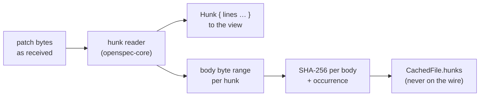

## Context

`pull-request-viewer` keeps review progress in `review-progress.json`, one entry per pull request:

```json
"github/acme/api/42": {
  "lastMarkedHead": "abc1234…",
  "files": { "src/big.rs": { "patch": "sha256:9f2c…" } },
  "touchedAt": 1791400000
}
```

A file's key is computed by the service from the cached detail, never by a caller. It is the SHA-256 of the file's patch bytes as received when the file has patch text, else GitHub's blob `sha` with the file's status, previous path and base branch, else the head commit and base branch. A file is viewed when its stored key equals its current key, changed since viewed when they differ, and unviewed when nothing is stored (`review_progress.rs`).

Three facts about the current code shape this design:

- **Hunks reach the cache in three ways.** A shown file's hunks are in `detail.files[i].content`. A budget-withheld file's hunks are in `CachedFile.withheld`. A file GitHub sent without its patch has hunks only once a file read stores `CachedFile.fetched`. After a restart, the cache is empty until the detail is read again.
- **Line text is decoded lossily.** `diff.rs` decodes each line with `String::from_utf8_lossy`, so `Line.text` is not the bytes the provider sent. BitBucket's diff is raw bytes, and a Latin-1 file decodes to replacement characters. The patch digest is taken from the bytes while the read holds them (`PatchDigest::of`), and `parse_diff_with_spans` already reports each file's byte spans.
- **`DiffView` is shared.** Commit detail hosts it too. Its two per-file slots (`renderFileHeaderExtra`, `renderFilePreamble`) are the only way a host adds anything. Collapse, loaded content and the navigator's mark are view state it holds. A layout switch keeps the reader's place through `recordPlace` and `restorePlace`, by the side-qualified identity of the topmost rendered line. Model-built copy (`modelCopyText`) walks every hunk between the selection's two ends.

## Goals / Non-Goals

**Goals:**

- Mark and unmark each hunk of a pull request's file, persisted on this machine beside file marks.
- After a push, keep every hunk whose content the push left alone viewed, and reopen only the hunks it changed.
- One invariant between the two granularities: a file is viewed exactly when every hunk is.
- Fold viewed hunks out of the reader's way, and collapse a file the reader's own mark completes.
- Keep `DiffView` host-agnostic, and leave commit detail unchanged.

**Non-Goals:**

- A keyboard loop such as "mark and jump to the next unviewed hunk". Hunks have no focus model yet.
- Sticky hunk headings. In unified layout the heading row sits inside `.diff-unified`, whose `overflow-x: auto` makes it the heading's scroll container, so `position: sticky` cannot stick it to the port.
- Collapsing viewed files when a pull request opens.
- Writing anything to either host, including GitHub's own viewed state.
- Hunk marks in commit detail.

## Decisions

### D1. A hunk's key is the digest of its body bytes as received, numbered among its twins

$$\text{key}(h_i) = \texttt{sha256:}\,\operatorname{hex}\bigl(\operatorname{SHA\text{-}256}(\operatorname{body}(h_i))\bigr)\,\texttt{\#}\,n_i \qquad n_i = \bigl|\{\, j \le i : \operatorname{body}(h_j) = \operatorname{body}(h_i) \,\}\bigr|$$

$$\operatorname{body}(h)$$ is the bytes from just after the hunk's `@@` header line to the end of its last line. That includes each line's marker and newline, and any `\ No newline at end of file` line belonging to it. The header is left out: its ranges move whenever anything above the hunk changes length, and its section heading is git's guess, which a local diff (`diff_versions`) never writes. $$n_i$$ numbers identical hunks of one file in order, so marking one copy of repeated boilerplate never marks the other.



*Rejected: the hunk's index.* A push that adds a hunk above it renumbers everything after it.

*Rejected: the header and the body.* A push that changes one line near the top shifts every later header, so every later hunk would reopen. That is exactly the whole-file reset this change removes.

*Rejected: the changed lines only, without context.* A change to a neighbouring line alters what the reader saw around the change, and it should reopen the hunk.

*Rejected: a digest of the decoded `Line.text`.* It is lossy. Two BitBucket hunks differing only in bytes that decode to U+FFFD would share a key, and the author controls those bytes.

*Rejected: a short or non-cryptographic hash.* The same reasoning as the file key: the author controls the content, and the key outlives the run and the toolchain.

### D2. The digests are taken at read time and kept on `CachedFile`

`openspec-core`'s hunk reader reports each hunk's body range in the text it read. This comes from the same reader that builds the hunk, so the two can never disagree:

- `parse_hunks` gains a sibling that returns the ranges too.
- `SpannedFile` gains the ranges of its hunks.
- `diff_versions` gains a sibling that reports the bodies of the patch text it generates.

`github_detail.rs` and `bitbucket_detail.rs` digest the bodies while they hold the bytes, exactly where they take `PatchDigest` today. `ReadFile` and `CachedFile` gain `hunks: Option<Vec<HunkDigest>>`. It is `None` for a file without patch text, and filled for a patch-less file when its file read is kept (`keep_fetched`).

*Rejected: put the digest on `Hunk`.* `Hunk` crosses IPC and serves commit detail. It would put review machinery on every commit diff and grow every payload.

*Rejected: rebuild the bytes from `Line` at mark time.* That is a second definition of the bytes. It is lossy for invalid UTF-8 (D1), and it could drift from the reader.

### D3. The store gains a `hunks` map, written by one rule

Each entry gains `hunks: { path: [key, …] }`, read with `#[serde(default)]` and left out when empty, so an entry written before this change reads unchanged. For a file $$f$$ write:

- $$k$$ for its current key, and $$S_f$$ for its stored one (or none);
- $$H$$ for its current hunks, *known* when the cache holds their digests and there is at least one;
- $$S_h$$ for its stored hunk keys.

A hunk is viewed when the whole file is, or when its own key is stored:

$$\operatorname{viewed}(h) \iff S_f = k \;\lor\; \operatorname{key}(h) \in S_h$$

Writing $$V = \{\operatorname{key}(h) : h \in H,\ \operatorname{viewed}(h)\}$$ for the keys of its viewed hunks now, each write replaces both stored values:

| Write | $$S_h'$$ | $$S_f'$$ |
|---|---|---|
| mark the file | $$\{\operatorname{key}(h) : h \in H\}$$ when $$H$$ is known, else $$S_h$$ | $$k$$ |
| unmark the file | $$\emptyset$$ | none |
| mark hunk $$h$$ | $$V \cup \{\operatorname{key}(h)\}$$ | $$k$$ when $$S_h' \supseteq \operatorname{key}(H)$$, else $$S_f$$ |
| unmark hunk $$h$$ | $$V \setminus \{\operatorname{key}(h)\}$$ | none |

Three properties follow:

- **Bounded.** Every write to a file with known hunks prunes its keys to its current hunks.
- **Unmarking expands first.** Unmarking a hunk of a file marked before this change ($$S_f = k$$, $$S_h = \emptyset$$) writes out its other hunks' keys, so the other hunks stay viewed.
- **A stale file key survives hunk marks.** It is still there to say "changed since viewed" while the reader works through the reopened hunks, until the last one replaces it with $$k$$.

Hunk keys are stored as strings (`sha256:<hex>#<n>`), so the JSON stays readable and small: about 70 bytes a hunk.

*Rejected: replace file keys with hunk keys.* Binary, too-large and patch-less files have no hunks. Every mark made before this change would also lose its meaning.

*Rejected: a second store file.* Two files cannot be replaced in one atomic write, so a crash between them could leave a file viewed with no hunks, or the reverse.

### D4. States are derived, and "viewed" means every hunk

$$\operatorname{state}(f) = \begin{cases} \text{viewed} & S_f = k \;\lor\; \bigl(H \text{ known} \wedge \forall h \in H:\ \operatorname{viewed}(h)\bigr) \\ \text{changed since viewed} & \text{else when } S_f \ne \text{none} \\ \text{partly viewed} & \text{else when } \bigl(H \text{ known} \wedge \exists h \in H:\ \operatorname{viewed}(h)\bigr) \lor \bigl(H \text{ unknown} \wedge S_h \ne \emptyset\bigr) \\ \text{unviewed} & \text{otherwise} \end{cases}$$

A push that only shifts hunks changes the patch bytes, so $$S_f \ne k$$, but leaves every body intact. The file therefore stays viewed, where today it flips to changed since viewed. A file marked before this change has $$S_h = \emptyset$$, so a push that changes it reopens all its hunks, as it does today.

*Rejected: derive "changed" from stored hunk keys that match no current hunk.* Pruning on each mark (D3) would erase that evidence as soon as the reader marks anything. A partly viewed file whose marked hunks all changed is therefore unviewed. That loses a little information, but it never hides a line.

### D5. `set_hunk_viewed` names the hunk by its index, and the service computes its key

`set_hunk_viewed(reference, path, hunk, viewed, head, base)` takes the hunk's index within the file's hunks, as the view rendered them. It inherits every refusal of `set_file_viewed`: a disabled provider, no cached detail, a head or base commit other than the cached detail's, or a path not among its files. It adds two more: a file whose hunks are unknown, and an index past its last hunk. An unmark never creates an entry. Each stored write raises `review-progress-changed`, as a file mark does. `set_file_viewed` keeps its signature and applies the file rows of D3.

*Rejected: an optional hunk argument on `set_file_viewed`.* It changes a command both transports and their tests pin, and gives one call two meanings.

*Rejected: the caller sends the hunk's digest.* A caller could then mark content it never rendered. The service computing keys from its own cache is D9 of `pull-request-viewer`, and it holds here too.

### D6. Progress carries each file's hunk states, guarded by the commits they belong to

`FileReviewProgress` gains:

- `hunks: boolean[] | null`: each current hunk's viewed state in order, or `null` when its hunks are unknown;
- the state `partlyViewed`.

`ReviewProgress` gains `headCommit` and `baseCommit`, the cached detail's commits that the states were computed against. Hunk states are positional, so the view applies them only to a detail whose two commits match. Otherwise it treats every file's hunks as unknown until its next read. A load that brings a file's hunks makes the view read progress again, since a patch-less file's digests exist only once its file read is kept.

*Rejected: send the digests to the view and match by content there.* The view never holds the raw bytes (D1), so it cannot compute them. It would also have to trust whatever digests it was sent.

### D7. `DiffView` gains per-hunk slots, host folds and a one-shot collapse

```ts
interface HunkSlots {
    /// The hunks the host folds, by index.
    folded: ReadonlySet<number>
    /// Rendered in hunk `index`'s heading row, in the gutter left of the heading.
    heading: (index: number) => ReactNode
    /// Rendered as a row after hunk `index`'s last line; null renders no row.
    end: (index: number) => ReactNode | null
}

interface DiffViewProps {
    // …the existing props…
    hunkSlots?: (file: DiffFile) => HunkSlots | undefined
    ref?: Ref<DiffViewHandle> // React 19: a plain prop
}

interface DiffViewHandle {
    /// Collapse `file`'s section, once, as its header toggle would.
    collapse: (file: DiffFile) => void
}
```

A folded hunk renders one row: the heading slot, its `@@` heading, and a "Show n lines" control that is the view's own. "Show" sets an override, which is view state held per file and hunk index, like collapse. A new `files` array drops every override. A hunk's override is also dropped when the host's fold of that hunk changes, so a re-marked hunk folds again. Every piece of chrome the view or a slot adds carries `data-copy="skip"`.

Folding is the host's data, because it is the host's semantics. Collapse stays view state held by the view: the handle only asks once, as if the reader had pressed the header toggle, and the toggle reopens it.

*Rejected: the view owns "viewed".* That would fork pull-request semantics into the renderer commit detail shares.

*Rejected: a `collapsed` prop the host controls.* Collapse would become host state, fighting the reader's own toggle.

### D8. One place-keeping rule for folds, shows and collapses

Each fold change records an anchor and its offset in a layout effect before paint, then restores it, extending `recordPlace` and `restorePlace`:

| The change came from | The anchor |
|---|---|
| a control in a hunk's heading row (its toggle, "Show", "Hide") | that heading row |
| a hunk's end row | the first row after the hunk |
| the file box in the sticky header, or a collapse a completing mark asks for | the section's header, at the top of the view when it was stuck there |
| anything else: another window's mark, a progress read | the topmost visible line; when that line's hunk folds, its heading; when its section collapses, its header |

So a reader who marks a long hunk from its end row keeps reading the next hunk where it was. A reader who presses "Show" on a heading at the top of the view sees the lines open below it. A mark from another window moves nothing the reader is looking at.

*Rejected: leave it to the browser's scroll anchoring.* It picks its own anchor node, which is often not the row the reader acted on. The layout switch already restores its place explicitly, so this reuses that path.

### D9. Only the reader's own completing mark collapses a file

A file's section collapses when a mark the reader made in this view is stored and the progress read that follows shows the file viewed. That mark can be the file's box, or a hunk's toggle or end row when it marks the last unviewed hunk. A mark arriving from another window or tab, a progress read, and opening the pull request never collapse anything.

*Rejected: collapse at click time.* A refused mark would have to re-expand the section.

*Rejected: collapse on every transition to viewed.* A mark in the pull-request window would yank content out from under the center pane's reader.

### D10. The end row is the host's, by a line count

The pull-request view gives a hunk an end row when it is unviewed and has more than 40 lines in the model: $$\operatorname{end}(h) \iff \lnot\operatorname{viewed}(h) \wedge |\operatorname{lines}(h)| > 40$$. The row reads "Mark hunk viewed". It is the same in either layout, and spans the full width side by side.

*Rejected: "taller than the view".* That depends on the window size and the layout, so it changes on resize and cannot be tested.

### D11. The file box shows a mixed state, and the chips count hunks

The file's toggle stays a native checkbox:

- checked when the file is viewed;
- `indeterminate` (exposed as mixed) when the file is partly viewed, or changed since viewed with at least one hunk still viewed;
- unchecked otherwise.

Pressing a mixed box marks the file. The header's chip reads:

| State | Hunks known | Chip |
|---|---|---|
| partly viewed | yes | "4 of 9 hunks viewed" |
| partly viewed | no | "some hunks viewed" |
| changed since viewed | yes | "changed since viewed · 3 hunks to review" |
| changed since viewed | no | "changed since viewed", with its reason when keyed by the head, as today |

The view header's counts are unchanged ("n of m files viewed", "k changed since viewed"). They are now counted from the derived states.

*Rejected: a separate hunk-progress bar in the header.* It is more chrome for a number that only matters per file.

## Risks / Trade-offs

- **A hunk moved verbatim with identical context keeps its mark.** The mark follows the content, not the place. → Identical context makes the moved code the same code. Within one file, the occurrence number keeps twins apart, so the only mark that carries over is one that truly saw that content.
- **GitHub's patch and a local diff may split a file differently.** For example, a file that drops below GitHub's patch threshold after a push. → The hunks reopen, which is the safe direction. `diff_versions` uses `RawMyers`, which matched GitHub on the measured pages.
- **Positional hunk states could land on another detail's hunks.** → `headCommit`/`baseCommit` guard them (D6). A mismatch shows hunks as unknown until the next read, never as someone else's.
- **An older SpecForge writing the same file drops `hunks`** from the entry it rewrites. It rebuilds the entry from its own struct, and leaves other entries alone. → The two-writers note says so. The effect is that some hunks reopen; no file mark is lost.
- **The state rules have many branches** that a whole-function mutant won't separate. → Table-driven tests in `review_progress.rs`, one fixture per row of D3 and per case of D4, plus the adversarial fixtures: twins, a shift-only push, a pre-change mark then a hunk unmark, a stale file key.
- **Fold changes jumping the page.** → D8, verified in a live window: marking from an end row, "Show" at the top, and a mark arriving from a second window.
- **Store growth.** → Keys are pruned to the current hunks on every write (D3), and entries still prune after 90 days. A 1,000-hunk pull request stores about 70 KB.
- **Folded hunks still tokenise.** → Tokens stay computed once per hunk, as the layout switch requires. The rows are not rendered, which is the DOM saving the open performance follow-up asks for.

## Migration Plan

No data migration is needed. An entry without `hunks` reads as an empty map, so every existing file mark keeps its state. Rolling back to an older version ignores `hunks` and drops it from any entry that version writes. The wire shape changes on both transports in one release, as the frontend is bundled with each.

## Open Questions

- Should viewed files open collapsed when a pull request opens, as GitHub does? It is deferred, and would be a host-requested collapse at mount.
- Is a keyboard loop worth the hunk focus model it needs?
- Sticky hunk headings would mean moving the heading row out of the sideways scroller in unified layout.
