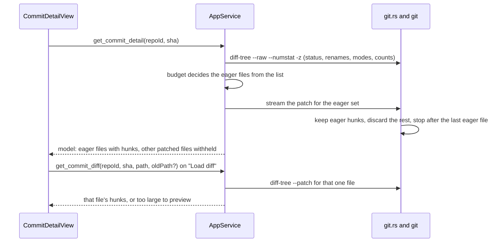

## Context

Commit detail (archived as part of `2026-05-29-add-commit-graph-rail`) was deliberately shipped as stage 2 of three: "clicking a commit swaps the center pane to `--stat` + a raw unified diff". Stage 3, "file-tree navigation, per-file collapse, syntax highlighting, +/- gutters, as in the reference screenshot", was recorded as a deferred fast-follow. What exists today:

- **Data.**
  - `commit_files` (`crates/openspec-core/src/git.rs`) runs `git diff-tree --name-status` and `--numstat` for one commit and joins them by path.
  - It does no rename detection, so a rename arrives as a deletion plus an addition.
  - It passes neither `--root` nor a merge option, so a root commit and every merge return no files.
  - `commit_diff` runs `git show --format= <sha> -- <path>` once per file and decodes it strictly, so a file in another encoding shows "No textual diff." and nothing else is affected.
  - Both pass the reference after the end-of-options marker, and the service refuses any reference that is not a 4–64 character hex id before calling them (`is_object_id`; `commit-graph`: *Commit References Are Injection-Safe Arguments*).
  - Both are confined to registered repositories (*Commit Reading Is Restricted to Registered Repositories*).
- **Transport.** `CommitDetailView` asks for the file list, then fetches every file's diff in parallel: one IPC call and one `git` process per file, with no size cap. The workspace-file browser caps its reads at 5 MiB (`MAX_WORKSPACE_FILE_BYTES`, "file is too large to preview"), but diffs have no equivalent.
- **Rendering.** `DiffBlock` splits the raw text on newlines and colours each line by its prefix (hunk, file header, added, removed), one DOM node per line, with no gutters, highlighting, collapse or navigation.

The read-only pull-request viewer (change `pull-request-viewer`) needs to render a pull request's changed files. Its diffs arrive as provider text:
- BitBucket sends a full unified diff.
- GitHub sends per-file `patch` fields that start at `@@`, with no file headers, while status, paths and counts arrive as JSON.

Both are parsed in `openspec-app`, which can hand a frontend a model but not a component. Rendering commit detail and pull requests from one model is what keeps the two from drifting.

`highlight.js` already ships in the bundle, reached through `rehype-highlight` 7 → `lowlight` 3, and `App.css` styles its `hljs-*` classes for fenced code. Some colours are literals and some come from tokens; comments use `--text-faint`, and titles use `--accent`. All of them are guaranteed 4.5:1 only against the code well (`visual-identity`: *Syntax Highlight Palette*).

## Goals / Non-Goals

**Goals:**

- One diff model, produced in Rust from either git's output or provider text, and rendered by one component for commit detail now and the pull-request viewer next.
- Bounded work per commit: a fixed number of `git` processes and IPC calls whatever the file count, and line and byte budgets that keep the page responsive on a large commit.
- A truthful file list: renames, type changes, modes, root commits and merges.
- Highlighting that matches markdown code blocks and keeps the contrast floor on tinted lines.
- Diff lines and paths that cannot hide what they contain.
- Pure, separately tested parser and budget logic, so the mutation gate on `openspec-core` has assertions to catch.

**Non-Goals:**

- A split view, word-level emphasis, an ignore-whitespace toggle, virtualised rendering, or expanding a hunk's context to the full file.
- Making commit detail addressable, or any change to the graph or rail.
- The full-message fix in the commit header.
- Any terminal surface.

## Decisions

### D1. Parse in `openspec-core`; the frontend renders a model

```rust
pub struct DiffFile {
    pub old_path: Option<String>,   // None when added
    pub new_path: Option<String>,   // None when deleted
    pub old_mode: Option<String>,   // git's octal mode; None when the source gives none
    pub new_mode: Option<String>,
    pub status: FileStatus,
    pub additions: Option<u32>,     // None when the source gives no count
    pub deletions: Option<u32>,
    pub content: DiffContent,
}
pub enum FileStatus { Added, Modified, Deleted, Renamed { similarity: Option<u8> },
                      Copied { similarity: Option<u8> }, ModeChanged, TypeChanged }
pub enum DiffContent { Hunks { hunks: Vec<Hunk> }, // empty: no textual change
                       Withheld,                   // held back by the budget; loadable
                       TooLarge,                   // past a ceiling, or a provider omitted its patch for size
                       Binary }
pub struct Hunk { pub old_start: u32, pub old_lines: u32, pub new_start: u32, pub new_lines: u32,
                  pub section: Option<String>, pub lines: Vec<Line> }
pub struct Line { pub kind: LineKind,   // Context | Added | Removed | NoNewline
                  pub old_no: Option<u32>, pub new_no: Option<u32>, pub text: String }
```

`diff.rs` exposes two pure functions plus the budget decision of D2:
- `parse_diff(text) -> Vec<DiffFile>` reads git's and BitBucket's full unified diffs;
- `parse_hunks(patch) -> Vec<Hunk>` reads a header-less per-file patch such as GitHub's `patch` field. The caller builds that file's `DiffFile` from the provider's own status, paths and counts.

The parser understands:
- git's extended headers (`rename from/to`, `similarity index`, `new/deleted file mode`, `old/new mode`, `Binary files … differ`, `Subproject commit`);
- the `\ No newline at end of file` marker;
- git's C-quoted paths.

It assigns line numbers from the hunk ranges, and the header shows old and new modes whenever they differ.

`ModeChanged` stays the status of a mode-only change, so a file that is both edited and made executable reads `Modified` with its modes shown. A type change, which git prints as a deletion section followed directly by a creation section for the same path, folds inside `parse_diff` into one `TypeChanged` file carrying both sections' hunks. The fold applies whenever the two sections' `deleted file mode` and `new file mode` differ in file type, so it holds for a commit, for provider text and for a one-file read alike.

Bytes are decoded with `String::from_utf8_lossy`, per patch line and per `-z` record, never as one strict string. A file in another encoding shows replacement characters in its own lines or path, and no other file is affected. That matters for the list too: `-z` prints paths verbatim, where today's list C-quotes bytes of 0x80 and above.

Paths are never guessed from ambiguous headers. `-z` does not apply to patch output, git C-quotes unusual names, and it leaves spaces unquoted in the `diff --git` line. So:
- **For a commit**, each patch section, after the type-change fold, is paired with its `-z` file-list record (D2) by git's output order, and paths come from that record.
- **For provider text**, paths come from `rename from/to`, else from `---`/`+++`, dropping the tab git appends after a name that contains a space.
- **Only for a section with neither** (a mode-only change, an empty added or deleted file, a binary file) is the `diff --git` line read, split where its two halves name the same path.

On the wire:
- Structs cross IPC with `rename_all = "camelCase"`.
- `FileStatus` and `DiffContent` are tagged unions, `#[serde(tag = "kind", rename_all = "camelCase", rename_all_fields = "camelCase")]`, as `ArchiveScope` is.
- `LineKind` is a camelCase string enum.
- `wire_shape.rs` populates every variant and field. It asserts each `LineKind` value with `assert_wire_value` (`noNewline`, …), and each union's discriminant by exact value through `["kind"]` (`modeChanged`, `typeChanged`, `tooLarge`, …), as `workspace_view_discriminants_match_the_declared_union` does.

*Rejected — keep parsing in TypeScript, as `DiffBlock` does by line prefix.* The frontend is a pure consumer by convention, and parsers belong where `cargo test` and the mutation gate reach them. The pull-request viewer also parses provider diffs in `openspec-app`, which cannot call a TypeScript parser.

*Rejected — compute diffs with a library (`similar`, or `git2`'s diff).* SpecForge would then disagree with git about renames and hunks. `git2` would also add a native dependency, and it would bypass two things: `git_command`, the chokepoint that carries WSL routing and the test invocation log; and the call sites that place every reference after `--end-of-options`.

`diff-tree` is plumbing. It honours git's core diff settings, such as `diff.renameLimit`, but none of the porcelain's display settings (`diff.algorithm`, `diff.context`). That keeps its output stable to parse and its context fixed at three lines. A user who sets `diff.algorithm` or `diff.context` therefore sees git's default hunks here, where today's `git show` read follows those settings.

### D2. A fixed number of `git` processes per commit, and line and byte budgets



The file list comes from one invocation, `git diff-tree -r -M --root --no-commit-id -z --raw --numstat`, which replaces today's two. Its records arrive in the same order:
- the raw records give each file's status letter (A, M, D, T, or R with its similarity) and its old and new modes;
- the numstat records give the counts.

The budget is a pure function in `diff.rs`. It decides only among patched files, that is, files with a patch to show, taken in the model's file order. A `Binary` file, or one already `TooLarge` (a provider omitted its patch, or it lies past a read ceiling), keeps its own state, adds nothing to the total and is never `Withheld`. With $$c(f)$$ the added plus removed lines of file $$f$$, a file arrives with its hunks exactly when:

$$\text{eager}(f) \iff \text{patched}(f) \;\wedge\; c(f) \le 500 \;\wedge\; c(f) + \sum_{g \prec f,\ \text{eager}(g)} c(g) \le 3000$$

Every other patched file is `Withheld`, and so is one a byte limit cuts off. Lines are not bytes, so two byte limits apply as the patch streams:
- a file is withheld once its own patch text passes 64 KiB;
- once the eager files' patch text reaches 1 MiB in total, every remaining file is withheld and reading stops.

A capped file's lines stay in the line total, so the eager set only shrinks from what the list decided. Context lines are not counted, so a page renders at most about seven lines per counted line. The measurement under Risks is taken on rendered lines.

The 3,000-line total and both byte limits are SpecForge's own constants for page responsiveness, to be confirmed by that measurement. GitHub's own one-call diff stops much later, at 20,000 lines, 1 MB or 300 files. The 500-line single-file threshold sits close to GitHub's own automatic load of 400 lines or 20 KB per file. None of them is a setting. `openspec-app` applies the same decision, and the same byte limits, to a pull request's detail in `pull-request-viewer`.

`git.rs` reads the patch for the eager set the service passes it, through `git_command`, from one invocation: `git diff-tree -r -M --root --no-commit-id --patch`, read as a stream. It:
- keeps eager files' hunks;
- discards the patches of withheld files it passes over;
- gives up, withholding every remaining file, once 8 MiB of patch text has been read in all;
- after the last eager file, closes the pipe, kills the child and waits for it.

A child `git.rs` stopped deliberately counts as a success, not as the failed exit the existing `.output()` pattern would see. A withheld file never crosses IPC, although git may still diff one that precedes an eager file.

A withheld file renders collapsed, with its counts and a "Load diff" control. That control fetches the file alone through `get_commit_diff`, under a per-file ceiling of 8 MiB of diff text. Past the ceiling the file's content is `TooLarge` and reads "too large to preview", the wording the file browser already uses.

*Rejected — keep one IPC call and one `git` process per file.* An $$N$$-file commit costs $$N + 2$$ processes and $$N + 1$$ round trips, and there is no single place to apply a budget.

*Rejected — virtualised rendering instead of a budget.* Windowing breaks find-in-page, sticky headers and text selection across lines, and scroll-marking would need measured heights. The budgets bound the lines on the page without any of that, and the reader opens a withheld file in one click. They do not bound the number of files: every file keeps a navigator row and a section header (see Risks).

### D3. Renames, type changes, root commits and merges

- **Renames.** `-M` at git's default similarity, the same heuristic `git show` and `git log -M` use. A renamed file shows `old → new` and, when its content also changed, its hunks.
- **Type changes.** One `TypeChanged` file (D1), never a deletion plus an addition.
- **Root commits.** `--root`, so a root commit is diffed against the empty tree.
- **Merges.** A merge is diffed against its first parent as a two-tree diff, `--end-of-options <parent> <merge>`. The parent is read by the service as a hex id rather than accepted from the caller, and the view labels it "Changes against first parent `abc1234`".

*Rejected — a combined diff (`--cc`) for merges.* It shows only the paths the merge resolved by hand, so a merge that brought in fifty files would read as "changed two files".

*Rejected — leave merges and root commits empty.* "This commit changed no files" is false for both.

### D4. Highlight each hunk side with `lowlight`, and keep the contrast floor

Each hunk is highlighted twice:
- its old side, the context and removed lines, as one contiguous text;
- its new side, the context and added lines, as another.

The resulting token tree is split back into lines, so a comment or string that spans lines inside a hunk is highlighted correctly.

The language comes from the file's extension, or from its whole name for an extensionless file such as `Makefile`. It is resolved with `registered()` on a `lowlight` instance built from the same `common` grammar set `rehype-highlight` uses by default, and an unknown language renders plain. `lowlight` becomes a direct dependency pinned to the version `rehype-highlight` resolves.

Highlighting runs in the frontend, since it is presentation, which keeps the model text-only and the IPC payload small.

Once tokens own the text colour, added and removed lines are told apart by a background tint and their kept `+`/`−` markers. The palette's 4.5:1 floor, defined today only against the code well, is extended to the added, removed and context backgrounds in both schemes (the `visual-identity` delta). Where a colour cannot clear every background, whether a literal or a token-driven class (comments at `--text-faint`, titles at `--accent`), the diff view gives it a per-scheme, per-background value under the syntax-palette carve-out. Comments are the likeliest to need one: `--text-faint` clears the code well by little (4.82:1 light, 5.01:1 dark), and a GitHub-like tint such as `#ffebe9` takes it to 4.21:1.

*Rejected — tokenise each line on its own.* Every multi-line construct breaks: for example, a removed line inside a block comment is highlighted as code.

*Rejected — tokenise whole files.* That needs both full revisions of every file, which means more `git` reads and, for provider diffs, more API calls. It is a natural follow-up once full-file context exists.

*Rejected — Shiki.* TextMate grammars and a WASM engine are heavier and asynchronous, and diffs would stop matching markdown code blocks.

### D5. One `DiffView` component with two per-file slots

`DiffView` renders a navigator and the file sections from `DiffFile[]`.
- It accepts a loader, offered only for `Withheld` files. A `TooLarge` or `Binary` file shows its state and no control.
- Two optional slots carry everything a host adds:
  - `renderFileHeaderExtra(file)` sits inside the sticky header. The pull-request viewer puts its "viewed" mark and "changed since viewed" flag there.
  - `renderFilePreamble(file)` sits between the header and the first hunk. The viewer puts its review threads there.
- The navigator is a tree by directory, compacting single-child directories. It is keyboard-operable like the workspace tree and shows each file's status and counts.
- Activating a file scrolls its section into view, and the section being read is marked as the reader scrolls.
- Section collapse is view state held by the component and never persisted.
- Below the width at which the navigator fits beside the sections, it folds into a list above them. A container query on the view decides, as Settings does, never a media query.

`CommitDetailView` keeps only its header and passes the model through.

*Rejected — a second renderer for pull requests.* Two renderers drift. The two slots are the only differences the viewer needs.

### D6. Characters that render as nothing are shown, not rendered

`DiffView` renders every character with the Unicode property Default_Ignorable_Code_Point (`/\p{Default_Ignorable_Code_Point}/u`), in lines and paths, as a visible, marked escape. That set includes:
- the bidirectional controls;
- the zero-width characters;
- the tag characters;
- variation selectors and Hangul fillers;
- the soft hyphen and the invisible operators.

Only these are exempt:
- a U+200D between two emoji;
- one U+FE0E or U+FE0F directly after an emoji character;
- the tag characters of the three RGI subdivision flags: U+1F3F4, then `gbeng`, `gbsct` or `gbwls`, then U+E007F;
- a U+FEFF at the very start of a file.

Every other variation selector or tag character is escaped, so a run of them after an emoji is never hidden. A file containing any escaped character carries a warning in its header, as GitHub's diff does. The rule belongs to `diff-view`, so commit detail and pull requests share it, and the pull-request viewer reuses the same escapes for titles and branch names.

*Rejected — escape a fixed list of bidirectional and zero-width characters.* Tag characters carry "ASCII smuggling", instructions hidden from people but read by language-model agents, which is a real concern for a viewer of agent pull requests. Hangul fillers are valid identifier characters and have carried an "invisible backdoor". Neither is on such a list.

*Rejected — exempt whole emoji sequences.* The emoji tag-sequence grammar accepts any run of tags after U+1F3F4, so smuggled text would pass as a flag.

*Rejected — render them raw, or strip them silently.* Raw, code would read differently from what it compiles to (Trojan Source, CVE-2021-42574). Stripped, the view would hide what the file actually contains.

### D7. Same command names, existing arguments kept, new shapes, both transports

- `get_commit_detail(repoId, sha)` returns the budgeted `Vec<DiffFile>`.
- `get_commit_diff(repoId, sha, path, oldPath?)` returns one `DiffFile`, with `Hunks` or `TooLarge` content. The service passes `path` and `oldPath` as literal pathspecs (`:(literal)<path>`), so a file named `pages/[id].tsx` reads only itself, and the old path keeps rename detection intact.

The service keeps the hex-id check, and every `git` call site keeps the end-of-options marker. Both commands keep their dispatch arms on the web transport, and the break for external `/api/invoke` scripts is called out in the proposal.

*Rejected — new command names beside the old ones.* That leaves two shapes for one view. The bundled frontend moves with the change, which is the trade `get_my_pull_requests` → `get_bitbucket_pull_requests` already accepted.

## Risks / Trade-offs

- [The budgets hide content a reader expected to see] → Every file stays in the navigator with its counts, a withheld file is one click from its diff, and the header states how many files are not shown in full.
- [Highlighting a commit at the budget blocks the main thread] → The line and byte budgets bound the work. Measure rendered lines on the largest commit in this repository and, if the cost is visible, highlight a section when it is first expanded rather than all at once.
- [A commit that touches thousands of files renders thousands of section headers and navigator rows] → Measure the commit with the most files as well as the largest one. If the cost shows, sections past the first 1,000 files render when the navigator reaches them.
- [A withheld file early in git's order is still diffed and piped] → `git.rs` discards it as it streams, and the 8 MiB read ceiling bounds the worst case.
- [Rename detection is slow on a commit that touches thousands of files] → git's own `diff.renameLimit` bounds it, and the user's `diff.renameLimit` applies as it does on the command line.
- [A user's `diff.algorithm` or `diff.context` stops applying] → Stated in D1. The fixed three-line context is what the line budget and the reviewer's expectations are measured against.
- [First-parent diffs surprise on a "merge master into feature" commit] → The label names the parent. A parent switcher is a follow-up if it proves wanted.
- [Token colours lose contrast on tinted lines] → The `visual-identity` delta makes the floor normative on every diff background in both schemes, literal and token-driven classes alike, and the existing contrast measurement extends to them.
- [`lowlight` drifts from the version `rehype-highlight` resolves] → Pin it to the same version and keep them aligned, as `katex` is kept aligned with `rehype-katex`.
- [Scripts calling the two commands over `/api/invoke` break] → **BREAKING** in the proposal and the release notes; the bundled frontend is updated in the same change.

## Open Questions

- Should word-level emphasis be computed in `openspec-core`, where it is testable, or in the frontend? The leaning is core, in its own change.
- Should a reader's collapsed sections survive switching commits? The proposal is no: collapse is view state.
