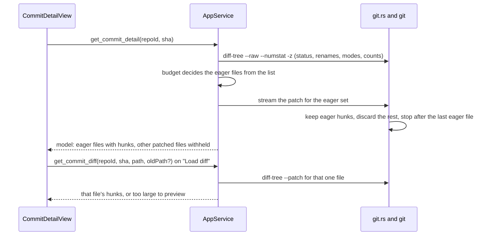
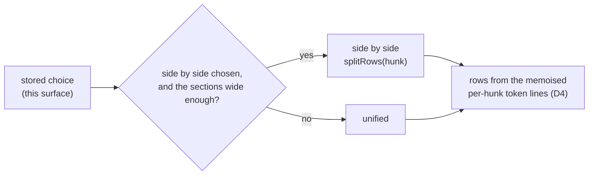

## Context

Commit detail (archived as part of `2026-05-29-add-commit-graph-rail`) was deliberately shipped as stage 2 of three: "clicking a commit swaps the center pane to `--stat` + a raw unified diff". Stage 3, "file-tree navigation, per-file collapse, syntax highlighting, +/- gutters, as in the reference screenshot", was recorded as a deferred fast-follow. What exists today:

- **Data.**
  - `commit_files` (`crates/openspec-core/src/git.rs`) runs `git diff-tree --name-status` and `--numstat` for one commit and joins them by path.
  - It does no rename detection, so a rename arrives as a deletion plus an addition.
  - It passes neither `--root` nor a merge option, so a root commit and every merge return no files.
  - `commit_diff` runs `git show --format= <sha> -- <path>` once per file and decodes it strictly, so a file in another encoding shows "No textual diff." and nothing else is affected.
  - Both pass the reference after the end-of-options marker, and the service refuses any reference that is not a 4–64 character hex id before calling them (`is_object_id`; `commit-graph`: *Commit References Are Injection-Safe Arguments*).
  - Both are confined to registered repositories (*Commit Reading Is Restricted to Registered Repositories*).
- **Transport.** `CommitDetailView` asks for the file list, then fetches every file's diff in parallel: one IPC call and one `git` process per file, with no size cap. The workspace-file browser caps its reads at 5 MiB (`MAX_WORKSPACE_FILE_BYTES`, "file is too large to preview"), but diffs have no equivalent.
- **Rendering.** `DiffBlock` splits the raw text on newlines and colours each line by its prefix (hunk, file header, added, removed), one DOM node per line, with no gutters, highlighting, collapse or navigation. It renders unified only, and long lines scroll sideways (`white-space: pre`, `overflow-x: auto`).

The read-only pull-request viewer (change `pull-request-viewer`) needs to render a pull request's changed files. Its diffs arrive as provider text:
- BitBucket sends a full unified diff.
- GitHub sends per-file `patch` fields that start at `@@`, with no file headers, while status, paths and counts arrive as JSON.

Both are parsed in `openspec-app`, which can hand a frontend a model but not a component. Rendering commit detail and pull requests from one model is what keeps the two from drifting. Reviewers also asked to choose between a unified and a side-by-side diff.

`highlight.js` already ships in the bundle, reached through `rehype-highlight` 7 → `lowlight` 3, and `App.css` styles its `hljs-*` classes for fenced code. Some colours are literals and some come from tokens; comments use `--text-faint`, and titles use `--accent`. All of them are guaranteed 4.5:1 only against the code well (`visual-identity`: *Syntax Highlight Palette*).

The codebase has two homes for a display choice:
- **An application setting**, used for the reading width. It is shared by every surface, mirrored for first paint, and announced to open windows by its own event.
- **Per-surface view state in `localStorage`**, used for pane visibility and pull-request panel collapse. It is shared by every window of one surface: desktop windows share one origin, and so do a served instance's tabs. The desktop app and a browser tab never share it.

## Goals / Non-Goals

**Goals:**

- One diff model, produced in Rust from either git's output or provider text, and rendered by one component for commit detail now and the pull-request viewer next.
- A unified and a side-by-side layout of that one model.
  - The reader chooses between them in the diff view, and each surface remembers the choice.
  - Highlighting is computed once per hunk side and escapes once per line, and both layouts draw on that; slots and budgets are identical in both.
  - A switch re-reads nothing.
- Bounded work per commit: a fixed number of `git` processes and IPC calls whatever the file count, and line and byte budgets that keep the page responsive on a large commit.
- A truthful file list: renames, type changes, modes, root commits and merges.
- Highlighting that matches markdown code blocks and keeps the contrast floor on tinted lines.
- Diff lines and paths that cannot hide what they contain.
- Pure, separately tested parser, budget and layout logic. The parser and budget sit in `openspec-core`, where the mutation gate reaches them; the layout decisions sit in a bun-tested frontend module.

**Non-Goals:**

- Word-level emphasis.
- Pairing a change block's lines by similarity. Side by side pairs them by position (D8).
- An ignore-whitespace toggle.
- Virtualised rendering.
- Expanding a hunk's context to the full file.
- A layout per file or per window.
- A keyboard shortcut, menu item or Settings row for the layout.
- Making commit detail addressable, or any change to the graph or rail.
- The full-message fix in the commit header.
- Any terminal surface.

## Decisions

### D1. Parse in `openspec-core`; the frontend renders a model

```rust
pub struct DiffFile {
    pub old_path: Option<String>,   // None when added
    pub new_path: Option<String>,   // None when deleted
    pub old_mode: Option<String>,   // git's octal mode; None when the source gives none
    pub new_mode: Option<String>,
    pub status: FileStatus,
    pub additions: Option<u32>,     // None when the source gives no count
    pub deletions: Option<u32>,
    pub content: DiffContent,
}
pub enum FileStatus { Added, Modified, Deleted, Renamed { similarity: Option<u8> },
                      Copied { similarity: Option<u8> }, ModeChanged, TypeChanged }
pub enum DiffContent { Hunks { hunks: Vec<Hunk> }, // empty: no textual change
                       Withheld,                   // held back by the budget; loadable
                       TooLarge,                   // past a ceiling, or a provider omitted its patch for size
                       Binary }
pub struct Hunk { pub old_start: u32, pub old_lines: u32, pub new_start: u32, pub new_lines: u32,
                  pub section: Option<String>, pub lines: Vec<Line> }
pub struct Line { pub kind: LineKind,   // Context | Added | Removed
                  pub old_no: Option<u32>, pub new_no: Option<u32>, pub text: String,
                  pub no_newline: bool }  // this line ends its file without a newline
```

`diff.rs` exposes two pure functions plus the budget decision of D2:
- `parse_diff(text) -> Vec<DiffFile>` reads git's and BitBucket's full unified diffs;
- `parse_hunks(patch) -> Vec<Hunk>` reads a header-less per-file patch such as GitHub's `patch` field. The caller builds that file's `DiffFile` from the provider's own status, paths and counts.

The parser understands:
- git's extended headers (`rename from/to`, `copy from/to`, `similarity index`, `new/deleted file mode`, `old/new mode`, `Binary files … differ`, `Subproject commit`);
- git's C-quoted paths;
- the `\ No newline at end of file` marker, which it folds into the line before it as `no_newline`. That line may be removed, added or context. The marker never becomes a line of its own, so its side is decided here, where `cargo test` and the mutation gate reach it, and no layout has to look backwards to place it.

It assigns line numbers from the hunk ranges, and the header shows old and new modes whenever they differ.

The model carries no layout. Both layouts render from the same `Hunk.lines`, whose order, kinds and `old_no`/`new_no` decide every side-by-side row (D8). Nothing on the wire depends on the layout, and switching never re-reads.

`ModeChanged` stays the status of a mode-only change, so a file that is both edited and made executable reads `Modified` with its modes shown. A type change, which git prints as a deletion section followed directly by a creation section for the same path, folds inside `parse_diff` into one `TypeChanged` file carrying both sections' hunks. The fold applies whenever the two sections' `deleted file mode` and `new file mode` differ in file type, so it holds for a commit, for provider text and for a one-file read alike.

Bytes are decoded with `String::from_utf8_lossy`, per patch line and per `-z` record, never as one strict string. A file in another encoding shows replacement characters in its own lines or path, and no other file is affected. That matters for the list too: `-z` prints paths verbatim, where today's list C-quotes bytes of 0x80 and above.

Paths are never guessed from ambiguous headers. `-z` does not apply to patch output, git C-quotes unusual names, and it leaves spaces unquoted in the `diff --git` line. So:
- **For a commit**, each patch section, after the type-change fold, is paired with its `-z` file-list record (D2) by git's output order, and paths come from that record.
- **For provider text**, paths come from `rename from/to` or `copy from/to`, else from `---`/`+++`, dropping the tab git appends after a name that contains a space.
- **Only for a section with neither** (a mode-only change, an empty added or deleted file, a binary file) is the `diff --git` line read, split where its two halves name the same path.

On the wire:
- Structs cross IPC with `rename_all = "camelCase"`. `no_newline` is `noNewline`, defaulted and skipped when false.
- `FileStatus` and `DiffContent` are tagged unions, `#[serde(tag = "kind", rename_all = "camelCase", rename_all_fields = "camelCase")]`, as `ArchiveScope` is.
- `LineKind` is a camelCase string enum.
- `wire_shape.rs` populates every variant and field, `noNewline` included. It asserts each `LineKind` value with `assert_wire_value` (`removed`, …), and each union's discriminant by exact value through `["kind"]` (`modeChanged`, `typeChanged`, `tooLarge`, …), as `workspace_view_discriminants_match_the_declared_union` does.

*Rejected — keep parsing in TypeScript, as `DiffBlock` does by line prefix.* The frontend is a pure consumer by convention, and parsers belong where `cargo test` and the mutation gate reach them. The pull-request viewer also parses provider diffs in `openspec-app`, which cannot call a TypeScript parser.

*Rejected — compute diffs with a library (`similar`, or `git2`'s diff).* SpecForge would then disagree with git about renames and hunks. `git2` would also add a native dependency, and it would bypass two things: `git_command`, the chokepoint that carries WSL routing and the test invocation log; and the call sites that place every reference after `--end-of-options`.

*Rejected — keep the no-newline marker as a line kind.* Every layout would have to work out its side from the line before it, outside the mutation gate. Side by side would then risk placing it opposite an unrelated line, as GitLab's renderer can.

`diff-tree` is plumbing. It honours git's core diff settings, such as `diff.renameLimit`, but none of the porcelain's display settings (`diff.algorithm`, `diff.context`). That keeps its output stable to parse and its context fixed at three lines. A user who sets `diff.algorithm` or `diff.context` therefore sees git's default hunks here, where today's `git show` read follows those settings.

### D2. A fixed number of `git` processes per commit, and line and byte budgets



The file list comes from one invocation, `git diff-tree -r -M --root --no-commit-id -z --raw --numstat`, which replaces today's two. Its records arrive in the same order:
- the raw records give each file's status letter (A, M, D, T, or R with its similarity) and its old and new modes;
- the numstat records give the counts.

The budget is a pure function in `diff.rs`. It decides only among patched files, that is, files with a patch to show, taken in the model's file order. A `Binary` file, or one already `TooLarge` (a provider omitted its patch, or it lies past a read ceiling), keeps its own state, adds nothing to the total and is never `Withheld`. With $$c(f)$$ the added plus removed lines of file $$f$$, a file arrives with its hunks exactly when:

$$\text{eager}(f) \iff \text{patched}(f) \;\wedge\; c(f) \le 500 \;\wedge\; c(f) + \sum_{g \prec f,\ \text{eager}(g)} c(g) \le 3000$$

Every other patched file is `Withheld`, and so is one a byte limit cuts off. Lines are not bytes, so two byte limits apply as the patch streams:
- a file is withheld once its own patch text passes 64 KiB;
- once the eager files' patch text reaches 1 MiB in total, every remaining file is withheld and reading stops. The file whose text reaches it keeps its hunks, so the eager text stays under 1 MiB plus one file's 64 KiB.

A capped file's lines stay in the line total, so the eager set only shrinks from what the list decided.

Context lines are not counted. With three lines of context either side, a unified page renders at most about seven lines per counted line. Side by side, the same page has no more rows, but each context line fills both columns, so it holds up to about thirteen code cells per counted line. The budgets are decided before any layout and never depend on it. The measurement under Risks is taken in both layouts, on rendered cells, and the constants are confirmed against the heavier one.

The 3,000-line total and both byte limits are SpecForge's own constants for page responsiveness, to be confirmed by that measurement. GitHub's own one-call diff stops much later, at 20,000 lines, 1 MB or 300 files. The 500-line single-file threshold sits close to GitHub's own automatic load of 400 lines or 20 KB per file. None of them is a setting. `openspec-app` applies the same decision, and the same byte limits, to a pull request's detail in `pull-request-viewer`.

`git.rs` reads the patch for the eager set the service passes it, through `git_command`, from one invocation: `git diff-tree -r -M --root --no-commit-id --patch`, read as a stream. It:
- keeps eager files' hunks;
- discards the patches of withheld files it passes over;
- gives up, withholding every remaining file, once 8 MiB of patch text has been read in all;
- after the last eager file, closes the pipe, kills the child and waits for it.

A child `git.rs` stopped deliberately counts as a success, not as the failed exit the existing `.output()` pattern would see. A withheld file never crosses IPC, although git may still diff one that precedes an eager file.

A withheld file renders collapsed, with its counts and a "Load diff" control. That control fetches the file alone through `get_commit_diff`, under a per-file ceiling of 8 MiB of diff text. Past the ceiling the file's content is `TooLarge` and reads "too large to preview", the wording the file browser already uses.

*Rejected — keep one IPC call and one `git` process per file.* An $$N$$-file commit costs $$N + 2$$ processes and $$N + 1$$ round trips, and there is no single place to apply a budget.

*Rejected — virtualised rendering instead of a budget.*
- Windowing breaks find-in-page, sticky headers and text selection across lines, and scroll-marking would need measured heights.
- The budgets bound the lines on the page without any of that, and the reader opens a withheld file in one click.
- Side by side keeps all three: a selection there stays in the column it started in (D8). Find-in-page reports each context match twice side by side, because a context line is in both columns.
- The budgets do not bound the number of files: every file keeps a navigator row and a section header (see Risks).

### D3. Renames, type changes, root commits and merges

- **Renames.** `-M` at git's default similarity, the same heuristic `git show` and `git log -M` use. A renamed file shows `old → new` and, when its content also changed, its hunks.
- **Type changes.** One `TypeChanged` file (D1), never a deletion plus an addition.
- **Root commits.** `--root`, so a root commit is diffed against the empty tree.
- **Merges.** A merge is diffed against its first parent as a two-tree diff, `--end-of-options <parent> <merge>`. The parent is read by the service as a hex id rather than accepted from the caller, and the view labels it "Changes against first parent `abc1234`".

*Rejected — a combined diff (`--cc`) for merges.* It shows only the paths the merge resolved by hand, so a merge that brought in fifty files would read as "changed two files".

*Rejected — leave merges and root commits empty.* "This commit changed no files" is false for both.

### D4. Highlight each hunk side with `lowlight`, and keep the contrast floor

Each hunk is highlighted twice:
- its old side, the context and removed lines, as one contiguous text;
- its new side, the context and added lines, as another.

The resulting token tree is split back into lines, so a comment or string that spans lines inside a hunk is highlighted correctly.

The two sides are exactly the two side-by-side columns:
- Side by side, the left column shows the old side's tokens for its context and removed lines, and the right column the new side's tokens for its context and added lines.
- Unified shows a removed line with the old side's tokens and an added line with the new side's.
- In unified, a context line takes the new side's tokens: the code as it now reads.

The two sides differ only where a change opens or closes a multi-line construct around a context line, which side by side shows and unified cannot. Both layouts read the same per-hunk token lines, memoised per hunk, so a switch re-tokenises nothing and highlighting costs the same in either.

The language comes from the file's extension, or from its whole name for an extensionless file such as `Makefile`. It is resolved with `registered()` on a `lowlight` instance built from the same `common` grammar set `rehype-highlight` uses by default, and an unknown language renders plain. `lowlight` becomes a direct dependency pinned to the version `rehype-highlight` resolves.

Highlighting runs in the frontend, since it is presentation, which keeps the model text-only and the IPC payload small. Side-by-side pairing (D8) runs there for the same reason.

Once tokens own the text colour, added and removed lines are told apart by a background tint and their kept `+`/`−` markers, in both layouts. The palette's 4.5:1 floor, defined today only against the code well, is extended to the added, removed and context backgrounds in both schemes (the `visual-identity` delta). Where a colour cannot clear every background, whether a literal or a token-driven class (comments at `--text-faint`, titles at `--accent`), the diff view gives it a per-scheme, per-background value under the syntax-palette carve-out. Comments are the likeliest to need one: `--text-faint` clears the code well by little (4.82:1 light, 5.01:1 dark), and a GitHub-like tint such as `#ffebe9` takes it to 4.21:1.

A side-by-side filler cell carries no text, so the floor does not apply to it. It is told from an empty line by its missing line number, which needs no colour, and by its own neutral background token.

*Rejected — tokenise each line on its own.* Every multi-line construct breaks: for example, a removed line inside a block comment is highlighted as code.

*Rejected — tokenise whole files.* That needs both full revisions of every file, which means more `git` reads and, for provider diffs, more API calls. It is a natural follow-up once full-file context exists.

*Rejected — Shiki.* TextMate grammars and a WASM engine are heavier and asynchronous, and diffs would stop matching markdown code blocks.

### D5. One `DiffView` component, two per-file slots, two layouts

`DiffView` renders a navigator and the file sections from `DiffFile[]`, in the layout D8 decides, and owns the control that chooses it.
- It accepts a loader, offered only for `Withheld` files. A `TooLarge` or `Binary` file shows its state and no control.
- Two optional slots carry everything a host adds. Neither slot is given a column; both render the same in either layout.
  - `renderFileHeaderExtra(file)` sits inside the sticky header. The pull-request viewer puts its "viewed" mark and "changed since viewed" flag there.
  - `renderFilePreamble(file)` sits between the header and the first hunk, across the section's full width. The viewer puts its review threads there.
- Hosts also pass the names of the two sides, which the toolbar shows, with D6's escapes, while side by side is in effect:
  - commit detail passes the first parent's abbreviated id, or "empty tree" for a root commit, and the commit's;
  - the pull-request view passes the base and head branch names.
- The navigator is a tree by directory, compacting single-child directories. It is keyboard-operable like the workspace tree and shows each file's status and counts.
- Activating a file scrolls its section into view, and the section being read is marked as the reader scrolls.
- Every rendered line carries a side-qualified identity, old line n or new line n, in both layouts; a context line carries both.
  - A switch keeps the reader's place by the identity of the topmost visible line.
  - A later change can anchor content to a line by side and number, as GitHub's `diffSide` and BitBucket's `inline.from`/`inline.to` give it, without knowing the layout.
- Section collapse is view state held by the component and never persisted. Unlike the layout (D8), it is not a preference. It is keyed by file, so a layout switch keeps every section's collapse, every loaded withheld file's hunks, and the marked section.
- Below the width at which the navigator fits beside the sections, it folds into a list above them. A container query on the view decides, as Settings does, never a media query.
- While side by side is chosen, the navigator also folds wherever keeping it beside the sections would leave them under side by side's entry threshold (D8), so widening the view never turns side by side off. Script decides this fold from the view's width less the navigator's, in the code-font units D8 measures, and sets an attribute the stylesheet folds on. A container query cannot decide it, because the `ch` in its condition resolves in the view's own font, not the code font.

`CommitDetailView` keeps only its header and passes the model through.

*Rejected — a second renderer for pull requests.* Two renderers drift. Every host passes a loader and the two side names; the two slots are the only additions the viewer needs.

*Rejected — render both layouts and let a container query pick one.* It doubles the DOM. A side-by-side structure restyled as unified would also keep its document order (old, new, old, new), so selection, copying, find-in-page and assistive technology would read a unified-looking view out of order.

### D6. Characters that render as nothing are shown, not rendered

`DiffView` renders every character with the Unicode property Default_Ignorable_Code_Point (`/\p{Default_Ignorable_Code_Point}/u`), in lines, in each hunk header's section heading, in paths and in the side names a host passes, as a visible, marked escape. That set includes:
- the bidirectional controls;
- the zero-width characters;
- the tag characters;
- variation selectors and Hangul fillers;
- the soft hyphen and the invisible operators.

On context lines, in paths, and in titles, branch names and side names, only these are exempt:
- a U+200D between two emoji;
- one U+FE0E or U+FE0F directly after an emoji character;
- the U+FE0F of a keycap sequence: `0`–`9`, `#` or `*`, then U+FE0F, then U+20E3;
- the tag characters of the three RGI subdivision flags: U+1F3F4, then `gbeng`, `gbsct` or `gbwls`, then U+E007F;
- a U+FEFF at the very start of a context line that is both old line 1 and new line 1.

An emoji character is one with the property Extended_Pictographic, and a joiner's left neighbour may carry one emoji modifier or one U+FE0F. A section heading takes a context line's exemptions.

On an added or removed line, nothing is exempt. A change that only adds or removes one of these characters therefore never shows as two identical lines; side by side would otherwise put such lines directly opposite each other.

Every other variation selector or tag character is escaped, so a run of them after an emoji is never hidden.

A file carries a warning in its header, as GitHub's diff does, when it contains a character escaped for itself. Some characters are escaped only because their line is added or removed: ones the list above would exempt were the line context (for a U+FEFF, at the very start of the line when it is line 1 of its side). Such a character shows its escape but raises no warning, so a changed line with an emoji or a byte-order mark never cries wolf. The rule belongs to `diff-view`, so commit detail and pull requests share it, and the pull-request viewer reuses the same escapes for titles and branch names.

Escapes are decided from a line's own text, its own kind and its own line numbers, never from the layout or the facing cell. A line therefore shows the same escapes in both layouts and in either column, and the header's warning does not depend on the layout.

*Rejected — escape a fixed list of bidirectional and zero-width characters.* Tag characters carry "ASCII smuggling", instructions hidden from people but read by language-model agents, which is a real concern for a viewer of agent pull requests. Hangul fillers are valid identifier characters and have carried an "invisible backdoor". Neither is on such a list.

*Rejected — exempt whole emoji sequences.* The emoji tag-sequence grammar accepts any run of tags after U+1F3F4, so smuggled text would pass as a flag.

*Rejected — render them raw, or strip them silently.* Raw, code would read differently from what it compiles to (Trojan Source, CVE-2021-42574). Stripped, the view would hide what the file actually contains.

### D7. Same command names, existing arguments kept, new shapes, both transports

- `get_commit_detail(repoId, sha)` returns the budgeted `Vec<DiffFile>`.
- `get_commit_diff(repoId, sha, path, oldPath?)` returns one `DiffFile`, with `Hunks` or `TooLarge` content. The service passes `path` and `oldPath` as literal pathspecs (`:(literal)<path>`), so a file named `pages/[id].tsx` reads only itself, and the old path keeps rename detection intact.

The service keeps the hex-id check, and every `git` call site keeps the end-of-options marker. Both commands keep their dispatch arms on the web transport, and the break for external `/api/invoke` scripts is called out in the proposal.

*Rejected — new command names beside the old ones.* That leaves two shapes for one view. The bundled frontend moves with the change, which is the trade `get_my_pull_requests` → `get_bitbucket_pull_requests` already accepted.

### D8. Unified or side by side: one model, two layouts, a per-surface choice



**The two layouts.**
- **Unified.** One column. Each line shows its old and new numbers, its marker and its text, in the model's order. Long lines scroll sideways inside their file section, as today.
- **Side by side.** One grid per file with four columns of fixed halves: old number, old code, new number, new code.
  - A context line fills both cells of one row.
  - A change block is a maximal run of removed and added lines that no context line interrupts.
  - `splitRows(hunk)` walks it with one open slot, the earliest left-only row of the block not yet given a partner. A removed line opens a left-only row. An added line fills the open slot's right cell, or opens a right-only row when no slot is open. So the i-th removed and i-th added line of a git block share a row, and fillers sit at the bottom of the shorter side, which makes max(k, m) rows for k removed and m added lines. Interleaved provider text such as −a +b −c +d pairs a with b and c with d. An added line never pairs with a removed line that comes after it.
  - A line with no partner faces a filler cell. A filler has no number, no marker and no text, uses its own background token, is hidden from assistive technology, and is never selected or copied.
  - Long lines wrap inside their cell, breaking anywhere, with no line number on the continuation. A row takes the taller cell's height, so paired lines stay level.
  - A file whose every line is on one side, with no context line at all, renders in one full-width column headed by that side: every added or deleted file, and one emptied or filled from empty. Half its width would otherwise be filler.
  - A file with any context line keeps both columns, even if its hunks only add or only remove. Its context lines then face each other with both numbers, and a thread on either side's line can be found.

**Both layouts:**
- the hunk header, `@@ -a,b +c,d @@` with its section heading, is one full-width row;
- a `Withheld`, `TooLarge`, `Binary` or hunk-less file is the same full-width state row, with the same loader, and a withheld file loaded while side by side is in effect renders side by side;
- the no-newline flag shows as a small badge in each cell that shows the line it marks, so a flagged context line carries it on both sides;
- the sticky file header is the section's own child above the rows. It is never a grid item, and it sits outside the unified layout's horizontal scroller, which wraps the lines alone as `.diff-block` does today;
- tabs render at one width;
- markers stay visible.

The layout never reaches the service. The budgets (D2), the payload and the per-file read are the same in both layouts.

**The choice.** A two-option radio group, "Unified" and "Side by side", sits in the view's toolbar.
- It is a new `ChoiceGroup` that reuses the `.settings-choice` styles and adds the workspace tint palette's arrow-key contract: the checked option is the single tab stop, and the arrow keys move and select with wrap. Settings' own choice rows keep their markup and keyboard behaviour.
- It has text labels and is always visible, never revealed on hover (`touch-input`).
- A switch applies at once to the view where it is made, and is stored under `specforge.diffLayout` in that surface's `localStorage`. Every desktop window shares one origin and so one choice, while each served instance's browser keeps its own.
- Every diff a surface opens afterwards starts in the stored layout: another commit, or a pull request opened or reloaded, in the center pane or its own window. A view that is open keeps its layout until the reader switches it there or opens another commit or pull request; a re-read of the same pull request keeps it.
- Any stored value other than exactly `split` reads as unified, the default, by the exact-value rule `commitHistory.ts` uses.
- Reads and writes are best-effort. A failed write keeps the choice for that view only.
- The layout is in no address and in no window's URL.

**Narrow views.** Side by side is in effect only when it is chosen and the file sections are wide enough for two columns.
- The sections column's width is read synchronously in a layout effect before the first paint, and kept current with a `ResizeObserver`, as `FigureLightbox` does. The rows render once it is known. It is never the window's width, and a container query cannot swap row structures.
- The threshold is expressed in `ch` of the code font. A hidden probe set in that font, observed with the column, converts the width, so the threshold follows font size and zoom. Side by side comes into effect at 104 ch and leaves below 96 ch. That gap keeps a scrollbar that appears after a switch from flipping it straight back.
- While the fallback holds, the control keeps "Side by side" selected and says "Too narrow — showing unified", through visible text and `aria-describedby`. The stored choice is never rewritten, so widening the view brings side by side back.

**Selection and copying.**
- A pointer-down in a side-by-side code cell names that side on the whole view. Every file's grid then turns off selection in the other column, so a drag into the next file stays on that side.
- The side stays named until a pointer-down outside a code cell, or until a pointer-up leaves the selection collapsed or outside the view. The collapsed caret a pointer-down leaves before a drag never clears it.
- A copy handler builds the clipboard text from the model, not from the DOM, for a selection whose two ends lie in code cells of one file while unified is in effect or a side is named. Side by side that is the named side's lines; in unified, the selected lines in the order shown. Either way it is code text only, with no gutters, markers, fillers or badges, and partial first and last lines are honoured.
- Any other selection copies its text in document order: one reaching a file header, a preamble such as a review thread, or a hunk row, one spanning files, or, side by side, one made while no side is named. It still leaves out gutters, markers, fillers and badges.
- Every copy yields the file's real characters: an escaped character (D6) is copied as itself, not as its escape glyph.
- The handler is needed because the code cells show escape glyphs that a copy must replace with the real characters. It also covers WebKit before 257749@main (December 2022), which copied text that `user-select: none` only hid visually. It is verified in the desktop app on each platform and in the browser skin.

**Accessibility.**
- Each two-column file grid carries visually hidden column headers: old line, old, new line, new; a one-column file carries the two that name its side.
- Each line-number cell is named by side and kind, for example "old line 12, removed".
- Reading order follows visual order, because each layout is its own structure.
- Fillers are hidden.
- The control exposes the fallback's reason. Unified stays fully equivalent for anyone who reads linearly.

**Across a switch.** Collapse, loaded withheld files and the marked section are kept per file (D5). The reader's place is kept by the side-qualified identity of the topmost visible line. Token lines and rows are memoised per hunk, so a switch re-tokenises nothing and re-reads nothing.

*Rejected — an application setting, as the reading width is.*
- The reader chose the layout in the diff view, not in Settings. The BitBucket panel's design put its position in settings for two reasons: the user asked for it in the configuration, and a layout preference belongs there when it should follow the user between the desktop and the browser skin. The next bullet shows this one should not.
- Settings are shared by every client of a served instance, so choosing unified on a phone would switch the desktop.
- Pane visibility, the precedent for an in-place layout toggle, is view state for the reason `hide-side-panels` recorded: storing it in settings "would leak one surface's layout into another".
- A setting would also need get and set commands in four places, an event on both transports, a Settings row, and tolerance in the terminal.

*Rejected — follow a switch live in other open windows.* A window the reader is not looking at would re-lay out every section, at the cost the Risks measure, for a choice made elsewhere, and nothing in the frontend listens for storage events today.

*Rejected — pair a change block's lines by similarity.* It is a heuristic that word-level emphasis would have to share. It waits for that change, which can move pairing and emphasis to `openspec-core` together.

*Rejected — compute side-by-side rows in `openspec-core` and send them.* The payload would carry each hunk twice, or row indices for a layout the reader may never choose. Pairing reads only line order and kind, which the model already carries, so it stays in the frontend as highlighting does (D4). It lives in `src/diffLayout.ts`, a pure module with bun tests, because the mutation gate does not reach `src/`.

*Rejected — a smaller budget side by side.* The service would have to know the layout, a switch would re-read, and the two layouts would withhold different files.

*Rejected — independently scrolled columns, or two synchronised scrollers.* Rows drift apart as soon as anything wraps, and scroll syncing jitters. GitHub, GitLab and Gerrit render one grid per file.

*Rejected — a layout per file or per window.* A reader chooses how they read diffs, not how one file reads, and persisted per-file entries would accrue with nothing to prune them.

## Risks / Trade-offs

- [The budgets hide content a reader expected to see] → Every file stays in the navigator with its counts, a withheld file is one click from its diff, and the header states how many files are not shown in full.
- [Highlighting a commit at the budget blocks the main thread] → The line and byte budgets bound the work. Measure rendered cells in both layouts on the largest commit in this repository, and the cost of switching layouts on it. If the cost is visible, highlight a section when it is first expanded rather than all at once.
- [A commit that touches thousands of files renders thousands of section headers and navigator rows] → Measure the commit with the most files as well as the largest one, in both layouts. If the cost shows, sections past the first 1,000 files render when the navigator reaches them.
- [Switching layout on a page at the budget re-renders every section and moves the reader] → Rows and token lines are memoised per hunk, and the reader's place is kept by the topmost line's identity. The switch is measured with the rest.
- [A reader who chose side by side sees unified in a narrow pane and takes the control for broken] → The control says the view is too narrow, and the choice is kept for wider views.
- [Copying from side by side mixes old and new code] → Selection stays in the column it started in, and copies are built from the model, without gutters, markers or fillers.
- [Pairing by position suggests a line became the one facing it] → Markers and tints stay per line, and similarity pairing waits for word-level emphasis.
- [A change only in trailing whitespace or line endings shows two identical-looking lines] → The counts and markers still show a change. Marking such changes waits for word-level emphasis (Open Questions).
- [Changed lines with an emoji or a byte-order mark show escapes] → The escape is what makes a change of only a selector or a mark visible. It raises no warning (D6), so the warning stays reserved for characters escaped wherever they appear.
- [A copy carries hidden characters into wherever it is pasted, an agent's prompt included] → The copy stays faithful, so pasted code behaves as the file does. The escapes and the header's warning have already shown the reader what it holds.
- [Find-in-page finds each context line twice side by side] → It is inherent in two columns, as on GitHub and GitLab, and stated in D2.
- [The desktop app and a browser keep different layouts] → This is by design: the choice is per surface, like pane visibility.
- [A withheld file early in git's order is still diffed and piped] → `git.rs` discards it as it streams, and the 8 MiB read ceiling bounds the worst case.
- [Rename detection is slow on a commit that touches thousands of files] → git's own `diff.renameLimit` bounds it, and the user's `diff.renameLimit` applies as it does on the command line.
- [A user's `diff.algorithm` or `diff.context` stops applying] → Stated in D1. The fixed three-line context is what the line budget and the reviewer's expectations are measured against.
- [First-parent diffs surprise on a "merge master into feature" commit] → The label names the parent. A parent switcher is a follow-up if it proves wanted.
- [Token colours lose contrast on tinted lines] → The `visual-identity` delta makes the floor normative on every diff background in both schemes and both layouts, literal and token-driven classes alike, and the existing contrast measurement extends to them.
- [`lowlight` drifts from the version `rehype-highlight` resolves] → Pin it to the same version and keep them aligned, as `katex` is kept aligned with `rehype-katex`.
- [Scripts calling the two commands over `/api/invoke` break] → **BREAKING** in the proposal and the release notes; the bundled frontend is updated in the same change.

## Open Questions

- Should word-level emphasis be computed in `openspec-core`, where it is testable, or in the frontend? The leaning is core, in its own change. Emphasis needs the same pairing side by side uses (D8). If emphasis moves to core, pairing moves with it and goes on the wire then, and D8's rule is what both follow.
- Should a reader's collapsed sections survive switching commits? The proposal is no: collapse is view state. The layout, by contrast, is a remembered choice (D8).
- Should a pull request's own window open side by side when nothing has been stored yet, since it is sized for two columns? That would need a default per presentation.
- Should a changed line mark a trailing carriage return or trailing whitespace, so a line-ending-only change is visible? Doing it without flooding every line of a CRLF file needs the facing line, which is word-level emphasis's territory.
