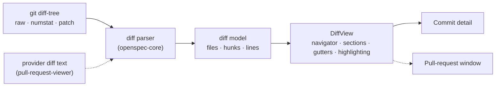

# Rich, Navigable Diff View

## Why

The commit-detail view renders each changed file as a raw unified diff in a prefix-coloured `<pre>`: no syntax highlighting, no line numbers, no way to move between files, and no limit on how much it renders. The richer viewer was planned from the start and deferred twice:
- as stage 3 of `add-commit-graph-rail` ("file-tree navigation, per-file collapse, syntax highlighting, +/- gutters");
- in `CommitDetailView.tsx`'s own comment ("a richer, navigable diff viewer is the documented follow-up").

It is due now because the read-only pull-request viewer (change `pull-request-viewer`) needs the same view for a pull request's files. Building it once, over a parsed diff model, upgrades commit detail today and gives the viewer its "Files changed" body without a second renderer.

## What Changes

- **A parsed diff model in `openspec-core`.** A pure parser reads git's unified-diff output, and a second entry point reads a header-less per-file patch such as GitHub's. Both produce the same model:
  - **Files**, each with old and new paths and a status: added, modified, deleted, renamed, copied, mode-only or type-changed.
  - **Each file's content**, in one of four states: its hunks, held back by the budget, too large to preview, or binary.
  - **Hunks**, each with old and new ranges and its section heading.
  - **Lines**, each context, added, removed or the no-newline marker, with old and new line numbers.

  The frontend renders the model and parses nothing, and the pull-request viewer will feed it from the providers' diff text.
- **One bounded read per commit.** Commit detail reads the commit in a fixed number of `git` processes, instead of one IPC call and one process per file.
  - Files that fit a line budget arrive with their hunks.
  - Larger files arrive with their counts and load when the reader asks.
  - A file past the per-file ceiling says it is too large to preview.
  - Binary files are listed without a diff.
- **A file navigator.** A collapsible tree of the changed files, by directory, showing each file's status and counts. Activating a file scrolls to it, and the file being read is marked as the reader scrolls.
- **File sections.** Each file is a section with:
  - a sticky header: the path (old → new for a rename), the status, the counts and a collapse toggle;
  - old and new line-number gutters;
  - lines that keep their `+` and `−` markers, so additions and removals are never conveyed by colour alone.
- **Syntax highlighting.** Diff lines are highlighted by the file's language with the same grammars as fenced code in rendered markdown. A language the highlighter does not know renders plain. Every token colour keeps the palette's 4.5:1 contrast floor on the added, removed and context line backgrounds as well as on the code well.
- **Hidden characters made visible.** Bidirectional controls and zero-width characters in a line or a path render as visible, marked escapes, and the file's header warns, as GitHub's diff does. Code can no longer read differently from what it contains.
- **A file list that tells the truth.**
  - A rename is detected and shown as one renamed file, rather than a deletion plus an addition.
  - A type change (file ↔ symlink ↔ submodule) is one file.
  - A root commit lists the files it added, where today it says "This commit changed no files".
  - A merge commit shows its changes against its first parent, labelled as such, where today it shows no files.
- **One shared component.** `DiffView` takes the model and two optional per-file slots, one in the header and one between the header and the first hunk. The pull-request viewer can then add its "viewed" mark and its review threads without forking the renderer.
- **BREAKING** for any external script that reads `get_commit_detail` or `get_commit_diff` over the browser skin's `/api/invoke`. Both keep their names and arguments and return the new model. The bundled frontend moves in the same change.

## Capabilities

### New Capabilities

- `diff-view`: the shared diff presentation, independent of where a diff came from. It covers the model's meaning (statuses, content states, hunks, line numbers), the file navigator, file sections and their collapse, the gutters, syntax highlighting, visible hidden characters, the line budget with on-request loading, and keyboard and accessibility behaviour.

### Modified Capabilities

- `commit-graph`: *Commit Detail View* renders its files through the `diff-view` capability, reads the commit in a bounded number of `git` processes, detects renames and type changes, lists a root commit's files, and shows a merge commit's changes against its first parent.
- `visual-identity`: *Syntax Highlight Palette* extends its 4.5:1 floor from the code well to the diff view's added, removed and context line backgrounds, in both schemes.

## Impact

- `crates/openspec-core/src/diff.rs` (new): the two pure parsing entry points, the model types and the budget decision. It ships with fixture tests, so the mutation gate has assertions to catch. Fixtures cover:
  - renames and type changes;
  - a submodule change, mode changes, binary markers and no-newline markers;
  - C-quoted non-ASCII paths and names containing spaces;
  - empty, added and root diffs;
  - a diff cut mid-section, and a budget boundary.
- `crates/openspec-core/src/git.rs`:
  - one `diff-tree --raw --numstat -z` file list;
  - a streamed, budgeted patch read whose child process is stopped and reaped deliberately;
  - a first-parent diff for merges;
  - literal pathspecs for the per-file read;
  - every reference still passed after the end-of-options marker (`commit-graph`: *Commit References Are Injection-Safe Arguments*).
- `crates/openspec-app/src/service.rs`: commit detail assembles the budgeted model, and the per-file read returns one file on request. The hex-id check (`is_object_id`) stays where it is.
- `crates/specforge/src/commands.rs`, `crates/specforge-web/src/dispatch.rs`, `src/api.ts`: the two commit-detail commands return the model on both transports.
- `crates/openspec-app/tests/wire_shape.rs`, `src/types.ts`: the model's types, every variant populated, discriminants asserted by exact value, mirrored by hand.
- `src/components/DiffView.tsx` (new), `src/components/CommitDetailView.tsx`, `src/App.css`: the navigator, sections, gutters, highlighting, hidden-character escapes, and per-scheme line tints that keep the palette's floor. Commit detail becomes its header over a `DiffView`.
- `package.json`: `lowlight` becomes a direct dependency at the version `rehype-highlight` already resolves, so diffs and markdown code blocks share one highlighter.

**Deliberately unchanged.**
- **Not added:** no split (side-by-side) view, no word-level emphasis, no ignore-whitespace toggle and no virtualised rendering. The model leaves room for each, and the budget is what bounds the page.
- **Navigation untouched:** no change to the commit graph, the rail or the address grammar. Commit detail stays the unaddressed center-pane view it is today.
- **Terminal untouched:** the terminal frontend has no commit detail.
- **The header message stays as it is.** It shows only the subject, which already falls short of the "full message" *Commit Detail View* requires. That is a separate fix, so this change stays about the diff.
- **Still read-only:** no `git` operation that writes is added.
