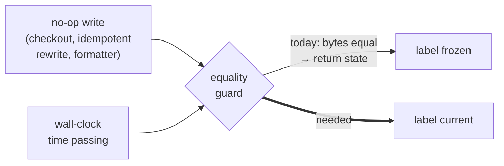

## Context

The identity header names the change and its branch. It does not say when the artifact last moved, and the value needed to say so does not cross the IPC boundary: `AppService::read_artifact` returns `Result<String, String>`.

Two facts shape everything below.

**The pane is already live.** `auto-refresh-artifact-view` re-reads the open artifact on every watcher batch, so this is not a staleness indicator. It answers "how long has this sat", which is a question about elapsed time rather than about the view.

**The pane is aggressively guarded against repainting.** `refreshPolicy.ts`'s `reduce` returns the *same object* when a watcher-driven read yields identical bytes, and its doc comment states why: so React skips the re-render "and the reader's scroll position is never disturbed by a refresh that carried no news." That guard is load-bearing — it is what makes the deliberately unfiltered watcher subscription free — and a timestamp collides with it from two directions at once. A no-op write moves the time while the bytes compare equal, and the passage of time moves the *label* while nothing on disk changed at all.



The narrow reading of the problem is "add a field to a return type". The actual problem is that the pane is built to not repaint, and a clock has to.

## Goals / Non-Goals

**Goals:**

- The header reports when the artifact currently rendered last changed, per *artifact*, not per change directory.
- The label stays true while the pane sits open — under both a no-op write and the mere passage of time.
- The label cannot move the change name, at any width, on any tick.
- Widening the guard costs no markdown re-render.

**Non-Goals:**

- A timestamp in the terminal frontend. It has no identity header; giving it one is a `terminal-ui` layout question of its own.
- Any signal derived from git history — last commit, last author, age of the branch. Those are provenance facts from a different subsystem with a different cost profile. This is `stat`.
- A timestamp on the workspace tree, the Dashboard, or the file browser.
- Changing what triggers a refresh. The subscription, the debounce, the coalescing, and the sequence-token ordering all stay exactly as `auto-refresh-artifact-view` left them.

## Decisions

### D1: Per-artifact modification time, not the change directory's

`ChangeInstance.modifiedAt` already crosses the IPC boundary, is already a `DetailPane` prop, and is already reached by the exact walk `branchChipForWorktree` runs to find the branch. Returning it costs a third field on `BranchChip` — no Rust, no IPC, no mutation gate. It is free.

It is also wrong. `newest_mtime()` (`repo_view.rs:1224`) recurses the whole `openspec/changes/<id>/` directory and returns the newest mtime under it. So while an agent ticks boxes down `tasks.md`, a reader parked on `proposal.md` would see the header report the proposal as changing every few seconds. The single scenario this application exists for is the one where the free value lies, and it lies in the direction that inspires the most misplaced confidence.

So the time comes from the artifact's own file, which means it comes from the read.

*Rejected: ship the free one and refine later.* The refinement is the entire change; what would ship first is a header that is wrong precisely when someone is watching.

### D2: One struct from one call, and `stat` **before** the read

The alternative to changing `read_artifact`'s shape is a second command — `artifact_modified_at` — leaving the existing signature alone. That halves the diff and doubles the failure modes: two calls resolve the same path at two instants, the frontend has to pair their results, and nothing in either signature says the pair must be of the same read. Every refresh becomes two IPC round-trips whose results can disagree.

Returning both from one call makes the mismatch unrepresentable, which is the same reasoning D4 of the tint change applied to the branch and its colour.

Within that call the **ordering matters**, and it is not the obvious one:

| | reported time | failure when a write lands mid-call |
|---|---|---|
| read, then `stat` | mtime of the *newer* write | header claims the bytes are fresher than they are — a false "just now" |
| `stat`, then read | mtime at or before the bytes' own | header claims the bytes are older than they are — a stale-looking label |

`stat` goes first. Both orderings are corrected by the next watcher batch, but they fail in opposite directions while uncorrected, and for a freshness indicator a false "just now" is the worse lie: it is the one a reader acts on.

*Rejected: read the metadata from the already-open handle after reading.* Tidier, and it is the read-then-`stat` row.

### D3: Widening the guard and memoizing the markdown are one decision, not two

Widening `reduce`'s comparison to `(content, modifiedAt)` is a two-line change that, on its own, is a regression. `MarkdownView` is not memoized, so a new state object re-runs remark/rehype, every `MermaidBlock`, KaTeX, and the SVG gate — on every no-op write, to move a text label. The guard exists to prevent exactly that.

Memoizing first turns the trade into a fix. And the boundary happens to be clean:

```
MarkdownViewProps      DetailPane.tsx:329        FileBrowserView.tsx:343
  content: string        content                   content
  containerRef?: Ref     useRef (line 85) ✓        (omitted)
  root: string           target.workspace          root
  basePath: string       artifactBasePath() → str  selectedPath ?? ""
```

Four props, both call sites: three strings and one `useRef`. No callbacks, no inline object or array literals. `React.memo` with its default shallow comparison applies with no custom comparator and no restructuring — and `FileBrowserView` is shielded for free.

The scroll-anchor effect is unaffected: its deps are `[scrollAnchor, content, loading]`, and `content` is referentially equal across a modification-time-only update, so the anchor cannot re-fire and pull the reader.

*Rejected: widen the guard alone.* Correct label, and it pays a full markdown re-render for it — undermining the reading-position guarantee the guard was written to provide.

*Rejected: hold the modification time outside the reduced state, in its own `useState`.* It does not help. Setting that state re-renders `DetailPane`, which re-renders `MarkdownView` just the same. Without the memo there is no arrangement of state that avoids the re-render; with it, the plain widening is the simplest thing that works.

### D4: A relative label that ticks, and what makes that affordable

Absolute time (`14:32`) is structurally immune to everything in this design — no timer, no freeze, nothing to tear down. It is also the wrong answer to the question. "How long has this sat" asked of a clock face requires the reader to do arithmetic against a number the header does not show.

Relative day labels (`today` / `3 days ago`), reusing the `graph-rail-relative-day-labels` vocabulary, need no timer and are stable for a day at a time — but they are silent about the minutes-scale movement that is the whole point of watching an agent work.

So: relative, at the granularity the elapsed interval warrants, advancing on its own.

The cost of "advancing on its own" is what made this unattractive before D3. An interval that re-renders `DetailPane` used to mean re-rendering the entire document; behind the memo it costs a text node. The decision to memoize is what makes the honest formatting choice cheap, which is why D3 and D4 are worth reading together.

Two details the formatter owns:

- **The tick is never finer than the unit displayed.** A label reading in days does not need a per-minute wakeup. Recomputing on a cadence tied to the displayed unit keeps a pane parked on an old artifact from waking every few seconds forever.
- **A future modification time clamps to the present.** Clock skew, a restored archive, and a network filesystem all produce files stamped in the future. `in 4 minutes` reads as a bug in the application rather than as a fact about the file, so the formatter floors the elapsed interval at zero.

The interval is owned by the header and torn down with it — the same contract the copy confirmation already carries: it SHALL NOT outlive the artifact it described.

### D5: A reserved constant box, because the name absorbs every width change

`.detail-identity-inner` is a single, non-wrapping flex line. `.identity-name` carries `min-width: 0` and `overflow-wrap: anywhere`; `.identity-branch` is `flex: 0 0 auto`. The name is therefore the only element that yields, and it yields by re-wrapping **at any character** — mid-slug.

A ticking label changes width on a timer: `9 min ago` → `10 min ago` gains a character, `59 min ago` → `1 hour ago` loses one and changes shape. Dropped onto that flex line unreserved, each tick re-lays-out the change name under a reader who is looking at it.

The header's own spec already forbids this, for the click-driven case:

> Confirmation SHALL NOT change the layout of the header — no label substitution, no added or removed glyph — because the name shares a flex row with the branch chip and may wrap, so any width change would move the row on every copy.

A timer-driven width change is the same defect with a worse trigger, since the reader did not even initiate it. The remedy the confirmation clause implies is a constant box: the element is sized once to the widest label the formatter can emit and never resizes, with tabular figures so digit changes do not shift within it either. Only the text inside changes.

*Rejected: its own line beneath the name.* Structurally immune rather than carefully sized, and genuinely simpler. It also grows the sticky header permanently — on every artifact, for a value that is one short phrase — and the header is already carrying a macOS titlebar clearance. Buying a whole row for it is disproportionate when a fixed box costs nothing.

*Rejected: right-align with `margin-left: auto` and no reservation.* Grows leftward into empty space, which works until the change name is long — and long change names are the case where re-wrapping is both most likely and most disruptive.

### D6: One rule for every artifact, with the caveat written into the requirement

An archived artifact's modification time is set by whatever last wrote the file. `git mv` into `archive/` usually preserves it; a fresh `git clone` does not — it stamps checkout time. So a change archived in May can report having changed minutes ago on a new machine, and `ArchivedChangeSummary.date`, parsed from the directory-name prefix, cannot lie in that way.

That is a real argument for substituting the archive date — and it does not survive contact with the symmetry: **a clone stamps active artifacts identically.** An active change's `proposal.md` reads "just now" on a fresh checkout exactly as an archived one does. There is no archived-changes defect to carve out; there is one property of modification times that applies everywhere.

So the rule is uniform, and the requirement says what the value *is* — the file's modification time — rather than implying a provenance it does not have. A reader who knows that is told something true; a reader given a rule with an exception carved into it would reasonably infer the unexcepted case is trustworthy in a way it is not.

*Rejected: substitute the archive date for archived changes.* Fixes a third of the exposure, complicates the contract, and leaves the majority case quietly wrong while looking authoritative.

*Rejected: suppress the label for archived changes, as the branch chip is suppressed.* The branch chip is suppressed because an archived change genuinely has no branch — the value does not exist. Its file's modification time does exist and is exactly as meaningful as any other artifact's.

## Risks / Trade-offs

**A fresh clone makes every artifact read "just now."** → Accepted and specified rather than mitigated. Any fix requires a provenance source this change does not open (git log per artifact, on every read, on every watcher batch). The requirement names the value as a filesystem modification time so the contract does not overpromise.

**The memo boundary is only as good as the props stay.** → It holds today because every prop at both call sites is a string or a stable `useRef`. A future object literal, inline array, or callback prop would silently defeat the shallow comparison and — worse than losing the optimization — could pin a stale document if the guard is ever narrowed again. Worth a comment at the memo site naming the constraint, since nothing in the type signature enforces it.

**The reserved box takes horizontal room from the change name permanently.** → It is sized to the widest label the formatter can emit, so it is at its largest even while displaying `just now`. In a narrow pane that pressure lands on the one element specified to render in full. The alternative — a box that resizes — is the defect D5 exists to prevent, so the trade is deliberate; the width should be checked against a long slug in a narrow pane rather than only at a comfortable one.

**A ticking interval per open artifact.** → One timer, owned by the header, cleared when the artifact changes or the pane clears. The unit-matched cadence keeps a long-parked pane from waking frequently. The failure mode to watch for is a leaked timer surviving a target change and updating a header that has moved on — the same hazard the copy-confirmation contract addresses with "SHALL NOT outlive the artifact it described," and the same remedy.

**Narrowing "not observable when bytes are unchanged" weakens a guarantee somebody relies on.** → The guarantee's *purpose* — the reader is not disturbed, no loading indicator appears, the document does not repaint — is preserved exactly. What narrows is its literal scope, from "nothing changes" to "nothing about the document changes." The header updating is the feature. The scenario asserting the old wording is rewritten rather than deleted, so the protection stays testable.
