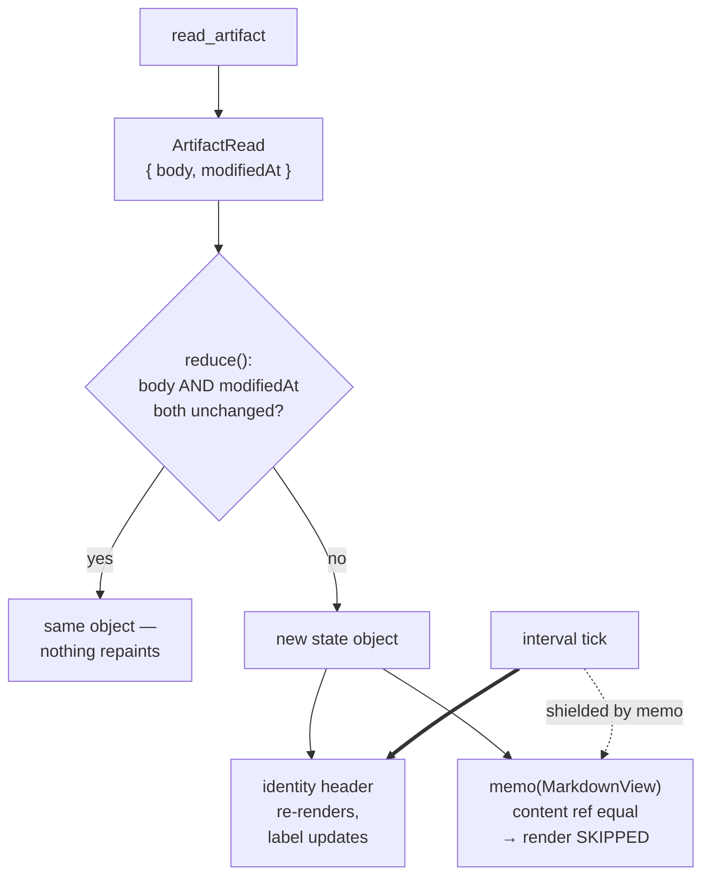

# Show When an Artifact Last Changed

## Why

The detail pane's identity header answers *which change* this is and *which branch* it lives on. It cannot answer *when it last moved* — the one question a reader of a work-in-progress spec actually has.

That gap is not a freshness problem. `auto-refresh-artifact-view` already guarantees the open artifact is re-read on every watcher batch, so the bytes on screen are never stale. The question the header leaves unanswered is the opposite one: **how long has this sat untouched?** A proposal edited four minutes ago and one abandoned twelve days ago render identically today, and the difference between them is most of what a reader wants to know before deciding whether to trust what they are reading.

This is also a debt being paid. The timestamp was written down twice — in `2026-08-16-tint-identity-branch-chip`, as a non-goal both times:

> The "last changed" timestamp is out of scope. It requires `read_artifact` to return a struct rather than a bare `String` across all three frontends, in the two mutation-gated crates. It ships as its own change; this one carries no backend work and can land independently.

That change shipped. The promised follow-up was never created, so the only trace of the requirement anywhere in the repository is the sentence deferring it. This is that follow-up.

The cost estimate in the deferral was pessimistic on two counts, and both are worth correcting because they are why it sat:

- **One mutation-gated crate, not two.** `read_artifact` and `resolve_artifact_path` both live in `openspec-app`. `openspec-core` is not in the artifact-read path at all.
- **One frontend, not three.** The identity header is a `spec-browser` surface rendered by the React frontend, which desktop and web share. The terminal frontend has no identity header; its call site needs only to ignore a field it does not read.

## What Changes

- **`read_artifact` returns the artifact's modification time alongside its body**, replacing the bare `String`. The `metadata()` call sits beside a read that already opens the file, so the cost at the source is negligible.

- **The identity header shows how long ago the artifact last changed**, as a relative label (`just now`, `9 min ago`, `12 days ago`) that **advances on its own** while the pane is open. A relative label that only repaints when a file is written would read `just now` for an hour to a reader who never left the page — so the label ticks, and stops when the artifact it describes is gone.

- **The label occupies a reserved, constant-width box** at the trailing edge of the identity row. `.identity-name` carries `min-width: 0` and `overflow-wrap: anywhere`, so it absorbs every width change on that flex line by re-wrapping — mid-identifier. A label whose width changes on a timer would therefore reflow the change name *while the reader is looking at it*, on a cadence they did not ask for. The header's existing copy-confirmation contract already forbids this for a click-driven width change; a timer-driven one is the same defect with a worse trigger, so the box is sized once to the widest label the formatter can emit and never resizes.

- **The detail pane's equality guard widens from the body to the body *and* its modification time.** Today `reduce` returns the same state object when a watcher-driven re-read yields identical bytes, which is what makes the unfiltered watcher subscription free. A no-op write — a branch switch, an idempotent rewrite, a formatter — bumps the modification time while leaving the bytes equal, and under today's guard the header would go on reporting the old time indefinitely.

- **`MarkdownView` is memoized on its props**, so widening the guard costs nothing. Without it, every no-op write and every clock tick would re-run the full remark/rehype pipeline, each mermaid diagram, KaTeX, and the SVG gate — to move a text label. All four of its props are strings or a stable `useRef`, at both of its call sites, so the default shallow comparison applies with no custom comparator and no adaptation.

## Capabilities

### New Capabilities

_None._

### Modified Capabilities

- `spec-browser`: two requirements.
  - *Change Identity Header in the Detail Pane* gains the last-changed contract — what the label reports, that it advances unprompted, that it holds a constant box so it cannot move the change name, and that the value is a filesystem modification time with the honest caveat that follows from that.
  - *Reactive Updates from Filesystem* has its "not observable when the bytes are unchanged" guarantee **narrowed**. It currently promises that a refresh returning identical content changes nothing at all. That is no longer true and should not be: when a file is rewritten with identical bytes, its modification time *did* change, and a header that reports modification time is obliged to say so. The guarantee is re-scoped to the rendered document and the reading position — the two things it was protecting — leaving the header free to report a fact that genuinely changed.

## Impact

**Code.**

Rust — one gated crate:

- `crates/openspec-app/src/service.rs` — `read_artifact` returns a serializable struct carrying the body and the file's modification time as unix seconds. **This is the only mutation-gated file in the change**; the new line needs test coverage or a written exclusion, per `.cargo/mutants.toml`.
- `crates/specforge/src/commands.rs` — the Tauri wrapper's return type. Body unchanged; it already only forwards.
- `crates/specforge-tui/src/app.rs` — the call site takes the body from the struct. The terminal frontend has no identity header and gains no behaviour.
- `crates/specforge-web/src/dispatch.rs` — the arm serializes whatever the service returns, so likely no edit at all; verified rather than assumed.

TypeScript:

- `src/types.ts` — the mirror interface for the new struct, camelCase per the IPC convention.
- `src/api.ts` — `readArtifact`'s return type.
- `src/detail/refreshPolicy.ts` — `DetailState` and the `resolved` event carry the modification time; the guard compares both.
- `src/components/MarkdownView.tsx` — wrapped in `React.memo`.
- `src/components/DetailPane.tsx` — threads the value into `ChangeIdentityHeader`; the header owns the interval and its teardown.
- `src/App.css` — the reserved box on the identity row.
- New pure module + tests for the relative formatter, alongside `changeIdentity.ts`. JSX is not exercised by `bun test` and a frontend-only diff short-circuits the mutation gate, so a pure function with tests is the only coverage this logic can get — the same reasoning that put `branchChipForWorktree` there.

**Deliberately unchanged:**

- **The terminal frontend gains nothing user-visible.** It has no identity header to put a timestamp in. Adding one is a `terminal-ui` change with its own layout question, not a rider on this one.
- **`ChangeInstance.modifiedAt` is not the source.** It is already a `DetailPane` prop and would have cost no backend work at all — but it is `newest_mtime()` over the *entire* change directory, recursive. Reading `proposal.md` while an agent ticks a box in `tasks.md` would report the proposal as freshly changed. A header that is confidently wrong in exactly the app's primary use case is worse than a header that says nothing.
- **Archived changes are not special-cased.** The label reports the file's modification time for every artifact, archived or active, under one rule. See the caveat below — it applies uniformly, which is precisely why no carve-out is warranted.
- **The Dashboard and the workspace tree are untouched.** The tree already sorts by `modifiedAt` and paints the active dot from it; whether *that* signal should also be spelled out in words is a separate question about a different surface.
- **No new command and no new event.** The existing `read_artifact` changes shape; nothing is added to the four registration points.

**A caveat that ships with the feature.** A modification time is a filesystem fact, not a history fact. A fresh `git clone`, a branch switch, or any checkout stamps files with the time of that operation — so on a newly cloned repository *every* artifact reports having just changed, including ones last genuinely edited months ago. This is not an archived-changes problem that could be dodged by substituting the archive date: an active change's `proposal.md` is stamped by a clone exactly as an archived one is. The requirement states what the value is rather than implying a provenance it does not have.
