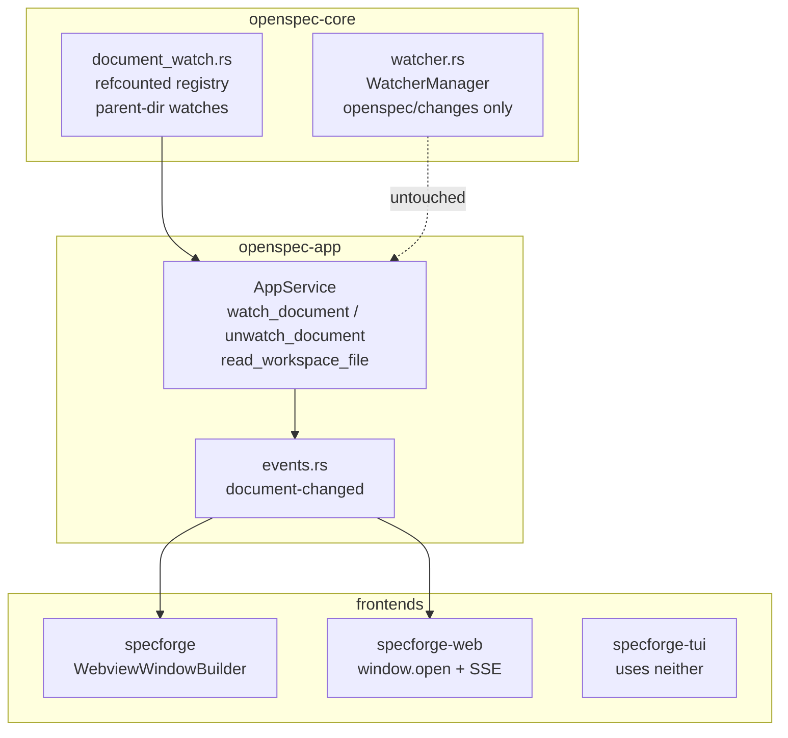
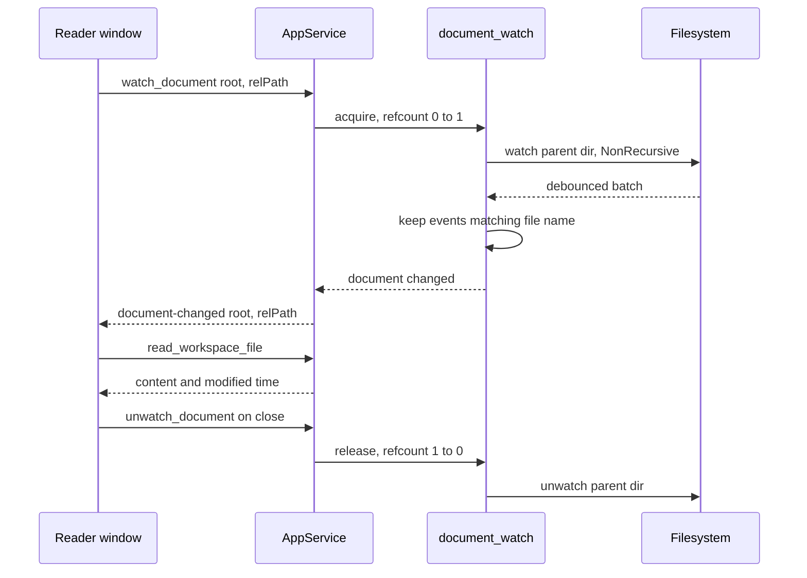

# Design — Reader Windows for Workspace Documents

## Context

Three properties of the existing code decide most of this design before any choice is made.

**The rendered document already cannot navigate.** `MarkdownView` intercepts every anchor: external hrefs go to the OS opener through the validated `open_artifact_link` chokepoint, workspace-relative file hrefs open in the default handler, and fragments, `javascript:`, `data:` and `file:` render inert. There is no in-app link. So "a window with no navigation" requires nothing to be *disabled* — only the surrounding chrome to be absent.

**The desktop shell deliberately has no URL routing.** `createHistory()` returns an in-memory adapter inside Tauri and a `pushState` adapter in the browser, and `view-routing`'s design records why: the shell loads through the asset protocol, which does not fall back to `index.html` for an unknown path. A second window therefore cannot simply be pointed at `/r/specforge/file/README.md` — the request would 404 before React ever mounts.

**Freshness is not uniform, and the boundary is accidental.** `WatcherManager::add_workspace` watches `<workspace>/openspec` recursively, then filters delivered events to `openspec/changes/`. A document under `openspec/specs/` sits inside the watched tree and still never updates. Any design that promises a live reader over arbitrary markdown must supply the missing delivery for one zone and the missing watch for another.

A fourth constraint shapes what can be verified rather than what can be built: the mutation gate is scoped to `openspec-core` and `openspec-app`, so the new watch module is gated and must carry real tests, while every `src/` and `crates/specforge/` line in this change is invisible to it.

## Goals / Non-Goals

**Goals**

- Detach one document into a window that contains the document and nothing that navigates.
- Make that window live for *any* markdown file in an authorized workspace, not only the artifacts that happen to sit under `openspec/changes/`.
- Keep the Address codec pure — no host concept, no presentation flag, no new argument.
- Bound the cost: the number of filesystem watches is a function of open documents, not of workspace size.
- Reach the desktop and browser hosts through one mechanism, not two parallel implementations.
- Leave the read guard exactly as strong as it is, while feeding it paths that now originate in a URL.

**Non-Goals**

- Detaching non-document surfaces — Dashboard, Archive, commit graph, Settings (*Decision 8*).
- Addressing archived artifacts (*Decision 9*).
- Per-worktree file addresses; a file address names the main worktree (*Decision 1*).
- Per-document window geometry (*Decision 7*).
- Any write path. The *Read-Only Viewer* requirement is unchanged.
- Terminal-frontend support.

## Decisions

### Decision 1 — A `file` Address variant with a reserved segment

`Address` gains `{ kind: "file"; scope: Scope; path: string }`, encoded as `/w/<workspace>/file/<path…>` and `/r/<repo>/file/<path…>`. The relative path's segments are percent-encoded individually and joined, so the grammar stays one path with no opaque blob in it.

The problem is that the codec decides everything from a closed vocabulary with no outside data, and a raw relative path is not closed. Placed directly after the scope prefix, `openspec/specs/spec-browser/spec.md` decodes as change `openspec`, the literal `specs`, capability `spec-browser`, plus a trailing segment the grammar has no slot for. A discriminator is unavoidable.

**Considered and rejected: `-` as the separator, GitLab-style.** Collision-proof in practice — no OpenSpec change is named `-`. Rejected because these URLs are shareable in the served UI and are read by people; `/r/specforge/file/openspec/specs/…` says what it is and `/r/specforge/-/openspec/specs/…` does not. The residual risk `file` carries is a change directory literally named `file`, which is documented as reserved rather than defended against.

**Considered and rejected: a top-level `/f/<slug>/<path…>` prefix.** Zero collision risk, because the branch separates at segment zero. Rejected because it discards the `w`/`r` classification that lets the codec pre-classify a slug without registry data — the property the prefix exists for. The `archive` variant tolerates resolving against both pools, but it is decoded from a fixed vocabulary; a file address should not give up a classification its siblings keep.

**Considered and rejected: an instance segment, `/r/<repo>/<instance>/file/<path…>`.** Decodable — `file` being reserved disambiguates it. Rejected for v1 on scope: the existing `files` address is already specified as the main worktree, and a file address that disagreed with it would be the odd one out. The segment stays available, and an address minted now keeps meaning what it means when it arrives.

### Decision 2 — The reader presentation rides outside the Address, in the query string

A reader is launched at `index.html?reader=1&at=<encoded path>` in the desktop shell and at `<path>?reader=1` in the browser. `main.tsx` reads the parameter once and mounts either `App` or `ReaderRoot`.

This falls out of an existing property rather than fighting one: `createBrowserHistory.current()` returns `window.location.pathname`, so **the query string is already invisible to the codec**. `encodeAddress`/`decodeAddress` need no argument, no variant, and no test change to accommodate the flag, and a reader URL in the browser remains a valid, shareable address that reopens the same reader.

**Considered and rejected: a `reader` field on `Address`.** It would make the reader bookmarkable through the codec rather than beside it. Rejected because it is false to the model the capability is built on: *Addressable Viewing State* defines an Address as naming *what is shown*, and `Side-Pane Visibility Toggles` already establishes that chrome visibility is view state that is deliberately not addressable. A reader window shows the same document as the pane; only the chrome differs. Encoding it would also force every consumer of `Address` to carry a field meaningless in the main window.

**Considered and rejected: a second HTML entry point, `reader.html`.** Clean separation, and Vite supports multiple inputs. Rejected because it doubles the bundle's entry surface and splits the shared-bundle property `web-ui`'s *Single Frontend Bundle, Host-Detected Transport* requirement rests on — two documents that must be kept in step by hand for a difference that is one branch at mount.

### Decision 3 — The same query string seeds the desktop window's address

The desktop reader is built with `WebviewUrl::App("index.html?reader=1&at=…")`. The asset protocol serves `index.html` because that is a real bundled file; the query is ignored by the protocol and read by the frontend.

**Considered and rejected: a hash fragment.** Works identically. Rejected because a hash is the conventional marker of client-side *routing*, and this shell deliberately has none; a future reader of the code would reasonably infer the shell had grown hash routing when it has not.

**Considered and rejected: `initialization_script` injecting a global.** Invisible in the URL and unambiguous. Rejected as a third host-to-frontend channel — the app has commands and events, and adding a bootstrap-global channel for one string is a mechanism that will attract more passengers.

**Considered and rejected: encoding the address in the window label and fetching it with a command.** The most "correct" option — the address never appears in a URL at all. Rejected on cost and latency: it adds a fifth command to register across all four sites, and the reader cannot render until a round-trip completes, so the window paints empty first.

### Decision 4 — The document watch is an independent watcher, not a graft onto `WatcherManager`

`document_watch.rs` owns its own `notify` + `notify-debouncer-full` instance and its own broadcast channel. It never consults `WatcherManager`'s roots or filters.

For a document under `openspec/changes/`, this means the same directory is watched twice at the OS level. That is the deliberate price. The alternative reuses the existing descriptor:

**Considered and rejected: extend `WatcherManager`'s debounce handler to also match registered document paths.** It would cover two of the three zones with no new OS watch, needing a new watch only for files outside `openspec/`. Rejected because it threads a second concern through the one code path this repository documents as delicate — the recompute gate whose determinism is itself a written convention, and `SelfWriteTracker` suppression. The saving is one kernel watch descriptor per open reader; the cost is that every future change to either mechanism must reason about the other. Duplicate delivery is harmless here in any case: the frontend already coalesces refetches, and a re-read of identical bytes is specified to be unobservable.

**Considered and rejected: widen `WatcherManager` to the whole workspace and stop filtering.** One mechanism, one mental model. Rejected on blast radius — unfiltering `openspec/` changes what the *cache* sees, and watching a repository root recursively means `node_modules/`, `target/` and `dist/`, which is exactly the traversal `workspace-file-browser`'s ignore-respecting enumeration exists to avoid.

### Decision 5 — Watch the parent directory, non-recursively, filtered by name

Registering `(root, "docs/architecture.md")` watches `<root>/docs` with `RecursiveMode::NonRecursive` and keeps only events whose path's file name matches.

**Considered and rejected: watching the file itself.** The obvious shape, and the one that breaks under normal use. Editors — and `git checkout`, and most atomic writers — save by writing a temporary file and renaming it over the target. That unlinks the inode the watch is bound to, and on inotify the watch follows the *inode*, not the path: the reader receives one final event and then goes permanently deaf while appearing to work. The failure is silent and looks like "it updated once and then stopped".

**Considered and rejected: polling `mtime` while the window is visible.** Immune to the rename problem, needs no new event, no SSE arm and no core module, and has precedent — the WSL backend already substitutes a `PollWatcher`. Rejected because a reader parked on a second monitor is frequently *not* the visible or focused window, so a visibility-gated poll would be asleep during exactly the scenario the feature exists for, and an ungated poll trades a bounded push mechanism for a permanent timer.

Registration is refcounted, keyed by canonicalised root plus relative path, so several surfaces on one document share a watch and the last release drops it. The number of live OS watches is therefore bounded by distinct open documents, never by workspace size:

$$|W| = \bigl|\{(\text{root}, \text{path}) : \text{refcount} > 0\}\bigr| \le |S|$$

where $S$ is the set of open document surfaces.

### Decision 6 — `document-changed` is its own event, not a `CacheEvent` variant

The watch publishes on a dedicated channel, and `openspec-app::events` maps it to a `document-changed` event carrying `{ root, relPath }`.

**Considered and rejected: a new `CacheEvent` variant.** The reflex, and the reason not to is written down in this repository already: `CacheEvent` has ten variants, the aggregator's `Logical*` pair fires instead of `ChangeAdded` inside a git repository, and the standing instruction is never to add a wildcard arm without deciding what each ignored variant means. A document change is not a cache change — it mutates no cached state and concerns no tree row — so adding it would force every existing `CacheEvent` consumer to grow an arm that ignores it, in three frontends.

### Decision 7 — Window identity is the address; geometry is shared

A reader's Tauri label is `reader-<shortHash(path)>` — labels admit only `[a-zA-Z0-9-/:_]`, so a raw path cannot be one, and `slug.ts` already has `shortHash` for the archive's worktree hint. Launching a reader for a document that already has one focuses the existing window instead of opening a second. In the browser the same identity is the `window.open` target name, which gives the same deduplication from the platform.

Geometry is **one** remembered size for all readers, held in `SettingsStore`, with a cascade offset so a second reader does not land exactly on the first. Reader labels are denylisted from `tauri-plugin-window-state`.

**Considered and rejected: per-label geometry through the window-state plugin, which is the default behaviour.** It is what the plugin does with no code at all, and it gives each document its own remembered position. Rejected because the plugin is configured with `Builder::default()` and persists every label it sees: per-document labels mean the state file accrues one entry per file ever opened, keyed by an opaque hash, with nothing that ever removes them. The feature would quietly write an unbounded, unreadable map as a side effect of being used.

**Considered and rejected: a fixed pool of labels, `reader-1..N`.** Bounds the state file. Rejected because it severs identity from the document, which is what deduplication and focus-instead-of-reopen depend on.

### Decision 8 — Only documents detach

A reader window renders exactly one document. No other `Address` variant can be launched into one, even though every one of them would work.

**Considered and rejected: a general "detach this Address" mechanism.** Nearly free once the chromeless mount exists — the Dashboard, Archive, commit graph and Settings are all just addresses. Rejected because the cost is not the mechanism, it is the surface: each of those views assumes it lives inside the shell and shares its state, and each would need its own answers to identity, freshness, and what its chrome means once detached. Taking it now converts a feature about reading documents into multi-window SpecForge, and forecloses nothing to defer it.

### Decision 9 — A vanished document holds its content and says so; it does not follow the file

When a watched document is deleted, renamed away, or its change archived, the reader keeps the content it holds, marks the document as no longer present, and does not close itself or navigate.

**Considered and rejected: following an archived change into `openspec/changes/archive/<date>-<id>/`.** Attractive, and reachable — `ArchiveView` already renders archived artifacts through the same pane using an `archive/`-prefixed change id. Rejected because it is a navigation, and this window's entire premise is that it does not navigate: the address the window was opened at would silently stop being the address it displays. Holding the last good content is also the behaviour already specified for a failed background read in *Reactive Updates from Filesystem*, so it is the consistent answer rather than a new one.

### Decision 10 — Close is one predefined menu item, with no branch on window kind

The macOS Window submenu gains a Close item built from the framework's predefined close action, which sends a close request to the focused window.

This needs no conditional. The main window's `on_window_event` handler already intercepts `CloseRequested` and hides instead of destroying, because the tray and watcher must survive; a reader window installs no such handler and is destroyed. One item, two correct behaviours, both inherited from window-event handling that already exists.

**Considered and rejected: a custom Close handler that inspects the focused window's label.** Explicit, and immediately wrong to maintain — it would put the hide-versus-destroy decision in two places, and the menu's copy of it would be the one nobody updates.

### Decision 11 — The document view is extracted, not duplicated

`DocumentView` owns the fetch, the identity header, the markdown render and the freshness policy; `DetailPane`, the file browser's preview and the reader window all consume it.

**Considered and rejected: a standalone reader view, leaving both existing views alone.** The smallest diff, and nothing working can regress. Rejected because it would be the *third* implementation of "fetch a string, show a header, render markdown, keep it fresh", and the third would be the only one that is live for arbitrary files — leaving the file browser's preview as the single surface in the application that shows stale bytes, immediately after this change made that fixable. The refresh-policy reducer generalising from artifact reads to document reads is the real work, and it is worth doing once.

Note that the file browser's manual refresh control **stays**. It refreshes the *listing*, which remains pull-based by design; only the preview becomes push-fresh.

## Risks / Trade-offs

- **The refresh-policy reducer is load-bearing and now serves three callers.** `refreshPolicy.ts` encodes the guarantees that make a background refresh unobservable — no loading indicator, preserved reading position, no re-render on identical bytes, last-good content on a failed read. Generalising it risks weakening one of those for the surfaces that already depend on it. *Mitigation:* it is already a pure module with its own tests; the generalisation changes what a read is *of*, not what a trigger *means*, and its existing test suite must pass unchanged before any new surface is wired to it.

- **Duplicate delivery for documents under `openspec/changes/`.** Such a document is watched by both `WatcherManager` and the document watch, so a single edit can produce two refetches. *Mitigation:* `useCoalescedRefetch` already collapses concurrent triggers, and a re-read returning identical bytes is specified to leave the rendered output, the reading position and the loading indicator untouched. The visible cost is one extra read, not a flicker.

- **A reader window can invoke nothing if its capability is missed.** `capabilities/default.json` scopes to `"windows": ["main"]`. A reader window omitted from a capability gets a webview whose `invoke` calls are all refused — the window opens, renders no content, and shows an error that does not name the cause. *Mitigation:* the capability change is a task in its own right, and the manual smoke walks a reader window opened from a cold start, which fails loudly if it was missed.

- **Watch loss on directory replacement.** Watching the parent directory survives atomic-rename saves of the *file*, but not replacement of the *directory* — a `git checkout` that swaps a whole subtree, or a change directory moved to the archive. The reader would go deaf rather than report anything. *Mitigation:* the watch registry re-arms on a delivered removal event for the watched directory, and the reader's own vanished-document state (*Decision 9*) is what the user sees if re-arming finds nothing.

- **Two windows, one shared application state directory.** Every SpecForge instance resolves the same `config_dir()`, and the shared reader geometry lives in `SettingsStore`. Two worktree builds running side by side through `wt:dev` will co-write it, exactly as they already co-write `activity.json` and window state. *Mitigation:* none beyond what exists; the geometry is a single small value whose worst case is a reader opening at the other instance's size.

- **`.md`-only, by inheritance.** The reader can show only what `read_workspace_file` will return, so a link to a `.txt` or `.rst` file cannot be opened in one. This is inherited rather than chosen, and consistent with the file browser. *Mitigation:* none needed; the read guard's markdown restriction is a security-relevant property and is not relaxed to widen this feature.

- **The mutation gate covers less than half of this change.** `document_watch.rs` is gated; the Address variant, the extracted view, the window plumbing and the menu item are not — a `src/`-only or `crates/specforge/`-only portion of the diff reports green without running. *Mitigation:* the codec and resolver changes are covered by the existing `bun test` suites for `routing/`, which are pure; the window behaviour is covered by the manual smoke, which is the only instrument that exists for it.
