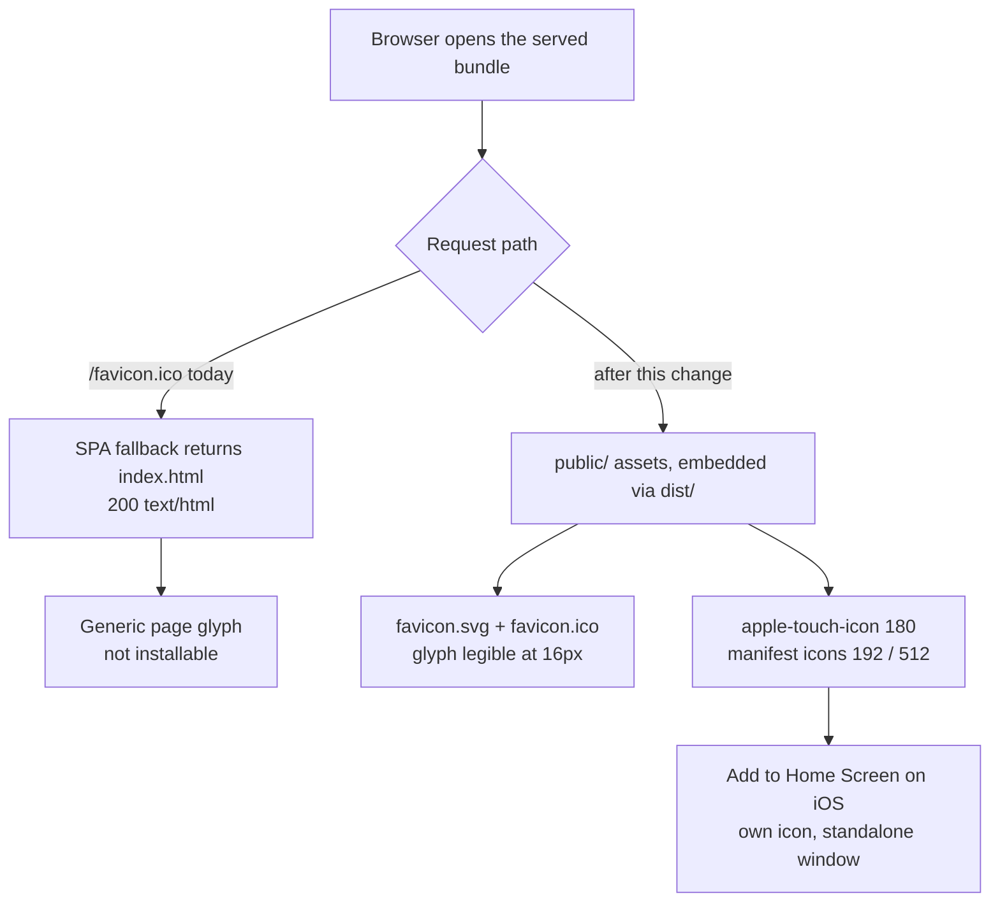
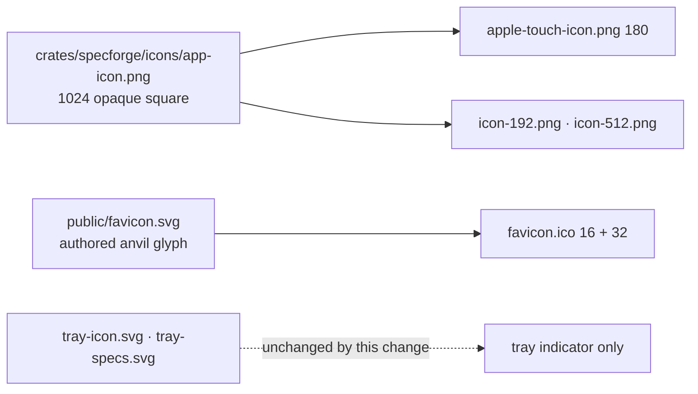

# Web App Icons and Install

## Why

The served web UI has no icon of any kind: `index.html` carries no `<link rel="icon">`, there is no `public/` directory, and nothing icon-shaped ever reaches `dist/`. Because the asset handler falls back to the app shell for unmatched paths, the browser's unprompted `GET /favicon.ico` is answered with `200 text/html` and the whole `index.html` body — an answer that is not merely missing but actively wrong. The consequence is a generic page glyph in every tab, and no way to install the UI as a standalone app on a phone or tablet even though `tailscale serve` already publishes it over real HTTPS to exactly those devices, and `touch-input` already treats them as a designed-for surface.

## What Changes

- Add a `public/` directory whose contents Vite copies verbatim into `dist/`, so `rust-embed` picks them up with no change to how assets are embedded or served.
- Ship a **two-source** icon set: a hand-authored single-colour anvil glyph for the sizes where the illustration cannot survive (16/32 px), and rasterizations of the existing canonical 1024×1024 illustration for the sizes where it reads (180/192/512 px).
- Add a web app manifest with `display: standalone` and a **relative** `start_url`, so the same bundle installs correctly whether it is reached on `127.0.0.1:<port>` or over a tailnet name.
- Stop the SPA fallback from shadowing icon and manifest requests, so a missing icon is a `404` rather than an HTML document served under an image request.
- Restore the event stream when the document is resumed from a suspended or frozen state, so an installed app that iOS has suspended does not come back showing silently stale data.
- **No service worker.** Offline support is meaningless for a UI whose entire content comes from a live local server, and a stale cached shell would be a new failure mode. iOS Add-to-Home-Screen does not require one; the cost is only that Android's install prompt stays unavailable.

The two icon sources stay separate on purpose, and the tray glyphs are not touched by either:

## Capabilities

### New Capabilities

- `web-app-install`: The installable-app surface of the served bundle — the icon markup in the document head, the web app manifest and its origin-agnostic `start_url`, the icon set and the sizes each source serves, and the standalone-mode behaviours (home-screen icon, separate window, status-bar and theme colour). Parallels `touch-input`: it governs one cross-cutting treatment of the bundle that `web-ui` defines, without redefining what that bundle contains.

### Modified Capabilities

- `product-identity`: The *Canonical Application Icon Source* requirement currently enumerates only the derivatives `bun tauri icon` produces. It gains the web icon set as a second, separately-generated family of derivatives from the same 1024×1024 source, and recognises the authored web glyph as a non-derivative authored mark alongside the two tray SVGs — so a future regeneration run cannot mistake either for something to overwrite.
- `web-ui`: Three requirement-level changes. *Deep-Link Durability of the Served Bundle* gains a boundary — the shell fallback must not answer requests for bundled-asset paths that do not exist. *Event Transport Reproduces the Frontend Event Contract* gains a client-side obligation to restore the stream after document suspension. *Link Handling in the Browser Skin* is amended to acknowledge that in a standalone window an opener-isolated external link surfaces as an in-app browser view rather than a sibling tab.

## Impact

**Frontend and assets.** New `public/` directory (`favicon.svg`, `favicon.ico`, `apple-touch-icon.png`, `icon-192.png`, `icon-512.png`, `icon-512-maskable.png`, `manifest.webmanifest`), all committed. New head markup in `index.html`. `src/api.ts` gains event-stream resume around its single module-level `EventSource`. Manifest `theme_color` / `background_color` read from the `--bg` values `visual-identity` already defines rather than being hand-picked.

**Rust.** `crates/specforge-web/src/assets.rs` gains the fallback boundary; `crates/specforge-web/tests/server.rs` gains coverage for it, alongside the existing deep-address tests that it must not regress.

**Tooling.** A dev-time generation script under `scripts/` produces the raster set from the canonical source and the `.ico` from the authored glyph. No new runtime dependency in `package.json` or any crate.

**Deliberately unchanged.** No service worker and no offline caching. No change to the trust boundary: bind resolution, the request-authority allowlist, the Tailscale login gate and the absent host-open command all stay exactly as they are, and the manifest is a static asset served through the same path as every other. `bun tauri icon` and the native bundle icons it produces are untouched, as are `tray-icon.svg` and `tray-specs.svg`. The Tauri desktop window loads the same `index.html`, where this markup is inert — it has no tab strip and no install affordance — which is accepted rather than worked around. No IPC command, event name, or payload shape changes, so `src/types.ts` and the dispatch table stay as they are.
